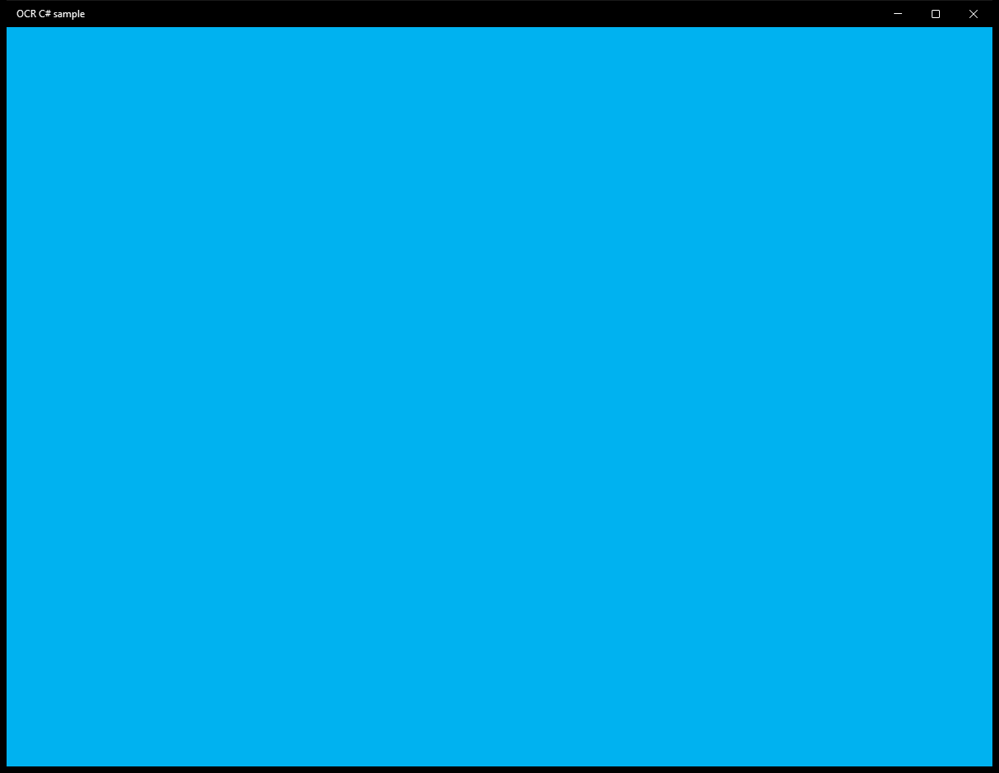

# OCR (C#)

> **Source**: `Samples\OCR\cs\`  
> **Feature**: OCR C# sample  
> **AUMID**: `Microsoft.SDKSamples.OCR.CS_8wekyb3d8bbwe!App`  
> **PackageFamilyName**: `Microsoft.SDKSamples.OCR.CS_8wekyb3d8bbwe`  

## Build / deploy / capture status
- build: ok
- deploy: ok
- launch: ok
- capture: ok-generic
- uninstall: ok

## Main page

---

## MainPage (generic)

This sample did not expose a standard scenario list. Captures below come from a generic enumeration of buttons / list items / hyperlinks on the main page.

### Interaction captures
Initial state:

