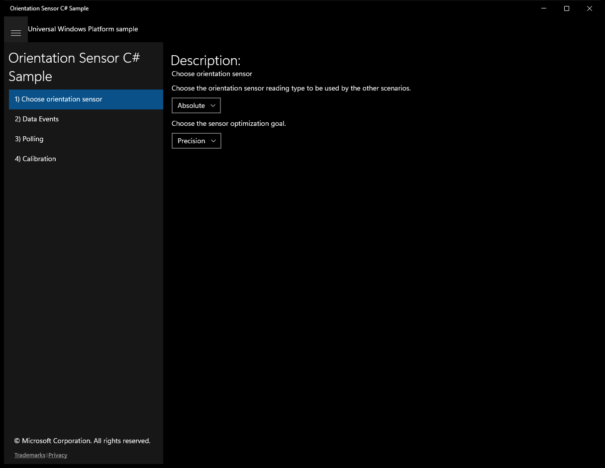
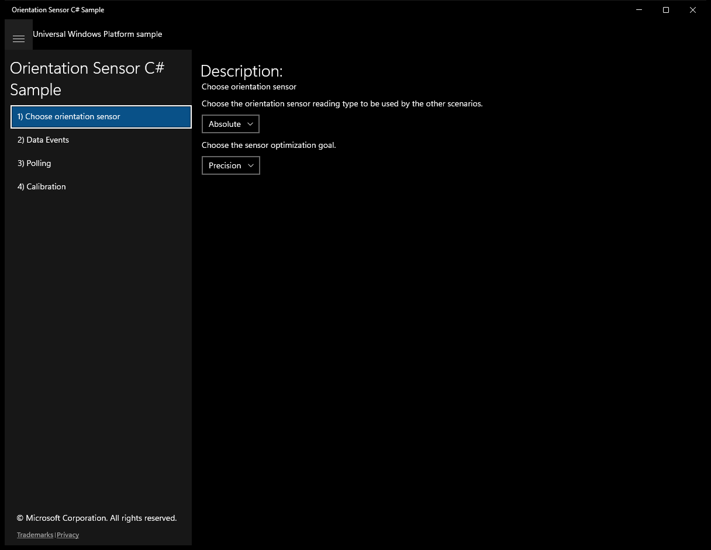
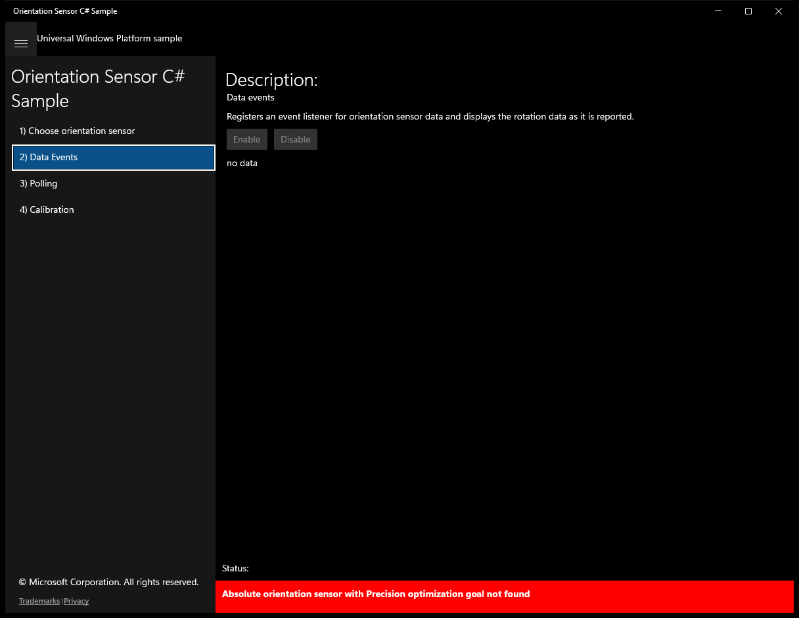
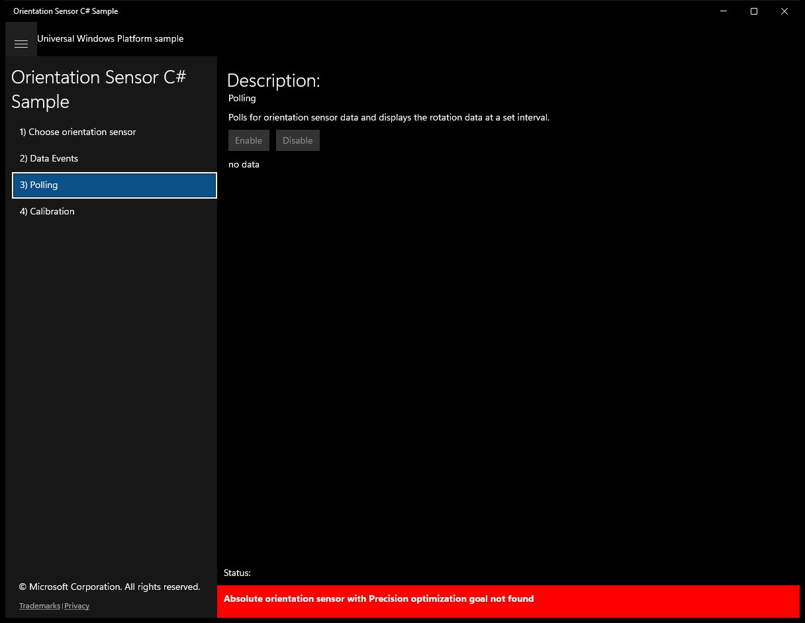
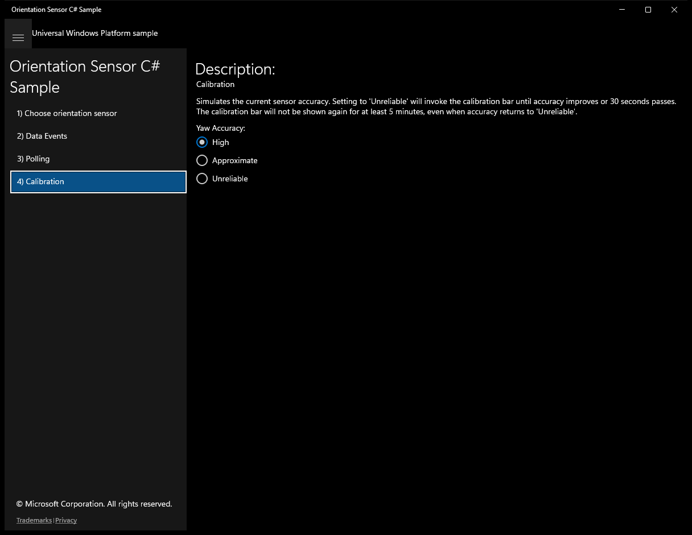

# OrientationSensor (C#)

> **Source**: `Samples\OrientationSensor\cs\`  
> **Feature**: Orientation Sensor C# Sample  
> **AUMID**: `Microsoft.SDKSamples.Orientation.CS_8wekyb3d8bbwe!App`  
> **PackageFamilyName**: `Microsoft.SDKSamples.Orientation.CS_8wekyb3d8bbwe`  

## Build / deploy / capture status
- build: ok
- deploy: ok
- launch: ok
- capture: ok
- uninstall: ok

## Main page

---

## Scenario 1 - Choose orientation sensor

### UI elements
- **TextBlock**  - text="Description:"
- **TextBlock**  - text="Choose orientation sensor"
- **TextBlock**  - text="Choose the orientation sensor reading type to be used by the other scenarios."
- **ComboBox**  - x:Name="ReadingTypeComboBox"
- **TextBlock**  - text="Choose the sensor optimization goal."
- **ComboBox**  - x:Name="OptimizationGoalComboBox"

### Code behavior
- **`OnNavigatingFrom`**
    - API refs: `ReadingTypeComboBox.SelectedValue`, `OptimizationGoalComboBox.SelectedValue`

### Screenshots
Initial state:

---

## Scenario 2 - Data Events

### UI elements
- **TextBlock**  - text="Description:"
- **TextBlock**  - text="Data events"
- **TextBlock**  - text="Registers an event listener for orientation sensor data and displays the rotation data as it is reported."
- **Button**  - x:Name="ScenarioEnableButton"; content="Enable"; events: Click={x:Bind ScenarioEnable}
- **Button**  - x:Name="ScenarioDisableButton"; content="Disable"; events: Click={x:Bind ScenarioDisable}
- **TextBlock**  - x:Name="ScenarioOutput"; text="no data"

### Code behavior
- **`OnNavigatedTo`**
    - API refs: `OrientationSensor.GetDefault`, `NotifyType.StatusMessage`, `ScenarioEnableButton.IsEnabled`, `NotifyType.ErrorMessage`
- **`OnNavigatingFrom`**
    - API refs: `ScenarioDisableButton.IsEnabled`
- **`VisibilityChanged`**
    - API refs: `ScenarioDisableButton.IsEnabled`
- **`ReadingChanged`**
    - API refs: `Dispatcher.RunAsync`, `CoreDispatcherPriority.Normal`, `MainPage.SetReadingText`
- **`ScenarioEnable`**
    - API refs: `Math.Max`, `Window.Current`, `ScenarioEnableButton.IsEnabled`, `ScenarioDisableButton.IsEnabled`
- **`ScenarioDisable`**
    - API refs: `Window.Current`, `ScenarioEnableButton.IsEnabled`, `ScenarioDisableButton.IsEnabled`

### Screenshots
Initial state:

---

## Scenario 3 - Polling

### UI elements
- **TextBlock**  - text="Description:"
- **TextBlock**  - text="Polling"
- **TextBlock**  - text="Polls for orientation sensor data and displays the rotation data at a set interval."
- **Button**  - x:Name="ScenarioEnableButton"; content="Enable"; events: Click={x:Bind ScenarioEnable}
- **Button**  - x:Name="ScenarioDisableButton"; content="Disable"; events: Click={x:Bind ScenarioDisable}
- **TextBlock**  - x:Name="ScenarioOutput"; text="no data"

### Code behavior
- **`OnNavigatedTo`**
    - instantiates: `DispatcherTimer`
    - API refs: `OrientationSensor.GetDefault`, `Math.Max`, `TimeSpan.FromMilliseconds`, `NotifyType.StatusMessage`, `ScenarioEnableButton.IsEnabled`, `NotifyType.ErrorMessage`
- **`OnNavigatingFrom`**
    - API refs: `ScenarioDisableButton.IsEnabled`
- **`VisibilityChanged`**
    - API refs: `ScenarioDisableButton.IsEnabled`
- **`DisplayCurrentReading`**
    - API refs: `MainPage.SetReadingText`
- **`ScenarioEnable`**
    - API refs: `Window.Current`, `ScenarioEnableButton.IsEnabled`, `ScenarioDisableButton.IsEnabled`
- **`ScenarioDisable`**
    - API refs: `Window.Current`, `ScenarioEnableButton.IsEnabled`, `ScenarioDisableButton.IsEnabled`

### Screenshots
Initial state:

---

## Scenario 4 - Calibration

### UI elements
- **TextBlock**  - text="Description:"
- **TextBlock**  - text="Calibration"
- **TextBlock**  - text="Simulates the current sensor accuracy. Setting to 'Unreliable' will invoke the calibration bar until accuracy improves or 30 seconds passes. The calibration bar will not be shown again for at least 5 minutes, even when accuracy returns to 'Unreliable'."
- **TextBlock**  - text="Yaw Accuracy:"
- **RadioButton**  - content="High"; events: Click={x:Bind OnHighAccuracy}
- **RadioButton**  - content="Approximate"; events: Click={x:Bind OnApproximateAccuracy}
- **RadioButton**  - content="Unreliable"; events: Click={x:Bind OnUnreliableAccuracy}
- **TextBlock**  - x:Name="DisabledContent"; text="Yaw accuracy is reported only for absolute sensor reading types."

### Code behavior
- **`OnUnreliableAccuracy`**
    - API refs: `MagnetometerAccuracy.Unreliable`

### Screenshots
Initial state:

