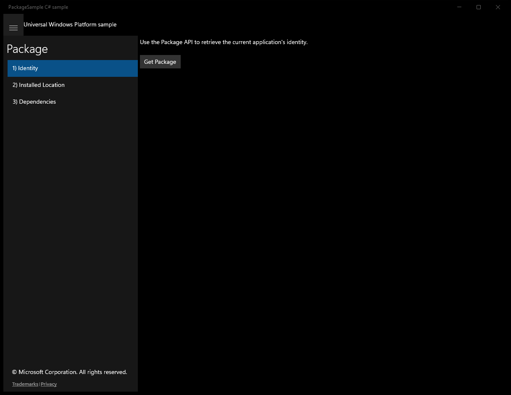
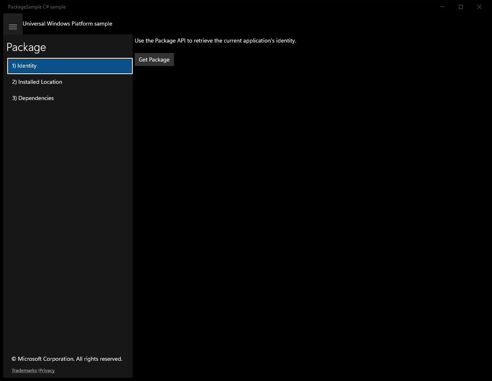
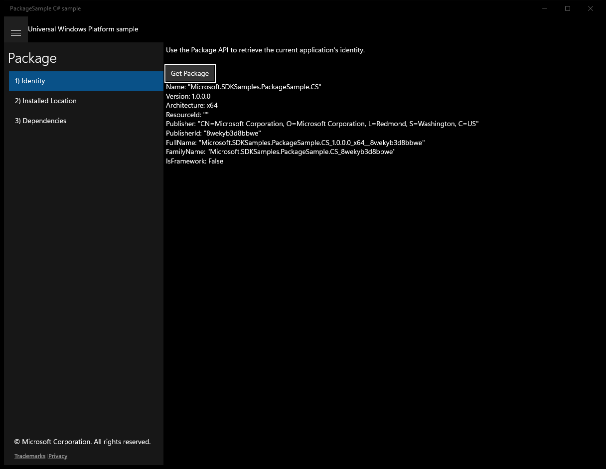
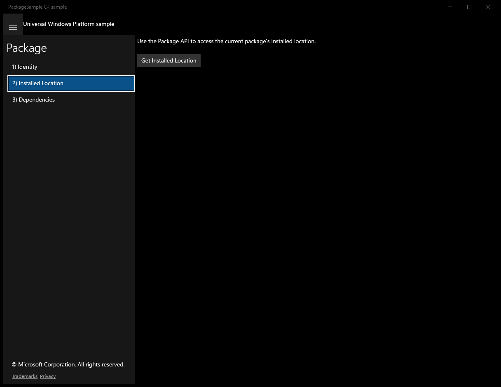
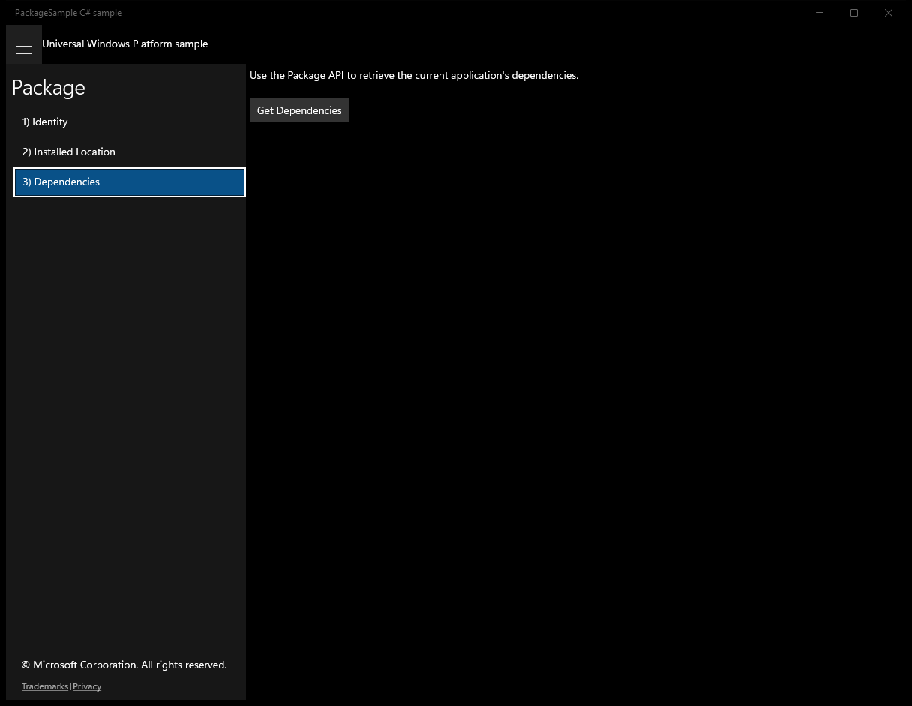
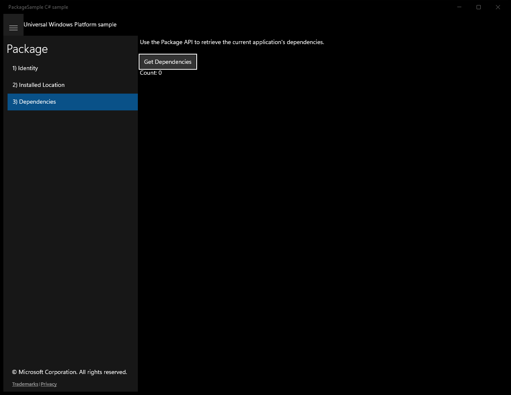

# Package (C#)

> **Source**: `Samples\Package\cs\`  
> **Feature**: Package  
> **AUMID**: `Microsoft.SDKSamples.PackageSample.CS_8wekyb3d8bbwe!PackageSample.App`  
> **PackageFamilyName**: `Microsoft.SDKSamples.PackageSample.CS_8wekyb3d8bbwe`  

## Sample purpose
Shows how to get package info by using the Windows Runtime packaging API (Windows.ApplicationModel.Package and PackageId).

## Scenarios demonstrated (from README)
- Getting the package identity using Package.Id
- Getting the package directory using Package.InstalledLocation
- Getting package dependencies using Package.Dependencies
- Getting the package description using Package.Description
- Getting the package display name using Package.DisplayName
- Determining whether the package is a bundle package using Package.IsBundle
- Determining whether the package is installed in development mode using Package.IsDevelopmentMode
- Determining whether the package is a resource package using Package.IsResourcePackage
- Getting package logo using Package.Logo
- Getting publisher display name of the package using Package.PublisherDisplayName

## Top-level UWP namespaces used
- `Windows.Storage.StorageFolder`
- `Windows.ApplicationModel.Package`

## Build / deploy / capture status
- build: skipped
- deploy: ok
- launch: ok
- capture: ok
- uninstall: ok

## Main page

---

## Scenario 1 - scenario1_identity

### UI elements
- **TextBlock**  - text="Use the Package API to retrieve the current application's identity."
- **Button**  - x:Name="GetPackage"; content="Get Package"; events: Click=GetPackage_Click
- **TextBlock**  - x:Name="OutputTextBlock"

### Code behavior
- **`GetPackage_Click`**
    - API refs: `Package.Current`, `String.Format`, `Logo.AbsoluteUri`, `OutputTextBlock.Text`
    - updates UI: `OutputTextBlock.Text`

### Screenshots
Initial state:

After click **Get Package**:

---

## Scenario 2 - scenario2_installedlocation

### UI elements
- **TextBlock**  - text="Use the Package API to access the current package's installed location."
- **Button**  - x:Name="GetInstalledLocation"; content="Get Installed Location"; events: Click=GetInstalledLocation_Click
- **TextBlock**  - x:Name="OutputTextBlock"

### Code behavior
- **`GetInstalledLocation_Click`**
    - namespaces: `Windows.Storage.StorageFolder`
    - API refs: `Windows.Storage`, `Package.Current`, `OutputTextBlock.Text`, `String.Format`
    - updates UI: `OutputTextBlock.Text`

### Screenshots
Initial state:

> Button **Get Installed Location** skipped (blocklist)

---

## Scenario 3 - scenario3_dependencies

### UI elements
- **TextBlock**  - text="Use the Package API to retrieve the current application's dependencies."
- **Button**  - x:Name="GetDependencies"; content="Get Dependencies"; events: Click=GetDependencies_Click
- **TextBlock**  - x:Name="OutputTextBlock"

### Code behavior
- **`GetDependencies_Click`**
    - namespaces: `Windows.ApplicationModel.Package`
    - API refs: `Windows.ApplicationModel`, `Package.Current`, `String.Format`, `Count.ToString`, `Id.FullName`, `OutputTextBlock.Text`
    - updates UI: `OutputTextBlock.Text`

### Screenshots
Initial state:

After click **Get Dependencies**:

