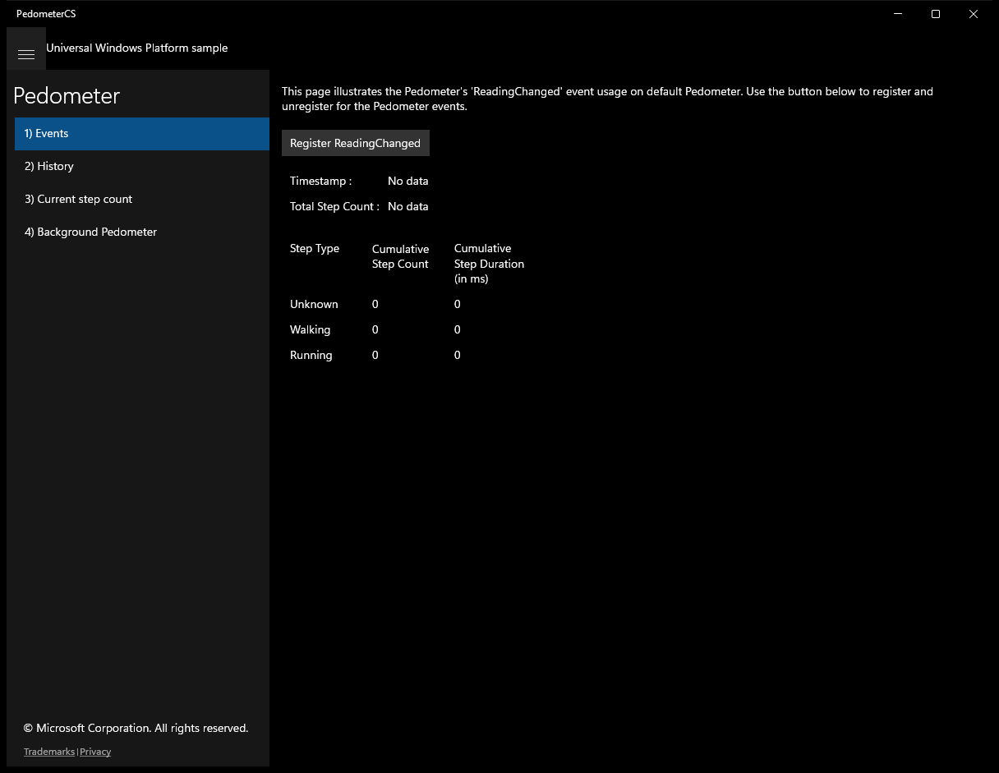
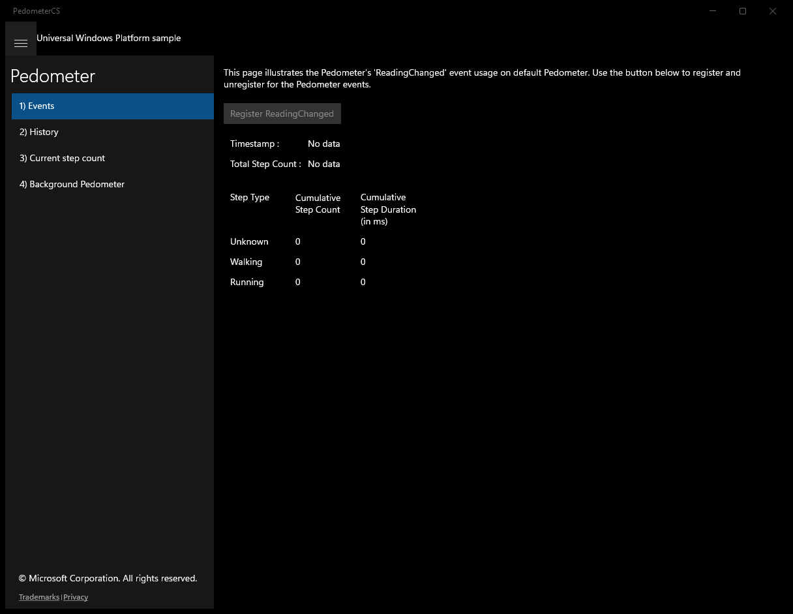
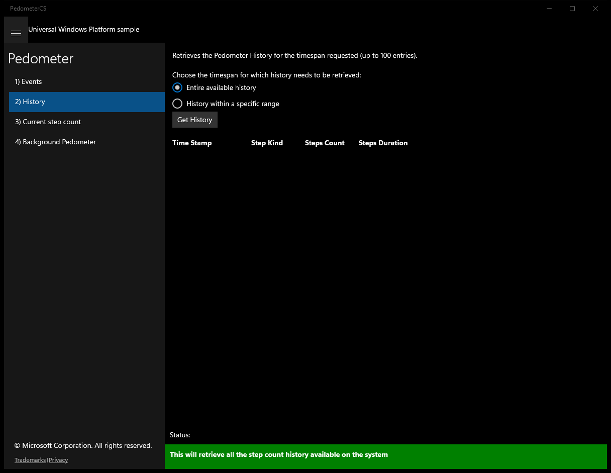
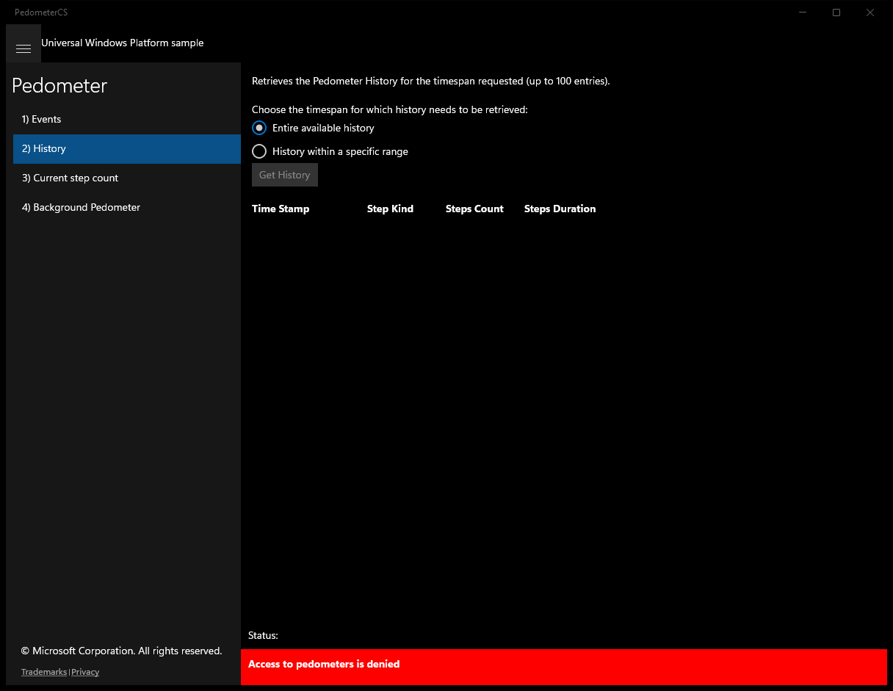
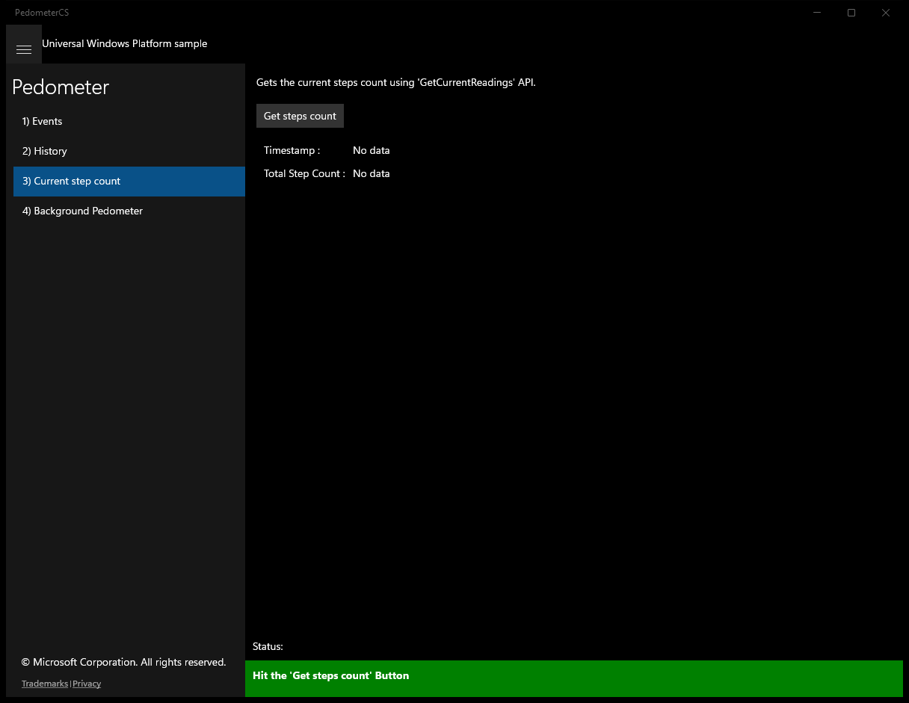
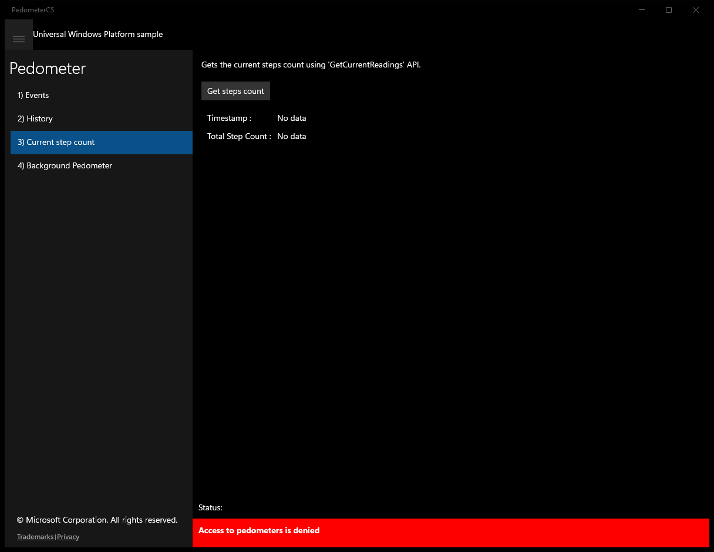
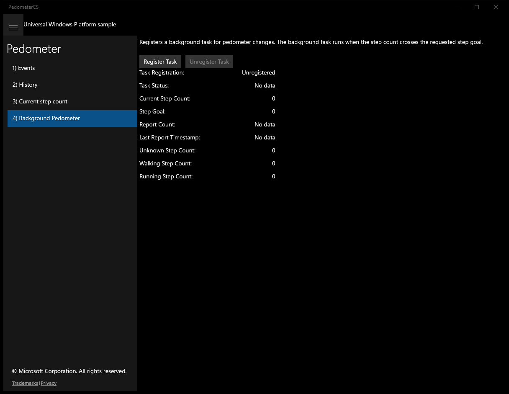

# Pedometer (C#)

> **Source**: `Samples\Pedometer\cs\`  
> **Feature**: Pedometer  
> **AUMID**: `Microsoft.SDKSamples.PedometerCS.CS_8wekyb3d8bbwe!App`  
> **PackageFamilyName**: `Microsoft.SDKSamples.PedometerCS.CS_8wekyb3d8bbwe`  

## Build / deploy / capture status
- build: ok
- deploy: ok
- launch: ok
- capture: ok
- uninstall: ok

## Main page

---

## Scenario 1 - Events

**Description**: This page illustrates the Pedometer's 'ReadingChanged' event usage on default Pedometer. Use the button below to register and unregister for the Pedometer events.

### UI elements
- **TextBlock**  - text="This page illustrates the Pedometer's 'ReadingChanged' event usage on default Pedometer. Use the button below to register and unregister for the Pedometer events."
- **Button**  - x:Name="RegisterButton"; content="Register ReadingChanged"; events: Click=RegisterButton_Click
- **TextBlock**  - text="Timestamp : "
- **TextBlock**  - text="Total Step Count :"
- **TextBlock**  - x:Name="ScenarioOutput_Timestamp"; text="No data"
- **TextBlock**  - x:Name="ScenarioOutput_TotalStepCount"; text="No data"
- **TextBlock**  - text="Step Type"
- **TextBlock**  - text="Cumulative Step Count"
- **TextBlock**  - text="Cumulative Step Duration (in ms)"
- **TextBlock**  - text="Unknown"
- **TextBlock**  - text="Walking"
- **TextBlock**  - text="Running"
- **TextBlock**  - x:Name="ScenarioOutput_UnknownCount"; text="0"
- **TextBlock**  - x:Name="ScenarioOutput_WalkingCount"; text="0"
- **TextBlock**  - x:Name="ScenarioOutput_RunningCount"; text="0"
- **TextBlock**  - x:Name="ScenarioOutput_UnknownDuration"; text="0"
- **TextBlock**  - x:Name="ScenarioOutput_WalkingDuration"; text="0"
- **TextBlock**  - x:Name="ScenarioOutput_RunningDuration"; text="0"
- **TextBlock**  - x:Name="StatusBlock"

### Code behavior
- **`OnNavigatedTo`**
    - API refs: `MainPage.Current`
- **`RegisterButton_Click`**
    - API refs: `RegisterButton.IsEnabled`, `Pedometer.GetDefaultAsync`, `NotifyType.ErrorMessage`, `RegisterButton.Content`, `NotifyType.StatusMessage`, `System.UnauthorizedAccessException`
- **`Pedometer_ReadingChanged`**
    - instantiates: `DateTimeFormatter`
    - API refs: `Dispatcher.RunAsync`, `CoreDispatcherPriority.Normal`, `PedometerStepKind.Unknown`, `ScenarioOutput_UnknownCount.Text`, `ScenarioOutput_UnknownDuration.Text`, `CumulativeStepsDuration.TotalMilliseconds`, `PedometerStepKind.Walking`, `ScenarioOutput_WalkingCount.Text`, `ScenarioOutput_WalkingDuration.Text`, `PedometerStepKind.Running`, `ScenarioOutput_RunningCount.Text`, `ScenarioOutput_RunningDuration.Text`, `ScenarioOutput_TotalStepCount.Text`, `ScenarioOutput_Timestamp.Text`
- **`AccessChanged`**
    - API refs: `DeviceAccessStatus.Allowed`, `Dispatcher.RunAsync`, `CoreDispatcherPriority.Normal`, `NotifyType.ErrorMessage`, `RegisterButton.Content`

### Screenshots
Initial state:

After click **Register ReadingChanged**:

---

## Scenario 2 - History

**Description**: Retrieves the Pedometer History for the timespan requested (up to 100 entries).

### UI elements
- **TextBlock**  - text="Retrieves the Pedometer History for the timespan requested (up to 100 entries)."
- **TextBlock**  - text="Choose the timespan for which history needs to be retrieved:"
- **RadioButton**  - x:Name="AllHistory"; events: Checked=AllHistory_Checked
- **RadioButton**  - x:Name="SpecificHistory"; events: Checked=SpecificHistory_Checked
- **TextBlock**  - text="From:"
- **DatePicker**  - x:Name="FromDate"
- **TimePicker**  - x:Name="FromTime"
- **TextBlock**  - text="To:"
- **DatePicker**  - x:Name="ToDate"
- **TimePicker**  - x:Name="ToTime"
- **Button**  - x:Name="GetHistory"; content="Get History"; events: Click=GetHistory_Click
- **TextBlock**  - text="Time Stamp"
- **TextBlock**  - text="Step Kind"
- **TextBlock**  - text="Steps Count"
- **TextBlock**  - text="Steps Duration"
- **ListView**  - x:Name="historyRecordsList"
- **TextBlock**  - text="{Binding TimeStamp}"
- **TextBlock**  - text="{Binding StepKind}"
- **TextBlock**  - text="{Binding StepsCount}"
- **TextBlock**  - text="{Binding StepsDuration}"
- **TextBlock**  - x:Name="StatusBlock"

### Code behavior
- **`AllHistory_Checked`**
    - API refs: `SpanPicker.Visibility`, `Visibility.Collapsed`, `NotifyType.StatusMessage`
- **`SpecificHistory_Checked`**
    - API refs: `SpanPicker.Visibility`, `Visibility.Visible`, `NotifyType.StatusMessage`
- **`GetHistory_Click`**
    - instantiates: `DateTimeFormatter`, `DateTimeOffset`, `Calendar`, `HistoryRecord`
    - API refs: `GetHistory.IsEnabled`, `DeviceAccessInformation.CreateFromDeviceClassId`, `DeviceAccessStatus.Allowed`, `Pedometer.GetDefaultAsync`, `DateTime.FromFileTimeUtc`, `NotifyType.StatusMessage`, `Pedometer.GetSystemHistoryAsync`, `FromDate.Date`, `Convert.ToInt32`, `FromTime.Time`, `ToDate.Date`, `ToTime.Time`, `NotifyType.ErrorMessage`, `TimeSpan.FromTicks`

### Screenshots
Initial state:

After click **Get History**:

---

## Scenario 3 - Current step count

**Description**: Gets the current steps count using 'GetCurrentReadings' API.

### UI elements
- **TextBlock**  - text="Gets the current steps count using 'GetCurrentReadings' API."
- **Button**  - x:Name="GetCurrentButton"; content="Get steps count"; events: Click=GetCurrentButton_Click
- **TextBlock**  - text="Timestamp : "
- **TextBlock**  - text="Total Step Count :"
- **TextBlock**  - x:Name="ScenarioOutput_Timestamp"; text="No data"
- **TextBlock**  - x:Name="ScenarioOutput_TotalStepCount"; text="No data"
- **TextBlock**  - x:Name="StatusBlock"

### Code behavior
- **`GetCurrentButton_Click`**
    - instantiates: `DateTimeFormatter`
    - API refs: `DeviceAccessInformation.CreateFromDeviceClassId`, `DeviceAccessStatus.Allowed`, `Pedometer.GetDefaultAsync`, `DateTime.FromFileTimeUtc`, `Enum.GetValues`, `ScenarioOutput_Timestamp.Text`, `ScenarioOutput_TotalStepCount.Text`, `NotifyType.StatusMessage`, `GetCurrentButton.IsEnabled`, `NotifyType.ErrorMessage`

### Screenshots
Initial state:

After click **Get steps count**:

---

## Scenario 4 - Scenario4_BackgroundTask

### UI elements
- **TextBlock**  - x:Name="InputTextBlock"; text="Registers a background task for pedometer changes. The background task runs when the step count crosses the requested step goal."
- **Button**  - x:Name="ScenarioRegisterTaskButton"; content="Register Task"; events: Click=ScenarioRegisterTask_Click
- **Button**  - x:Name="ScenarioUnregisterTaskButton"; content="Unregister Task"; events: Click=ScenarioUnregisterTask_Click
- **TextBlock**  - text="Task Registration:"
- **TextBlock**  - text="Task Status:"
- **TextBlock**  - text="Current Step Count:"
- **TextBlock**  - text="Step Goal:"
- **TextBlock**  - text="Report Count:"
- **TextBlock**  - text="Last Report Timestamp:"
- **TextBlock**  - text="Unknown Step Count:"
- **TextBlock**  - text="Walking Step Count:"
- **TextBlock**  - text="Running Step Count:"
- **TextBlock**  - x:Name="ScenarioOutput_TaskRegistration"; text="No data"
- **TextBlock**  - x:Name="ScenarioOutput_TaskStatus"; text="No data"
- **TextBlock**  - x:Name="ScenarioOutput_CurrentCount"; text="No data"
- **TextBlock**  - x:Name="ScenarioOutput_StepGoal"; text="No data"
- **TextBlock**  - x:Name="ScenarioOutput_ReportCount"; text="No data"
- **TextBlock**  - x:Name="ScenarioOutput_LastTimestamp"; text="No data"
- **TextBlock**  - x:Name="ScenarioOutput_UnknownCount"; text="No data"
- **TextBlock**  - x:Name="ScenarioOutput_WalkingCount"; text="No data"
- **TextBlock**  - x:Name="ScenarioOutput_RunningCount"; text="No data"

### Code behavior
- **`OnNavigatedTo`**
    - API refs: `BackgroundTaskRegistration.AllTasks`, `Value.Name`, `Scenario4_BackgroundPedometer.SampleBackgroundTaskName`
- **`ScenarioRegisterTask_Click`**
    - API refs: `Pedometer.GetDefaultAsync`, `BackgroundExecutionManager.RequestAccessAsync`, `BackgroundAccessStatus.AlwaysAllowed`, `BackgroundAccessStatus.AllowedSubjectToSystemPolicy`, `NotifyType.ErrorMessage`
- **`RegisterBackgroundTask`**
    - instantiates: `BackgroundTaskBuilder`, `PedometerDataThreshold`, `SensorDataThresholdTrigger`, `BackgroundTaskCompletedEventHandler`
    - API refs: `Enum.GetValues`
- **`ScenarioUnregisterTask_Click`**
    - API refs: `BackgroundTaskRegistration.AllTasks`, `Value.Name`, `Value.Unregister`
- **`UpdateUIAsync`**
    - API refs: `Dispatcher.RunAsync`, `CoreDispatcherPriority.Normal`, `ScenarioRegisterTaskButton.IsEnabled`, `ScenarioUnregisterTaskButton.IsEnabled`, `ScenarioOutput_TaskRegistration.Text`, `ApplicationData.Current`, `ScenarioOutput_CurrentCount.Text`, `ScenarioOutput_StepGoal.Text`, `ScenarioOutput_UnknownCount.Text`, `ScenarioOutput_WalkingCount.Text`, `ScenarioOutput_RunningCount.Text`, `Values.TryGetValue`, `ScenarioOutput_ReportCount.Text`, `ScenarioOutput_TaskStatus.Text`, `ScenarioOutput_LastTimestamp.Text`, `Enum.GetValues`, `PedometerStepKind.Unknown`, `PedometerStepKind.Walking`, `PedometerStepKind.Running`

### Screenshots
Initial state:

After click **Register Task**:

