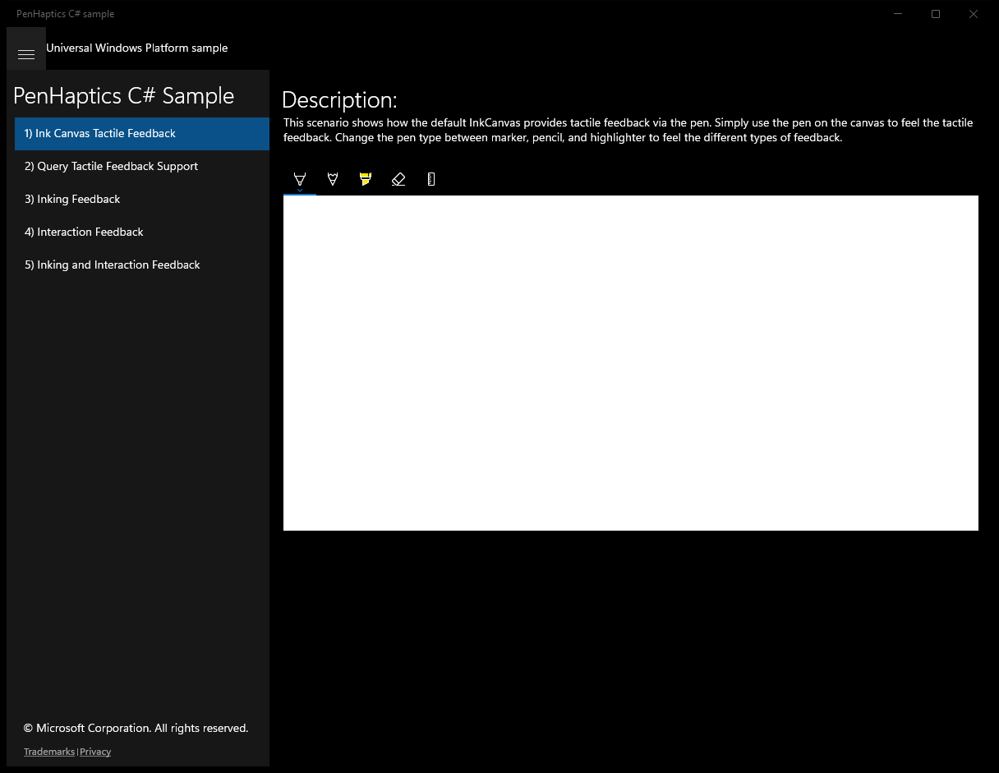
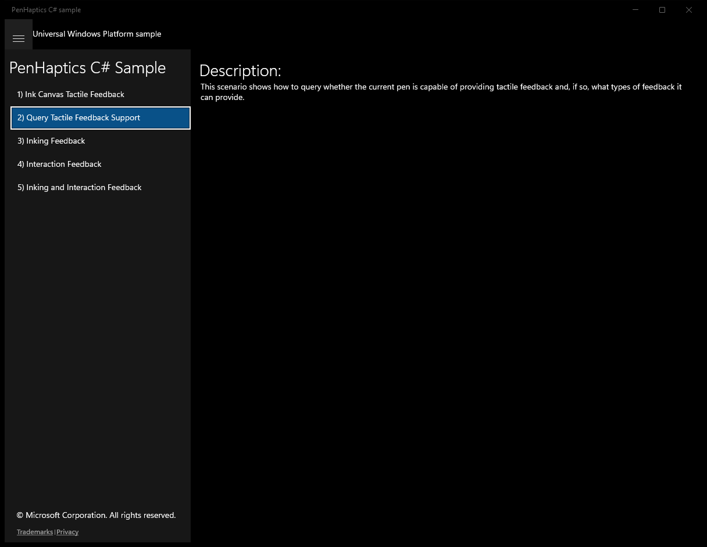
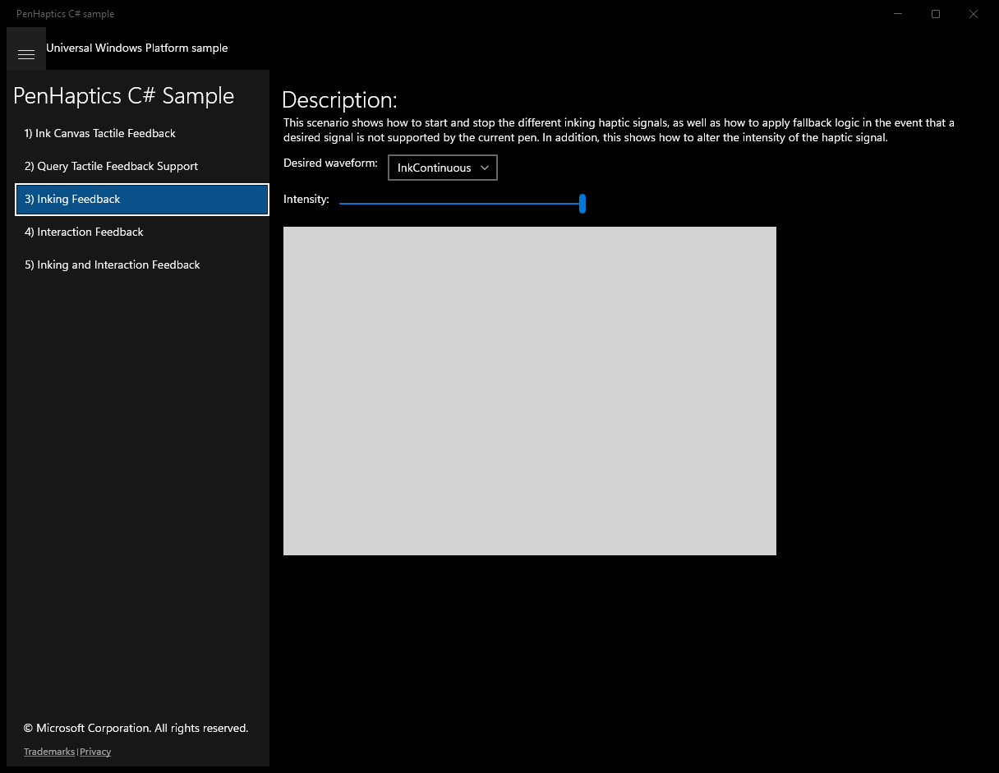
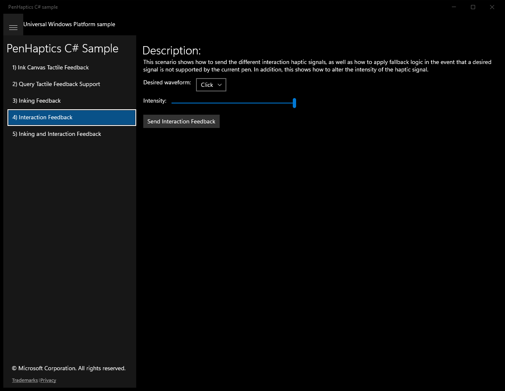
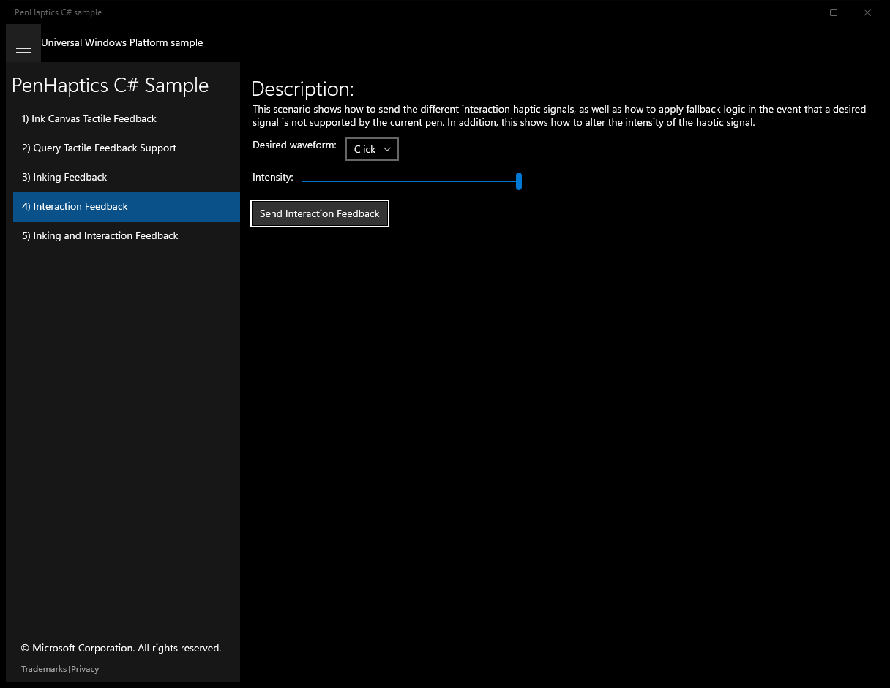
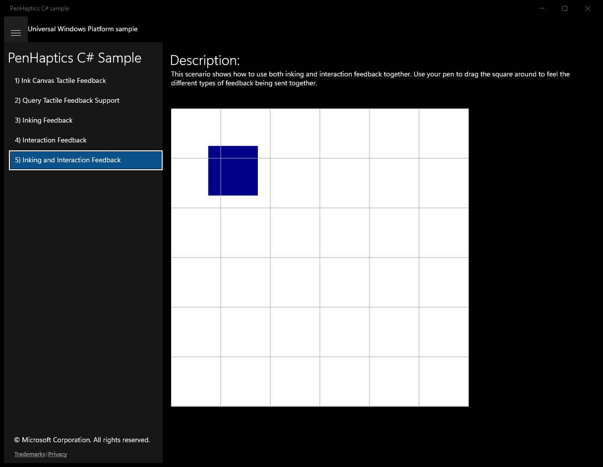

# PenHaptics (C#)

> **Source**: `Samples\PenHaptics\cs\`  
> **Feature**: PenHaptics C# Sample  
> **AUMID**: `Microsoft.SDKSamples.PenHaptics.CS_8wekyb3d8bbwe!PenHaptics.App`  
> **PackageFamilyName**: `Microsoft.SDKSamples.PenHaptics.CS_8wekyb3d8bbwe`  

## Build / deploy / capture status
- build: ok
- deploy: ok
- launch: ok
- capture: ok
- uninstall: ok

## Main page

---

## Scenario 1 - Ink Canvas Tactile Feedback

**Description**: This scenario shows how the default InkCanvas provides tactile feedback via the pen. Simply use the pen on the canvas to feel the tactile feedback. Change the pen type between marker, pencil, and highlighter to feel the different types of feedback.

### UI elements
- **TextBlock**  - text="Description:"
- **InkCanvas**  - x:Name="appInkCanvas"

### Code behavior
- **`OnSizeChanged`**
    - API refs: `RootGrid.ActualWidth`, `RootGrid.ActualHeight`

### Screenshots
Initial state:

---

## Scenario 2 - Query Tactile Feedback Support

**Description**: This scenario shows how to query whether the current pen is capable of providing tactile feedback and, if so, what types of feedback it can provide.

### UI elements
- **TextBlock**  - text="Description:"
- **TextBlock**  - text="This scenario shows how to query whether the current pen is capable of providing tactile feedback and, if so, what types of feedback it can provide."
- **TextBlock**  - name="statusText"
- **TextBlock**  - name="supportedFeatures"
- **TextBlock**  - name="supportedFeedback"

### Code behavior
- **`Pointer_Entered`**
    - API refs: `Pointer.PointerDeviceType`, `PointerDeviceType.Pen`, `PenDevice.GetFromPointerId`, `Pointer.PointerId`, `MainPage.WaveformNamesMap`

### Screenshots
Initial state:

---

## Scenario 3 - Inking Feedback

**Description**: This scenario shows how to start and stop the different inking haptic signals, as well as how to apply fallback logic in the event that a desired signal is not supported by the current pen. In addition, this shows how to alter the intensity of the haptic signal.

### UI elements
- **TextBlock**  - text="Description:"
- **TextBlock**  - text="Desired waveform: "
- **ComboBox**  - name="waveformComboBox"
- **TextBlock**  - text="Intensity: "
- **Slider**  - name="intensitySlider"
- **Canvas**  - name="hapticCanvas"
- **TextBlock**  - name="statusText"

### Code behavior
- **`HapticCanvas_Entered`**
    - API refs: `Pointer.PointerDeviceType`, `PointerDeviceType.Pen`, `PenDevice.GetFromPointerId`, `Pointer.PointerId`
- **`GetSelectedFeedbackOrFallback`**
    - API refs: `MainPage.WaveformNamesMap`, `MainPage.FindSupportedFeedback`, `KnownSimpleHapticsControllerWaveforms.InkContinuous`

### Screenshots
Initial state:

---

## Scenario 4 - Interaction Feedback

**Description**: This scenario shows how to send the different interaction haptic signals, as well as how to apply fallback logic in the event that a desired signal is not supported by the current pen. In addition, this shows how to alter the intensity of the haptic signal.

### UI elements
- **TextBlock**  - text="Description:"
- **TextBlock**  - text="Desired waveform: "
- **ComboBox**  - name="waveformComboBox"
- **TextBlock**  - text="Intensity: "
- **Slider**  - name="intensitySlider"
- **Button**  - name="sendFeedback"; content="Send Interaction Feedback"; events: Click=SendFeedback_Clicked
- **TextBlock**  - name="statusText"

### Code behavior
- **`MainGrid_Entered`**
    - API refs: `Pointer.PointerDeviceType`, `PointerDeviceType.Pen`, `PenDevice.GetFromPointerId`, `Pointer.PointerId`
- **`GetSelectedFeedbackOrFallback`**
    - API refs: `MainPage.WaveformNamesMap`, `MainPage.FindSupportedFeedback`, `KnownSimpleHapticsControllerWaveforms.Click`

### Screenshots
Initial state:

After click **Send Interaction Feedback**:

---

## Scenario 5 - Inking and Interaction Feedback

**Description**: This scenario shows how to use both inking and interaction feedback together. Use your pen to drag the square around to feel the different types of feedback being sent together.

### UI elements
- **TextBlock**  - text="Description:"
- **TextBlock**  - text="This scenario shows how to use both inking and interaction feedback together. Use your pen to drag the square around to feel the different types of feedback being sent together."
- **TextBlock**  - name="statusText"
- **Canvas**  - name="hapticCanvas"

### Code behavior
- **`InitializeGridLines`**
    - instantiates: `SolidColorBrush`, `Line`
    - API refs: `Colors.DarkGray`, `Children.Add`
- **`InitializeManipulationTransforms`**
    - instantiates: `MatrixTransform`, `Point`, `CompositeTransform`, `TransformGroup`
    - API refs: `Matrix.Identity`
- **`MatrixTransform`**
    - API refs: `Matrix.Identity`
- **`MovableRect_Entered`**
    - API refs: `Pointer.PointerDeviceType`, `PointerDeviceType.Pen`, `PenDevice.GetFromPointerId`, `Pointer.PointerId`, `KnownSimpleHapticsControllerWaveforms.InkContinuous`
- **`MovableRect_ManipulationDelta`**
    - API refs: `Delta.Translation`
- **`UpdatePreviewRect`**
    - instantiates: `Vector3`, `Point`
    - API refs: `Visibility.Visible`, `KnownSimpleHapticsControllerWaveforms.Click`, `Visibility.Collapsed`
- **`SnapMovableRectToGridLines`**
    - instantiates: `MatrixTransform`, `TransformGroup`
    - API refs: `Matrix.Identity`, `KnownSimpleHapticsControllerWaveforms.Click`
- **`MatrixTransform`**
    - API refs: `Matrix.Identity`

### Screenshots
Initial state:

