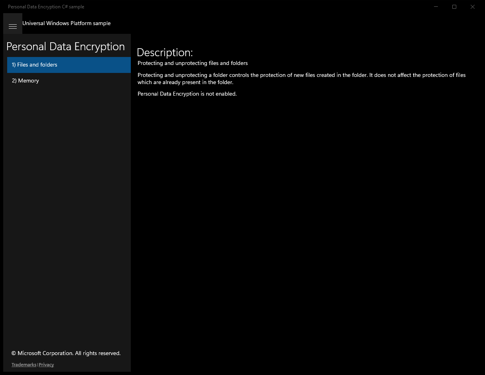
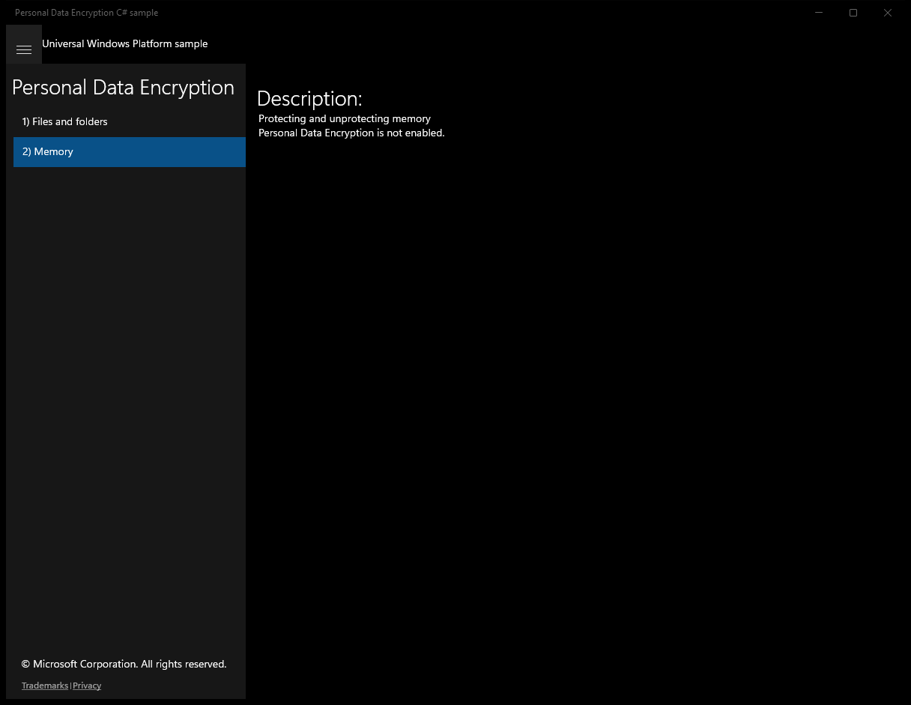

# PersonalDataEncryption (C#)

> **Source**: `Samples\PersonalDataEncryption\cs\`  
> **Feature**: Personal Data Encryption  
> **AUMID**: `Microsoft.SDKSamples.PersonalDataEncryption.CS_8wekyb3d8bbwe!PersonalDataEncryption.App`  
> **PackageFamilyName**: `Microsoft.SDKSamples.PersonalDataEncryption.CS_8wekyb3d8bbwe`  

## Build / deploy / capture status
- build: ok
- deploy: ok
- launch: ok
- capture: ok
- uninstall: ok

## Main page

---

## Scenario 1 - Files and folders

**Description**: Protecting and unprotecting files and folders

### UI elements
- **TextBlock**  - text="Description:"
- **TextBlock**  - text="Protecting and unprotecting files and folders"
- **TextBlock**  - text="Protecting and unprotecting a folder controls the protection of new files created in the folder. It does not affect the protection of files which are already present in the folder."
- **Button**  - content="Choose a file"; events: Click=ChooseFile_Click
- **Button**  - content="Choose a folder"; events: Click=ChooseFolder_Click
- **TextBlock**  - text="Item to protect/unprotect:"
- **TextBlock**  - x:Name="ItemNameBlock"
- **Button**  - content="Protect L1 (available after first unlock)"; events: Click=ProtectL1_Click
- **Button**  - content="Protect L2 (while unlocked)"; events: Click=ProtectL2_Click
- **Button**  - content="Unprotect"; events: Click=Unprotect_Click
- **TextBlock**  - text="Personal Data Encryption is not enabled."

### Code behavior
- **`OnNavigatedTo`**
    - API refs: `UserDataProtectionManager.TryGetDefault`, `AvailablePanel.Visibility`, `Visibility.Visible`, `UnavailablePanel.Visibility`, `Visibility.Collapsed`
- **`ChooseFile_Click`**
    - instantiates: `FileOpenPicker`
    - API refs: `FileTypeFilter.Add`
- **`UpdateItem`**
    - API refs: `ItemOperationsPanel.Visibility`, `Visibility.Visible`, `ItemNameBlock.Text`, `Visibility.Collapsed`
- **`ProtectL1_Click`**
    - API refs: `UserDataAvailability.AfterFirstUnlock`
- **`ProtectL2_Click`**
    - API refs: `UserDataAvailability.WhileUnlocked`
- **`Unprotect_Click`**
    - API refs: `UserDataAvailability.Always`
- **`ReportStatus`**
    - API refs: `UserDataStorageItemProtectionStatus.Succeeded`, `NotifyType.StatusMessage`, `UserDataStorageItemProtectionStatus.NotProtectable`, `NotifyType.ErrorMessage`, `UserDataStorageItemProtectionStatus.DataUnavailable`

### Screenshots
Initial state:

---

## Scenario 2 - Memory

**Description**: Protecting and unprotecting memory

### UI elements
- **TextBlock**  - text="Description:"
- **TextBlock**  - text="Protecting and unprotecting memory"
- **TextBox**  - x:Name="DataTextBox"
- **Button**  - content="Protect L1 (available after first unlock)"; events: Click=ProtectL1_Click
- **Button**  - content="Protect L2 (while unlocked)"; events: Click=ProtectL2_Click
- **TextBlock**  - text="Protected data:"
- **TextBlock**  - x:Name="ProtectedDataTextBlock"
- **Button**  - content="Unprotect"; events: Click=Unprotect_Click
- **TextBlock**  - text="Unprotected data:"
- **TextBlock**  - x:Name="UnprotectedDataTextBlock"
- **TextBlock**  - text="Personal Data Encryption is not enabled."

### Code behavior
- **`OnNavigatedTo`**
    - API refs: `UserDataProtectionManager.TryGetDefault`, `AvailablePanel.Visibility`, `Visibility.Visible`, `UnavailablePanel.Visibility`, `Visibility.Collapsed`
- **`ProtectL1_Click`**
    - API refs: `DataTextBox.Text`, `NotifyType.ErrorMessage`, `CryptographicBuffer.ConvertStringToBinary`, `BinaryStringEncoding.Utf8`, `UserDataAvailability.AfterFirstUnlock`
- **`ProtectL2_Click`**
    - API refs: `DataTextBox.Text`, `NotifyType.ErrorMessage`, `CryptographicBuffer.ConvertStringToBinary`, `BinaryStringEncoding.Utf8`, `UserDataAvailability.WhileUnlocked`
- **`ReportProtectedBuffer`**
    - API refs: `ProtectedDataTextBlock.Text`, `CryptographicBuffer.EncodeToHexString`, `UnprotectPanel.Visibility`, `Visibility.Visible`, `NotifyType.StatusMessage`
    - updates UI: `ProtectedDataTextBlock.Text`
- **`Unprotect_Click`**
    - API refs: `UnprotectedDataTextBlock.Text`, `UserDataBufferUnprotectStatus.Succeeded`, `NotifyType.StatusMessage`, `CryptographicBuffer.ConvertBinaryToString`, `BinaryStringEncoding.Utf8`, `UserDataBufferUnprotectStatus.Unavailable`, `NotifyType.ErrorMessage`
    - updates UI: `UnprotectedDataTextBlock.Text`

### Screenshots
Initial state:

