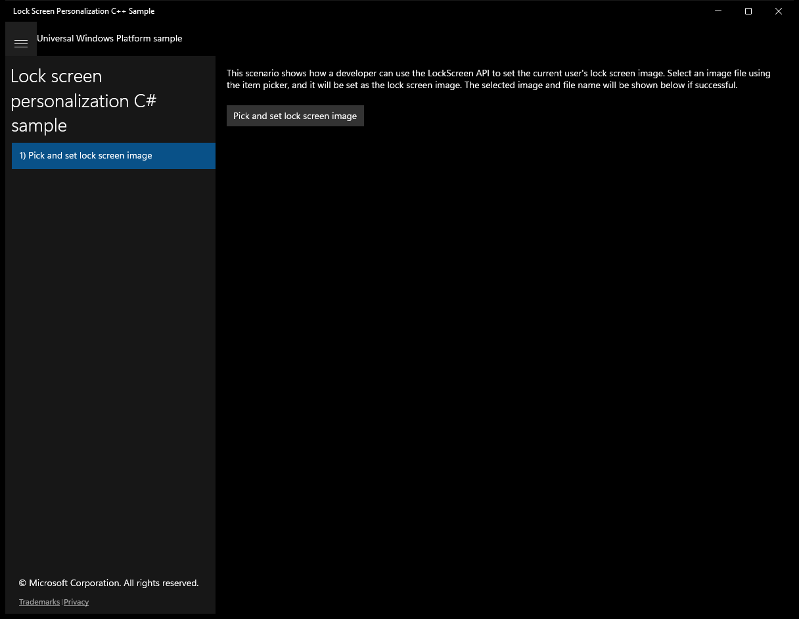
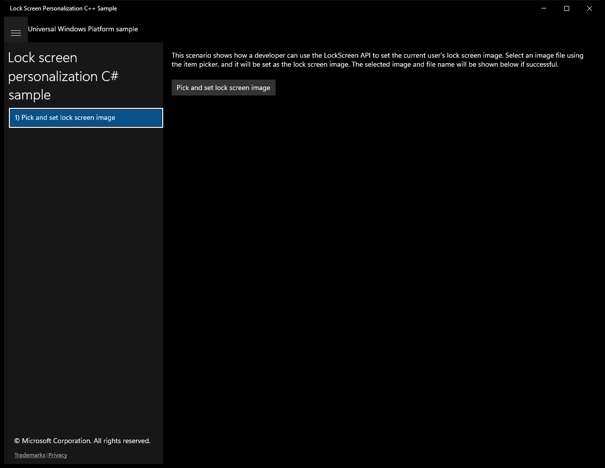

# Personalization (C#)

> **Source**: `Samples\Personalization\cs\`  
> **Feature**: Lock screen personalization C# sample  
> **AUMID**: `Microsoft.SDKSamples.Personalization.CS_8wekyb3d8bbwe!App`  
> **PackageFamilyName**: `Microsoft.SDKSamples.Personalization.CS_8wekyb3d8bbwe`  

## Build / deploy / capture status
- build: ok
- deploy: ok
- launch: ok
- capture: ok
- uninstall: ok

## Main page

---

## Scenario 1 - 1) Pick and set lock screen image

### Screenshots
Initial state:

> Button **Pick and set lock screen image** skipped (blocklist)

