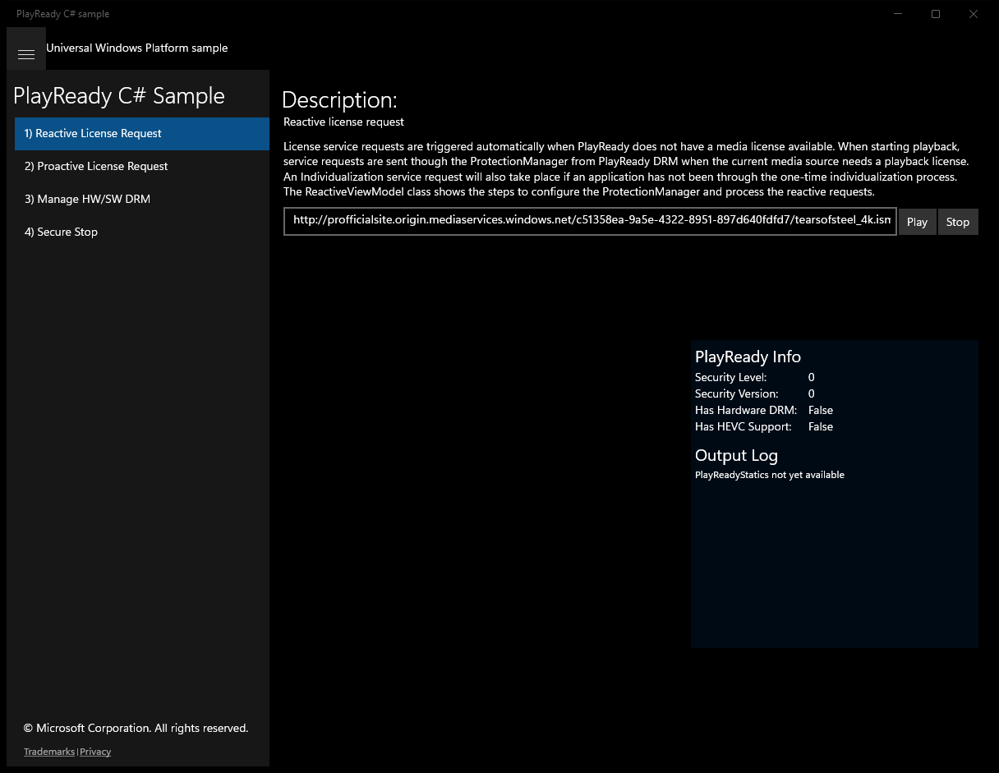
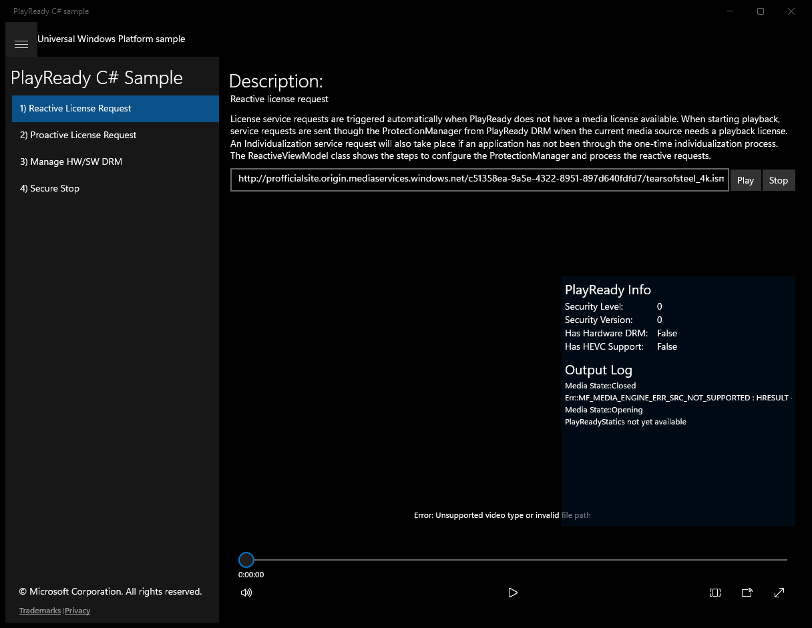
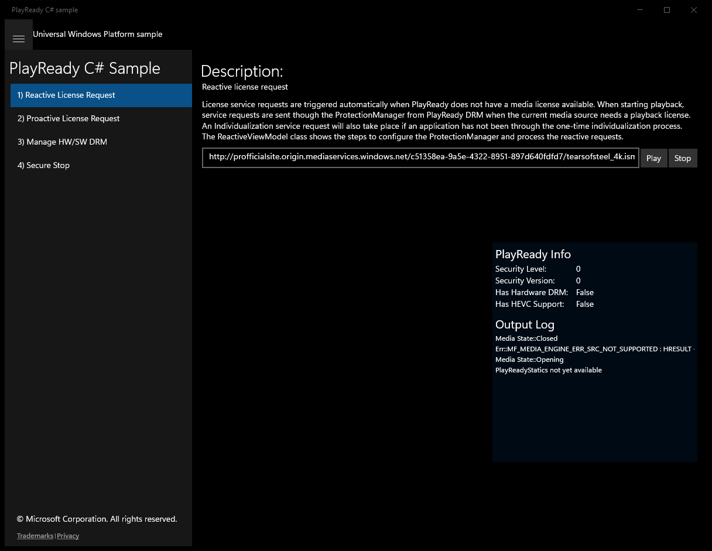
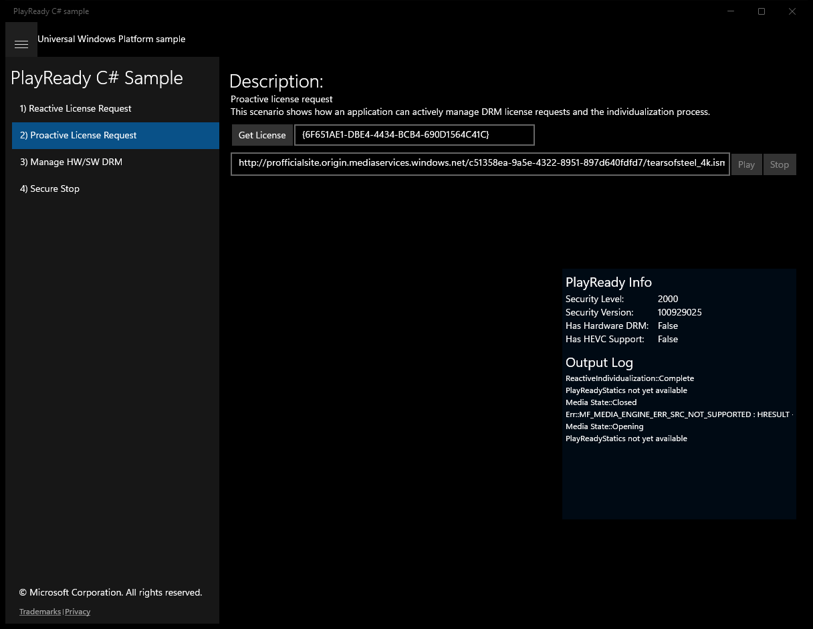

# PlayReady (C#)

> **Source**: `Samples\PlayReady\cs\`  
> **Feature**: PlayReady C# Sample  
> **AUMID**: `Microsoft.SDKSamples.PlayReady.CS_8wekyb3d8bbwe!PlayReady.App`  
> **PackageFamilyName**: `Microsoft.SDKSamples.PlayReady.CS_8wekyb3d8bbwe`  

## Build / deploy / capture status
- build: ok
- deploy: ok
- launch: ok
- capture: ok
- uninstall: ok

## Main page

---

## Scenario 1 - Reactive License Request

### UI elements
- **TextBlock**  - text="Description:"
- **TextBlock**  - text="Reactive license request"
- **TextBox**  - text="{Binding MoviePath, Mode=TwoWay}"
- **Button**  - content="Play"
- **Button**  - content="Stop"
- **MediaElement**  - name="mediaElement"

### Screenshots
Initial state:

After click **Play**:

After click **Stop**:

---

## Scenario 2 - Proactive License Request

### UI elements
- **TextBlock**  - text="Description:"
- **TextBlock**  - text="Proactive license request"
- **TextBlock**  - text="This scenario shows how an application can actively manage DRM license requests and the individualization process."
- **Button**  - content="Get License"
- **TextBox**  - text="{Binding KeyId, Mode=TwoWay}"
- **TextBox**  - text="{Binding MoviePath, Mode=TwoWay}"
- **Button**  - content="Play"
- **Button**  - content="Stop"
- **MediaElement**  - name="mediaElement"

### Screenshots
Initial state:

---

## Scenario 3 - Manage HW/SW DRM

**Description**: Hardware DRM provides enhanced video performance with hardware based security. Software DRM provides better compatability for legacy devices and content. The application can force either mode with Software DRM being the default.

### UI elements
- **TextBlock**  - text="Description:"
- **Button**  - content="Use Hardware DRM"
- **Button**  - content="Use Software DRM"
- **TextBox**  - text="{Binding MoviePath, Mode=TwoWay}"
- **Button**  - content="Play"
- **Button**  - content="Stop"
- **MediaElement**  - name="mediaElement"

### Screenshots
Initial state:

---

## Scenario 4 - Secure Stop

### UI elements
- **TextBlock**  - text="Description:"
- **TextBlock**  - text="Secure Stop"
- **Button**  - content="Get Publisher Cert"
- **Button**  - content="Renew License"
- **TextBox**  - text="{Binding MoviePath, Mode=TwoWay}"
- **Button**  - content="Play"
- **Button**  - content="Stop"
- **MediaElement**  - name="mediaElement"

### Screenshots
Initial state:

