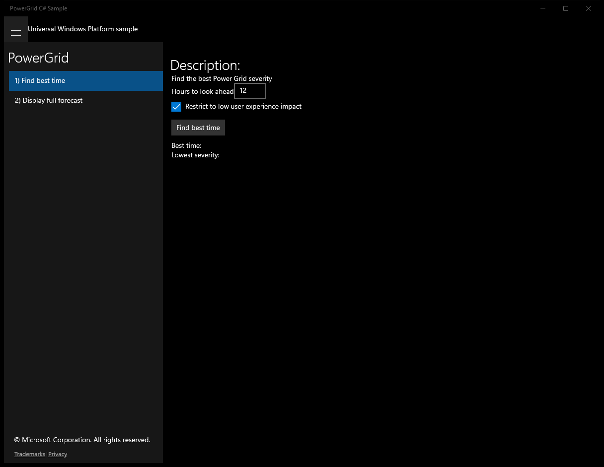
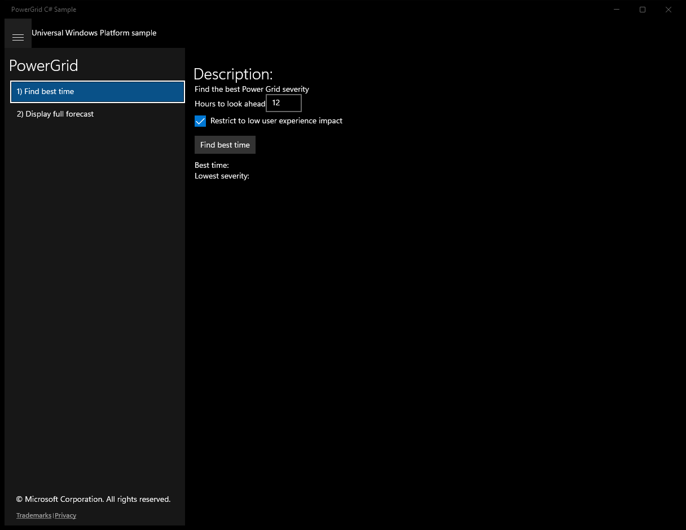
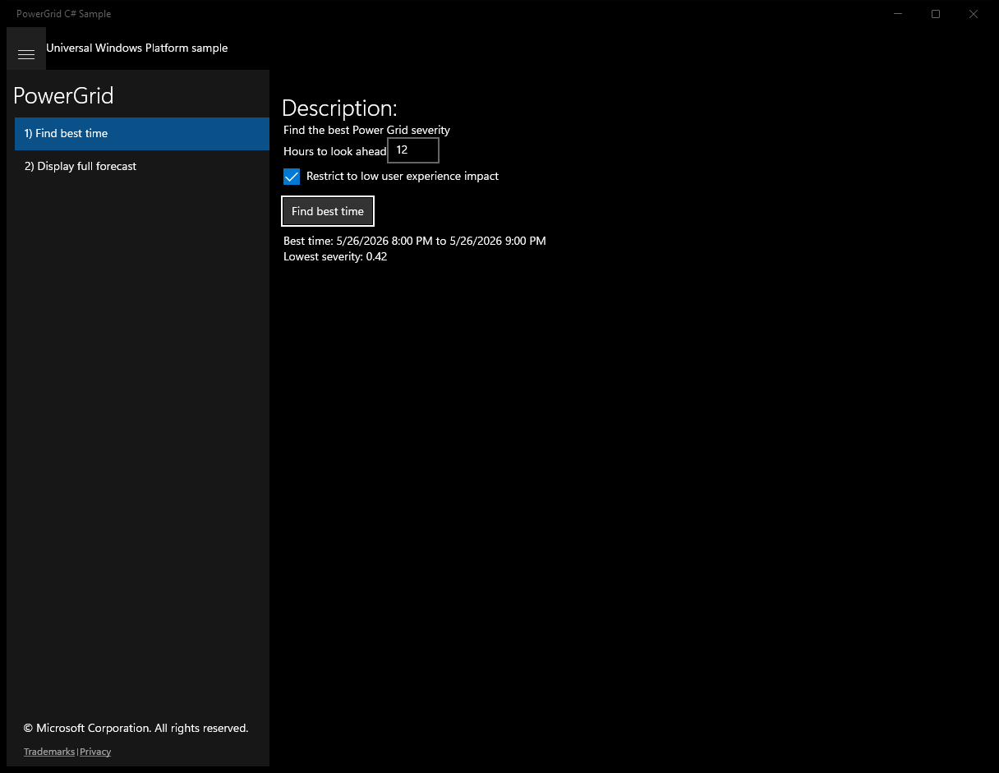
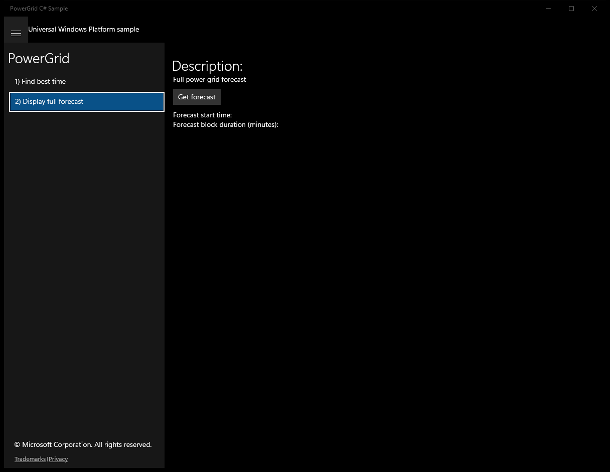
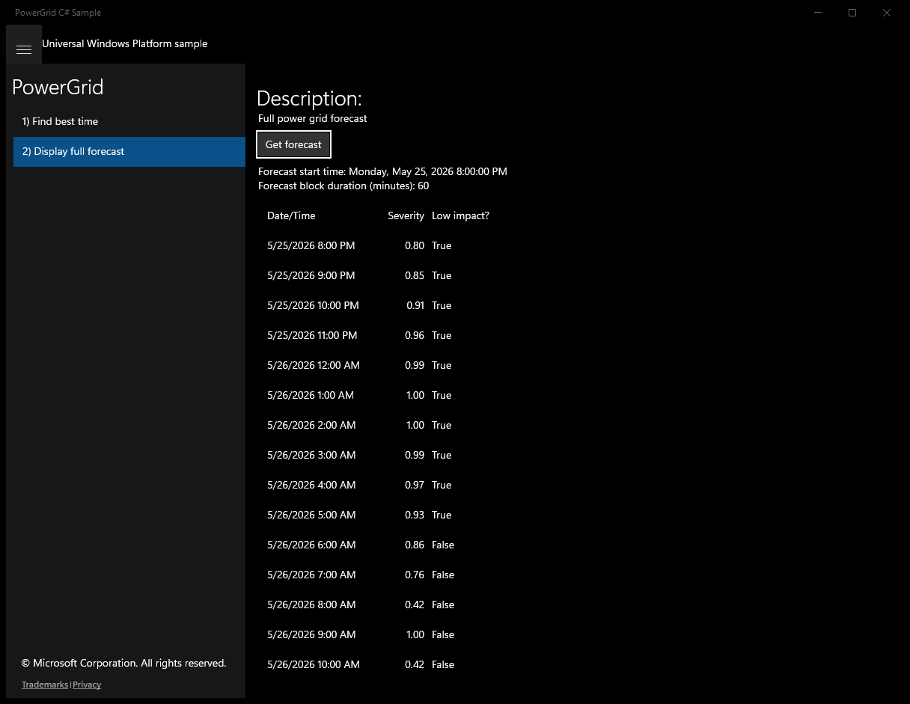

# PowerGrid (C#)

> **Source**: `Samples\PowerGrid\cs\`  
> **Feature**: PowerGrid  
> **AUMID**: `Microsoft.SDKSamples.PowerGrid.CS_8wekyb3d8bbwe!PowerGrid.App`  
> **PackageFamilyName**: `Microsoft.SDKSamples.PowerGrid.CS_8wekyb3d8bbwe`  

## Build / deploy / capture status
- build: ok
- deploy: ok
- launch: ok
- capture: ok
- uninstall: ok

## Main page

---

## Scenario 1 - Find best time

### UI elements
- **TextBlock**  - text="Description:"
- **TextBlock**  - text="Find the best Power Grid severity"
- **TextBlock**  - text="Hours to look ahead"
- **TextBox**  - x:Name="HoursAheadTextBox"; text="12"
- **CheckBox**  - x:Name="LowUXImpactCheckBox"; content="Restrict to low user experience impact"
- **Button**  - x:Name="FindBest"; content="Find best time"; events: Click=FindBest_Click
- **TextBlock**  - text="Best time:"
- **TextBlock**  - text="Lowest severity:"

### Code behavior
- **`OnNavigatedTo`**
    - API refs: `PowerGridForecast.ForecastUpdated`
- **`OnNavigatedFrom`**
    - API refs: `PowerGridForecast.ForecastUpdated`
- **`PowerGridForecast_ForecastUpdated`**
    - API refs: `NotifyType.StatusMessage`
- **`GetForecastIndexContainingTime`**
    - API refs: `TimeSpan.Zero`, `Math.Max`, `Math.Min`, `Forecast.Count`
- **`FindBest_Click`**
    - instantiates: `TimeSpan`, `DateTimeFormatter`, `DecimalFormatter`, `IncrementNumberRounder`
    - API refs: `BestTimeRun.Text`, `LowestSeverityRun.Text`, `NotifyType.StatusMessage`, `HoursAheadTextBox.Text`, `NotifyType.ErrorMessage`, `TimeSpan.FromHours`, `LowUXImpactCheckBox.IsChecked`, `DateTimeOffset.MaxValue`, `Task.Run`, `PowerGridForecast.GetForecast`, `DateTimeOffset.Now`, `BlockDuration.Ticks`

### Screenshots
Initial state:

After click **Find best time**:

---

## Scenario 2 - Display full forecast

### UI elements
- **TextBlock**  - text="Description:"
- **TextBlock**  - text="Full power grid forecast"
- **Button**  - content="Get forecast"; events: Click=GetForecastButton_Click
- **TextBlock**  - text="Forecast start time:"
- **TextBlock**  - text="Forecast block duration (minutes):"
- **ListView**  - x:Name="ForecastList"
- **TextBlock**  - text="{x:Bind DateTimeString}"
- **TextBlock**  - text="{x:Bind SeverityString}"
- **TextBlock**  - text="{x:Bind LowImpactString}"

### Code behavior
- **`OnNavigatedTo`**
    - API refs: `PowerGridForecast.ForecastUpdated`
- **`OnNavigatedFrom`**
    - API refs: `PowerGridForecast.ForecastUpdated`
- **`PowerGridForecast_ForecastUpdated`**
    - API refs: `NotifyType.StatusMessage`
- **`GetForecastButton_Click`**
    - instantiates: `List`, `DateTimeFormatter`, `DecimalFormatter`, `IncrementNumberRounder`
    - API refs: `ForecastStartTimeRun.Text`, `ForecastBlockDurationRun.Text`, `ForecastList.ItemsSource`, `Task.Run`, `PowerGridForecast.GetForecast`, `Forecast.Count`, `NotifyType.ErrorMessage`, `TotalMinutes.ToString`, `IsLowUserExperienceImpact.ToString`

### Screenshots
Initial state:

After click **Get forecast**:

