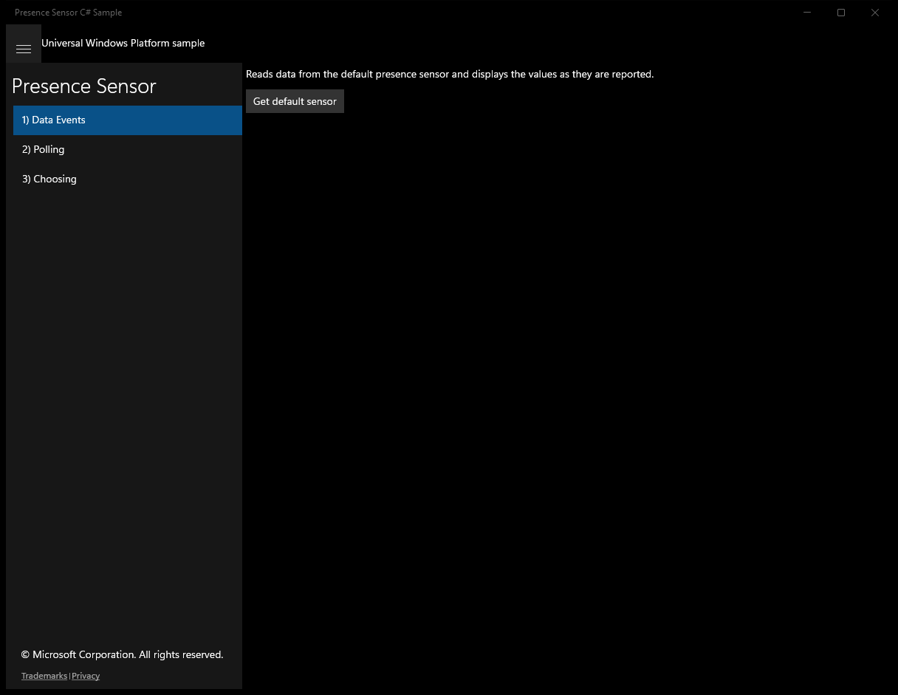
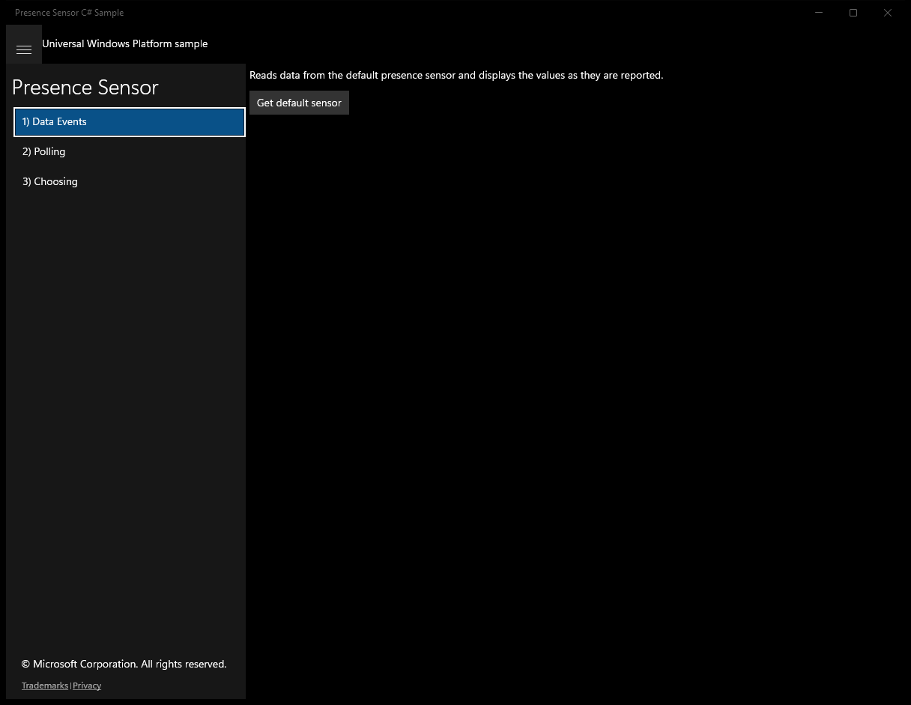
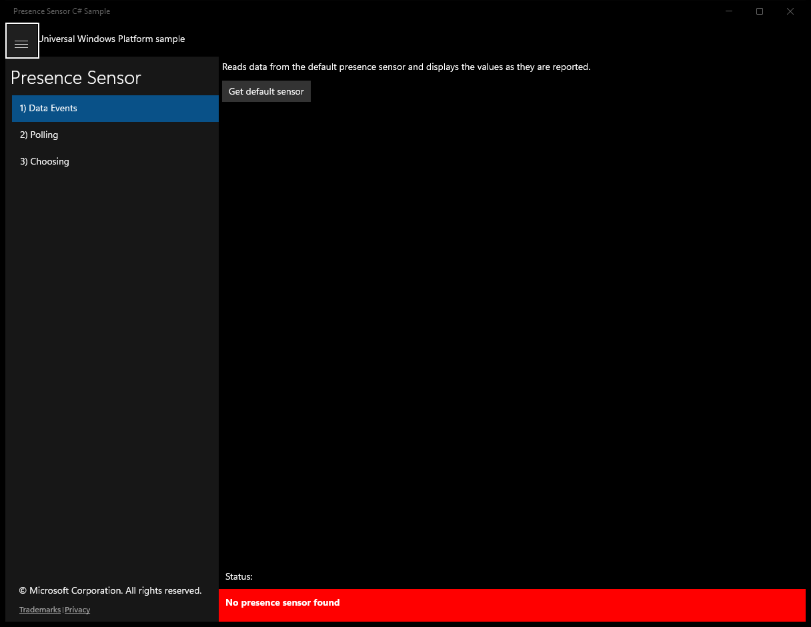
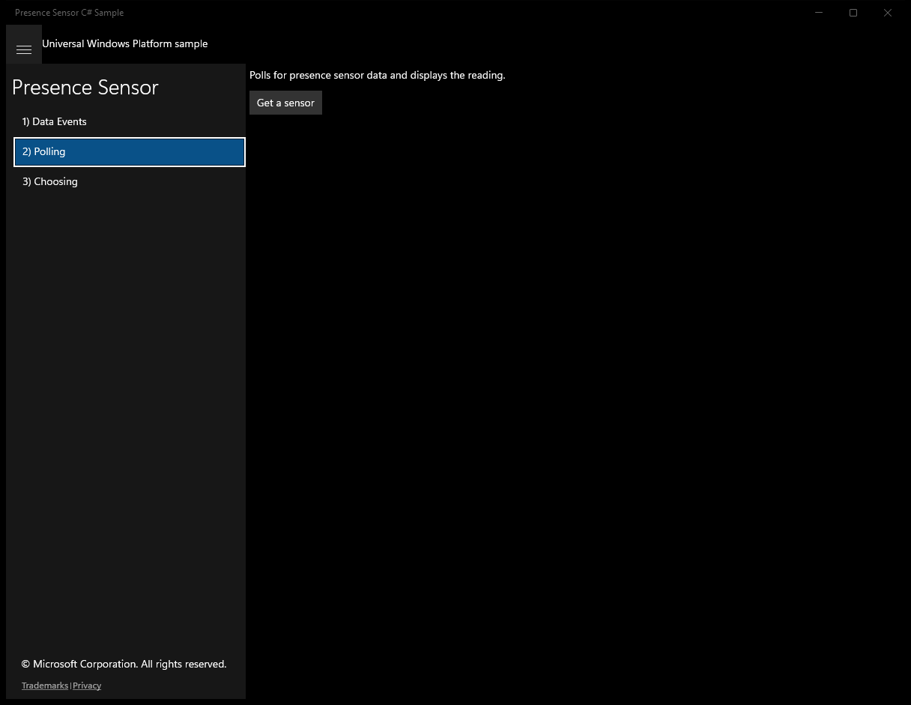
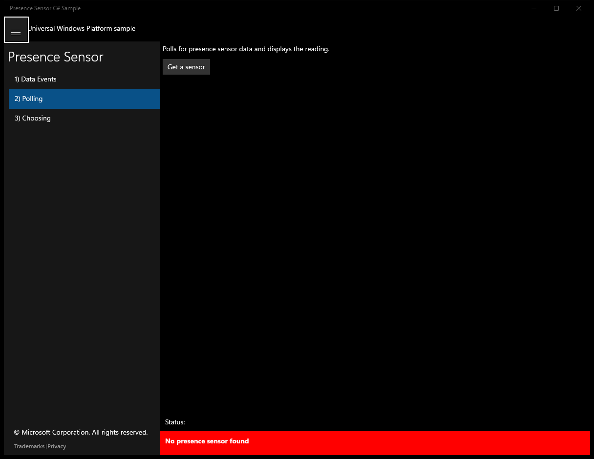
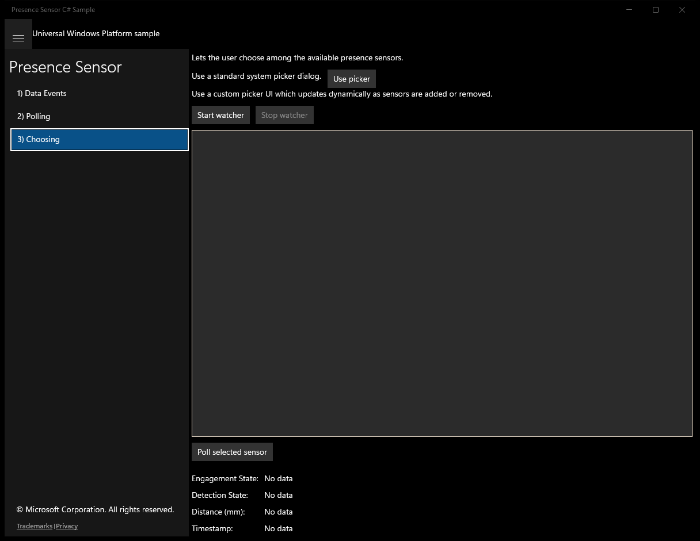
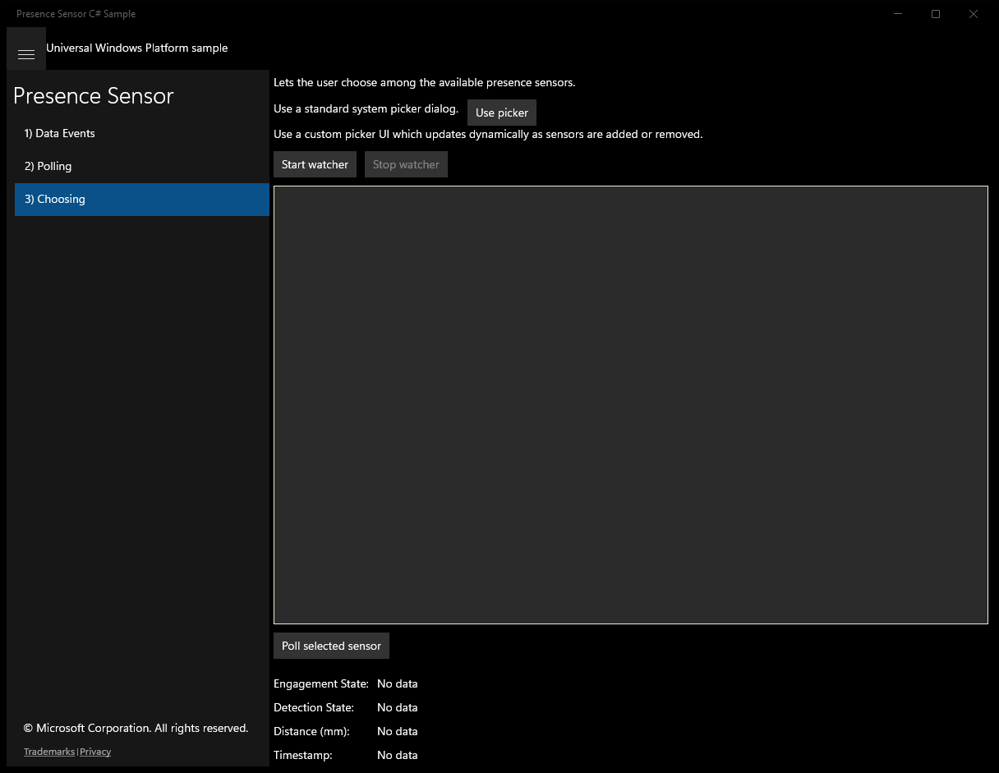
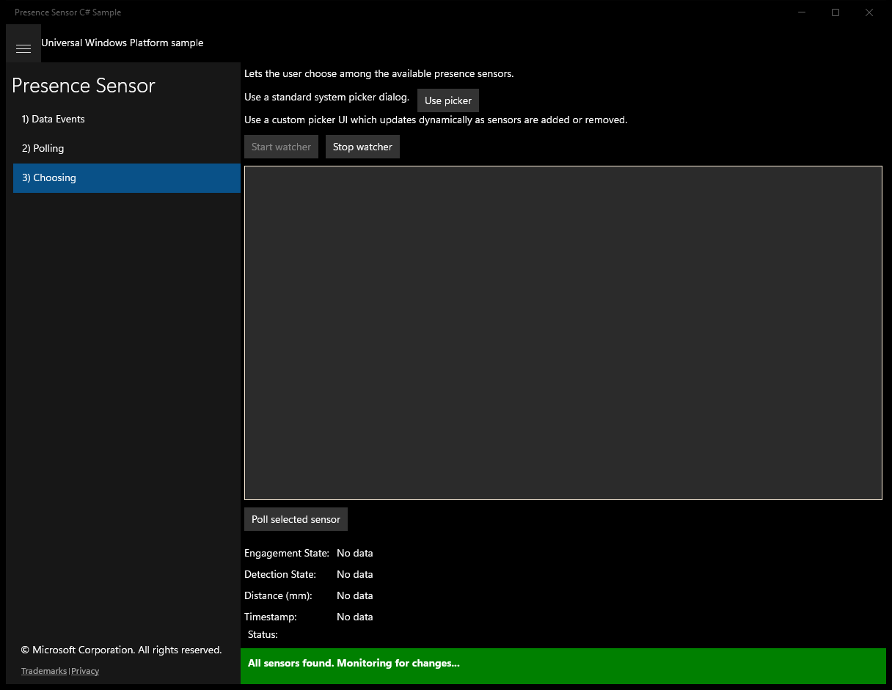
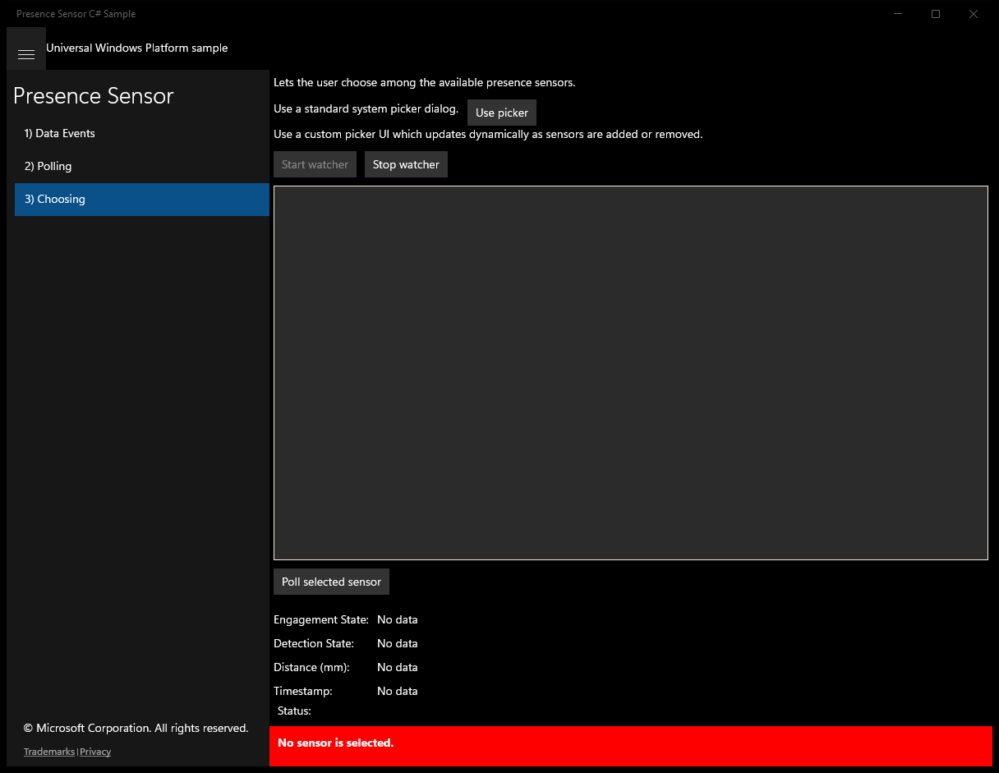

# PresenceSensor (C#)

> **Source**: `Samples\PresenceSensor\cs\`  
> **Feature**: Presence Sensor  
> **AUMID**: `Microsoft.SDKSamples.PresenceSensor.CS_8wekyb3d8bbwe!App`  
> **PackageFamilyName**: `Microsoft.SDKSamples.PresenceSensor.CS_8wekyb3d8bbwe`  

## Build / deploy / capture status
- build: ok
- deploy: ok
- launch: ok
- capture: ok
- uninstall: ok

## Main page

---

## Scenario 1 - Data Events

### UI elements
- **TextBlock**  - x:Name="InputTextBlock"; text="Reads data from the default presence sensor and displays the values as they are reported."
- **Button**  - x:Name="GetSensorButton"; content="Get default sensor"; events: Click=ScenarioGetSensor_Click
- **TextBlock**  - text="Engagement State: "
- **TextBlock**  - x:Name="EngagementStateTextBlock"; text="No data"
- **TextBlock**  - text="Detection State: "
- **TextBlock**  - x:Name="DetectionStateTextBlock"; text="No data"
- **TextBlock**  - text="Distance (mm): "
- **TextBlock**  - x:Name="DetectionDistanceTextBlock"; text="No data"
- **TextBlock**  - text="Timestamp: "
- **TextBlock**  - x:Name="TimestampTextBlock"; text="No data"

### Code behavior
- **`ScenarioGetSensor_Click`**
    - API refs: `GetSensorButton.IsEnabled`, `NotifyType.StatusMessage`, `HumanPresenceSensor.GetDefaultAsync`, `VisualStateManager.GoToState`, `NotifyType.ErrorMessage`
- **`ReadingChanged`**
    - API refs: `Dispatcher.RunAsync`, `CoreDispatcherPriority.Normal`, `EngagementStateTextBlock.Text`, `Engagement.ToString`, `DetectionStateTextBlock.Text`, `Presence.ToString`, `DetectionDistanceTextBlock.Text`, `DistanceInMillimeters.ToString`, `TimestampTextBlock.Text`, `Timestamp.ToString`
    - updates UI: `EngagementStateTextBlock.Text`, `DetectionStateTextBlock.Text`, `DetectionDistanceTextBlock.Text`, `TimestampTextBlock.Text`

### Screenshots
Initial state:

After click **Get default sensor**:

---

## Scenario 2 - Polling

### UI elements
- **TextBlock**  - x:Name="InputTextBlock"; text="Polls for presence sensor data and displays the reading."
- **Button**  - x:Name="GetSensorButton"; content="Get a sensor"; events: Click=ScenarioGetSensor_Click
- **Button**  - x:Name="ScenarioGetDataButton"; content="Get Data"; events: Click=ScenarioGetData_Click
- **TextBlock**  - text="Engagement State: "
- **TextBlock**  - x:Name="EngagementStateTextBlock"; text="No data"
- **TextBlock**  - text="Detection State: "
- **TextBlock**  - x:Name="DetectionStateTextBlock"; text="No data"
- **TextBlock**  - text="Distance (mm): "
- **TextBlock**  - x:Name="DetectionDistanceTextBlock"; text="No data"
- **TextBlock**  - text="Timestamp: "
- **TextBlock**  - x:Name="TimestampTextBlock"; text="No data"

### Code behavior
- **`ScenarioGetSensor_Click`**
    - API refs: `DeviceInformation.FindAllAsync`, `GetSensorButton.IsEnabled`, `NotifyType.StatusMessage`, `HumanPresenceSensor.GetDeviceSelector`, `HumanPresenceSensor.FromIdAsync`, `VisualStateManager.GoToState`, `NotifyType.ErrorMessage`
- **`ScenarioGetData_Click`**
    - API refs: `EngagementStateTextBlock.Text`, `Engagement.ToString`, `DetectionStateTextBlock.Text`, `Presence.ToString`, `DetectionDistanceTextBlock.Text`, `DistanceInMillimeters.ToString`, `TimestampTextBlock.Text`, `Timestamp.ToString`
    - updates UI: `EngagementStateTextBlock.Text`, `DetectionStateTextBlock.Text`, `DetectionDistanceTextBlock.Text`, `TimestampTextBlock.Text`

### Screenshots
Initial state:

After click **Get a sensor**:

---

## Scenario 3 - Choosing

### UI elements
- **TextBlock**  - text="Lets the user choose among the available presence sensors."
- **TextBlock**  - text="Use a standard system picker dialog."
- **Button**  - x:Name="ScenarioPickButton"; content="Use picker"; events: Click=ScenarioPick_Click
- **TextBlock**  - text="Use a custom picker UI which updates dynamically as sensors are added or removed."
- **Button**  - x:Name="ScenarioStartButton"; content="Start watcher"; events: Click=ScenarioStart_Click
- **Button**  - x:Name="ScenarioStopButton"; content="Stop watcher"; events: Click=ScenarioStop_Click
- **ListBox**  - x:Name="SensorsList"
- **Button**  - x:Name="ReadSelectedButton"; content="Poll selected sensor"; events: Click=ScenarioReadSelected_Click
- **TextBlock**  - text="Engagement State: "
- **TextBlock**  - x:Name="EngagementStateTextBlock"; text="No data"
- **TextBlock**  - text="Detection State: "
- **TextBlock**  - x:Name="DetectionStateTextBlock"; text="No data"
- **TextBlock**  - text="Distance (mm): "
- **TextBlock**  - x:Name="DetectionDistanceTextBlock"; text="No data"
- **TextBlock**  - text="Timestamp: "
- **TextBlock**  - x:Name="TimestampTextBlock"; text="No data"

### Code behavior
- **`ScenarioPick_Click`**
    - instantiates: `DevicePicker`, `Rect`
    - API refs: `Appearance.Title`, `Filter.SupportedDeviceSelectors`, `HumanPresenceSensor.GetDeviceSelector`, `ScenarioPickButton.TransformToVisual`, `ScenarioPickButton.ActualWidth`, `ScenarioPickButton.ActualHeight`
- **`OnHumanPresenceSensorAdded`**
    - instantiates: `ListBoxItem`
    - API refs: `Dispatcher.RunAsync`, `CoreDispatcherPriority.Normal`, `SensorsList.Items`
- **`OnHumanPresenceSensorRemoved`**
    - API refs: `Dispatcher.RunAsync`, `CoreDispatcherPriority.Normal`, `SensorsList.Items`
- **`OnHumanPresenceSensorUpdated`**
    - API refs: `Dispatcher.RunAsync`, `CoreDispatcherPriority.Normal`, `SensorsList.Items`
- **`OnHumanPresenceSensorEnumerationCompleted`**
    - API refs: `Dispatcher.RunAsync`, `CoreDispatcherPriority.Normal`, `NotifyType.StatusMessage`
- **`ScenarioStart_Click`**
    - API refs: `SensorsList.Items`, `DeviceInformation.CreateWatcher`, `HumanPresenceSensor.GetDeviceSelector`, `NotifyType.StatusMessage`, `ScenarioStartButton.IsEnabled`, `ScenarioStopButton.IsEnabled`
- **`ScenarioStop_Click`**
    - API refs: `NotifyType.StatusMessage`, `ScenarioStartButton.IsEnabled`, `ScenarioStopButton.IsEnabled`
- **`ScenarioReadSelected_Click`**
    - API refs: `NotifyType.StatusMessage`, `SensorsList.SelectedItem`, `NotifyType.ErrorMessage`
- **`ReadOneReadingFromSensorAsync`**
    - API refs: `HumanPresenceSensor.FromIdAsync`, `EngagementStateTextBlock.Text`, `DetectionStateTextBlock.Text`, `TimestampTextBlock.Text`, `DetectionDistanceTextBlock.Text`, `Engagement.ToString`, `Presence.ToString`, `DistanceInMillimeters.ToString`, `Timestamp.ToString`, `NotifyType.ErrorMessage`
    - updates UI: `EngagementStateTextBlock.Text`, `DetectionStateTextBlock.Text`, `TimestampTextBlock.Text`, `DetectionDistanceTextBlock.Text`

### Screenshots
Initial state:

After click **Use picker**:

After click **Start watcher**:

After click **Poll selected sensor**:

