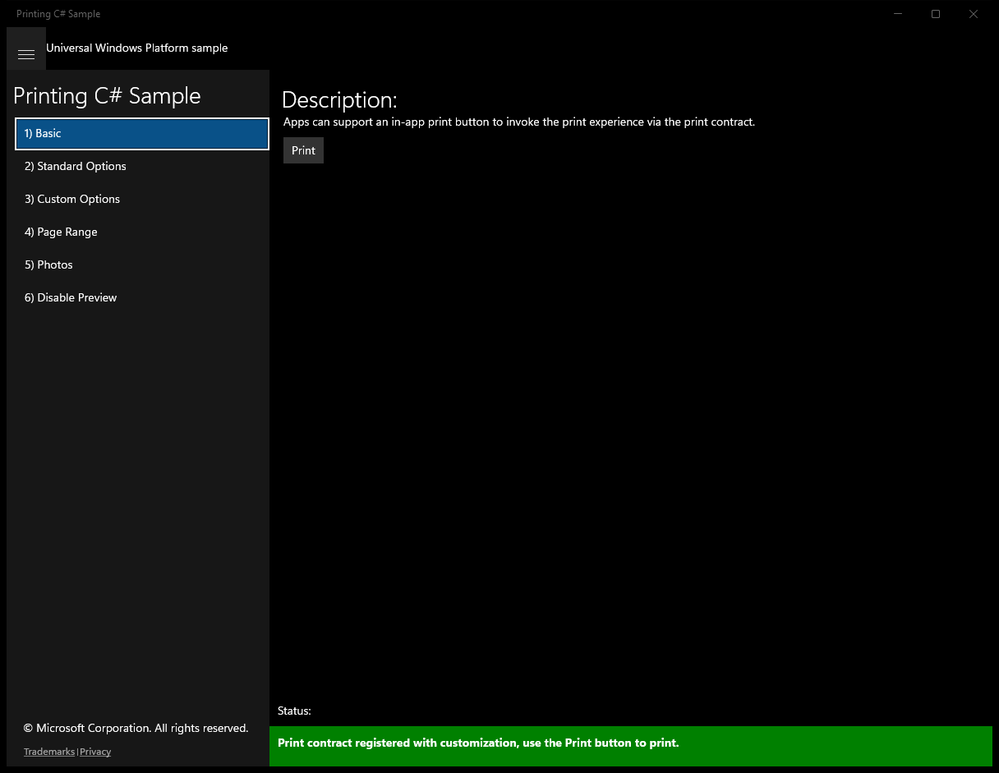
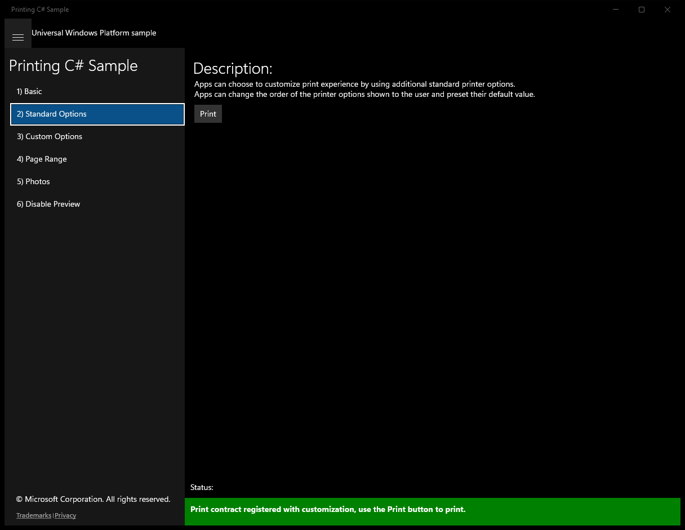
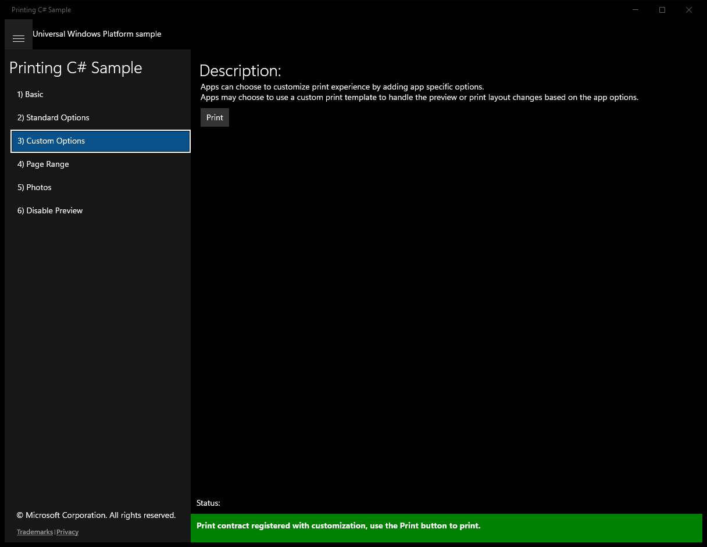
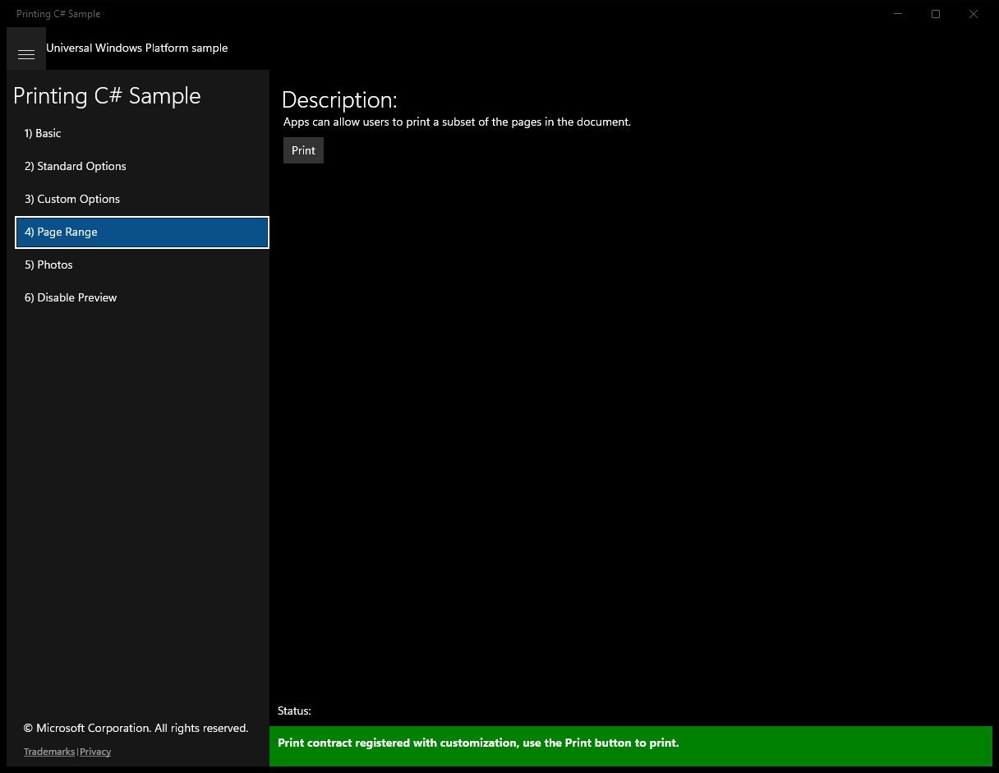
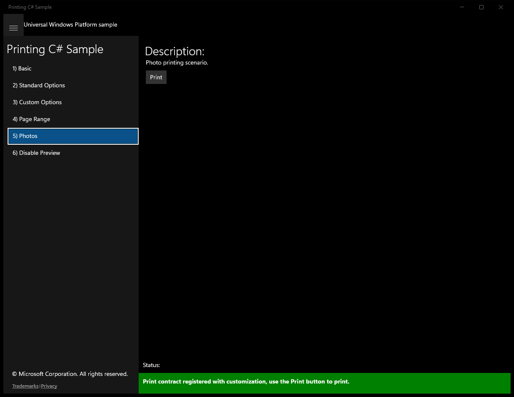
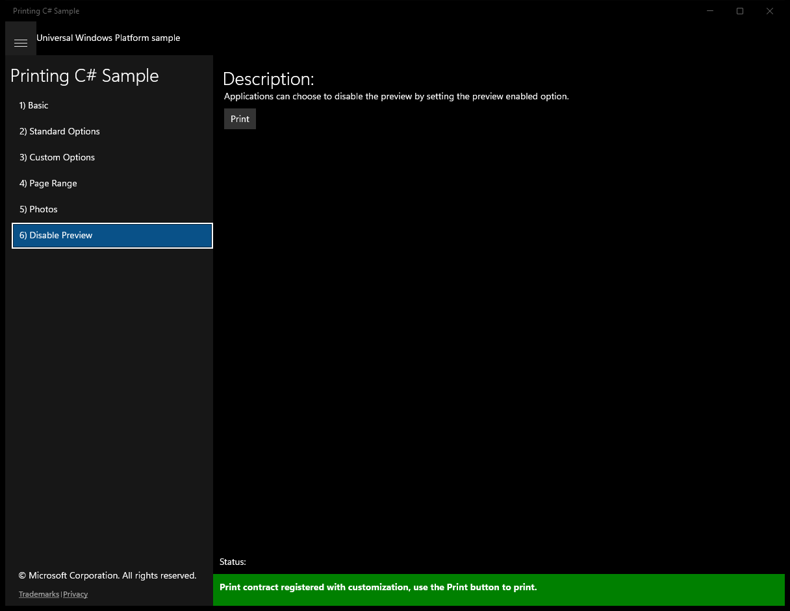

#  (C#)

> **Source**: `Samples\\cs\`  
> **Feature**: Printing C# Sample  
> **AUMID**: `Microsoft.SDKSamples.PrintSample.CS_8wekyb3d8bbwe!App`  
> **PackageFamilyName**: `Microsoft.SDKSamples.PrintSample.CS_8wekyb3d8bbwe`  

## Sample purpose
Shows how apps can add support for printing on Windows.

## Top-level UWP namespaces used
- `Windows.Graphics.Printing.StandardPrintTaskOptions.Copies`
- `Windows.Graphics.Printing.StandardPrintTaskOptions.Orientation`
- `Windows.Graphics.Printing.StandardPrintTaskOptions.MediaSize`
- `Windows.Graphics.Printing.StandardPrintTaskOptions.Collation`
- `Windows.Graphics.Printing.StandardPrintTaskOptions.Duplex`
- `Windows.UI.Core.CoreDispatcherPriority.Normal`
- `Windows.Graphics.Printing.StandardPrintTaskOptions.ColorMode`
- `Windows.UI.Xaml.Visibility.Visible`
- `Windows.UI.Xaml.Visibility.Collapsed`
- `Windows.Graphics.Printing.StandardPrintTaskOptions.CustomPageRanges`
- `Windows.UI.Xaml.HorizontalAlignment.Center`
- `Windows.UI.Xaml.VerticalAlignment.Center`

## Build / deploy / capture status
- build: skipped
- deploy: ok
- launch: ok
- capture: ok
- uninstall: ok

## Main page

---

## Scenario 1 - Basic

**Description**: Apps can support an in-app print button to invoke the print experience via the print contract.

### UI elements
- **Canvas**  - x:Name="PrintCanvas"
- **TextBlock**  - text="Description:"
- **TextBlock**  - text="Apps can support an in-app print button to invoke the print experience via the print contract."
- **Button**  - x:Name="InvokePrintingButton"; content="Print"; events: Click=OnPrintButtonClick
- **TextBlock**  - x:Name="StatusBlock"

### Code behavior
- **`OnNavigatedTo`**
    - instantiates: `PrintHelper`, `PageToPrint`
    - API refs: `PrintManager.IsSupported`, `MainPage.Current`, `NotifyType.StatusMessage`, `InvokePrintingButton.Visibility`, `Visibility.Collapsed`, `NotifyType.ErrorMessage`

### Screenshots
Initial state:

> Button **Print** skipped (blocklist)

---

## Scenario 2 - Scenario2StandardOptons

### UI elements
- **Canvas**  - x:Name="PrintCanvas"
- **TextBlock**  - text="Description:"
- **Button**  - x:Name="InvokePrintingButton"; content="Print"; events: Click=OnPrintButtonClick
- **TextBlock**  - x:Name="StatusBlock"

### Code behavior
- **`PrintTaskRequested`**
    - namespaces: `Windows.Graphics.Printing.StandardPrintTaskOptions.Copies`, `Windows.Graphics.Printing.StandardPrintTaskOptions.Orientation`, `Windows.Graphics.Printing.StandardPrintTaskOptions.MediaSize`, `Windows.Graphics.Printing.StandardPrintTaskOptions.Collation`, `Windows.Graphics.Printing.StandardPrintTaskOptions.Duplex`, `Windows.UI.Core.CoreDispatcherPriority.Normal`
    - API refs: `Request.CreatePrintTask`, `Options.DisplayedOptions`, `Windows.Graphics`, `Printing.StandardPrintTaskOptions`, `Options.MediaSize`, `PrintMediaSize.NorthAmericaLegal`, `PrintTaskCompletion.Failed`, `Dispatcher.RunAsync`, `Windows.UI`, `Core.CoreDispatcherPriority`, `MainPage.Current`, `NotifyType.ErrorMessage`
- **`OnNavigatedTo`**
    - instantiates: `StandardOptionsPrintHelper`, `PageToPrint`
    - API refs: `PrintManager.IsSupported`, `MainPage.Current`, `NotifyType.StatusMessage`, `InvokePrintingButton.Visibility`, `Visibility.Collapsed`, `NotifyType.ErrorMessage`

### Screenshots
Initial state:

> Button **Print** skipped (blocklist)

---

## Scenario 3 - Custom Options

### UI elements
- **Canvas**  - x:Name="PrintCanvas"
- **TextBlock**  - text="Description:"
- **Button**  - x:Name="InvokePrintingButton"; content="Print"; events: Click=OnPrintButtonClick
- **TextBlock**  - x:Name="StatusBlock"

### Code behavior
- **`PrintTaskRequested`**
    - namespaces: `Windows.Graphics.Printing.StandardPrintTaskOptions.Copies`, `Windows.Graphics.Printing.StandardPrintTaskOptions.Orientation`, `Windows.Graphics.Printing.StandardPrintTaskOptions.ColorMode`
    - API refs: `Request.CreatePrintTask`, `PrintTaskOptionDetails.GetFromPrintTaskOptions`, `Windows.Graphics`, `Printing.StandardPrintTaskOptions`, `PrintTaskCompletion.Failed`, `MainPage.Current`, `NotifyType.ErrorMessage`
- **`AddOnePrintPreviewPage`**
    - namespaces: `Windows.UI.Xaml.Visibility.Visible`, `Windows.UI.Xaml.Visibility.Collapsed`
    - instantiates: `GridLength`
    - API refs: `Windows.UI`, `Xaml.Visibility`, `Grid.ColumnSpanProperty`, `Grid.RowProperty`, `Grid.ColumnProperty`, `GridUnitType.Star`
- **`CreatePrintPreviewPages`**
    - API refs: `PrintTaskOptionDetails.GetFromPrintTaskOptions`, `Convert.ToInt32`
- **`OnNavigatedTo`**
    - instantiates: `CustomOptionsPrintHelper`, `PageToPrint`
    - API refs: `PrintManager.IsSupported`, `MainPage.Current`, `NotifyType.StatusMessage`, `InvokePrintingButton.Visibility`, `Visibility.Collapsed`, `NotifyType.ErrorMessage`

### Screenshots
Initial state:

> Button **Print** skipped (blocklist)

---

## Scenario 4 - Page Range

**Description**: Apps can allow users to print a subset of the pages in the document.

### UI elements
- **Canvas**  - x:Name="PrintCanvas"
- **TextBlock**  - text="Description:"
- **TextBlock**  - text="Apps can allow users to print a subset of the pages in the document."
- **Button**  - x:Name="InvokePrintingButton"; content="Print"; events: Click=OnPrintButtonClick
- **TextBlock**  - x:Name="StatusBlock"

### Code behavior
- **`PrintTaskRequested`**
    - namespaces: `Windows.Graphics.Printing.StandardPrintTaskOptions.Copies`, `Windows.Graphics.Printing.StandardPrintTaskOptions.CustomPageRanges`, `Windows.Graphics.Printing.StandardPrintTaskOptions.Orientation`, `Windows.Graphics.Printing.StandardPrintTaskOptions.MediaSize`, `Windows.Graphics.Printing.StandardPrintTaskOptions.ColorMode`, `Windows.UI.Core.CoreDispatcherPriority.Normal`
    - API refs: `Request.CreatePrintTask`, `PrintTaskOptionDetails.GetFromPrintTaskOptions`, `Windows.Graphics`, `Printing.StandardPrintTaskOptions`, `Options.PageRangeOptions`, `PrintTask.Completed`, `PrintTaskCompletion.Failed`, `Dispatcher.RunAsync`, `Windows.UI`, `Core.CoreDispatcherPriority`, `MainPage.Current`, `NotifyType.ErrorMessage`
- **`CreatePrintPreviewPages`**
    - API refs: `PrintTaskOptionDetails.GetFromPrintTaskOptions`, `StandardPrintTaskOptions.CustomPageRanges`
- **`AddPrintPages`**
    - API refs: `PrintTaskOptions.CustomPageRanges`, `PrintDocument.SetPreviewPageCount`
- **`OnNavigatedTo`**
    - instantiates: `PageRangePrintHelper`, `PageToPrint`
    - API refs: `PrintManager.IsSupported`, `MainPage.Current`, `NotifyType.StatusMessage`, `InvokePrintingButton.Visibility`, `Visibility.Collapsed`, `NotifyType.ErrorMessage`

### Screenshots
Initial state:

> Button **Print** skipped (blocklist)

---

## Scenario 5 - Photos

**Description**: Photo printing scenario.

### UI elements
- **Canvas**  - x:Name="PrintCanvas"
- **TextBlock**  - text="Description:"
- **TextBlock**  - text="Photo printing scenario."
- **Button**  - x:Name="InvokePrintingButton"; content="Print"; events: Click=OnPrintButtonClick
- **TextBlock**  - x:Name="StatusBlock"

### Code behavior
- **`Equals`**
    - API refs: `Math.Abs`, `PageSize.Width`, `PageSize.Height`, `ViewablePageSize.Width`, `ViewablePageSize.Height`, `PictureViewSize.Width`, `PictureViewSize.Height`
- **`PrintTaskRequested`**
    - namespaces: `Windows.Graphics.Printing.StandardPrintTaskOptions.MediaSize`, `Windows.Graphics.Printing.StandardPrintTaskOptions.Copies`, `Windows.UI.Core.CoreDispatcherPriority.Normal`
    - API refs: `Request.CreatePrintTask`, `PrintTaskOptionDetails.GetFromPrintTaskOptions`, `DisplayedOptions.Clear`, `DisplayedOptions.Add`, `Windows.Graphics`, `Printing.StandardPrintTaskOptions`, `Options.Orientation`, `PrintOrientation.Landscape`, `Dispatcher.RunAsync`, `Windows.UI`, `Core.CoreDispatcherPriority`, `Scaling.ShrinkToFit`, `PhotoSize.SizeFullPage`, `PrintTaskCompletion.Failed`, `MainPage.Current`, `NotifyType.ErrorMessage`
- **`PrintDetailedOptionsOptionChanged`**
    - namespaces: `Windows.UI.Core.CoreDispatcherPriority.Normal`
    - API refs: `OptionId.ToString`, `PhotoSize.SizeFullPage`, `PhotoSize.Size4x6`, `PhotoSize.Size5x7`, `PhotoSize.Size8x10`, `Scaling.Crop`, `Scaling.ShrinkToFit`, `Dispatcher.RunAsync`, `Windows.UI`, `Core.CoreDispatcherPriority`
- **`CreatePrintPreviewPages`**
    - instantiates: `PageDescription`, `PreviewUnavailable`
    - API refs: `Interlocked.Increment`, `PrintTaskOptionDetails.GetFromPrintTaskOptions`, `PrintTaskOptions.GetPageDescription`, `Margin.Width`, `Math.Max`, `ImageableRect.Left`, `ImageableRect.Right`, `PageSize.Width`, `Margin.Height`, `ImageableRect.Top`, `ImageableRect.Bottom`, `PageSize.Height`, `ViewablePageSize.Width`, `ViewablePageSize.Height`, `PhotoSize.Size4x6`, `PictureViewSize.Width`, `PictureViewSize.Height`, `PhotoSize.Size5x7`, `PhotoSize.Size8x10`, `PhotoSize.SizeFullPage`, `Scaling.Crop`, `PreviewPageCountType.Intermediate`
- **`GetPrintPreviewPage`**
    - API refs: `Interlocked.Exchange`, `Interlocked.CompareExchange`, `PrintCanvas.Children`, `PrintCanvas.InvalidateMeasure`, `PrintCanvas.UpdateLayout`
- **`AddPrintPages`**
    - API refs: `PrintTask.Completed`
- **`ClearPageCollection`**
    - API refs: `PrintCanvas.Children`
- **`GeneratePageAsync`**
    - namespaces: `Windows.UI.Xaml.HorizontalAlignment.Center`, `Windows.UI.Xaml.VerticalAlignment.Center`
    - instantiates: `Canvas`, `Uri`
    - API refs: `PageSize.Width`, `PageSize.Height`, `ViewablePageSize.Width`, `ViewablePageSize.Height`, `Canvas.LeftProperty`, `Margin.Width`, `Canvas.TopProperty`, `Margin.Height`, `PictureViewSize.Width`, `PictureViewSize.Height`, `Windows.UI`, `Xaml.HorizontalAlignment`, `Xaml.VerticalAlignment`, `Scaling.Crop`, `Stretch.None`, `Children.Add`
- **`Canvas`**
    - API refs: `ViewablePageSize.Width`, `ViewablePageSize.Height`
- **`LoadBitmapAsync`**
    - instantiates: `BitmapTransform`, `WriteableBitmap`
    - API refs: `StorageFile.GetFileFromApplicationUriAsync`, `FileAccessMode.Read`, `BitmapDecoder.CreateAsync`, `BitmapRotation.None`, `BitmapRotation.Clockwise270Degrees`, `BitmapRotation.Clockwise90Degrees`, `BitmapPixelFormat.Bgra8`, `BitmapAlphaMode.Straight`, `ExifOrientationMode.IgnoreExifOrientation`, `ColorManagementMode.DoNotColorManage`, `PixelBuffer.AsStream`
- **`OnNavigatedTo`**
    - instantiates: `PhotosPrintHelper`
    - API refs: `PrintManager.IsSupported`, `MainPage.Current`, `NotifyType.StatusMessage`, `InvokePrintingButton.Visibility`, `Visibility.Collapsed`, `NotifyType.ErrorMessage`

### Screenshots
Initial state:

> Button **Print** skipped (blocklist)

---

## Scenario 6 - Disable Preview

**Description**: Applications can choose to disable the preview by setting the preview enabled option.

### UI elements
- **Canvas**  - x:Name="PrintCanvas"
- **TextBlock**  - text="Description:"
- **TextBlock**  - text="Applications can choose to disable the preview by setting the preview enabled option."
- **Button**  - x:Name="InvokePrintingButton"; content="Print"; events: Click=OnPrintButtonClick
- **TextBlock**  - x:Name="StatusBlock"

### Code behavior
- **`PrintTaskRequested`**
    - API refs: `Request.CreatePrintTask`, `PrintTaskCompletion.Failed`, `Dispatcher.RunAsync`, `CoreDispatcherPriority.Normal`, `MainPage.Current`, `NotifyType.ErrorMessage`
- **`AddPrintPages`**
    - namespaces: `Windows.UI.Xaml.Visibility.Visible`
    - API refs: `PrintCanvas.Children`, `Windows.UI`, `Xaml.Visibility`
- **`AddOnePrintPage`**
    - namespaces: `Windows.UI.Xaml.Visibility.Visible`
    - instantiates: `ContinuationPage`
    - API refs: `Visibility.Collapsed`, `PageSize.Width`, `PageSize.Height`, `Math.Max`, `ImageableRect.Width`, `ImageableRect.Height`, `PrintCanvas.Children`, `PrintCanvas.InvalidateMeasure`, `PrintCanvas.UpdateLayout`, `Windows.UI`, `Xaml.Visibility`, `Visibility.Visible`
- **`OnNavigatedTo`**
    - instantiates: `DisablePreviewPrintHelper`, `PageToPrint`
    - API refs: `PrintManager.IsSupported`, `MainPage.Current`, `NotifyType.StatusMessage`, `InvokePrintingButton.Visibility`, `Visibility.Collapsed`, `NotifyType.ErrorMessage`

### Screenshots
Initial state:

> Button **Print** skipped (blocklist)

