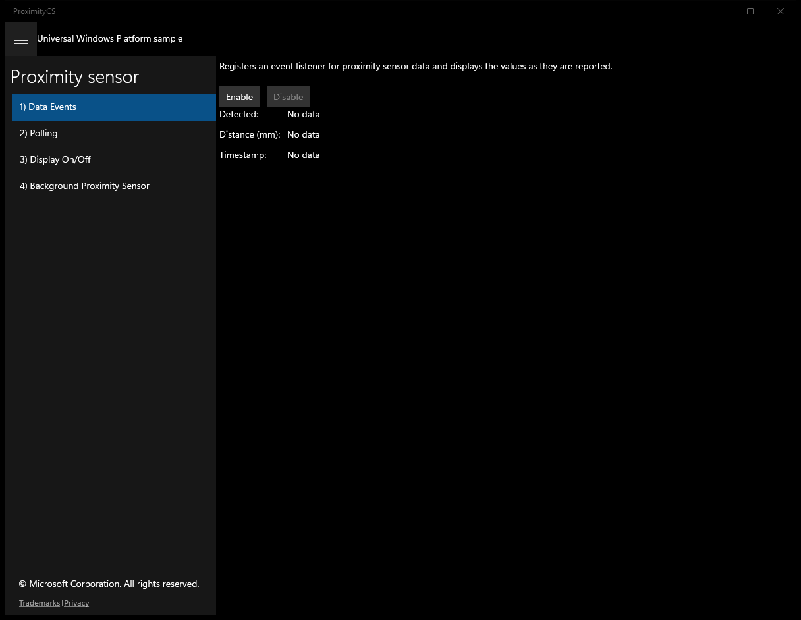
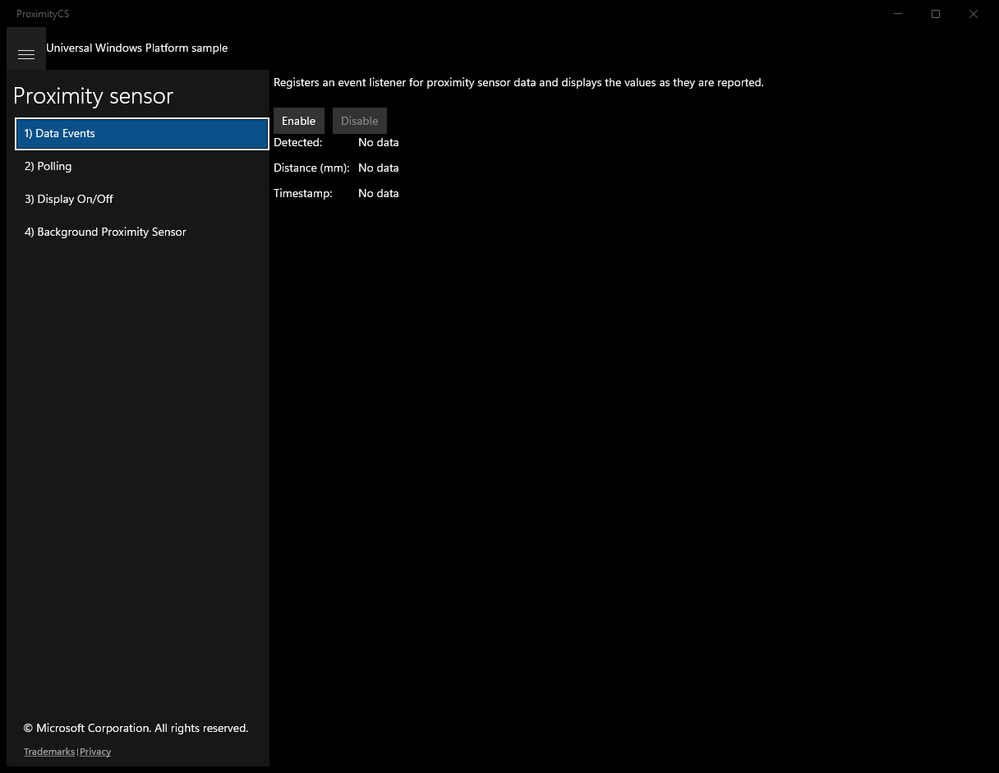
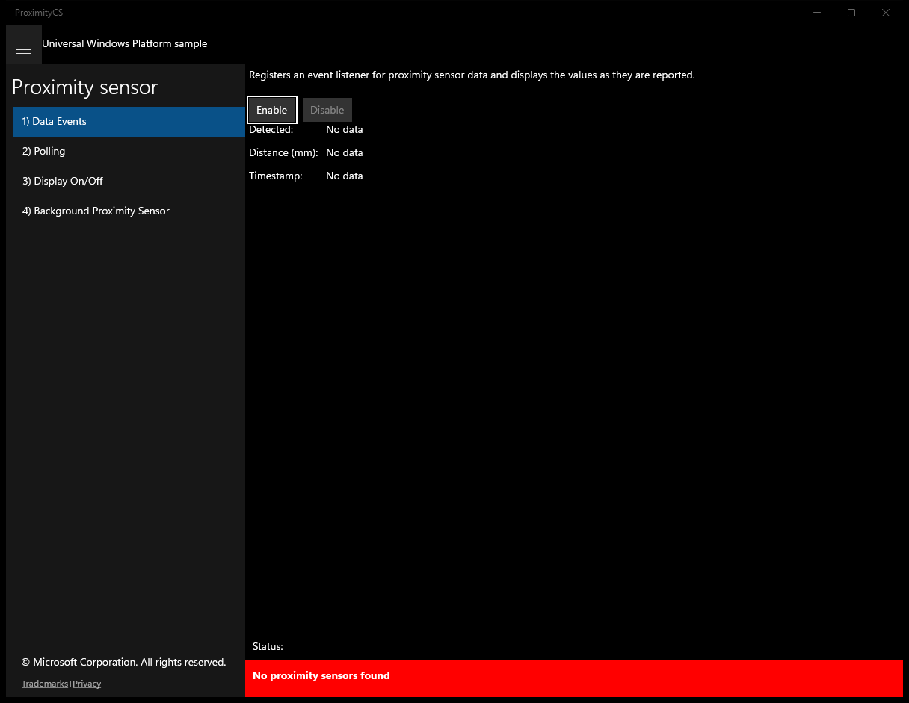
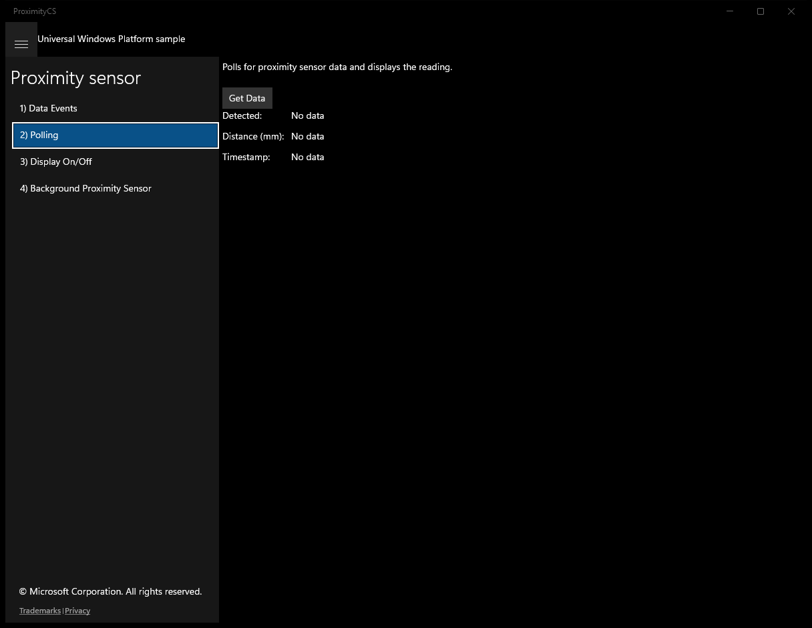
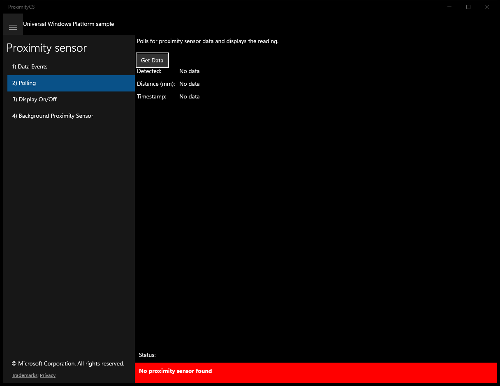
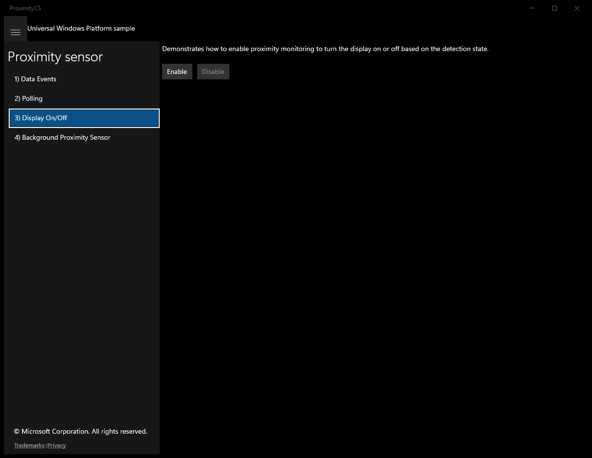
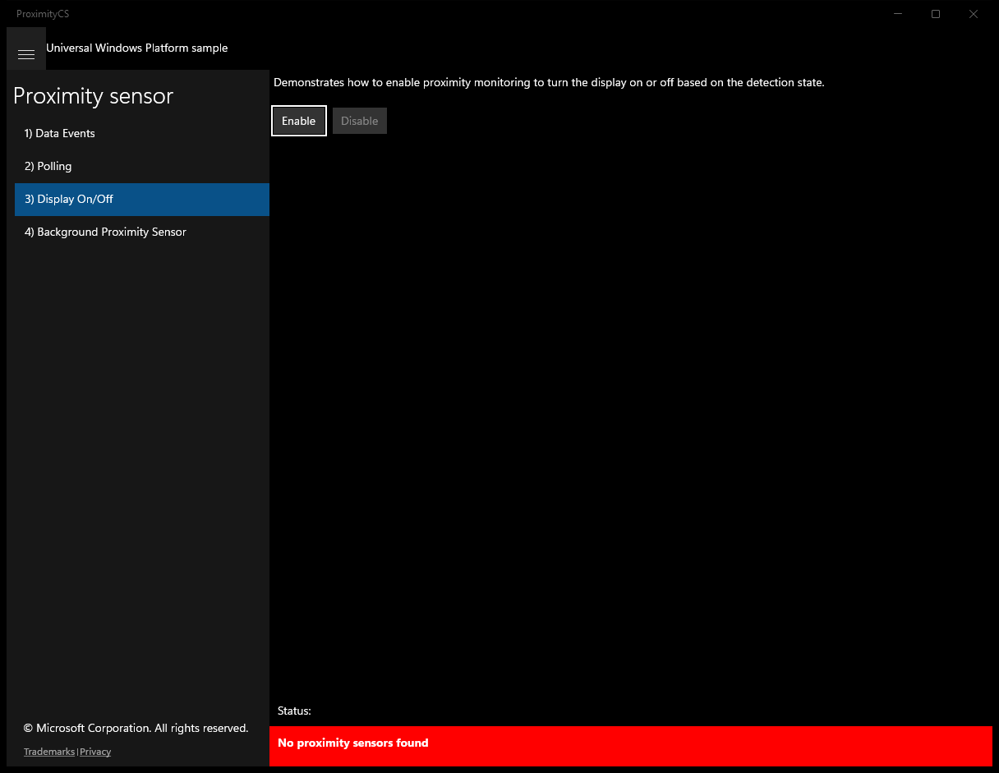
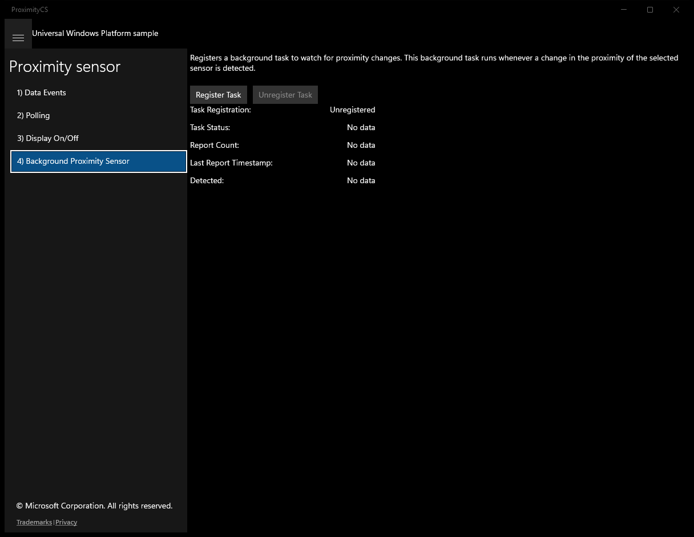
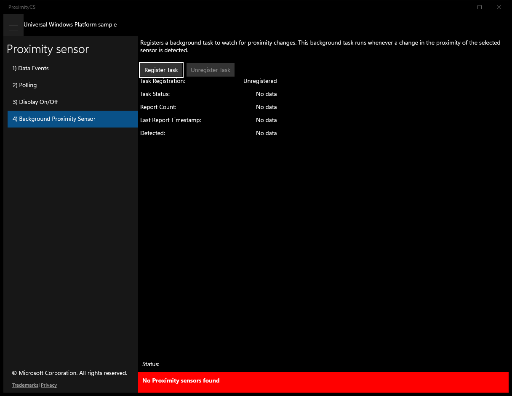

# ProximitySensor (C#)

> **Source**: `Samples\ProximitySensor\cs\`  
> **Feature**: Proximity sensor  
> **AUMID**: `Microsoft.SDKSamples.ProximityCS.CS_8wekyb3d8bbwe!App`  
> **PackageFamilyName**: `Microsoft.SDKSamples.ProximityCS.CS_8wekyb3d8bbwe`  

## Build / deploy / capture status
- build: ok
- deploy: ok
- launch: ok
- capture: ok
- uninstall: ok

## Main page

---

## Scenario 1 - Data Events

### UI elements
- **TextBlock**  - x:Name="InputTextBlock"; text="Registers an event listener for proximity sensor data and displays the values as they are reported."
- **Button**  - x:Name="ScenarioEnableButton"; content="Enable"; events: Click=ScenarioEnable
- **Button**  - x:Name="ScenarioDisableButton"; content="Disable"; events: Click=ScenarioDisable
- **TextBlock**  - text="Detected: "
- **TextBlock**  - x:Name="ScenarioOutput_DetectionState"; text="No data"
- **TextBlock**  - text="Distance (mm): "
- **TextBlock**  - x:Name="ScenarioOutput_DetectionDistance"; text="No data"
- **TextBlock**  - text="Timestamp: "
- **TextBlock**  - x:Name="ScenarioOutput_Timestamp"; text="No data"

### Code behavior
- **`OnProximitySensorAdded`**
    - API refs: `ProximitySensor.FromId`, `Dispatcher.RunAsync`, `CoreDispatcherPriority.Normal`, `NotifyType.StatusMessage`, `NotifyType.ErrorMessage`
- **`OnNavigatedTo`**
    - API refs: `ScenarioEnableButton.IsEnabled`, `ScenarioDisableButton.IsEnabled`
- **`OnNavigatingFrom`**
    - instantiates: `TypedEventHandler`
    - API refs: `ScenarioDisableButton.IsEnabled`
- **`ScenarioEnable`**
    - instantiates: `TypedEventHandler`
    - API refs: `ScenarioEnableButton.IsEnabled`, `ScenarioDisableButton.IsEnabled`, `NotifyType.ErrorMessage`
- **`ScenarioDisable`**
    - instantiates: `TypedEventHandler`
    - API refs: `ScenarioEnableButton.IsEnabled`, `ScenarioDisableButton.IsEnabled`
- **`ReadingChanged`**
    - API refs: `Dispatcher.RunAsync`, `CoreDispatcherPriority.Normal`, `ScenarioOutput_DetectionState.Text`, `ScenarioOutput_Timestamp.Text`, `Timestamp.ToString`, `ScenarioOutput_DetectionDistance.Text`, `DistanceInMillimeters.ToString`

### Screenshots
Initial state:

After click **Enable**:

---

## Scenario 2 - Polling

### UI elements
- **TextBlock**  - x:Name="InputTextBlock"; text="Polls for proximity sensor data and displays the reading."
- **Button**  - x:Name="ScenarioGetDataButton"; content="Get Data"; events: Click=ScenarioGetData
- **TextBlock**  - text="Detected: "
- **TextBlock**  - x:Name="ScenarioOutput_DetectionState"; text="No data"
- **TextBlock**  - text="Distance (mm): "
- **TextBlock**  - x:Name="ScenarioOutput_DetectionDistance"; text="No data"
- **TextBlock**  - text="Timestamp: "
- **TextBlock**  - x:Name="ScenarioOutput_Timestamp"; text="No data"

### Code behavior
- **`OnProximitySensorAdded`**
    - API refs: `ProximitySensor.FromId`, `ProximitySensor.MaxDistanceInCentimeters`, `Dispatcher.RunAsync`, `CoreDispatcherPriority.Normal`, `NotifyType.ErrorMessage`
- **`ScenarioGetData`**
    - API refs: `ScenarioOutput_DetectionState.Text`, `ScenarioOutput_Timestamp.Text`, `Timestamp.ToString`, `ScenarioOutput_DetectionDistance.Text`, `DistanceInMillimeters.ToString`, `NotifyType.ErrorMessage`

### Screenshots
Initial state:

After click **Get Data**:

---

## Scenario 3 - Display On/Off

### UI elements
- **TextBlock**  - x:Name="InputTextBlock"; text="Demonstrates how to enable proximity monitoring to turn the display on or off based on the detection state."
- **Button**  - x:Name="ScenarioEnableButton"; content="Enable"; events: Click=ScenarioEnable
- **Button**  - x:Name="ScenarioDisableButton"; content="Disable"; events: Click=ScenarioDisable

### Code behavior
- **`OnProximitySensorAdded`**
    - API refs: `ProximitySensor.FromId`, `Dispatcher.RunAsync`, `CoreDispatcherPriority.Normal`, `NotifyType.ErrorMessage`
- **`OnNavigatedTo`**
    - API refs: `ScenarioEnableButton.IsEnabled`, `ScenarioDisableButton.IsEnabled`
- **`OnNavigatingFrom`**
    - API refs: `ScenarioDisableButton.IsEnabled`
- **`ScenarioEnable`**
    - API refs: `ScenarioEnableButton.IsEnabled`, `ScenarioDisableButton.IsEnabled`, `NotifyType.ErrorMessage`
- **`ScenarioDisable`**
    - API refs: `ScenarioEnableButton.IsEnabled`, `ScenarioDisableButton.IsEnabled`

### Screenshots
Initial state:

After click **Enable**:

---

## Scenario 4 - Background Proximity Sensor

### UI elements
- **TextBlock**  - x:Name="InputTextBlock"; text="Registers a background task to watch for proximity changes. This background task runs whenever a change in the proximity of the selected sensor is detected."
- **Button**  - x:Name="ScenarioRegisterTaskButton"; content="Register Task"; events: Click=ScenarioRegisterTask_Click
- **Button**  - x:Name="ScenarioUnregisterTaskButton"; content="Unregister Task"; events: Click=ScenarioUnregisterTask_Click
- **TextBlock**  - text="Task Registration:"
- **TextBlock**  - text="Task Status:"
- **TextBlock**  - text="Report Count:"
- **TextBlock**  - text="Last Report Timestamp:"
- **TextBlock**  - text="Detected:"
- **TextBlock**  - x:Name="ScenarioOutput_TaskRegistration"; text="No data"
- **TextBlock**  - x:Name="ScenarioOutput_TaskStatus"; text="No data"
- **TextBlock**  - x:Name="ScenarioOutput_ReportCount"; text="No data"
- **TextBlock**  - x:Name="ScenarioOutput_LastTimestamp"; text="No data"
- **TextBlock**  - x:Name="ScenarioOutput_Detected"; text="No data"

### Code behavior
- **`OnProximitySensorAdded`**
    - API refs: `ProximitySensor.FromId`, `Dispatcher.RunAsync`, `CoreDispatcherPriority.Normal`, `NotifyType.ErrorMessage`
- **`OnNavigatedTo`**
    - API refs: `BackgroundTaskRegistration.AllTasks`, `Value.Name`, `Scenario4_BackgroundProximitySensor.SampleBackgroundTaskName`
- **`ScenarioRegisterTask_Click`**
    - API refs: `BackgroundExecutionManager.RequestAccessAsync`, `BackgroundAccessStatus.AlwaysAllowed`, `BackgroundAccessStatus.AllowedSubjectToSystemPolicy`, `NotifyType.ErrorMessage`
- **`ScenarioUnregisterTask_Click`**
    - API refs: `BackgroundTaskRegistration.AllTasks`, `Value.Name`, `Value.Unregister`
- **`UpdateUIAsync`**
    - API refs: `Dispatcher.RunAsync`, `CoreDispatcherPriority.Normal`, `ScenarioRegisterTaskButton.IsEnabled`, `ScenarioUnregisterTaskButton.IsEnabled`, `ScenarioOutput_TaskRegistration.Text`, `ApplicationData.Current`, `Values.TryGetValue`, `ScenarioOutput_ReportCount.Text`, `ScenarioOutput_TaskStatus.Text`, `ScenarioOutput_LastTimestamp.Text`, `ScenarioOutput_Detected.Text`

### Screenshots
Initial state:

After click **Register Task**:

