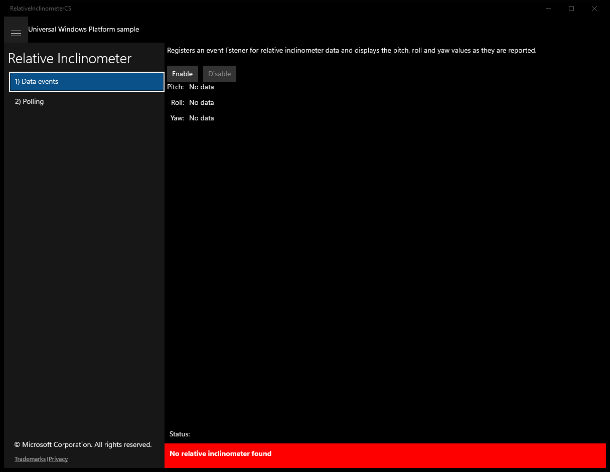
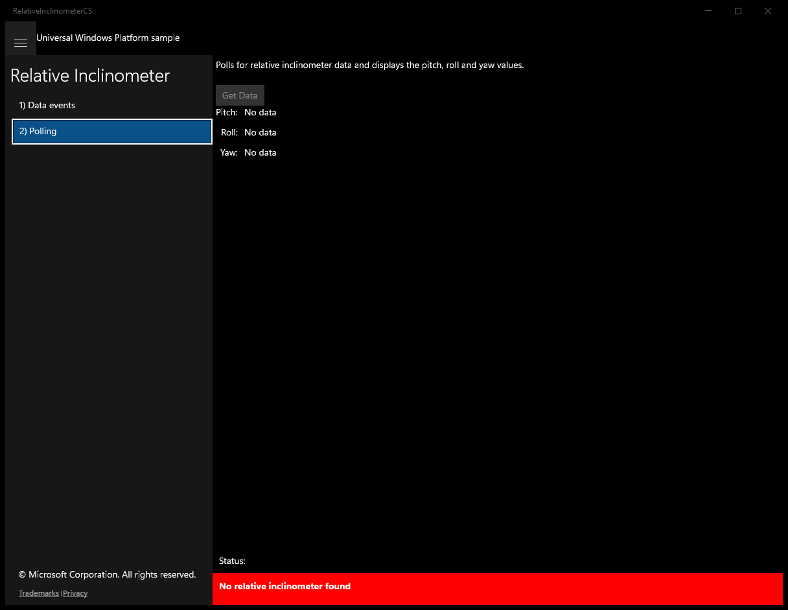

# RelativeInclinometer (C#)

> **Source**: `Samples\RelativeInclinometer\cs\`  
> **Feature**: Relative Inclinometer  
> **AUMID**: `Microsoft.SDKSamples.RelativeInclinometerCS.CS_8wekyb3d8bbwe!App`  
> **PackageFamilyName**: `Microsoft.SDKSamples.RelativeInclinometerCS.CS_8wekyb3d8bbwe`  

## Build / deploy / capture status
- build: ok
- deploy: ok
- launch: ok
- capture: ok
- uninstall: ok

## Main page

---

## Scenario 1 - Data events

### UI elements
- **TextBlock**  - x:Name="InputTextBlock"; text="Registers an event listener for relative inclinometer data and displays the pitch, roll and yaw values as they are reported."
- **Button**  - x:Name="ScenarioEnableButton"; content="Enable"; events: Click=ScenarioEnable
- **Button**  - x:Name="ScenarioDisableButton"; content="Disable"; events: Click=ScenarioDisable
- **TextBlock**  - text="Pitch: "
- **TextBlock**  - text="Roll: "
- **TextBlock**  - text="Yaw: "
- **TextBlock**  - x:Name="ScenarioOutput_X"; text="No data"
- **TextBlock**  - x:Name="ScenarioOutput_Y"; text="No data"
- **TextBlock**  - x:Name="ScenarioOutput_Z"; text="No data"

### Code behavior
- **`OnNavigatedTo`**
    - API refs: `ScenarioEnableButton.IsEnabled`, `ScenarioDisableButton.IsEnabled`
- **`OnNavigatingFrom`**
    - instantiates: `WindowVisibilityChangedEventHandler`, `TypedEventHandler`
    - API refs: `ScenarioDisableButton.IsEnabled`, `Window.Current`, `Sensor.ReadingChanged`, `Sensor.ReportInterval`
- **`VisibilityChanged`**
    - instantiates: `TypedEventHandler`
    - API refs: `ScenarioDisableButton.IsEnabled`, `Sensor.ReadingChanged`
- **`ReadingChanged`**
    - API refs: `Dispatcher.RunAsync`, `CoreDispatcherPriority.Normal`, `ScenarioOutput_X.Text`, `String.Format`, `ScenarioOutput_Y.Text`, `ScenarioOutput_Z.Text`
- **`ScenarioEnable`**
    - instantiates: `WindowVisibilityChangedEventHandler`, `TypedEventHandler`
    - API refs: `Sensor.ReportInterval`, `Window.Current`, `Sensor.ReadingChanged`, `ScenarioEnableButton.IsEnabled`, `ScenarioDisableButton.IsEnabled`, `NotifyType.ErrorMessage`
- **`ScenarioDisable`**
    - instantiates: `WindowVisibilityChangedEventHandler`, `TypedEventHandler`
    - API refs: `Window.Current`, `Sensor.ReadingChanged`, `Sensor.ReportInterval`, `ScenarioEnableButton.IsEnabled`, `ScenarioDisableButton.IsEnabled`

### Screenshots
Initial state:

After click **Enable**:

---

## Scenario 2 - Polling

### UI elements
- **TextBlock**  - x:Name="InputTextBlock"; text="Polls for relative inclinometer data and displays the pitch, roll and yaw values."
- **Button**  - x:Name="GetDataButton"; content="Get Data"; events: Click=GetData
- **TextBlock**  - text="Pitch: "
- **TextBlock**  - text="Roll: "
- **TextBlock**  - text="Yaw: "
- **TextBlock**  - x:Name="ScenarioOutput_X"; text="No data"
- **TextBlock**  - x:Name="ScenarioOutput_Y"; text="No data"
- **TextBlock**  - x:Name="ScenarioOutput_Z"; text="No data"

### Code behavior
- **`GetData`**
    - API refs: `Sensor.GetCurrentReading`, `ScenarioOutput_X.Text`, `String.Format`, `ScenarioOutput_Y.Text`, `ScenarioOutput_Z.Text`

### Screenshots
Initial state:

