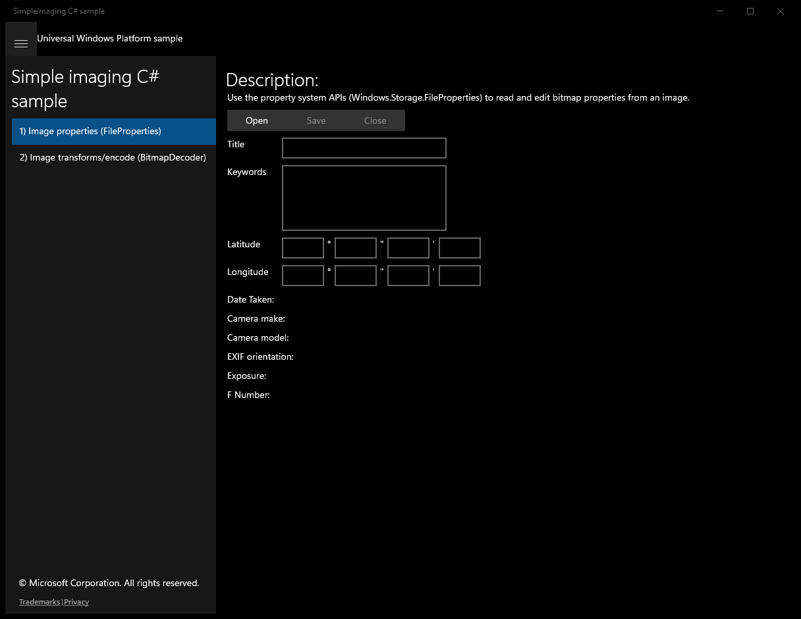
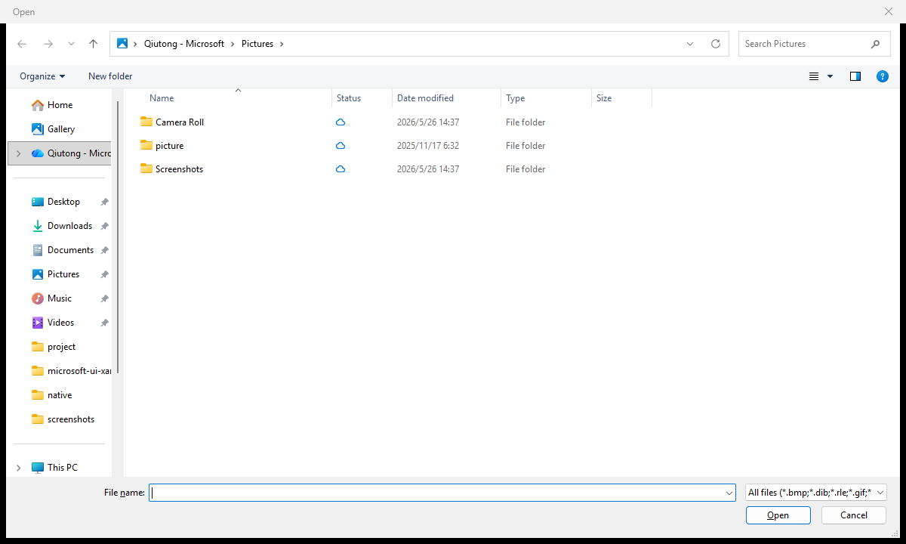
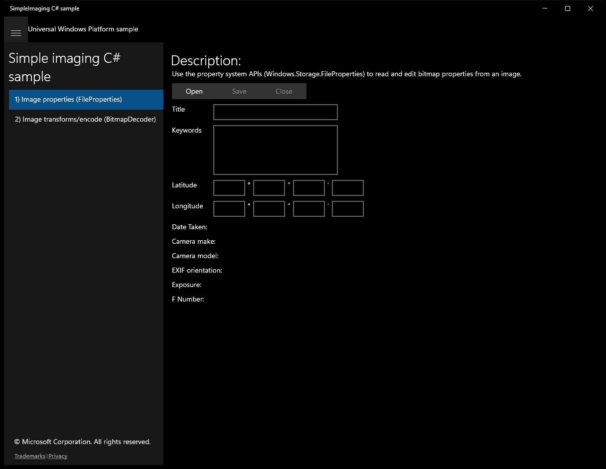
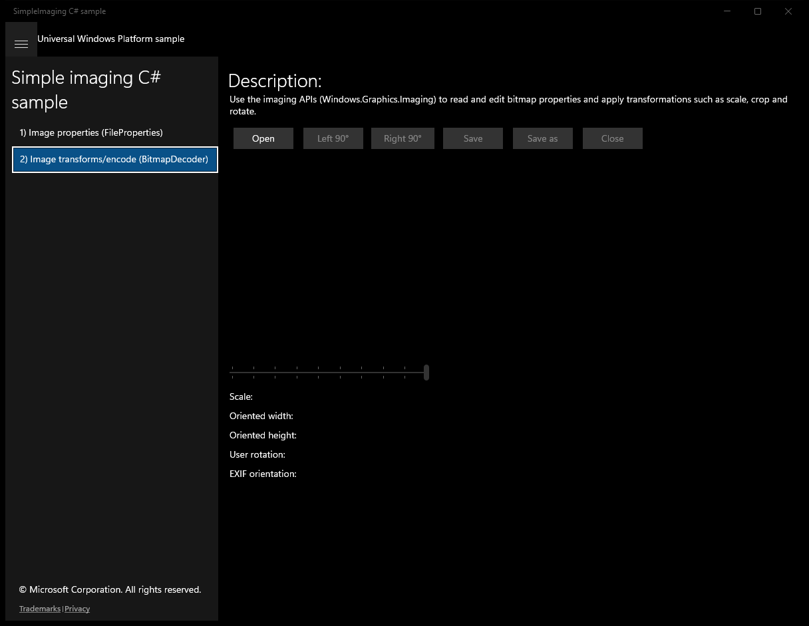
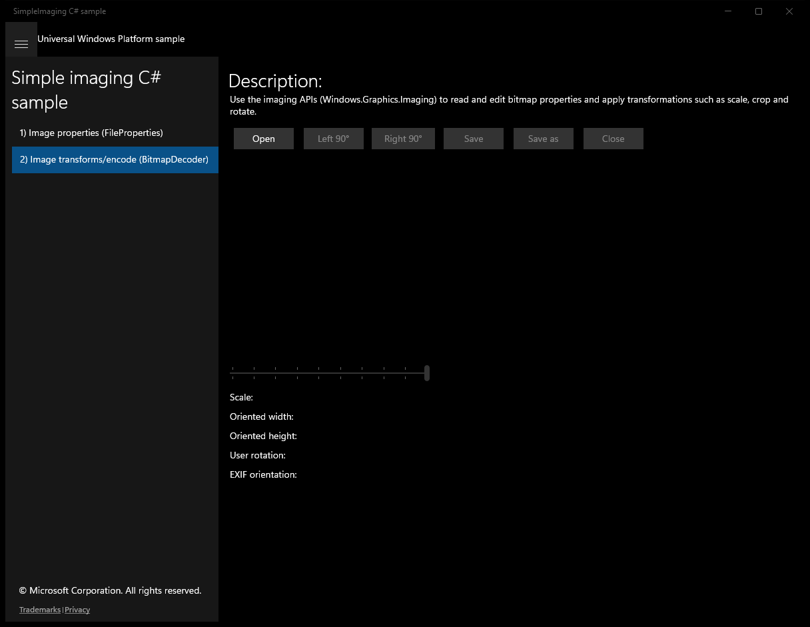
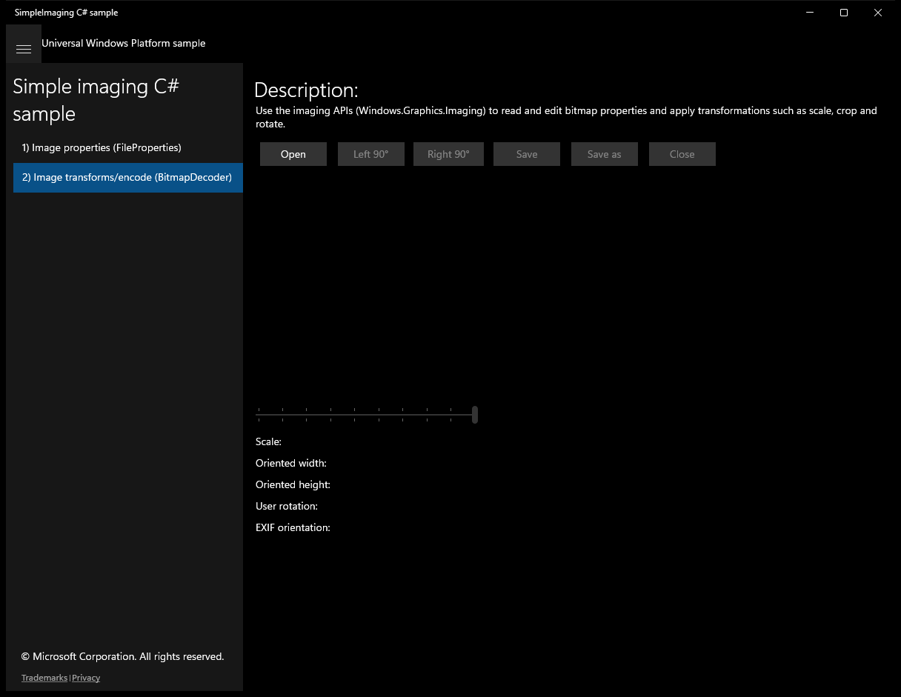

# SimpleImaging (C#)

> **Source**: `Samples\SimpleImaging\cs\`  
> **Feature**: Simple imaging C# sample  
> **AUMID**: `Microsoft.SDKSamples.SimpleImaging.CS_8wekyb3d8bbwe!SimpleImaging.App`  
> **PackageFamilyName**: `Microsoft.SDKSamples.SimpleImaging.CS_8wekyb3d8bbwe`  

## Top-level UWP namespaces used
- `Windows.Storage.FileProperties.ImageProperties`
- `Windows.Storage.FileProperties`
- `Windows.Foundation.PropertyType.UInt16`

## Build / deploy / capture status
- build: ok
- deploy: ok
- launch: ok
- capture: ok
- uninstall: ok

## Main page

---

## Scenario 1 - Image properties (FileProperties)

**Description**: Use the property system APIs (Windows.Storage.FileProperties) to read and edit bitmap properties from an image.

### UI elements
- **TextBlock**  - text="Description:"
- **TextBlock**  - text="Use the property system APIs (Windows.Storage.FileProperties) to read and edit bitmap properties from an image."
- **Button**  - x:Name="OpenButton"; content="Open"; events: Click=Open_Click
- **Button**  - x:Name="ApplyButton"; content="Save"; events: Click=Apply_Click
- **Button**  - x:Name="CloseButton"; content="Close"; events: Click=Close_Click
- **Image**  - x:Name="PreviewImage"
- **TextBlock**  - text="Title"
- **TextBox**  - x:Name="TitleTextbox"
- **TextBlock**  - text="Keywords"
- **TextBox**  - x:Name="KeywordsTextbox"
- **TextBlock**  - text="Latitude"
- **TextBox**  - x:Name="LatDegTextbox"
- **TextBlock**  - text="°"
- **TextBox**  - x:Name="LatMinTextbox"
- **TextBlock**  - text="""
- **TextBox**  - x:Name="LatSecTextbox"
- **TextBlock**  - text="'"
- **TextBox**  - x:Name="LatRefTextbox"
- **TextBlock**  - text="Longitude"
- **TextBox**  - x:Name="LongDegTextbox"
- **TextBlock**  - text="°"
- **TextBox**  - x:Name="LongMinTextbox"
- **TextBlock**  - text="""
- **TextBox**  - x:Name="LongSecTextbox"
- **TextBlock**  - text="'"
- **TextBox**  - x:Name="LongRefTextbox"
- **TextBlock**  - text="Date Taken:"
- **TextBlock**  - x:Name="DateTakenTextblock"
- **TextBlock**  - text="Camera make:"
- **TextBlock**  - x:Name="MakeTextblock"
- **TextBlock**  - text="Camera model:"
- **TextBlock**  - x:Name="ModelTextblock"
- **TextBlock**  - text="EXIF orientation:"
- **TextBlock**  - x:Name="OrientationTextblock"
- **TextBlock**  - text="Exposure:"
- **TextBlock**  - x:Name="ExposureTextblock"
- **TextBlock**  - text="F Number:"
- **TextBlock**  - x:Name="FNumberTextblock"

### Code behavior
- **`OnNavigatedTo`**
    - instantiates: `SuspendingEventHandler`
    - API refs: `MainPage.Current`, `App.Current`
- **`Open_Click`**
    - instantiates: `FileOpenPicker`
    - API refs: `Helpers.FillDecoderExtensions`, `PickerLocationId.PicturesLibrary`
- **`SaveDataToPersistedState`**
    - API refs: `SuspendingOperation.GetDeferral`, `TitleTextbox.Text`, `KeywordsTextbox.Text`, `DateTakenTextblock.Text`, `MakeTextblock.Text`, `ModelTextblock.Text`, `OrientationTextblock.Text`, `LatDegTextbox.Text`, `LatMinTextbox.Text`, `LatSecTextbox.Text`, `LatRefTextbox.Text`, `LongDegTextbox.Text`, `LongMinTextbox.Text`, `LongSecTextbox.Text`, `LongRefTextbox.Text`, `ExposureTextblock.Text`, `FNumberTextblock.Text`
- **`RestoreDataFromPersistedState`**
    - instantiates: `Dictionary`
    - API refs: `Properties.GetImagePropertiesAsync`, `NotifyType.StatusMessage`, `CloseButton.IsEnabled`, `ApplyButton.IsEnabled`, `NotifyType.ErrorMessage`
- **`LoadFileAsync`**
    - namespaces: `Windows.Storage.FileProperties.ImageProperties`
    - API refs: `Windows.Storage`, `FileProperties.ImageProperties`, `System.Photo`, `Properties.GetImagePropertiesAsync`, `NotifyType.StatusMessage`, `CloseButton.IsEnabled`, `ApplyButton.IsEnabled`, `NotifyType.ErrorMessage`
- **`GetImagePropertiesForDisplay`**
    - instantiates: `Dictionary`
    - API refs: `String.Join`, `Environment.NewLine`, `System.Photo`, `Helpers.GetOrientationString`, `Latitude.HasValue`, `Longitude.HasValue`, `Latitude.Value`, `Longitude.Value`, `Math.Floor`, `Math.Abs`, `DateTaken.ToString`
- **`DisplayImageUIAsync`**
    - instantiates: `BitmapImage`
    - API refs: `FileAccessMode.Read`, `PreviewImage.Source`, `AutomationProperties.SetName`, `TitleTextbox.Text`, `KeywordsTextbox.Text`, `DateTakenTextblock.Text`, `MakeTextblock.Text`, `ModelTextblock.Text`, `OrientationTextblock.Text`, `LatDegTextbox.Text`, `LatMinTextbox.Text`, `LatRefTextbox.Text`, `LongDegTextbox.Text`, `LongMinTextbox.Text`, `LongRefTextbox.Text`, `ExposureTextblock.Text`, `FNumberTextblock.Text`, `LatSecTextbox.Text`, `LongSecTextbox.Text`
- **`Apply_Click`**
    - instantiates: `PropertySet`
    - API refs: `NotifyType.StatusMessage`, `TitleTextbox.Text`, `KeywordsTextbox.Text`, `Keywords.Clear`, `Keywords.Add`, `String.Empty`, `Math.Floor`, `Double.Parse`, `LatDegTextbox.Text`, `LatMinTextbox.Text`, `LatSecTextbox.Text`, `LongDegTextbox.Text`, `LongMinTextbox.Text`, `LongSecTextbox.Text`, `LatRefTextbox.Text`, `LongRefTextbox.Text`, `System.GPS`, `System.FlagStatus`, `NotifyType.ErrorMessage`
- **`Close_Click`**
    - API refs: `NotifyType.StatusMessage`
- **`ResetSessionState`**
    - API refs: `CloseButton.IsEnabled`, `ApplyButton.IsEnabled`, `PreviewImage.Source`, `TitleTextbox.Text`, `KeywordsTextbox.Text`, `DateTakenTextblock.Text`, `MakeTextblock.Text`, `ModelTextblock.Text`, `OrientationTextblock.Text`, `LatDegTextbox.Text`, `LatMinTextbox.Text`, `LatSecTextbox.Text`, `LatRefTextbox.Text`, `LongDegTextbox.Text`, `LongMinTextbox.Text`, `LongSecTextbox.Text`, `LongRefTextbox.Text`, `ExposureTextblock.Text`, `FNumberTextblock.Text`

### Screenshots
Initial state:

After click **Open** (popup: Open):

After click **Open**:

---

## Scenario 2 - Image transforms/encode (BitmapDecoder)

**Description**: Use the imaging APIs (Windows.Graphics.Imaging) to read and edit bitmap properties and apply transformations such as scale, crop and rotate.

### UI elements
- **TextBlock**  - text="Description:"
- **TextBlock**  - text="Use the imaging APIs (Windows.Graphics.Imaging) to read and edit bitmap properties and apply transformations such as scale, crop and rotate."
- **Button**  - x:Name="OpenButton"; content="Open"; events: Click=Open_Click
- **Button**  - x:Name="RotateLeftButton"; content="Left 90°"; events: Click=RotateLeft_Click
- **Button**  - x:Name="RotateRightButton"; content="Right 90°"; events: Click=RotateRight_Click
- **Button**  - x:Name="SaveButton"; content="Save"; events: Click=Save_Click
- **Button**  - x:Name="SaveAsButton"; content="Save as"; events: Click=SaveAs_Click
- **Button**  - x:Name="CloseButton"; content="Close"; events: Click=Close_Click
- **Image**  - x:Name="PreviewImage"
- **Slider**  - x:Name="ScaleSlider"; events: ValueChanged=ScaleSlider_ValueChanged
- **TextBlock**  - text="Scale:"
- **TextBlock**  - x:Name="ScaleTextblock"
- **TextBlock**  - text="Oriented width:"
- **TextBlock**  - x:Name="WidthTextblock"
- **TextBlock**  - text="Oriented height:"
- **TextBlock**  - x:Name="HeightTextblock"
- **TextBlock**  - text="User rotation:"
- **TextBlock**  - x:Name="UserRotationTextblock"
- **TextBlock**  - text="EXIF orientation:"
- **TextBlock**  - x:Name="ExifOrientationTextblock"

### Code behavior
- **`OnNavigatedTo`**
    - instantiates: `SuspendingEventHandler`
    - API refs: `MainPage.Current`, `App.Current`
- **`SaveDataToPersistedState`**
    - API refs: `SuspendingOperation.GetDeferral`, `Helpers.ConvertToExifOrientationFlag`
- **`RestoreDataFromPersistedState`**
    - instantiates: `BitmapImage`
    - API refs: `NotifyType.StatusMessage`, `Helpers.ConvertToPhotoOrientation`, `FileAccessMode.Read`, `PreviewImage.Source`, `AutomationProperties.SetName`, `ExifOrientationTextblock.Text`, `Helpers.GetOrientationString`, `ScaleSlider.Value`, `RotateRightButton.IsEnabled`, `RotateLeftButton.IsEnabled`, `SaveButton.IsEnabled`, `CloseButton.IsEnabled`, `SaveAsButton.IsEnabled`, `ScaleSlider.IsEnabled`, `NotifyType.ErrorMessage`
- **`Open_Click`**
    - instantiates: `FileOpenPicker`
    - API refs: `Helpers.FillDecoderExtensions`, `PickerLocationId.PicturesLibrary`
- **`LoadFileAsync`**
    - API refs: `NotifyType.StatusMessage`, `NotifyType.ErrorMessage`
- **`DisplayImageFileAsync`**
    - instantiates: `BitmapImage`
    - API refs: `FileAccessMode.Read`, `PreviewImage.Source`, `AutomationProperties.SetName`, `ExifOrientationTextblock.Text`, `Helpers.GetOrientationString`, `ScaleSlider.IsEnabled`, `RotateLeftButton.IsEnabled`, `RotateRightButton.IsEnabled`, `SaveButton.IsEnabled`, `SaveAsButton.IsEnabled`, `CloseButton.IsEnabled`
- **`GetImageInformationAsync`**
    - namespaces: `Windows.Storage.FileProperties`
    - API refs: `FileAccessMode.Read`, `BitmapDecoder.CreateAsync`, `Windows.Storage`, `System.Photo`, `BitmapProperties.GetPropertiesAsync`, `Helpers.ConvertToPhotoOrientation`
- **`RotateRight_Click`**
    - API refs: `Helpers.Add90DegreesCW`
- **`RotateLeft_Click`**
    - API refs: `Helpers.Add90DegreesCCW`
- **`Save_Click`**
    - namespaces: `Windows.Foundation.PropertyType.UInt16`
    - instantiates: `InMemoryRandomAccessStream`, `BitmapPropertySet`, `BitmapTypedValue`
    - API refs: `NotifyType.StatusMessage`, `FileAccessMode.ReadWrite`, `BitmapDecoder.CreateAsync`, `BitmapEncoder.CreateForTranscodingAsync`, `BitmapTransform.ScaledWidth`, `BitmapTransform.ScaledHeight`, `BitmapTransform.InterpolationMode`, `BitmapInterpolationMode.Fant`, `System.Photo`, `Helpers.ConvertToExifOrientationFlag`, `Helpers.AddPhotoOrientation`, `Windows.Foundation`, `PropertyType.UInt16`, `BitmapProperties.SetPropertiesAsync`, `BitmapTransform.Rotation`, `Helpers.ConvertToBitmapRotation`, `RandomAccessStream.CopyAsync`, `NotifyType.ErrorMessage`
- **`SaveAs_Click`**
    - instantiates: `FileSavePicker`
    - API refs: `FileTypeChoices.Add`, `PickerLocationId.PicturesLibrary`
- **`LoadSaveFileAsync`**
    - instantiates: `BitmapTransform`
    - API refs: `BitmapEncoder.PngEncoderId`, `BitmapEncoder.BmpEncoderId`, `BitmapEncoder.JpegEncoderId`, `FileAccessMode.Read`, `FileAccessMode.ReadWrite`, `BitmapDecoder.CreateAsync`, `Helpers.ConvertToBitmapRotation`, `BitmapInterpolationMode.Fant`, `ExifOrientationMode.RespectExifOrientation`, `ColorManagementMode.ColorManageToSRgb`, `BitmapTransform.ScaledWidth`, `BitmapEncoder.CreateAsync`, `NotifyType.StatusMessage`, `NotifyType.ErrorMessage`
- **`ScaleSlider_ValueChanged`**
    - API refs: `ScaleSlider.IsEnabled`
- **`UpdateImageDimensionsUI`**
    - API refs: `ScaleTextblock.Text`, `WidthTextblock.Text`, `Math.Floor`, `HeightTextblock.Text`, `UserRotationTextblock.Text`, `Helpers.GetOrientationString`
- **`UpdateImageRotation`**
    - API refs: `PhotoOrientation.Rotate270`, `PhotoOrientation.Rotate180`, `PhotoOrientation.Rotate90`, `PhotoOrientation.Normal`
- **`Close_Click`**
    - API refs: `NotifyType.StatusMessage`
- **`ResetSessionState`**
    - API refs: `PhotoOrientation.Normal`, `RotateLeftButton.IsEnabled`, `RotateRightButton.IsEnabled`, `SaveButton.IsEnabled`, `SaveAsButton.IsEnabled`, `CloseButton.IsEnabled`, `PreviewImage.Source`, `ImageViewbox.Width`, `ImageViewbox.Height`, `ImageViewbox.RenderTransform`, `ScaleTextblock.Text`, `ScaleSlider.Value`, `ScaleSlider.IsEnabled`, `HeightTextblock.Text`, `WidthTextblock.Text`, `UserRotationTextblock.Text`, `ExifOrientationTextblock.Text`

### Screenshots
Initial state:

After click **&Help**:

After click **View Slider** (popup: View Slider Control):

After click **View Slider**:

After click **Organize**:

