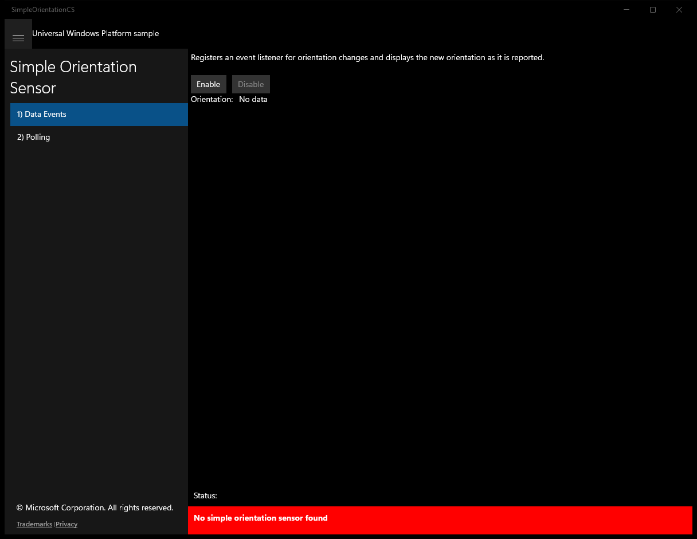
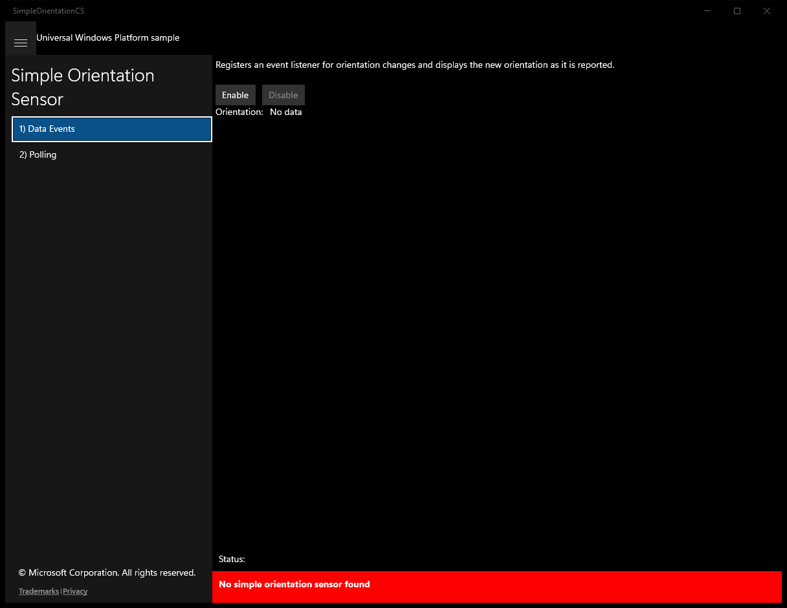
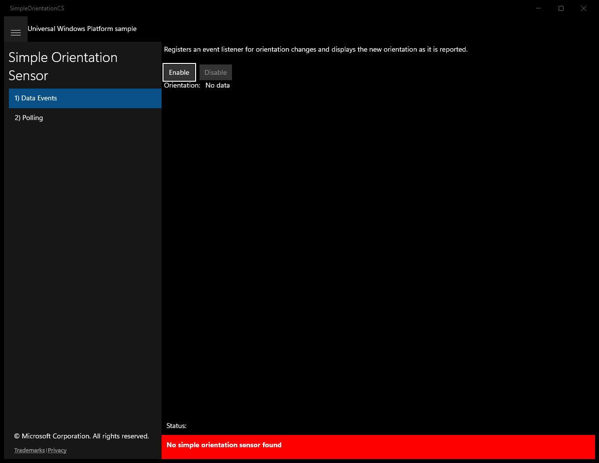
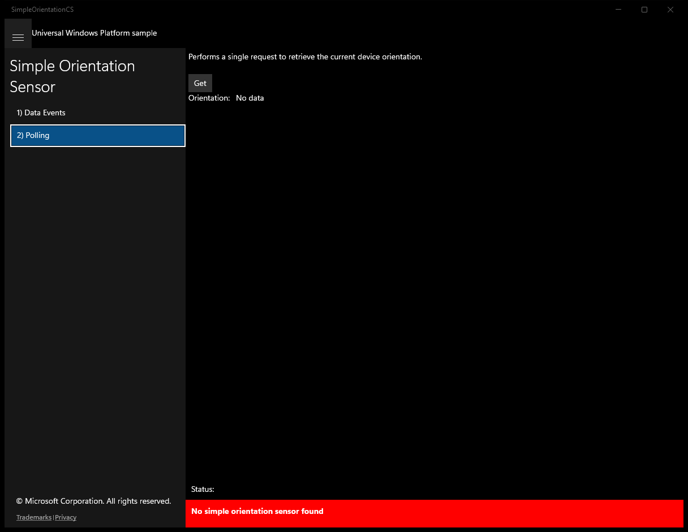
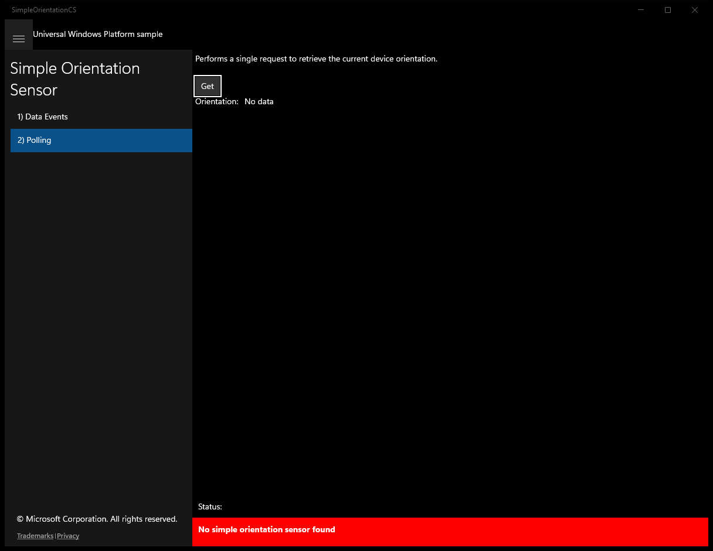

# SimpleOrientationSensor (C#)

> **Source**: `Samples\SimpleOrientationSensor\cs\`  
> **Feature**: Simple Orientation Sensor  
> **AUMID**: `Microsoft.SDKSamples.SimpleOrientationCS.CS_8wekyb3d8bbwe!App`  
> **PackageFamilyName**: `Microsoft.SDKSamples.SimpleOrientationCS.CS_8wekyb3d8bbwe`  

## Build / deploy / capture status
- build: ok
- deploy: ok
- launch: ok
- capture: ok
- uninstall: ok

## Main page

---

## Scenario 1 - Data Events

### UI elements
- **TextBlock**  - x:Name="InputTextBlock"; text="Registers an event listener for orientation changes and displays the new orientation as it is reported."
- **Button**  - x:Name="ScenarioEnableButton"; content="Enable"; events: Click=ScenarioEnable
- **Button**  - x:Name="ScenarioDisableButton"; content="Disable"; events: Click=ScenarioDisable
- **TextBlock**  - text="Orientation: "
- **TextBlock**  - x:Name="ScenarioOutput_Orientation"; text="No data"

### Code behavior
- **`OnNavigatedTo`**
    - API refs: `ScenarioEnableButton.IsEnabled`, `ScenarioDisableButton.IsEnabled`
- **`OnNavigatingFrom`**
    - instantiates: `WindowVisibilityChangedEventHandler`, `TypedEventHandler`
    - API refs: `ScenarioDisableButton.IsEnabled`, `Window.Current`
- **`VisibilityChanged`**
    - instantiates: `TypedEventHandler`
    - API refs: `ScenarioDisableButton.IsEnabled`
- **`DisplayOrientation`**
    - API refs: `SimpleOrientation.NotRotated`, `SimpleOrientation.Rotated90DegreesCounterclockwise`, `SimpleOrientation.Rotated180DegreesCounterclockwise`, `SimpleOrientation.Rotated270DegreesCounterclockwise`, `SimpleOrientation.Faceup`, `SimpleOrientation.Facedown`
- **`OrientationChanged`**
    - API refs: `Dispatcher.RunAsync`, `CoreDispatcherPriority.Normal`
- **`ScenarioEnable`**
    - instantiates: `WindowVisibilityChangedEventHandler`, `TypedEventHandler`
    - API refs: `Window.Current`, `ScenarioEnableButton.IsEnabled`, `ScenarioDisableButton.IsEnabled`, `NotifyType.ErrorMessage`
- **`ScenarioDisable`**
    - instantiates: `WindowVisibilityChangedEventHandler`, `TypedEventHandler`
    - API refs: `Window.Current`, `ScenarioEnableButton.IsEnabled`, `ScenarioDisableButton.IsEnabled`

### Screenshots
Initial state:

After click **Enable**:

---

## Scenario 2 - Polling

### UI elements
- **TextBlock**  - x:Name="InputTextBlock"; text="Performs a single request to retrieve the current device orientation."
- **Button**  - x:Name="ScenarioGetButton"; content="Get"; events: Click=ScenarioGet
- **TextBlock**  - text="Orientation: "
- **TextBlock**  - x:Name="ScenarioOutput_Orientation"; text="No data"

### Code behavior
- **`DisplayOrientation`**
    - API refs: `SimpleOrientation.NotRotated`, `SimpleOrientation.Rotated90DegreesCounterclockwise`, `SimpleOrientation.Rotated180DegreesCounterclockwise`, `SimpleOrientation.Rotated270DegreesCounterclockwise`, `SimpleOrientation.Faceup`, `SimpleOrientation.Facedown`
- **`ScenarioGet`**
    - API refs: `NotifyType.ErrorMessage`

### Screenshots
Initial state:

After click **Get**:

