# Store (C#)

> **Source**: `Samples\Store\cs\`  
> **Feature**: Store C# Sample  
> **AUMID**: `Microsoft.SDKSamples.Store.CS_8wekyb3d8bbwe!App`  
> **PackageFamilyName**: `Microsoft.SDKSamples.Store.CS_8wekyb3d8bbwe`  

## Top-level UWP namespaces used
- `Windows.System.Launcher.LaunchUriAsync`

## Build / deploy / capture status
- build: ok
- deploy: ok
- launch: ok
- capture: ok
- uninstall: ok

## Main page

---

## Scenario 1 - Trial-mode

**Description**: Determines the type of license the customer has, days remaining in trial mode, and offers to upgrade to the fully-licensed version.

### UI elements
- **TextBlock**  - text="Trial-mode"
- **TextBlock**  - text="Determines the type of license the customer has, days remaining in trial mode, and offers to upgrade to the fully-licensed version."
- **TextBlock**  - text="Current license mode: Unknown"
- **Button**  - content="Show trial period information"; events: Click={x:Bind ShowTrialPeriodInformation}
- **Button**  - text="Buy app (Price unknown)"; events: Click={x:Bind PurchaseFullLicense}
- **TextBlock**  - text="Buy app (Price unknown)"

### Code behavior
- **`OnNavigatedTo`**
    - API refs: `StoreContext.GetDefault`, `PurchasePrice.Text`, `Product.Price`
- **`OfflineLicensesChanged`**
    - API refs: `Dispatcher.RunAsync`, `CoreDispatcherPriority.Normal`
- **`GetLicenseState`**
    - API refs: `LicenseMode.Text`
- **`ShowTrialPeriodInformation`**
    - API refs: `DateTime.Now`, `NotifyType.StatusMessage`, `NotifyType.ErrorMessage`
- **`PurchaseFullLicense`**
    - API refs: `ExtendedError.Message`, `NotifyType.ErrorMessage`, `NotifyType.StatusMessage`, `Product.RequestPurchaseAsync`, `StorePurchaseStatus.AlreadyPurchased`, `StorePurchaseStatus.Succeeded`, `StoreContext.OfflineLicensesChanged`, `StorePurchaseStatus.NotPurchased`, `StorePurchaseStatus.NetworkError`, `StorePurchaseStatus.ServerError`

### Screenshots
Initial state:

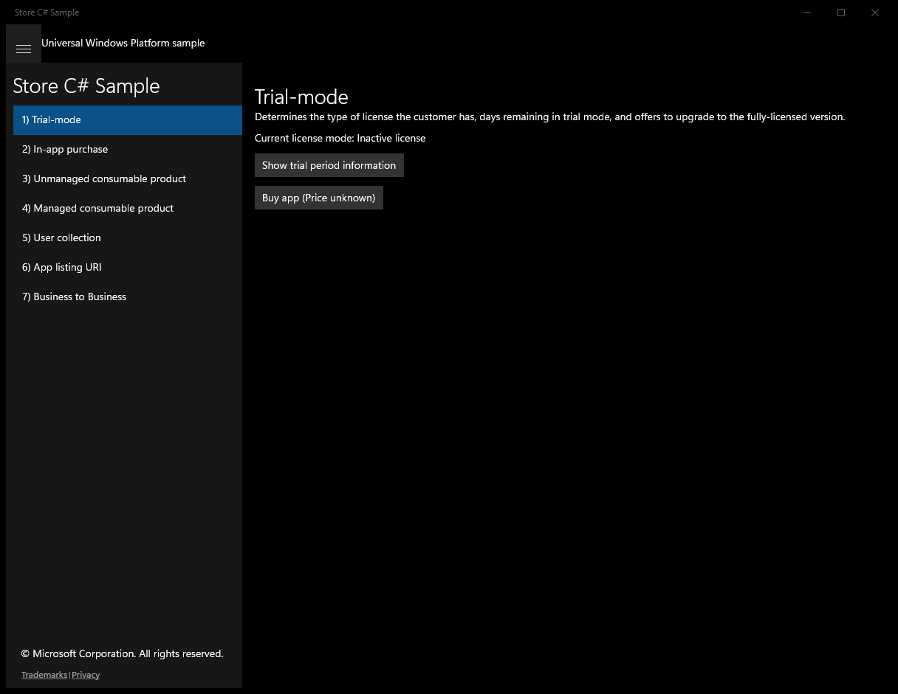

After click **Show trial period information**:

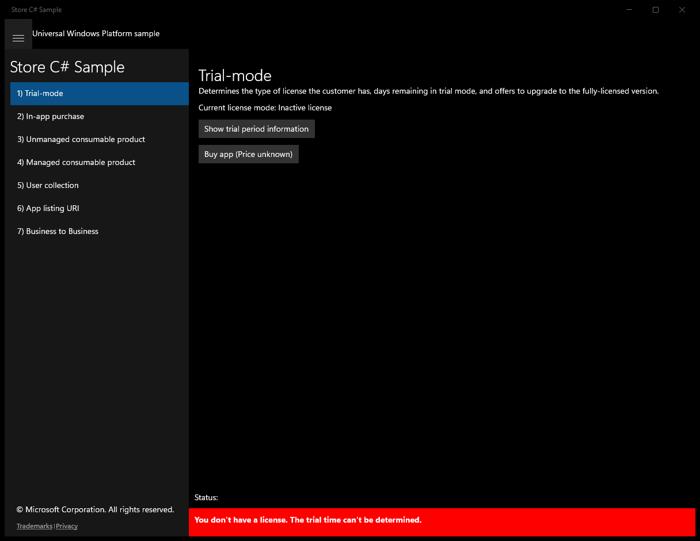

After click **Buy app (Price unknown)**:

---

## Scenario 2 - In-app purchase

**Description**: This scenario shows any in-app products that are sellable by this product. Once one is selected from the list, a purchase can be attempted on it.

### UI elements
- **TextBlock**  - text="In-app purchase"
- **TextBlock**  - text="This scenario shows any in-app products that are sellable by this product. Once one is selected from the list, a purchase can be attempted on it."
- **Button**  - x:Name="GetAssociatedProductsButton"; content="Get Associated Add-Ons"; events: Click=GetAssociatedProductsButton_Click
- **Button**  - x:Name="PurchaseAddOnButton"; content="Purchase Selected Add-On"; events: Click=PurchaseAddOnButton_Click
- **ListView**  - x:Name="ProductsListView"
- **TextBlock**  - text="{Binding FormattedTitle}"

### Code behavior
- **`GetAssociatedProductsButton_Click`**
    - API refs: `ProductsListView.ItemsSource`, `Utils.CreateProductListFromQueryResult`
- **`PurchaseAddOnButton_Click`**
    - API refs: `ProductsListView.SelectedItem`, `Utils.ReportExtendedError`, `StorePurchaseStatus.AlreadyPurchased`, `NotifyType.ErrorMessage`, `StorePurchaseStatus.Succeeded`, `NotifyType.StatusMessage`, `StorePurchaseStatus.NotPurchased`, `StorePurchaseStatus.NetworkError`, `StorePurchaseStatus.ServerError`

### Screenshots
Initial state:

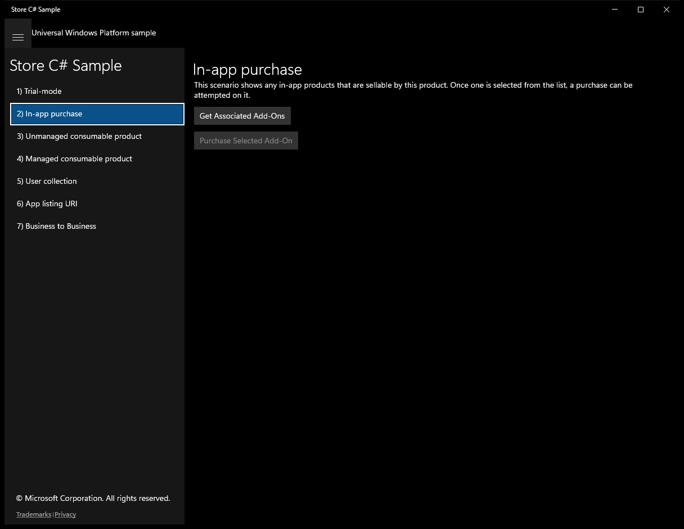

After click **Get Associated Add-Ons**:

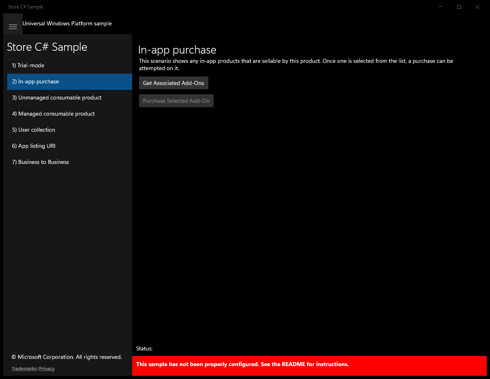

---

## Scenario 3 - Unmanaged consumable product

**Description**: Unmanaged Consumable products require both a purchase call and a fulfillment call to report usage of consumables. Stackable purchases are not supported on Unmanaged consumables.

### UI elements
- **TextBlock**  - text="Unmanaged Consumables"
- **TextBlock**  - text="Unmanaged Consumable products require both a purchase call and a fulfillment call to report usage of consumables. Stackable purchases are not supported on Unmanaged consumables."
- **Button**  - x:Name="GetUnManagedConsumablesButton"; content="Get Associated Add-Ons"; events: Click=GetUnmanagedConsumablesButton_Click
- **Button**  - x:Name="PurchaseAddOnButton"; content="Purchase Selected Consumable"; events: Click=PurchaseAddOnButton_Click
- **Button**  - x:Name="GetConsumableBalanceButton"; content="Get Consumable Balance"; events: Click=GetConsumableBalanceButton_Click
- **Button**  - x:Name="FulfillConsumableButton"; content="Fulfill Consumable"; events: Click=FulfillConsumableButton_Click
- **ListView**  - x:Name="ProductsListView"
- **TextBlock**  - text="{Binding FormattedTitle}"

### Code behavior
- **`GetUnmanagedConsumablesButton_Click`**
    - API refs: `ProductsListView.ItemsSource`, `Utils.CreateProductListFromQueryResult`
- **`PurchaseAddOnButton_Click`**
    - API refs: `ProductsListView.SelectedItem`, `Utils.ReportExtendedError`, `StorePurchaseStatus.AlreadyPurchased`, `NotifyType.ErrorMessage`, `StorePurchaseStatus.Succeeded`, `NotifyType.StatusMessage`, `StorePurchaseStatus.NotPurchased`, `StorePurchaseStatus.NetworkError`, `StorePurchaseStatus.ServerError`
- **`GetConsumableBalanceButton_Click`**
    - API refs: `ProductsListView.SelectedItem`, `Utils.ReportExtendedError`, `StoreConsumableStatus.InsufficentQuantity`, `NotifyType.ErrorMessage`, `StoreConsumableStatus.Succeeded`, `NotifyType.StatusMessage`, `StoreConsumableStatus.NetworkError`, `StoreConsumableStatus.ServerError`
- **`FulfillConsumableButton_Click`**
    - API refs: `ProductsListView.SelectedItem`, `Guid.NewGuid`, `Utils.ReportExtendedError`, `StoreConsumableStatus.InsufficentQuantity`, `NotifyType.ErrorMessage`, `StoreConsumableStatus.Succeeded`, `NotifyType.StatusMessage`, `StoreConsumableStatus.NetworkError`, `StoreConsumableStatus.ServerError`

### Screenshots
Initial state:

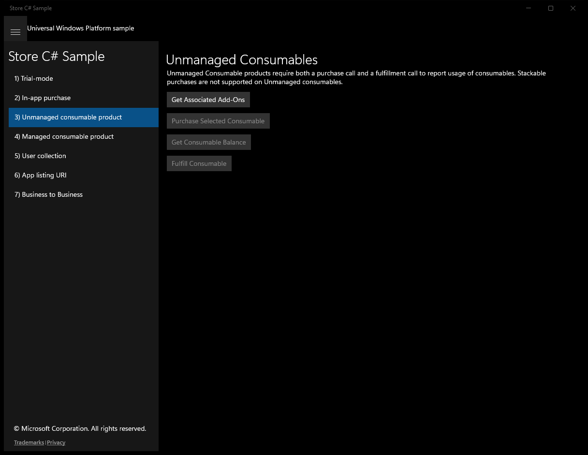

After click **Get Associated Add-Ons**:

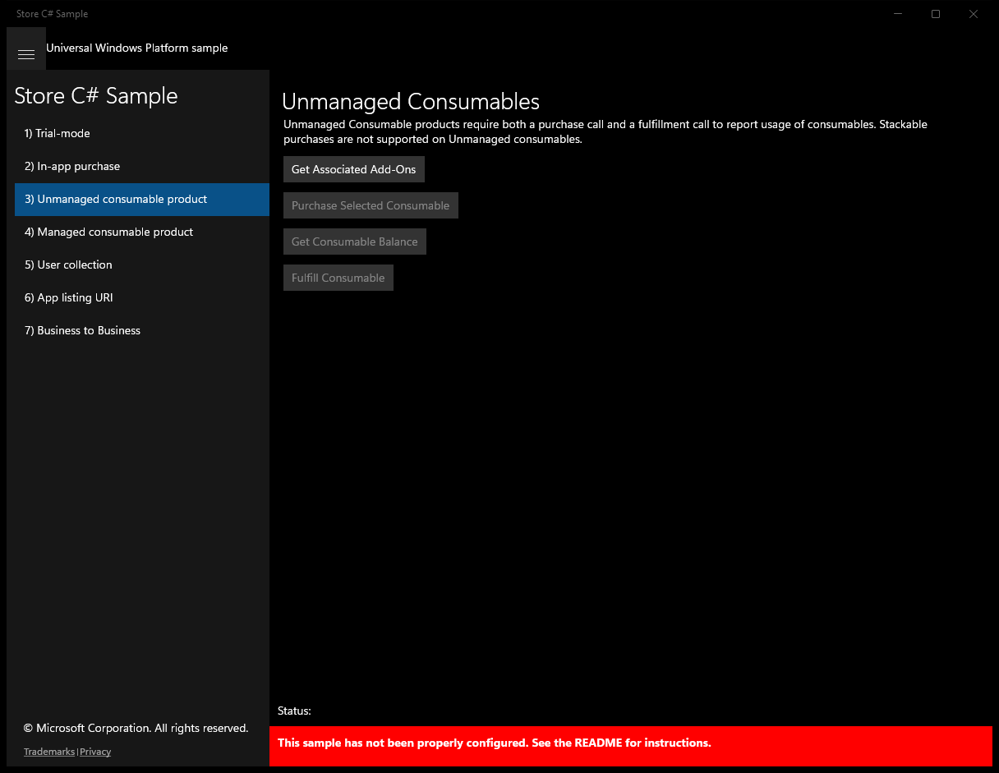

---

## Scenario 4 - Managed consumable product

**Description**: Managed Consumable products require both a purchase call and a fulfillment call to report usage of consumables and Microsoft Store Services will maintain the users balance. Stackable purchases are supported.

### UI elements
- **TextBlock**  - text="Managed Consumables"
- **Button**  - x:Name="GetManagedConsumablesButton"; content="Get Associated Add-Ons"; events: Click=GetManagedConsumablesButton_Click
- **Button**  - x:Name="PurchaseAddOnButton"; content="Purchase Selected Consumable"; events: Click=PurchaseAddOnButton_Click
- **Button**  - x:Name="GetConsumableBalanceButton"; content="Get Consumable Balance"; events: Click=GetConsumableBalanceButton_Click
- **Button**  - x:Name="FulfillConsumableButton"; content="Fulfill Consumable"; events: Click=FulfillConsumableButton_Click
- **TextBlock**  - text="Quantity"
- **ComboBox**  - x:Name="QuantityComboBox"
- **ListView**  - x:Name="ProductsListView"
- **TextBlock**  - text="{Binding FormattedTitle}"

### Code behavior
- **`GetManagedConsumablesButton_Click`**
    - API refs: `ProductsListView.ItemsSource`, `Utils.CreateProductListFromQueryResult`
- **`PurchaseAddOnButton_Click`**
    - API refs: `ProductsListView.SelectedItem`, `Utils.ReportExtendedError`, `StorePurchaseStatus.AlreadyPurchased`, `NotifyType.ErrorMessage`, `StorePurchaseStatus.Succeeded`, `NotifyType.StatusMessage`, `StorePurchaseStatus.NotPurchased`, `StorePurchaseStatus.NetworkError`, `StorePurchaseStatus.ServerError`
- **`GetConsumableBalanceButton_Click`**
    - API refs: `ProductsListView.SelectedItem`, `Utils.ReportExtendedError`, `StoreConsumableStatus.InsufficentQuantity`, `NotifyType.ErrorMessage`, `StoreConsumableStatus.Succeeded`, `NotifyType.StatusMessage`, `StoreConsumableStatus.NetworkError`, `StoreConsumableStatus.ServerError`
- **`FulfillConsumableButton_Click`**
    - API refs: `ProductsListView.SelectedItem`, `UInt32.Parse`, `QuantityComboBox.SelectedValue`, `Guid.NewGuid`, `Utils.ReportExtendedError`, `StoreConsumableStatus.InsufficentQuantity`, `NotifyType.ErrorMessage`, `StoreConsumableStatus.Succeeded`, `NotifyType.StatusMessage`, `StoreConsumableStatus.NetworkError`, `StoreConsumableStatus.ServerError`

### Screenshots
Initial state:

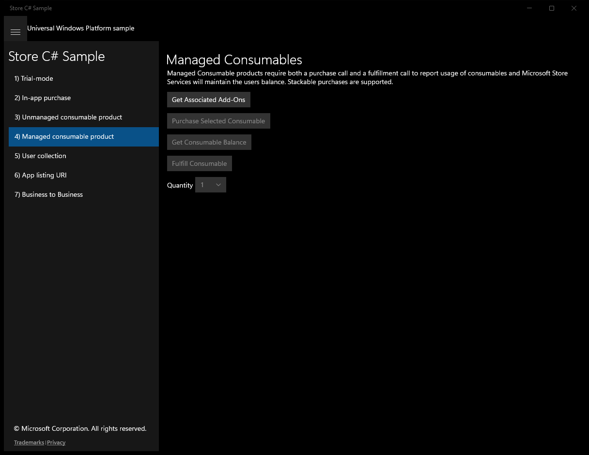

After click **Get Associated Add-Ons**:

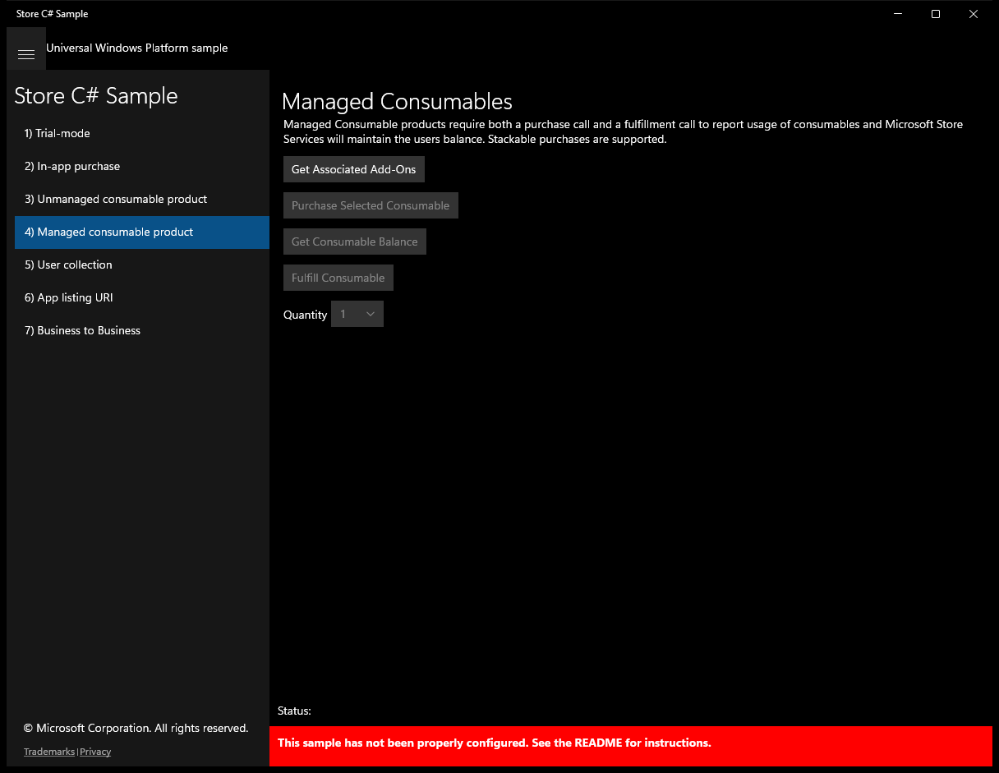

---

## Scenario 5 - User collection

**Description**: This scenario shows the collection of Add-On products for this product owned by the user.

### UI elements
- **TextBlock**  - text="User Collection"
- **TextBlock**  - text="This scenario shows the collection of Add-On products for this product owned by the user."
- **Button**  - x:Name="GetUserCollectionButton"; content="Get User Collection"; events: Click=GetUserCollectionButton_Click
- **ListView**  - x:Name="ProductsListView"
- **TextBlock**  - text="{Binding FormattedTitle}"

### Code behavior
- **`GetUserCollectionButton_Click`**
    - API refs: `ProductsListView.ItemsSource`, `Utils.CreateProductListFromQueryResult`

### Screenshots
Initial state:

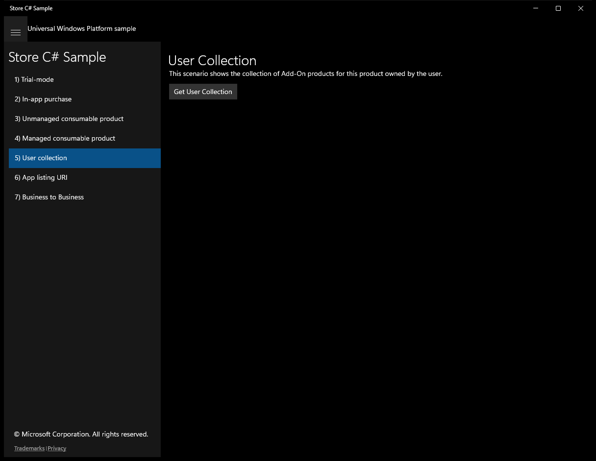

After click **Get User Collection**:

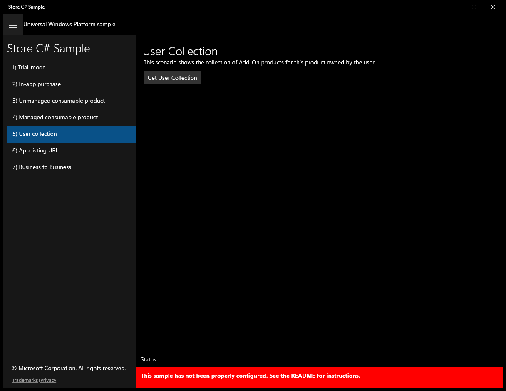

---

## Scenario 6 - App listing URI

**Description**: Goes to the app's listing in the Microsoft Store. You can use this information to make it easy for customers to purchase or review your app.

### UI elements
- **TextBlock**  - text="App listing URI"
- **TextBlock**  - text="Goes to the app's listing in the Microsoft Store. You can use this information to make it easy for customers to purchase or review your app."
- **Button**  - content="Rate this app"; events: Click={x:Bind DisplayLink}

### Code behavior
- **`DisplayLink`**
    - namespaces: `Windows.System.Launcher.LaunchUriAsync`
    - API refs: `Utils.ReportExtendedError`, `Windows.System`, `Launcher.LaunchUriAsync`, `Product.LinkUri`

### Screenshots
Initial state:

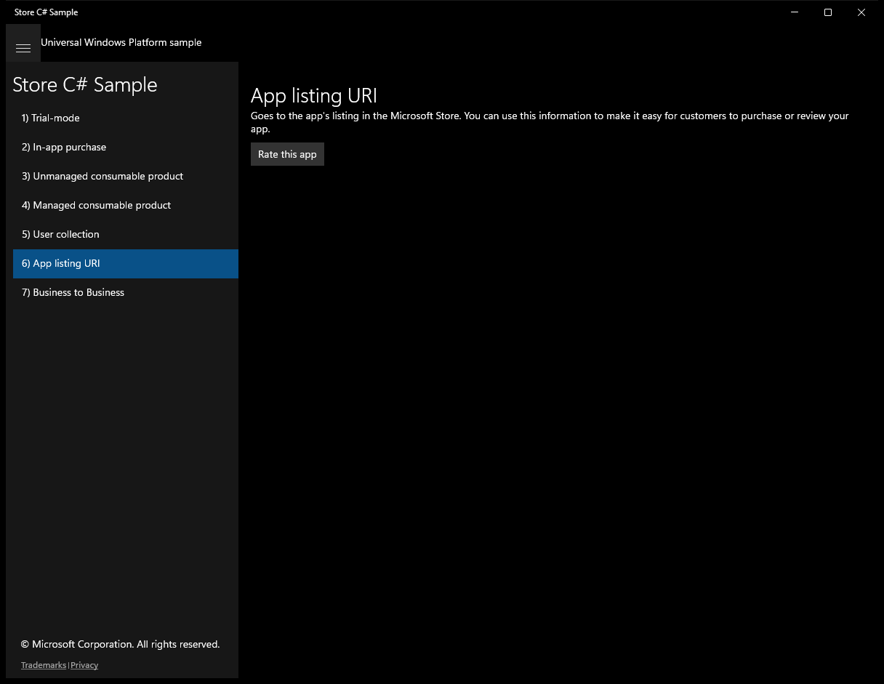

After click **Rate this app**:

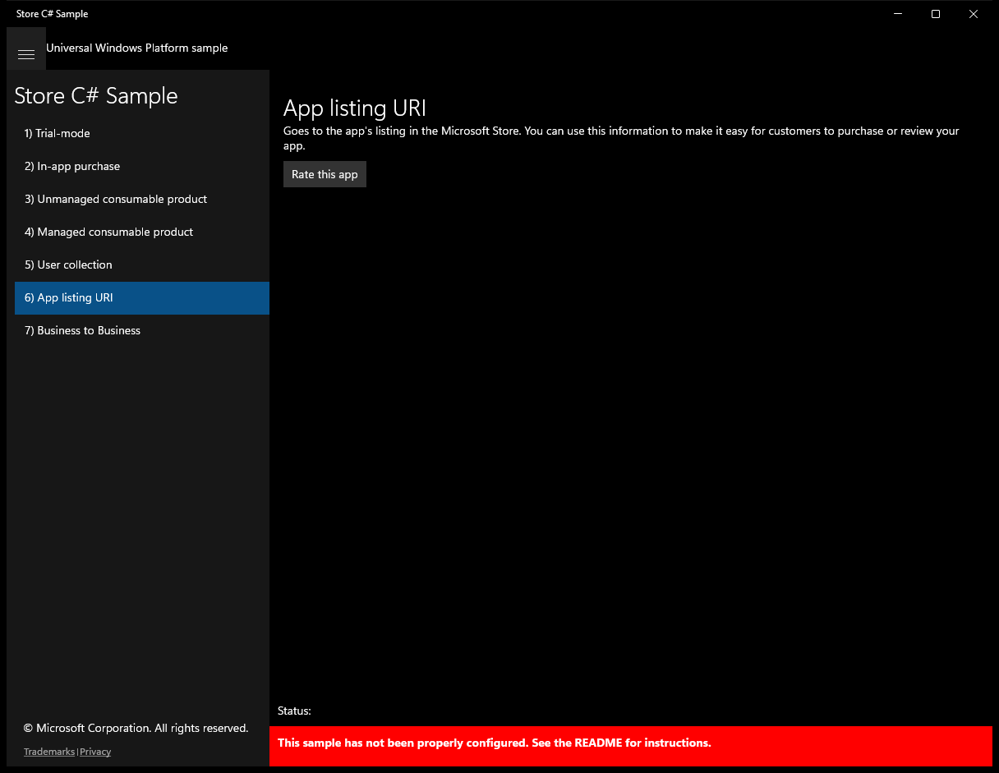

---

## Scenario 7 - Business to Business

**Description**: These APIs are used to retrieve secure tokens that can be saved by the application's servers to query the user's collection or grant a user access to a product.

### UI elements
- **TextBlock**  - text="Business to Business"
- **TextBlock**  - text="These APIs are used to retrieve secure tokens that can be saved by the application's servers to query the user's collection or grant a user access to a product."
- **Button**  - content="Get Customer Collections Id"; events: Click={x:Bind GetCustomerCollectionsId}
- **Button**  - content="Get Customer Purchase Id"; events: Click={x:Bind GetCustomerPurchaseId}
- **TextBlock**  - x:Name="Output"

### Code behavior
- **`GetCustomerCollectionsId`**
    - API refs: `String.IsNullOrEmpty`, `Output.Text`, `NotifyType.ErrorMessage`
- **`GetCustomerPurchaseId`**
    - API refs: `String.IsNullOrEmpty`, `Output.Text`, `NotifyType.ErrorMessage`
- **`GetTokenFromAzureOAuthAsync`**
    - instantiates: `HttpFormUrlEncodedContent`, `Dictionary`, `HttpMediaTypeHeaderValue`, `HttpClient`, `Uri`
    - API refs: `Headers.ContentType`, `Content.ReadAsStringAsync`, `JsonValue.Parse`, `Output.Text`, `String.Empty`

### Screenshots
Initial state:

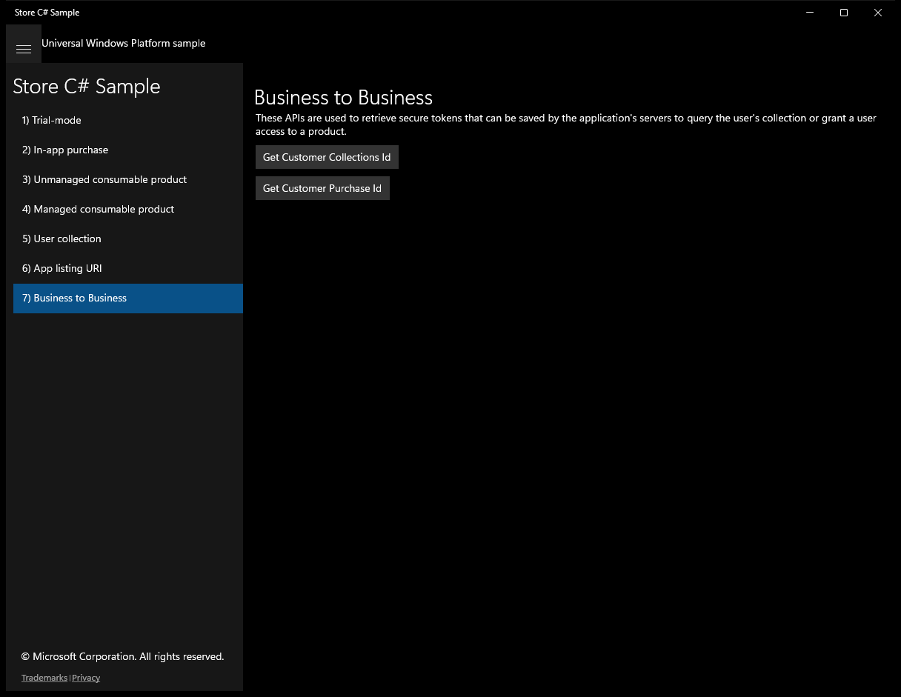

After click **Get Customer Collections Id**:

After click **Get Customer Purchase Id**:

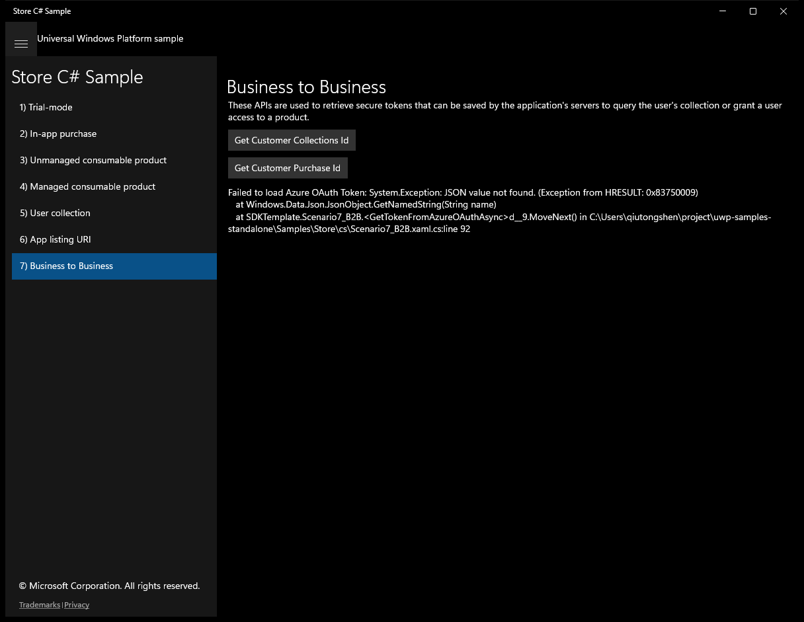

