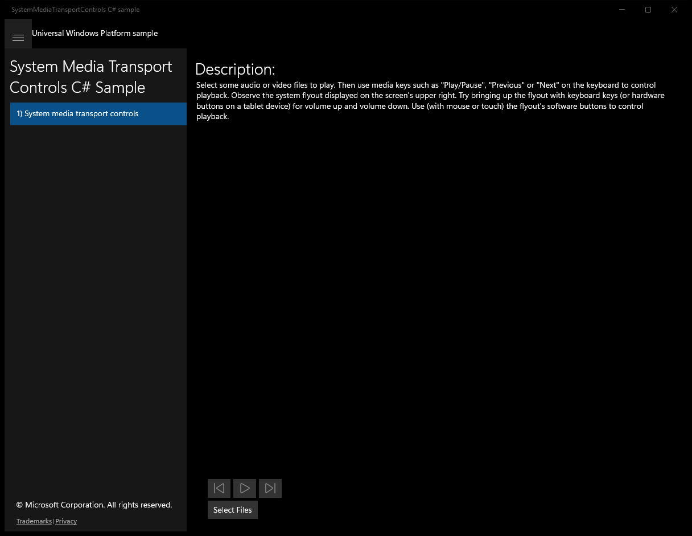
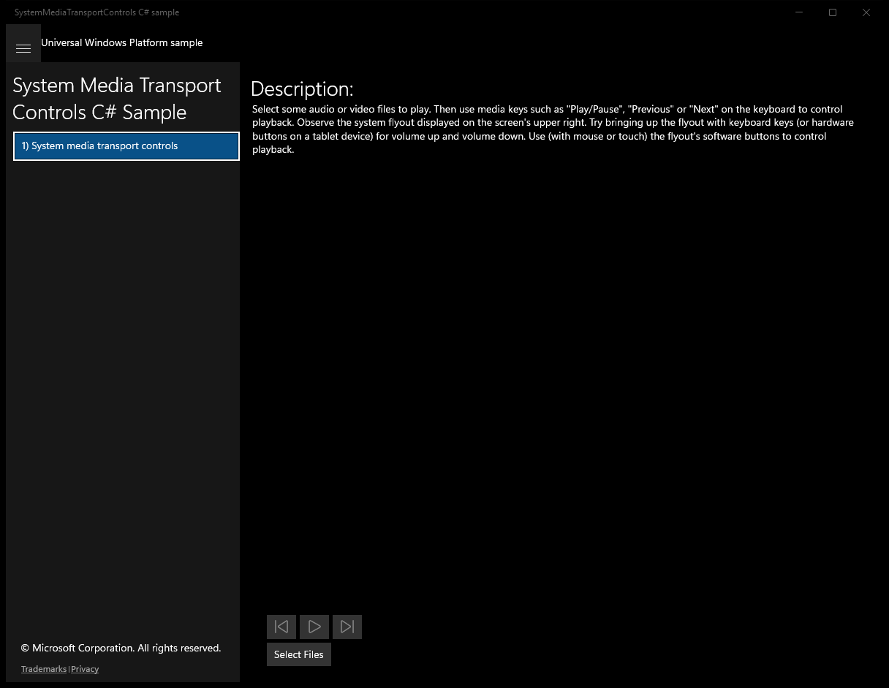

#  (C#)

> **Source**: `Samples\\cs\`  
> **Feature**: System Media Transport Controls C# Sample  
> **AUMID**: `Microsoft.SDKSamples.MediaTransportControls.CS_8wekyb3d8bbwe!MediaTransportControls.App`  
> **PackageFamilyName**: `Microsoft.SDKSamples.MediaTransportControls.CS_8wekyb3d8bbwe`  

## Sample purpose
Shows how to respond to system media events as well as providing the system with metadata about the content that is playing.

## Build / deploy / capture status
- build: skipped
- deploy: ok
- launch: ok
- capture: ok
- uninstall: ok

## Main page

---

## Scenario 1 - System media transport controls

**Description**: Select some audio or video files to play. Then use media keys such as "Play/Pause", "Previous" or "Next" on the keyboard to control playback. Observe the system flyout displayed on the screen's upper right. Try bringing up the flyout with keyboard keys (or hardware buttons on a tablet device) for volume up and volume down. Use (with mouse or touch) the flyout's software buttons to control playback.

### UI elements
- **TextBlock**  - text="Description:"
- **MediaPlayerElement**  - x:Name="mediaPlayerElement"
- **Button**  - x:Name="previousButton"; events: Click=previousButton_Click
- **Button**  - x:Name="playPauseButton"; events: Click=playPauseButton_Click
- **Button**  - x:Name="nextButton"; events: Click=nextButton_Click
- **Button**  - x:Name="SelectFilesButton"; content="Select Files"; events: Click=SelectFilesButton_Click

### Code behavior
- **`OnNavigatedTo`**
    - instantiates: `MediaPlayer`, `DispatcherTimer`
    - API refs: `MainPage.Current`, `CommandManager.IsEnabled`, `PlaybackSession.PlaybackStateChanged`, `TimeSpan.FromSeconds`
- **`SetupSystemMediaTransportControls`**
    - API refs: `SystemMediaTransportControls.GetForCurrentView`, `MediaPlaybackStatus.Closed`
- **`UpdateSmtcPosition`**
    - instantiates: `SystemMediaTransportControlsTimelineProperties`
    - API refs: `TimeSpan.FromSeconds`, `PlaybackSession.Position`, `PlaybackSession.NaturalDuration`
- **`SelectFilesButton_Click`**
    - instantiates: `FileOpenPicker`
    - API refs: `PickerViewMode.List`, `PickerLocationId.MusicLibrary`, `FileTypeFilter.Add`, `String.Format`, `NotifyType.StatusMessage`
- **`SyncPlaybackStatusToMediaPlayerState`**
    - API refs: `PlaybackSession.PlaybackState`, `MediaPlaybackState.None`, `MediaPlaybackStatus.Closed`, `MediaPlaybackState.Opening`, `MediaPlaybackState.Buffering`, `MediaPlaybackState.Paused`, `PlaybackSession.Position`, `TimeSpan.Zero`, `MediaPlaybackStatus.Stopped`, `MediaPlaybackStatus.Paused`, `MediaPlaybackState.Playing`, `MediaPlaybackStatus.Playing`
- **`GetMediaTypeFromFileContentType`**
    - API refs: `MediaPlaybackType.Unknown`, `ContentType.ToLowerInvariant`, `MediaPlaybackType.Music`, `MediaPlaybackType.Video`, `MediaPlaybackType.Image`
- **`UpdateSystemMediaControlsDisplayAsync`**
    - API refs: `MediaPlaybackType.Unknown`, `MediaPlaybackType.Music`, `DisplayUpdater.CopyFromFileAsync`, `DisplayUpdater.ClearAll`, `DisplayUpdater.Update`
- **`SetNewMediaItem`**
    - instantiates: `MediaPlaybackItem`
    - API refs: `FileAccessMode.Read`, `String.Format`, `Message.Trim`, `NotifyType.ErrorMessage`, `MediaSource.CreateFromStream`
- **`UpdateCustomTransportControls`**
    - instantiates: `SymbolIcon`
    - API refs: `PlaybackSession.PlaybackState`, `MediaPlaybackState.None`, `Symbol.Play`, `MediaPlaybackState.Paused`, `MediaPlaybackState.Playing`, `Symbol.Pause`

### Screenshots
Initial state:

> Button **Select Files** skipped (blocklist)

