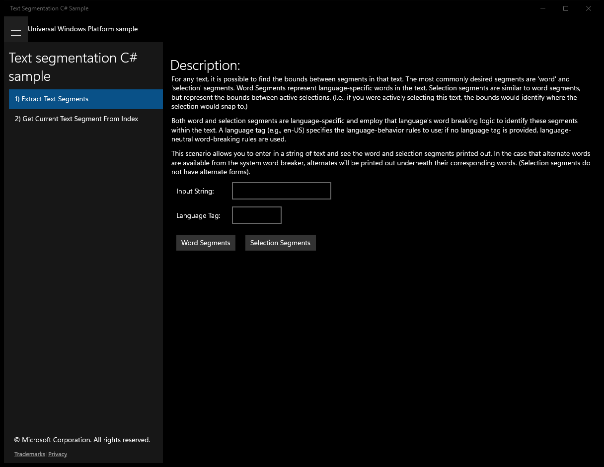
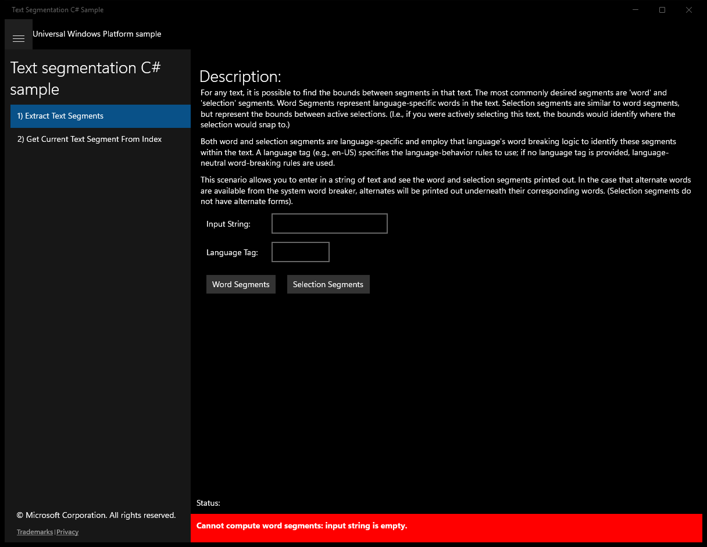
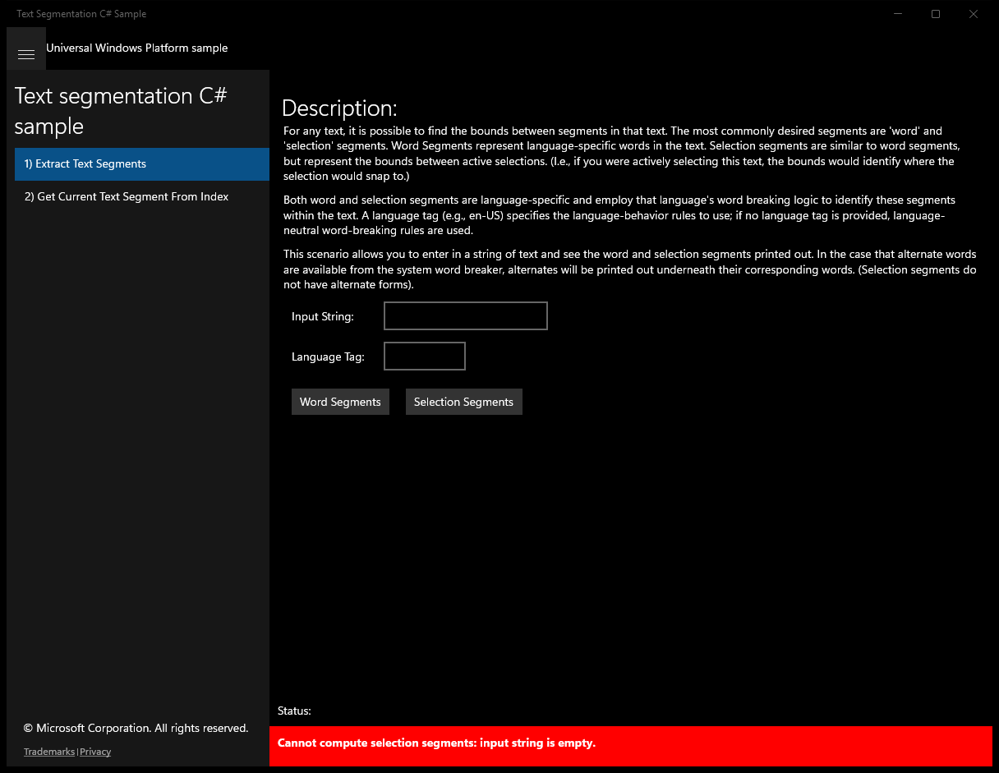
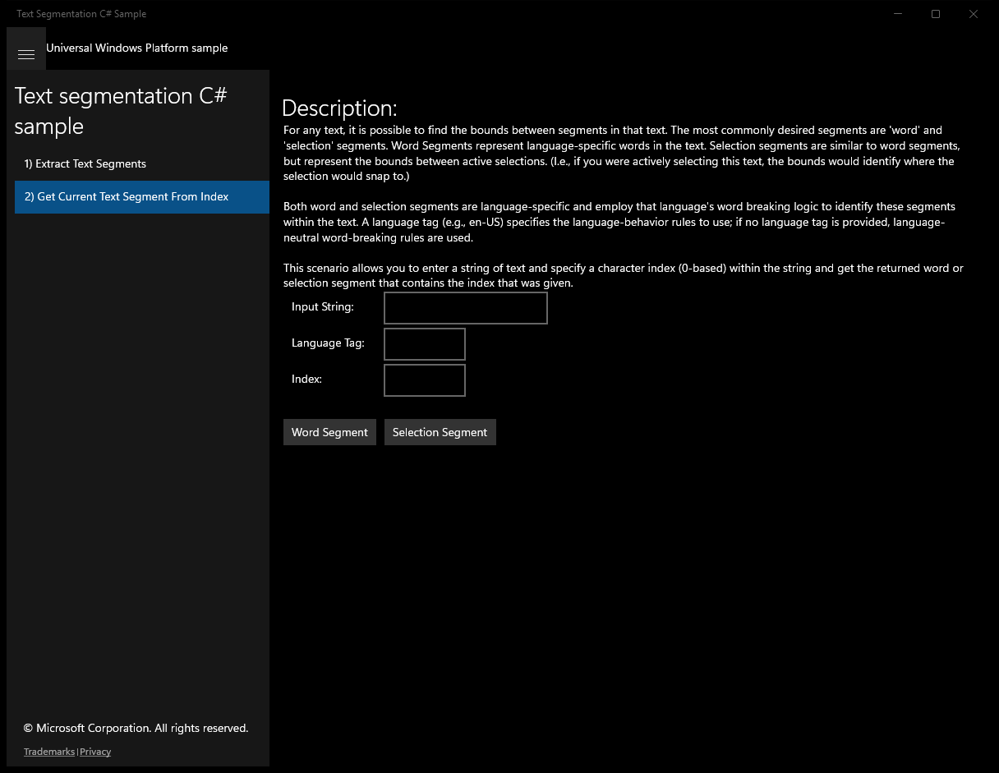
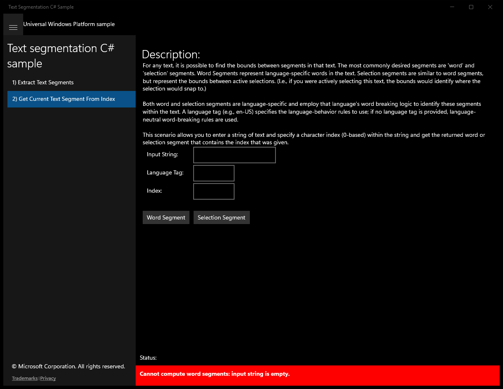
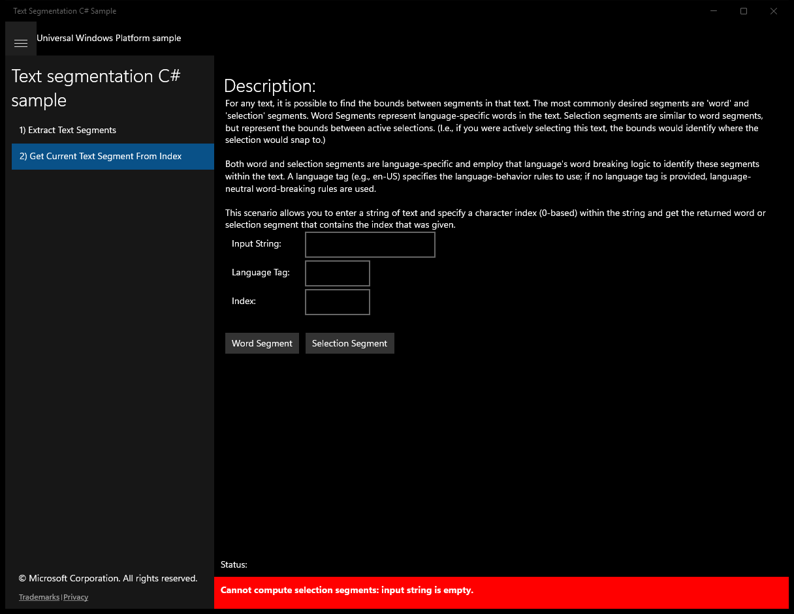

# TextSegmentation (C#)

> **Source**: `Samples\TextSegmentation\cs\`  
> **Feature**: Text segmentation C# sample  
> **AUMID**: `Microsoft.SDKSamples.TextSegmentation.CS_8wekyb3d8bbwe!App`  
> **PackageFamilyName**: `Microsoft.SDKSamples.TextSegmentation.CS_8wekyb3d8bbwe`  

## Top-level UWP namespaces used
- `Windows.Globalization.Language.IsWellFormed`
- `Windows.Data.Text.WordsSegmenter`
- `Windows.Data.Text.SelectableWordsSegmenter`

## Build / deploy / capture status
- build: ok
- deploy: ok
- launch: ok
- capture: ok
- uninstall: ok

## Main page

---

## Scenario 1 - Extract Text Segments

### UI elements
- **TextBlock**  - text="Description:"
- **TextBlock**  - text="Input String: "
- **TextBox**  - x:Name="inputStringBox"
- **TextBlock**  - text="Language Tag: "
- **TextBox**  - x:Name="languageTagBox"
- **Button**  - x:Name="WordSegmentsButton"; content="Word Segments"; events: Click=WordSegmentsButton_Click
- **Button**  - x:Name="SelectionSegmentsButton"; content="Selection Segments"; events: Click=SelectionSegmentsButton_Click

### Code behavior
- **`WordSegmentsButton_Click`**
    - namespaces: `Windows.Globalization.Language.IsWellFormed`, `Windows.Data.Text.WordsSegmenter`
    - instantiates: `StringBuilder`, `Windows.Data.Text.WordsSegmenter`
    - API refs: `String.IsNullOrEmpty`, `NotifyType.ErrorMessage`, `Windows.Globalization`, `Language.IsWellFormed`, `Windows.Data`, `Text.WordsSegmenter`, `NotifyType.StatusMessage`
- **`SelectionSegmentsButton_Click`**
    - namespaces: `Windows.Globalization.Language.IsWellFormed`, `Windows.Data.Text.SelectableWordsSegmenter`
    - instantiates: `StringBuilder`, `Windows.Data.Text.SelectableWordsSegmenter`
    - API refs: `String.IsNullOrEmpty`, `NotifyType.ErrorMessage`, `Windows.Globalization`, `Language.IsWellFormed`, `Windows.Data`, `Text.SelectableWordsSegmenter`, `NotifyType.StatusMessage`

### Screenshots
Initial state:

After click **Words Segments Button**:

After click **Selection Segments Button**:

---

## Scenario 2 - Get Current Text Segment From Index

### UI elements
- **TextBlock**  - text="Description:"
- **TextBlock**  - text="Input String: "
- **TextBox**  - x:Name="inputStringBox"
- **TextBlock**  - text="Language Tag: "
- **TextBox**  - x:Name="languageTagBox"
- **TextBlock**  - text="Index: "
- **TextBox**  - x:Name="indexBox"
- **Button**  - x:Name="WordSegmentButton"; content="Word Segment"; events: Click=WordSegmentButton_Click
- **Button**  - x:Name="SelectionSegmentButton"; content="Selection Segment"; events: Click=SelectionSegmentButton_Click

### Code behavior
- **`WordSegmentButton_Click`**
    - namespaces: `Windows.Globalization.Language.IsWellFormed`, `Windows.Data.Text.WordsSegmenter`
    - instantiates: `StringBuilder`, `Windows.Data.Text.WordsSegmenter`
    - API refs: `String.IsNullOrEmpty`, `NotifyType.ErrorMessage`, `Windows.Globalization`, `Language.IsWellFormed`, `Convert.ToUInt32`, `Windows.Data`, `Text.WordsSegmenter`, `NotifyType.StatusMessage`
- **`SelectionSegmentButton_Click`**
    - namespaces: `Windows.Globalization.Language.IsWellFormed`, `Windows.Data.Text.SelectableWordsSegmenter`
    - instantiates: `StringBuilder`, `Windows.Data.Text.SelectableWordsSegmenter`
    - API refs: `String.IsNullOrEmpty`, `NotifyType.ErrorMessage`, `Windows.Globalization`, `Language.IsWellFormed`, `Convert.ToUInt32`, `Windows.Data`, `Text.SelectableWordsSegmenter`, `NotifyType.StatusMessage`

### Screenshots
Initial state:

After click **Words Segments Button**:

After click **Selection Segments Button**:

