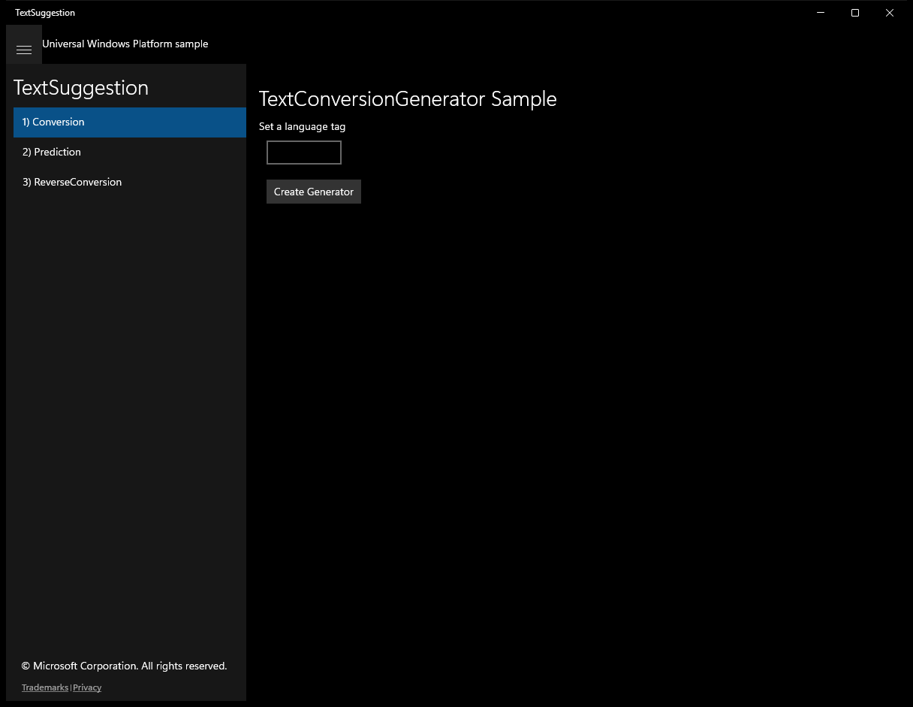
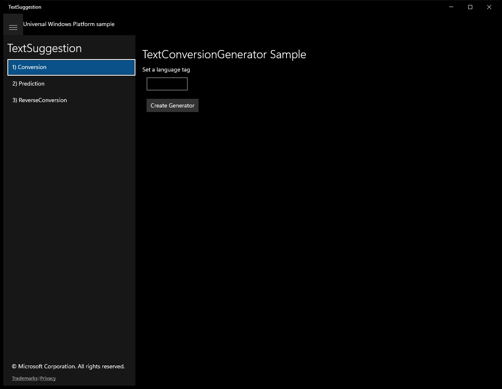
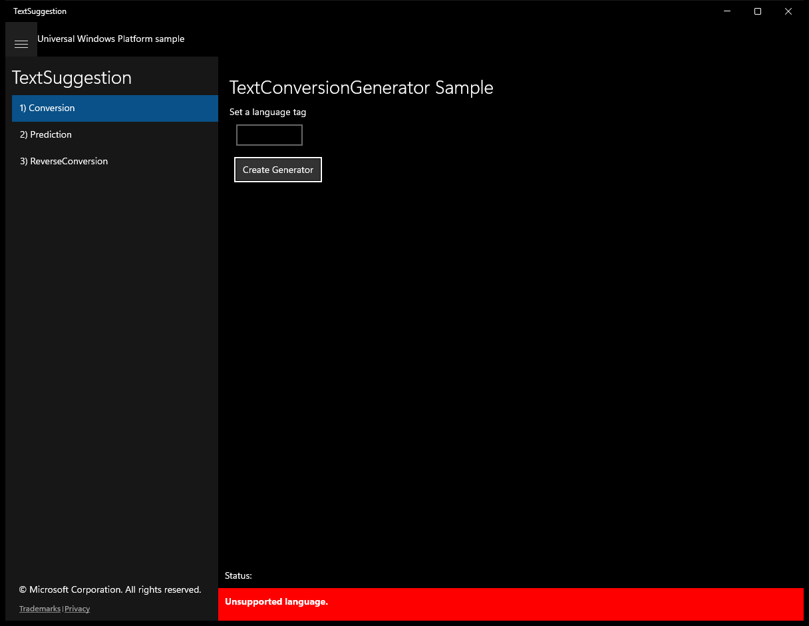
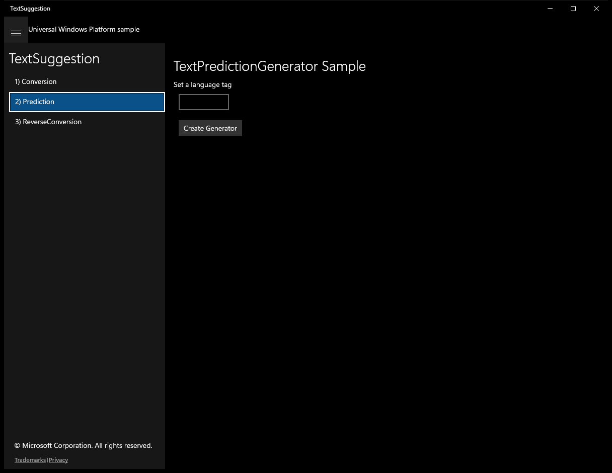
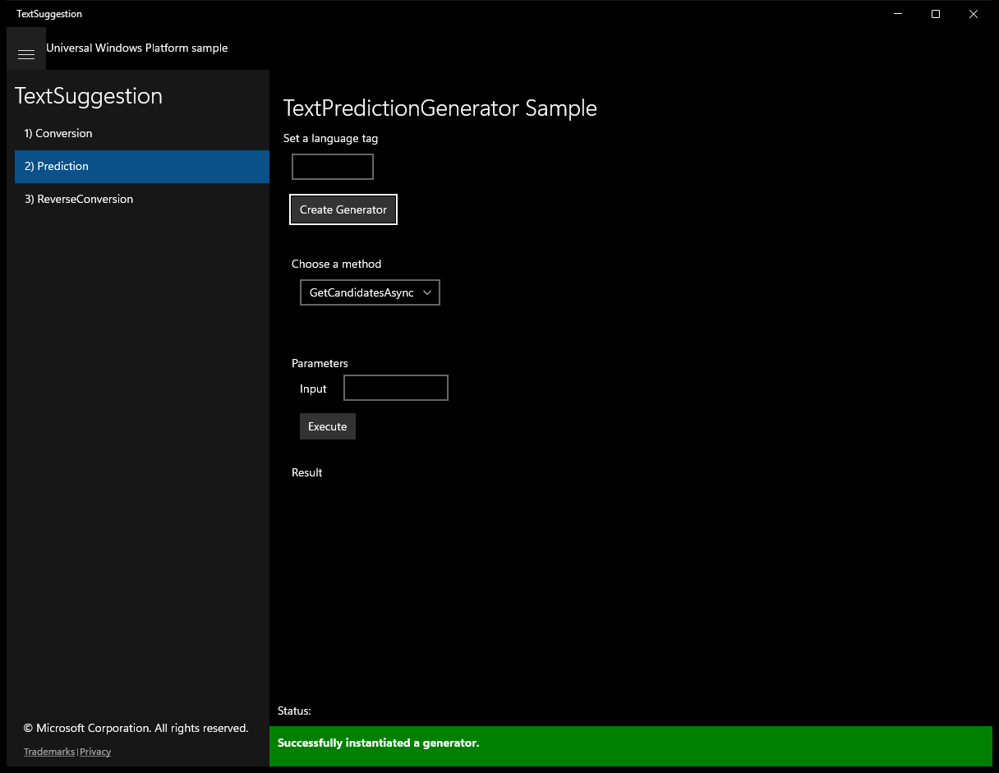
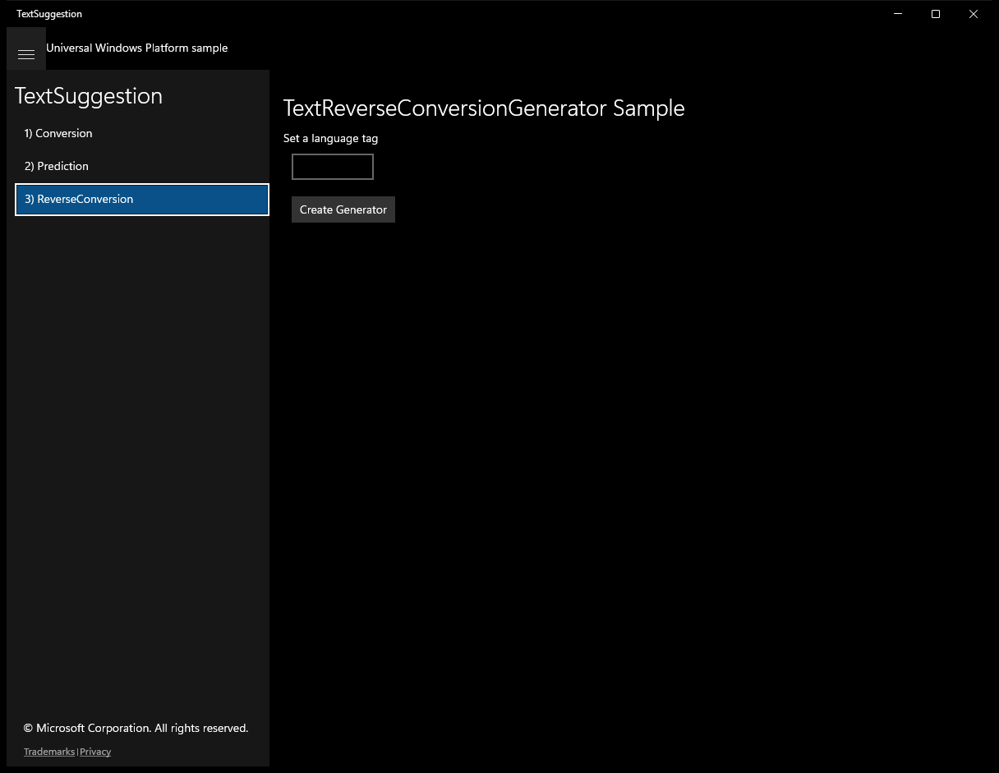
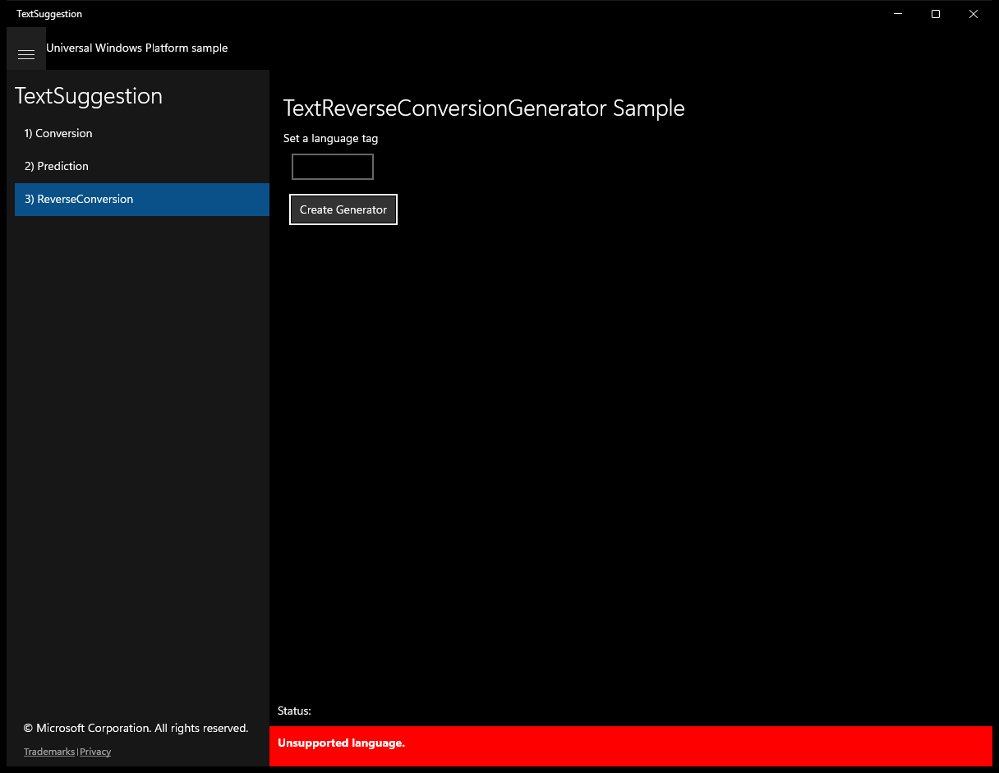

# TextSuggestion (C#)

> **Source**: `Samples\TextSuggestion\cs\`  
> **Feature**: TextSuggestion  
> **AUMID**: `Microsoft.SDKSamples.TextSuggestion.CS_8wekyb3d8bbwe!App`  
> **PackageFamilyName**: `Microsoft.SDKSamples.TextSuggestion.CS_8wekyb3d8bbwe`  

## Build / deploy / capture status
- build: ok
- deploy: ok
- launch: ok
- capture: ok
- uninstall: ok

## Main page

---

## Scenario 1 - Conversion

**Description**: Set a language tag

### UI elements
- **TextBlock**  - text="TextConversionGenerator Sample"
- **TextBlock**  - text="Set a language tag"
- **TextBox**  - name="langTag"
- **Button**  - name="createGeneratorButton"; content="Create Generator"; events: Click=CreateGeneratorButton_Click
- **TextBlock**  - text="Choose a method"
- **ComboBox**  - name="methods"; events: SelectionChanged=Methods_SelectionChanged
- **TextBlock**  - text="Parameters"
- **TextBlock**  - text="Input"
- **TextBox**  - name="Input"
- **TextBlock**  - text="maxCandidates"
- **TextBox**  - name="maxCandidates"
- **Button**  - name="executeButton"; content="Execute"; events: Click=Execute_Click
- **TextBlock**  - text="Result"
- **ListView**  - name="resultView"
- **TextBlock**  - x:Name="StatusBlock"

### Code behavior
- **`OnNavigatedTo`**
    - API refs: `MainPage.Current`, `NotifyType.StatusMessage`
- **`Execute_Click`**
    - API refs: `NotifyType.StatusMessage`, `Input.Text`, `String.IsNullOrEmpty`, `Tag.ToString`, `UInt32.TryParse`, `Items.Count`, `NotifyType.ErrorMessage`
- **`Methods_SelectionChanged`**
    - API refs: `Tag.ToString`, `Visibility.Visible`, `Visibility.Collapsed`
- **`CreateGeneratorButton_Click`**
    - instantiates: `TextConversionGenerator`
    - API refs: `GeneratorOperationArea.Visibility`, `Visibility.Collapsed`, `NotifyType.ErrorMessage`, `Visibility.Visible`, `NotifyType.StatusMessage`

### Screenshots
Initial state:

After click **Create Generator**:

---

## Scenario 2 - Prediction

**Description**: Set a language tag

### UI elements
- **TextBlock**  - text="TextPredictionGenerator Sample"
- **TextBlock**  - text="Set a language tag"
- **TextBox**  - name="langTag"
- **Button**  - name="createGeneratorButton"; content="Create Generator"; events: Click=CreateGeneratorButton_Click
- **TextBlock**  - text="Choose a method"
- **ComboBox**  - name="methods"; events: SelectionChanged=Methods_SelectionChanged
- **TextBlock**  - text="Parameters"
- **TextBlock**  - text="Input"
- **TextBox**  - name="Input"
- **TextBlock**  - text="maxCandidates"
- **TextBox**  - name="maxCandidates"
- **Button**  - name="executeButton"; content="Execute"; events: Click=Execute_Click
- **TextBlock**  - text="Result"
- **ListView**  - name="resultView"
- **TextBlock**  - x:Name="StatusBlock"

### Code behavior
- **`OnNavigatedTo`**
    - API refs: `MainPage.Current`, `NotifyType.StatusMessage`
- **`Execute_Click`**
    - API refs: `NotifyType.StatusMessage`, `Input.Text`, `String.IsNullOrEmpty`, `Tag.ToString`, `UInt32.TryParse`, `Items.Count`, `NotifyType.ErrorMessage`
- **`Methods_SelectionChanged`**
    - API refs: `Tag.ToString`, `Visibility.Visible`, `Visibility.Collapsed`
- **`CreateGeneratorButton_Click`**
    - instantiates: `TextPredictionGenerator`
    - API refs: `GeneratorOperationArea.Visibility`, `Visibility.Collapsed`, `NotifyType.ErrorMessage`, `Visibility.Visible`, `NotifyType.StatusMessage`

### Screenshots
Initial state:

After click **Create Generator**:

---

## Scenario 3 - ReverseConversion

**Description**: Set a language tag

### UI elements
- **TextBlock**  - text="TextReverseConversionGenerator Sample"
- **TextBlock**  - text="Set a language tag"
- **TextBox**  - name="langTag"
- **Button**  - name="createGeneratorButton"; content="Create Generator"; events: Click=CreateGeneratorButton_Click
- **TextBlock**  - text="Choose a method"
- **ComboBox**  - name="methods"
- **TextBlock**  - text="Parameters"
- **TextBlock**  - text="Input"
- **TextBox**  - name="Input"
- **Button**  - name="executeButton"; content="Execute"; events: Click=Execute_Click
- **TextBlock**  - text="Result"
- **ListView**  - name="resultView"
- **TextBlock**  - x:Name="StatusBlock"

### Code behavior
- **`OnNavigatedTo`**
    - API refs: `MainPage.Current`, `NotifyType.StatusMessage`
- **`Execute_Click`**
    - instantiates: `List`
    - API refs: `NotifyType.StatusMessage`, `Input.Text`, `String.IsNullOrEmpty`, `Tag.ToString`
- **`CreateGeneratorButton_Click`**
    - instantiates: `TextReverseConversionGenerator`
    - API refs: `GeneratorOperationArea.Visibility`, `Visibility.Collapsed`, `NotifyType.ErrorMessage`, `Visibility.Visible`, `NotifyType.StatusMessage`

### Screenshots
Initial state:

After click **Create Generator**:

