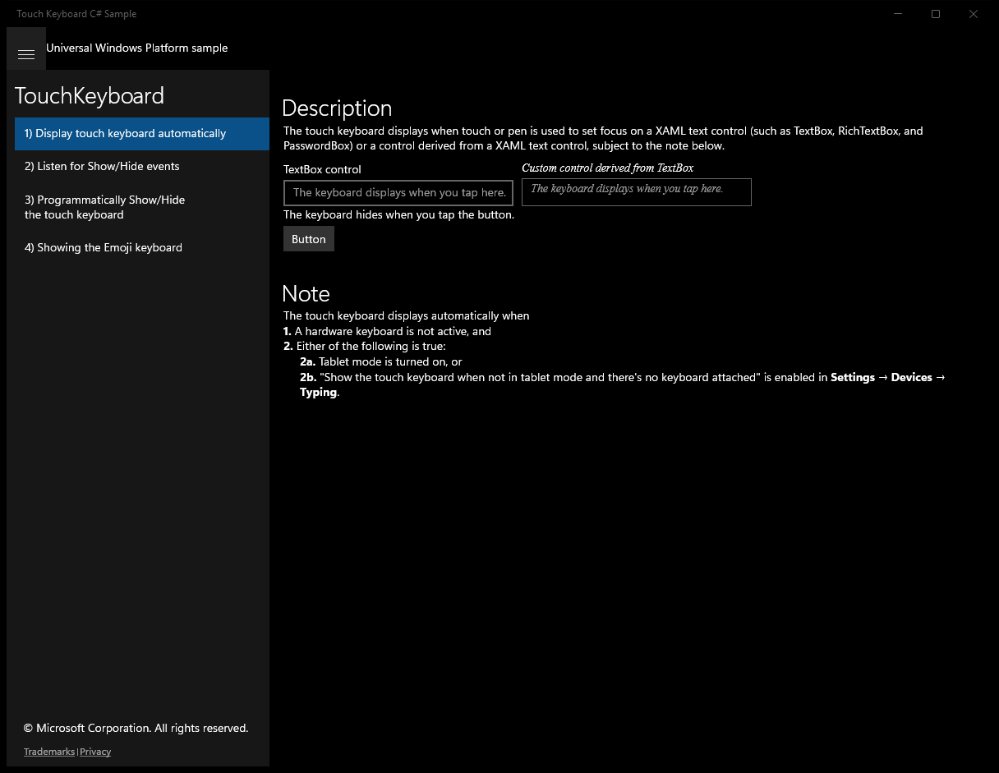
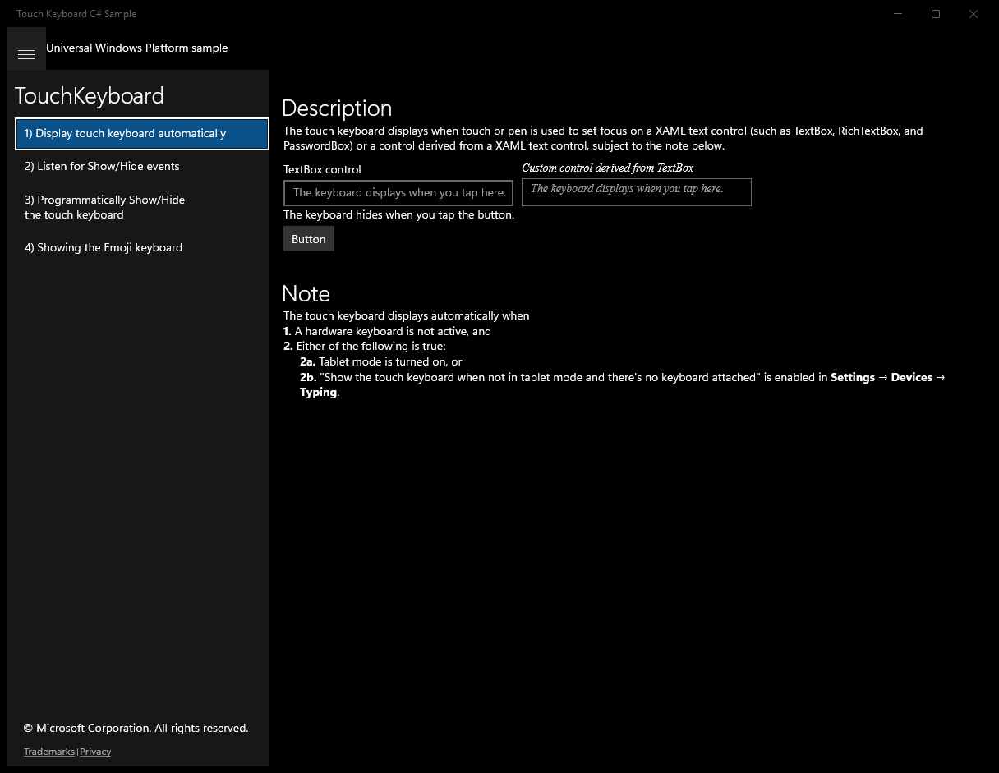
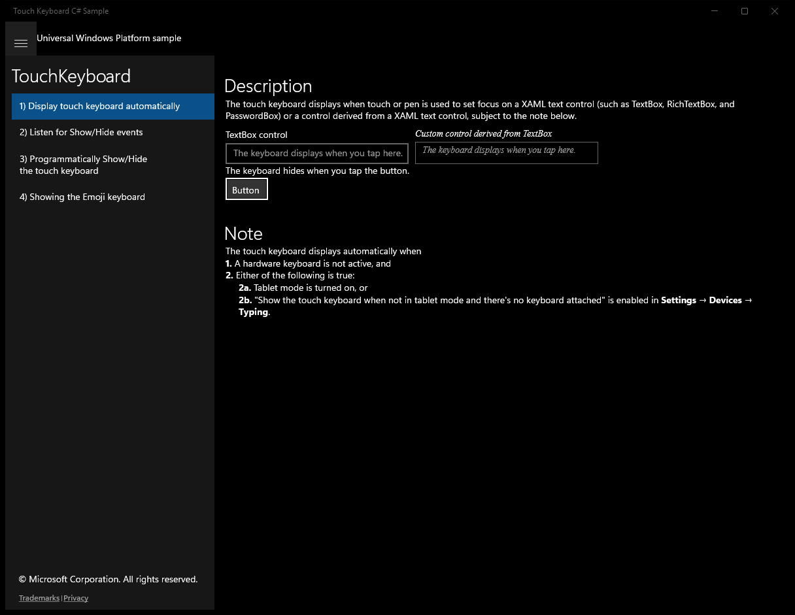
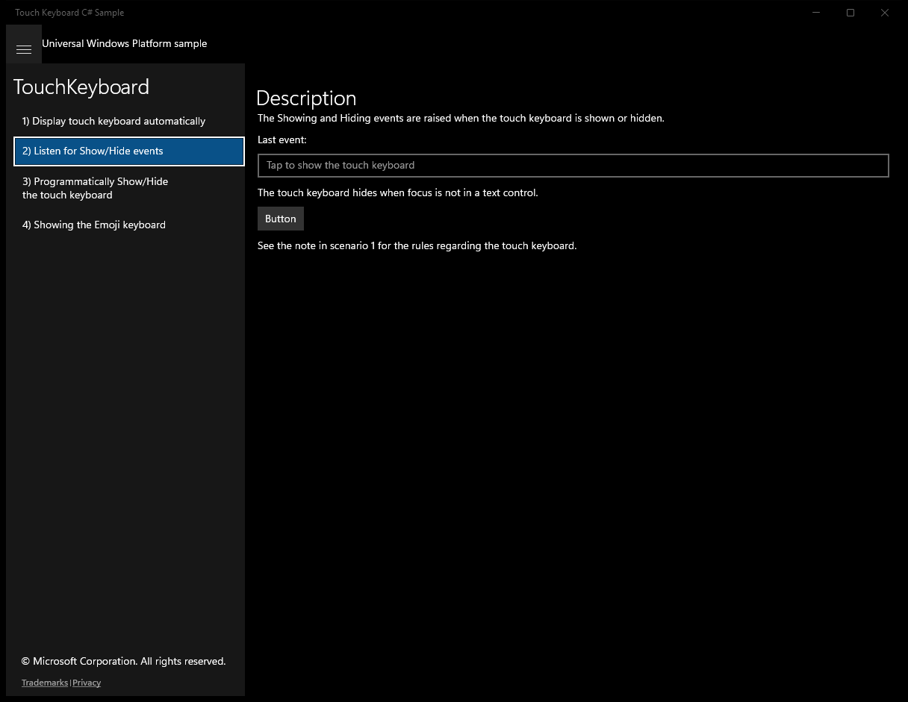
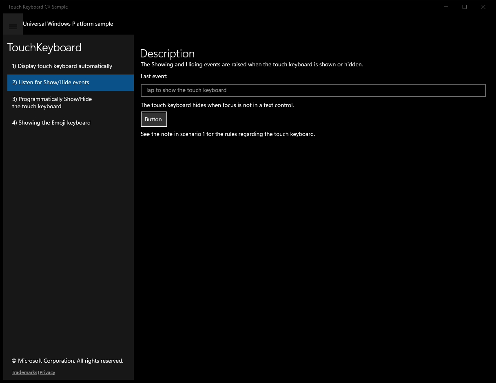
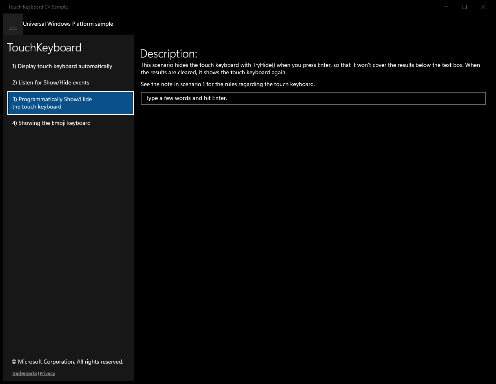
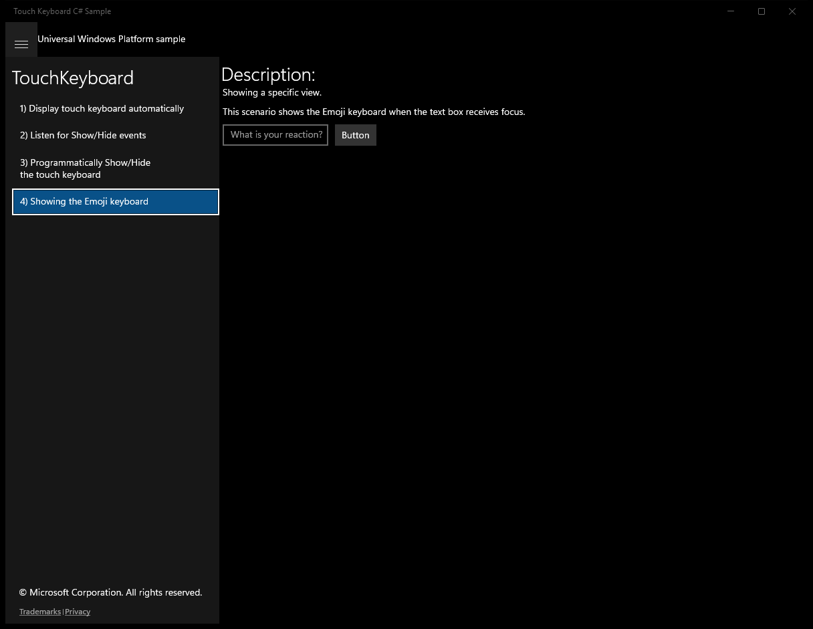
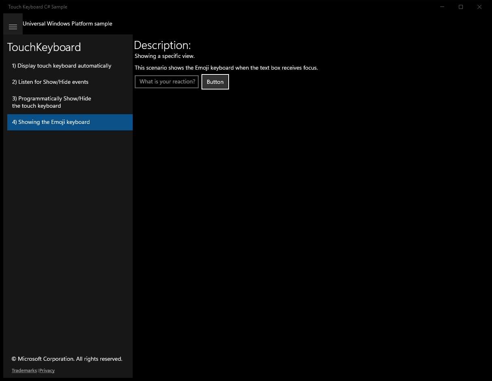

#  (C#)

> **Source**: `Samples\\cs\`  
> **Feature**: TouchKeyboard  
> **AUMID**: `Microsoft.SDKSamples.TouchKeyboard.CS_8wekyb3d8bbwe!TouchKeyboard.App`  
> **PackageFamilyName**: `Microsoft.SDKSamples.TouchKeyboard.CS_8wekyb3d8bbwe`  

## Sample purpose
Shows both the default display behavior of the touch keyboard and how that behavior can be customized in a UWP app.

## Top-level UWP namespaces used
- `Windows.System.VirtualKey.Enter`
- `Windows.UI.ViewManagement.InputPane.GetForCurrentView`

## Build / deploy / capture status
- build: skipped
- deploy: ok
- launch: ok
- capture: ok
- uninstall: ok

## Main page

---

## Scenario 1 - Display touch keyboard automatically

### UI elements
- **TextBlock**  - text="Description"
- **TextBlock**  - text="The keyboard hides when you tap the button."
- **Button**  - content="Button"
- **TextBlock**  - text="Note"
- **TextBlock**  - text="The touch keyboard displays automatically when 1. A hardware keyboard is not active, and 2. Either of the following is true:"
- **TextBlock**  - text="2a. Tablet mode is turned on, or 2b. "Show the touch keyboard when not in tablet mode and there's no keyboard attached" is enabled in Settings → Devices → Typing."

### Screenshots
Initial state:

After click **Button**:

---

## Scenario 2 - Listen for Show/Hide events

### UI elements
- **TextBlock**  - text="Description"
- **TextBlock**  - text="The Showing and Hiding events are raised when the touch keyboard is shown or hidden."
- **TextBlock**  - text="Last event:"
- **TextBlock**  - text="The touch keyboard hides when focus is not in a text control."
- **Button**  - content="Button"
- **TextBlock**  - text="See the note in scenario 1 for the rules regarding the touch keyboard."

### Code behavior
- **`OnNavigatedTo`**
    - API refs: `InputPane.GetForCurrentView`
- **`OnNavigatedFrom`**
    - API refs: `InputPane.GetForCurrentView`
- **`OnShowing`**
    - API refs: `LastInputPaneEventRun.Text`
- **`OnHiding`**
    - API refs: `LastInputPaneEventRun.Text`

### Screenshots
Initial state:

After click **Button**:

---

## Scenario 3 - Programmatically Show/Hide\nthe touch keyboard

### UI elements
- **TextBlock**  - text="Description:"
- **TextBlock**  - text="This scenario hides the touch keyboard with TryHide() when you press Enter, so that it won't cover the results below the text box. When the results are cleared, it shows the touch keyboard again."
- **TextBlock**  - text="See the note in scenario 1 for the rules regarding the touch keyboard."
- **TextBox**  - x:Name="WordListBox"; text="Type a few words and hit Enter."; events: KeyDown=WordListBox_OnKeyUp
- **TextBlock**  - x:Name="ResultsTextBlock"

### Code behavior
- **`OnNavigatedFrom`**
    - API refs: `FadeOutResults.Stop`
- **`WordListBox_OnKeyUp`**
    - namespaces: `Windows.System.VirtualKey.Enter`, `Windows.UI.ViewManagement.InputPane.GetForCurrentView`
    - API refs: `Windows.System`, `VirtualKey.Enter`, `WordListBox.Text`, `Windows.UI`, `ViewManagement.InputPane`, `ResultsTextBlock.Text`, `FadeOutResults.Begin`
    - updates UI: `ResultsTextBlock.Text`
- **`OnFadeOutCompleted`**
    - namespaces: `Windows.UI.ViewManagement.InputPane.GetForCurrentView`
    - API refs: `ResultsTextBlock.Text`, `Windows.UI`, `ViewManagement.InputPane`
    - updates UI: `ResultsTextBlock.Text`

### Screenshots
Initial state:

---

## Scenario 4 - Showing the Emoji keyboard

**Description**: Showing a specific view.

### UI elements
- **TextBlock**  - text="Description:"
- **TextBlock**  - text="Showing a specific view."
- **TextBlock**  - text="This scenario shows the Emoji keyboard when the text box receives focus."
- **Button**  - content="Button"

### Code behavior
- **`TextBox_GotFocus`**
    - API refs: `CoreInputView.GetForCurrentView`, `CoreInputViewKind.Emoji`

### Screenshots
Initial state:

After click **Button**:

