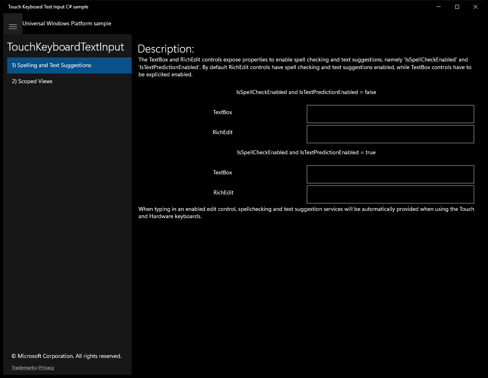
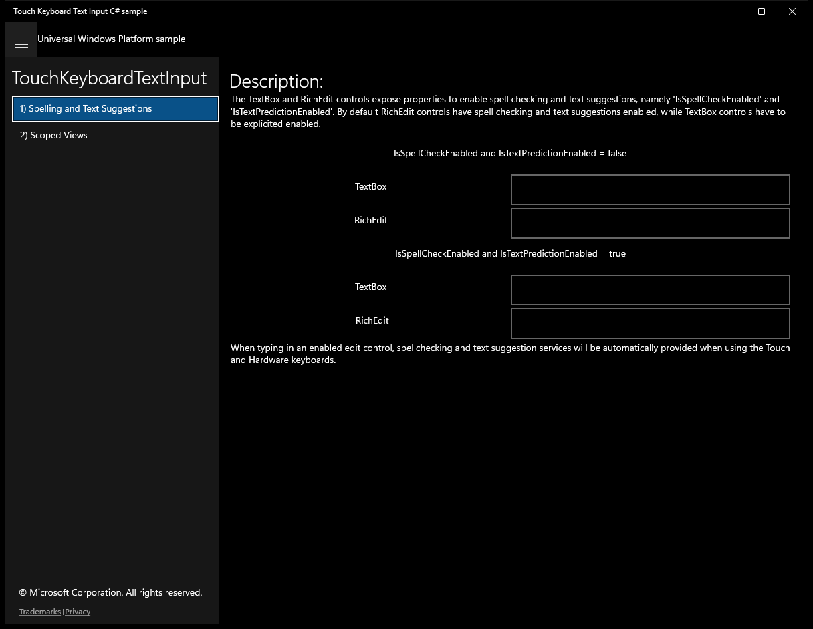
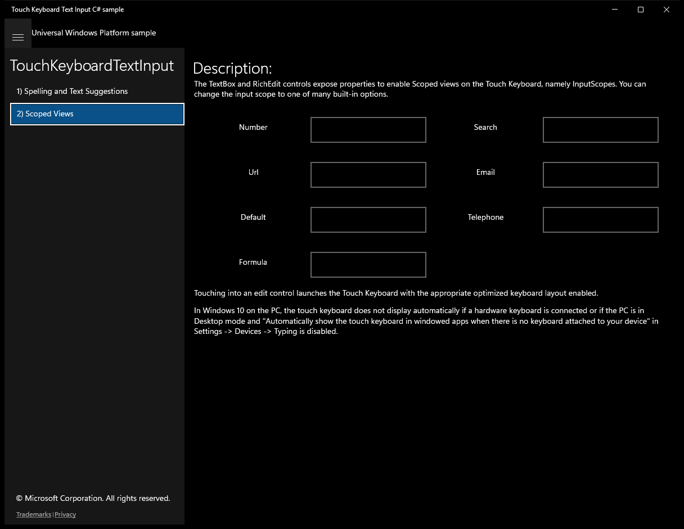

# TouchKeyboardTextInput (C#)

> **Source**: `Samples\TouchKeyboardTextInput\cs\`  
> **Feature**: TouchKeyboardTextInput  
> **AUMID**: `Microsoft.SDKSamples.TouchKeyboardTextInput.CS_8wekyb3d8bbwe!TouchKeyboardTextInput.App`  
> **PackageFamilyName**: `Microsoft.SDKSamples.TouchKeyboardTextInput.CS_8wekyb3d8bbwe`  

## Build / deploy / capture status
- build: ok
- deploy: ok
- launch: ok
- capture: ok
- uninstall: ok

## Main page

---

## Scenario 1 - Spelling and Text Suggestions

**Description**: The TextBox and RichEdit controls expose properties to enable spell checking and text suggestions, namely 'IsSpellCheckEnabled' and 'IsTextPredictionEnabled'. By default RichEdit controls have spell checking and text suggestions enabled, while TextBox controls have to be explicited enabled.

### UI elements
- **TextBlock**  - text="Description:"
- **TextBlock**  - text="IsSpellCheckEnabled and IsTextPredictionEnabled = false"
- **TextBlock**  - text="TextBox"
- **TextBox**  - x:Name="TextBoxOff"
- **TextBlock**  - text="RichEdit"
- **RichEditBox**  - x:Name="RichEditOff"
- **TextBlock**  - text="IsSpellCheckEnabled and IsTextPredictionEnabled = true"
- **TextBlock**  - text="TextBox"
- **TextBox**  - x:Name="TextBoxOn"
- **TextBlock**  - text=" RichEdit"
- **RichEditBox**  - x:Name="RichEditOn"
- **TextBlock**  - x:Name="OutputTextBlock1"; text="When typing in an enabled edit control, spellchecking and text suggestion services will be automatically provided when using the Touch and Hardware keyboards."

### Screenshots
Initial state:

---

## Scenario 2 - Scoped Views

**Description**: The TextBox and RichEdit controls expose properties to enable Scoped views on the Touch Keyboard, namely InputScopes. You can change the input scope to one of many built-in options.

### UI elements
- **TextBlock**  - text="Description:"
- **TextBlock**  - text="The TextBox and RichEdit controls expose properties to enable Scoped views on the Touch Keyboard, namely InputScopes. You can change the input scope to one of many built-in options."
- **TextBlock**  - text=" Number"
- **TextBox**  - x:Name="NumberControl"
- **TextBlock**  - text=" Search"
- **TextBox**  - x:Name="SearchControl"
- **TextBlock**  - text=" Url"
- **TextBox**  - x:Name="UrlControl"
- **TextBlock**  - text=" Email"
- **TextBox**  - x:Name="EmailControl"
- **TextBlock**  - text=" Default"
- **TextBox**  - x:Name="DefaultControl"
- **TextBlock**  - text=" Telephone"
- **TextBox**  - x:Name="TelephoneControl"
- **TextBlock**  - text=" Formula"
- **TextBox**  - x:Name="FormulaControl"
- **TextBlock**  - text="Touching into an edit control launches the Touch Keyboard with the appropriate optimized keyboard layout enabled."

### Screenshots
Initial state:

