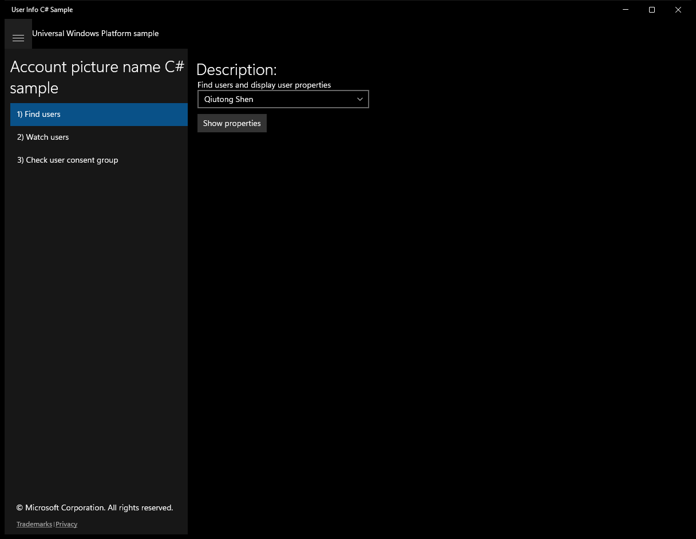
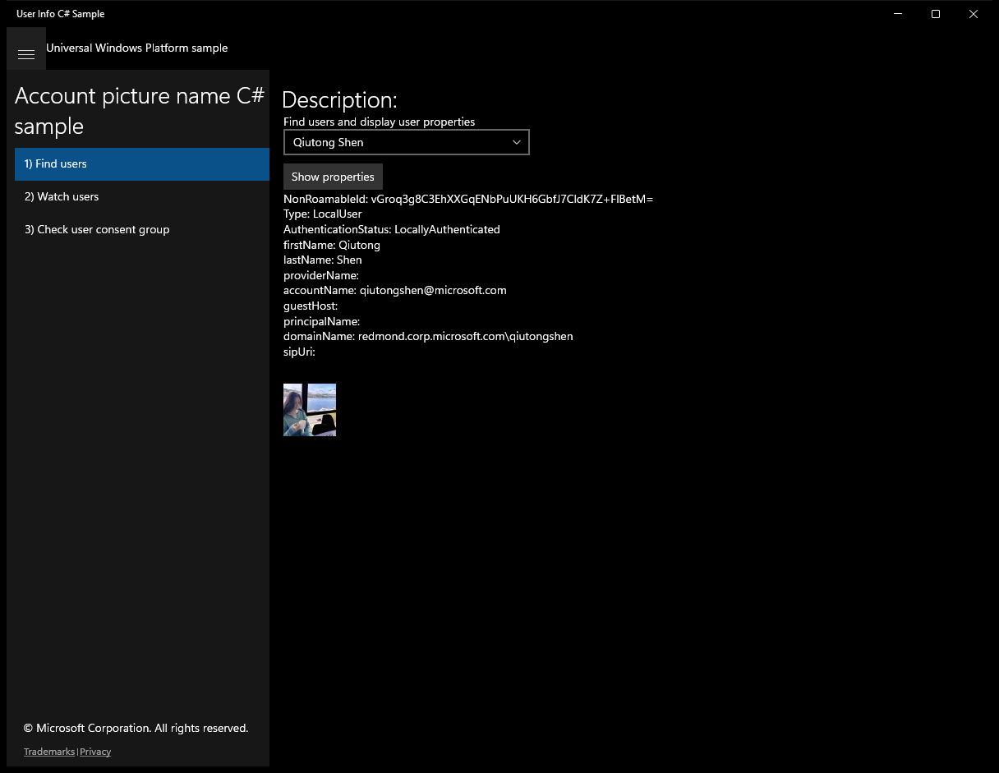
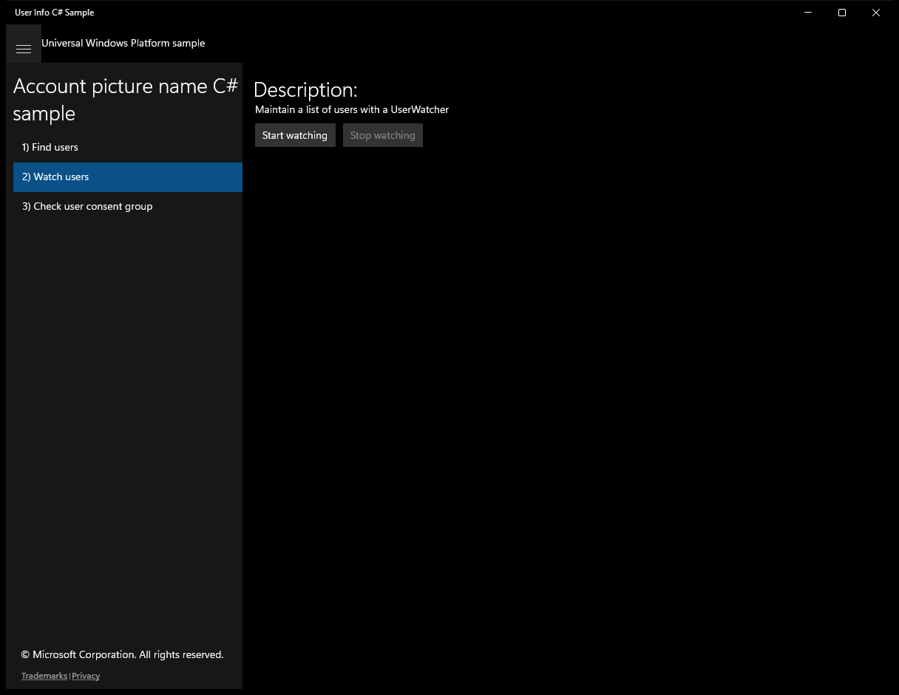
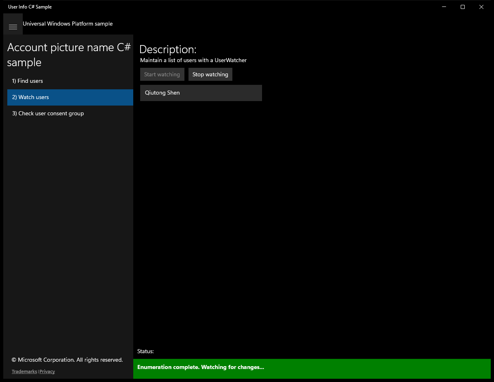
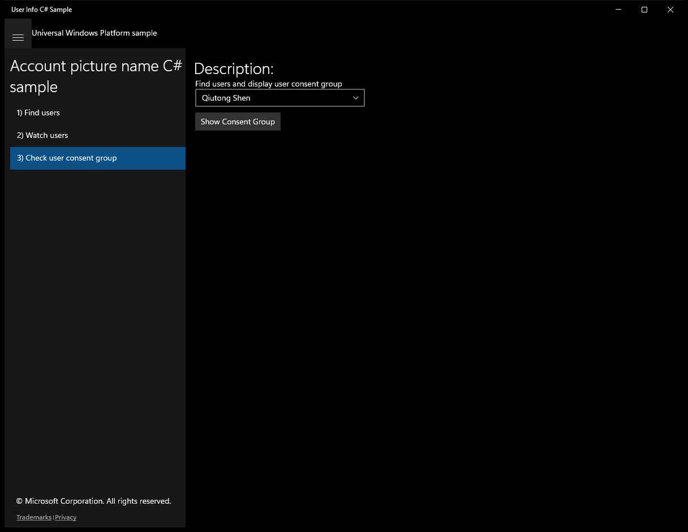
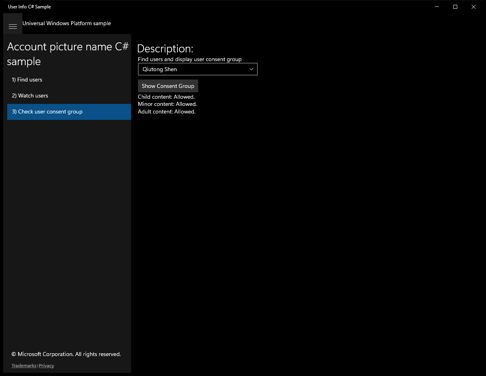

# UserInfo (C#)

> **Source**: `Samples\UserInfo\cs\`  
> **Feature**: Account picture name C# sample  
> **AUMID**: `Microsoft.SDKSamples.UserInfo.CS_8wekyb3d8bbwe!App`  
> **PackageFamilyName**: `Microsoft.SDKSamples.UserInfo.CS_8wekyb3d8bbwe`  

## Build / deploy / capture status
- build: ok
- deploy: ok
- launch: ok
- capture: ok
- uninstall: ok

## Main page

---

## Scenario 1 - Find users

**Description**: Find users and display user properties

### UI elements
- **TextBlock**  - text="Description:"
- **TextBlock**  - text="Find users and display user properties"
- **ComboBox**  - x:Name="UserList"
- **Button**  - content="Show properties"; events: Click={x:Bind ShowProperties}
- **TextBlock**  - x:Name="ResultsText"
- **Image**  - x:Name="ProfileImage"

### Code behavior
- **`OnNavigatedTo`**
    - API refs: `MainPage.Current`, `MainPage.GetUserViewModelsAsync`, `UserList.DataContext`, `UserList.SelectedIndex`
- **`ShowProperties`**
    - instantiates: `BitmapImage`
    - API refs: `UserList.SelectedValue`, `ResultsText.Text`, `ProfileImage.Source`, `NotifyType.StatusMessage`, `User.GetFromId`, `Type.ToString`, `AuthenticationStatus.ToString`, `KnownUserProperties.FirstName`, `KnownUserProperties.LastName`, `KnownUserProperties.ProviderName`, `KnownUserProperties.AccountName`, `KnownUserProperties.GuestHost`, `KnownUserProperties.PrincipalName`, `KnownUserProperties.DomainName`, `KnownUserProperties.SessionInitiationProtocolUri`, `UserPictureSize.Size64x64`, `NotifyType.ErrorMessage`

### Screenshots
Initial state:

After click **Show properties**:

---

## Scenario 2 - Watch users

**Description**: Maintain a list of users with a UserWatcher

### UI elements
- **TextBlock**  - text="Description:"
- **TextBlock**  - text="Maintain a list of users with a UserWatcher"
- **Button**  - x:Name="StartButton"; content="Start watching"; events: Click={x:Bind StartWatching}
- **Button**  - x:Name="StopButton"; content="Stop watching"; events: Click={x:Bind StopWatching}
- **ListBox**  - x:Name="UserList"

### Code behavior
- **`OnNavigatedTo`**
    - API refs: `MainPage.Current`
- **`StartWatching`**
    - API refs: `NotifyType.StatusMessage`, `Users.Clear`, `User.CreateWatcher`, `StartButton.IsEnabled`, `StopButton.IsEnabled`
- **`StopWatching`**
    - API refs: `Users.Clear`, `StartButton.IsEnabled`, `StopButton.IsEnabled`
- **`GetDisplayNameOrGenericNameAsync`**
    - API refs: `KnownUserProperties.DisplayName`, `String.IsNullOrEmpty`
- **`OnUserAdded`**
    - instantiates: `UserViewModel`
    - API refs: `Dispatcher.RunAsync`, `CoreDispatcherPriority.Low`, `Users.Add`
- **`OnUserUpdated`**
    - API refs: `Dispatcher.RunAsync`, `CoreDispatcherPriority.Low`
- **`OnUserRemoved`**
    - API refs: `Dispatcher.RunAsync`, `CoreDispatcherPriority.Low`, `Users.Remove`
- **`OnEnumerationCompleted`**
    - API refs: `Dispatcher.RunAsync`, `CoreDispatcherPriority.Low`, `NotifyType.StatusMessage`
- **`OnWatcherStopped`**
    - API refs: `Dispatcher.RunAsync`, `CoreDispatcherPriority.Low`

### Screenshots
Initial state:

After click **Start watching**:

---

## Scenario 3 - Check user consent group

**Description**: Find users and display user consent group

### UI elements
- **TextBlock**  - text="Description:"
- **TextBlock**  - text="Find users and display user consent group"
- **ComboBox**  - x:Name="UserList"
- **Button**  - content="Show Consent Group"; events: Click={x:Bind ShowConsentGroups}
- **TextBlock**  - x:Name="ResultsText"
- **Image**  - x:Name="ProfileImage"

### Code behavior
- **`OnNavigatedTo`**
    - API refs: `MainPage.GetUserViewModelsAsync`, `UserList.DataContext`, `UserList.SelectedIndex`
- **`EvaluateConsentResult`**
    - API refs: `UserAgeConsentResult.Included`, `UserAgeConsentResult.NotEnforced`, `UserAgeConsentResult.NotIncluded`, `UserAgeConsentResult.Unknown`, `UserAgeConsentResult.Ambiguous`
- **`ShowConsentGroups`**
    - API refs: `UserList.SelectedValue`, `ResultsText.Text`, `NotifyType.StatusMessage`, `User.GetFromId`, `UserAgeConsentGroup.Child`, `UserAgeConsentGroup.Minor`, `UserAgeConsentGroup.Adult`, `NotifyType.ErrorMessage`

### Screenshots
Initial state:

After click **Show Consent Group**:

