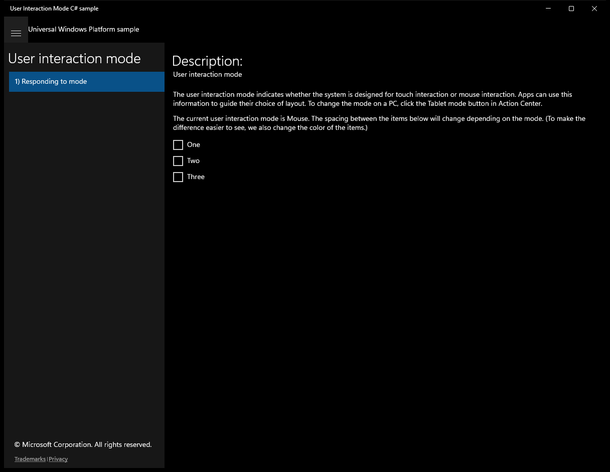
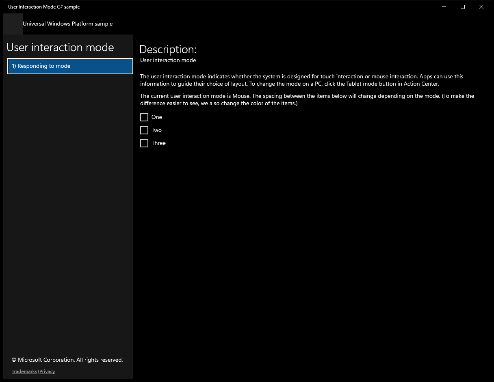

# UserInteractionMode (C#)

> **Source**: `Samples\UserInteractionMode\cs\`  
> **Feature**: User interaction mode  
> **AUMID**: `Microsoft.SDKSamples.UserInteractionMode.CS_8wekyb3d8bbwe!UserInteractionMode.App`  
> **PackageFamilyName**: `Microsoft.SDKSamples.UserInteractionMode.CS_8wekyb3d8bbwe`  

## Sample purpose
Shows how to detect and respond to the user interaction mode.

## Scenarios demonstrated (from README)
- Retrieving the current user interaction mode.
- Responding to changes in the user interaction mode.

## Build / deploy / capture status
- build: skipped
- deploy: ok
- launch: ok
- capture: ok
- uninstall: ok

## Main page

---

## Scenario 1 - Responding to mode

**Description**: User interaction mode

### UI elements
- **TextBlock**  - text="Description:"
- **TextBlock**  - text="User interaction mode"
- **TextBlock**  - text="The current user interaction mode is . The spacing between the items below will change depending on the mode. (To make the difference easier to see, we also change the color of the items.)"

### Code behavior
- **`OnNavigatedTo`**
    - API refs: `MainPage.Current`, `Window.Current`
- **`OnNavigatedFrom`**
    - API refs: `Window.Current`
- **`UpdateContent`**
    - API refs: `UIViewSettings.GetForCurrentView`, `UserInteractionMode.Mouse`

### Screenshots
Initial state:

