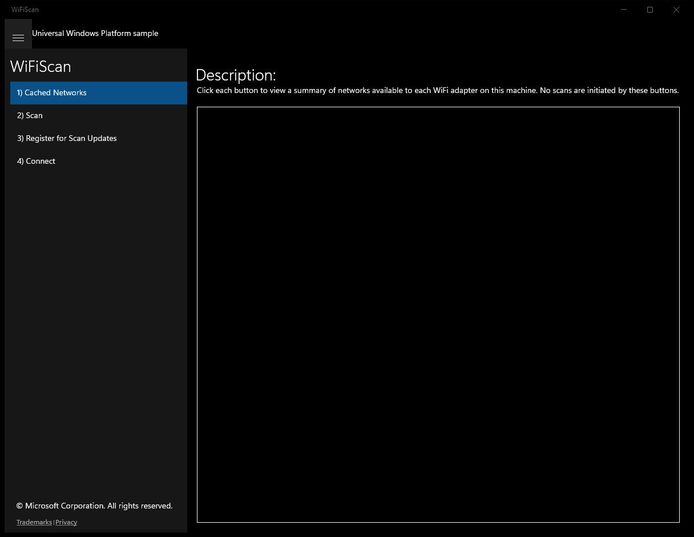
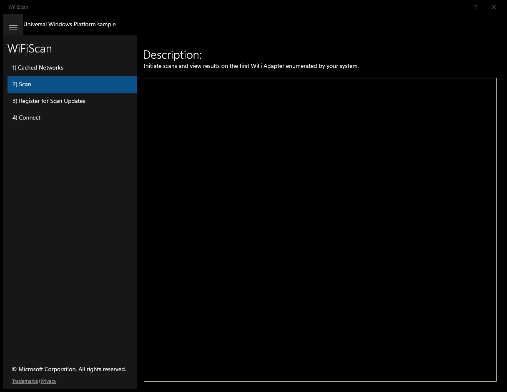
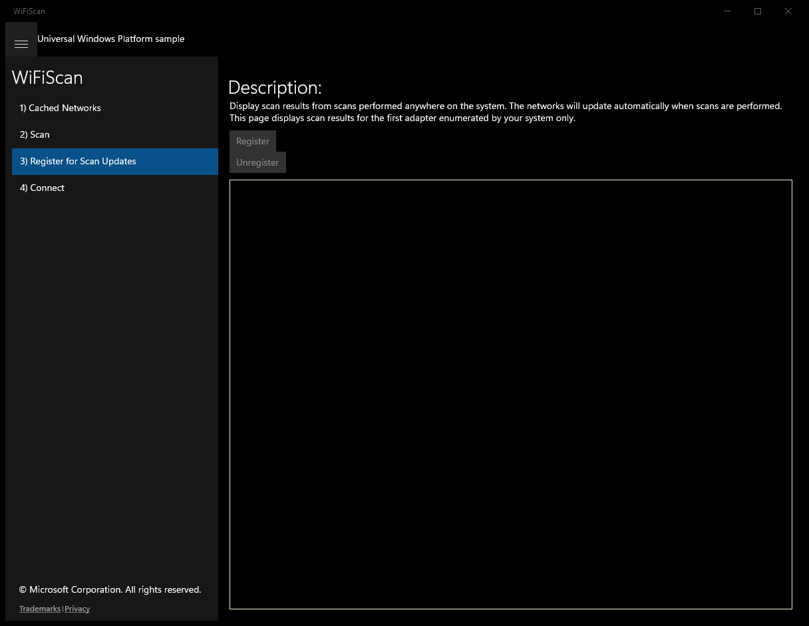
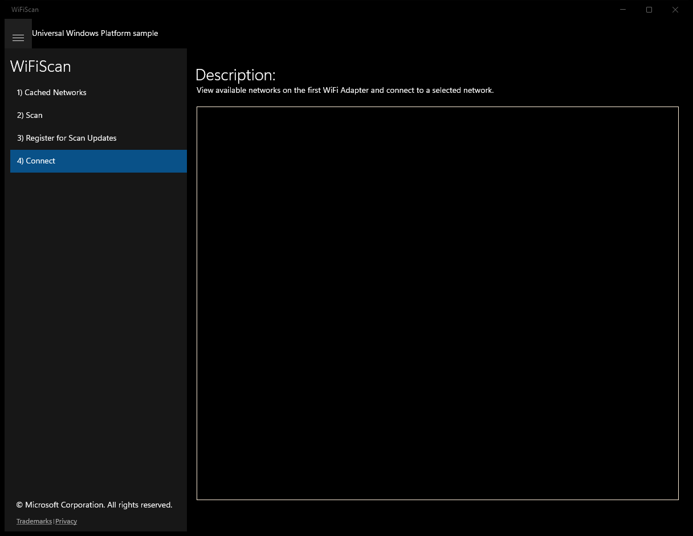

# WiFiScan (C#)

> **Source**: `Samples\WiFiScan\cs\`  
> **Feature**: WiFiScan  
> **AUMID**: `Microsoft.SDKSamples.WiFiScan.CS_8wekyb3d8bbwe!App`  
> **PackageFamilyName**: `Microsoft.SDKSamples.WiFiScan.CS_8wekyb3d8bbwe`  

## Top-level UWP namespaces used
- `Windows.Devices.Enumeration.DeviceInformation.FindAllAsync`

## Build / deploy / capture status
- build: ok
- deploy: ok
- launch: ok
- capture: ok
- uninstall: ok

## Main page

---

## Scenario 1 - Cached Networks

**Description**: Click each button to view a summary of networks available to each WiFi adapter on this machine. No scans are initiated by these buttons.

### UI elements
- **TextBlock**  - text="Ssid:"
- **TextBlock**  - text="{Binding Path=Ssid}"
- **TextBlock**  - text="Bssid:"
- **TextBlock**  - text="{Binding Path=Bssid}"
- **TextBlock**  - text="Rssi:"
- **TextBlock**  - text="{Binding Path=Rssi}"
- **TextBlock**  - text="Ch. Frequency:"
- **TextBlock**  - text="{Binding Path=ChannelCenterFrequency}"
- **TextBlock**  - text="{Binding Path=SecuritySettings}"
- **TextBlock**  - text="{Binding Path=ConnectivityLevel}"
- **TextBlock**  - text="Description:"
- **TextBlock**  - text="Click each button to view a summary of networks available to each WiFi adapter on this machine. No scans are initiated by these buttons."
- **ListView**  - x:Name="ResultsListView"

### Code behavior
- **`OnNavigatedTo`**
    - instantiates: `ObservableCollection`, `Button`
    - API refs: `MainPage.Current`, `WiFiAdapter.RequestAccessAsync`, `WiFiAccessStatus.Allowed`, `NotifyType.ErrorMessage`, `WiFiAdapter.FindAllAdaptersAsync`, `String.Format`, `Buttons.Children`
- **`DisplayNetworkReport`**
    - instantiates: `WiFiNetworkDisplay`
    - API refs: `NotifyType.StatusMessage`, `ResultCollection.Clear`, `ResultCollection.Add`

### Screenshots
Initial state:

---

## Scenario 2 - Scan

**Description**: Initiate scans and view results on the first WiFi Adapter enumerated by your system.

### UI elements
- **TextBlock**  - text="Ssid:"
- **TextBlock**  - text="{Binding Path=Ssid}"
- **TextBlock**  - text="Bssid:"
- **TextBlock**  - text="{Binding Path=Bssid}"
- **TextBlock**  - text="Rssi:"
- **TextBlock**  - text="{Binding Path=Rssi}"
- **TextBlock**  - text="Ch. Frequency:"
- **TextBlock**  - text="{Binding Path=ChannelCenterFrequency}"
- **TextBlock**  - text="{Binding Path=SecuritySettings}"
- **TextBlock**  - text="{Binding Path=ConnectivityLevel}"
- **TextBlock**  - text="Description:"
- **TextBlock**  - text="Initiate scans and view results on the first WiFi Adapter enumerated by your system."
- **ListView**  - x:Name="ResultsListView"

### Code behavior
- **`OnNavigatedTo`**
    - namespaces: `Windows.Devices.Enumeration.DeviceInformation.FindAllAsync`
    - instantiates: `ObservableCollection`, `Button`
    - API refs: `MainPage.Current`, `WiFiAdapter.RequestAccessAsync`, `WiFiAccessStatus.Allowed`, `NotifyType.ErrorMessage`, `Windows.Devices`, `Enumeration.DeviceInformation`, `WiFiAdapter.GetDeviceSelector`, `WiFiAdapter.FromIdAsync`, `Buttons.Children`
- **`DisplayNetworkReport`**
    - instantiates: `WiFiNetworkDisplay`
    - API refs: `NotifyType.StatusMessage`, `ResultCollection.Clear`, `ResultCollection.Add`

### Screenshots
Initial state:

---

## Scenario 3 - Register for Scan Updates

**Description**: Display scan results from scans performed anywhere on the system. The networks will update automatically when scans are performed. This page displays scan results for the first adapter enumerated by your system only.

### UI elements
- **TextBlock**  - text="Ssid:"
- **TextBlock**  - text="{Binding Path=Ssid}"
- **TextBlock**  - text="Bssid:"
- **TextBlock**  - text="{Binding Path=Bssid}"
- **TextBlock**  - text="Rssi:"
- **TextBlock**  - text="{Binding Path=Rssi}"
- **TextBlock**  - text="Ch. Frequency:"
- **TextBlock**  - text="{Binding Path=ChannelCenterFrequency}"
- **TextBlock**  - text="{Binding Path=SecuritySettings}"
- **TextBlock**  - text="{Binding Path=ConnectivityLevel}"
- **TextBlock**  - text="Description:"
- **Button**  - name="RegisterButton"; content="Register"; events: Click=Button_Click_Register
- **Button**  - name="UnregisterButton"; content="Unregister"; events: Click=Button_Click_Unregister
- **ListView**  - x:Name="ResultsListView"

### Code behavior
- **`OnNavigatedTo`**
    - namespaces: `Windows.Devices.Enumeration.DeviceInformation.FindAllAsync`
    - instantiates: `ObservableCollection`
    - API refs: `MainPage.Current`, `WiFiAdapter.RequestAccessAsync`, `WiFiAccessStatus.Allowed`, `NotifyType.ErrorMessage`, `Windows.Devices`, `Enumeration.DeviceInformation`, `WiFiAdapter.GetDeviceSelector`, `WiFiAdapter.FromIdAsync`, `RegisterButton.IsEnabled`
- **`DisplayNetworkReport`**
    - instantiates: `WiFiNetworkDisplay`
    - API refs: `Dispatcher.RunAsync`, `CoreDispatcherPriority.Normal`, `NotifyType.StatusMessage`, `ResultCollection.Clear`, `ResultCollection.Add`
- **`Button_Click_Register`**
    - API refs: `RegisterButton.IsEnabled`, `UnregisterButton.IsEnabled`
- **`Button_Click_Unregister`**
    - API refs: `UnregisterButton.IsEnabled`, `RegisterButton.IsEnabled`

### Screenshots
Initial state:

---

## Scenario 4 - Connect

### UI elements
- **TextBlock**  - text="Ssid:"
- **TextBlock**  - text="{Binding Path=Ssid}"
- **TextBlock**  - text="Bssid:"
- **TextBlock**  - text="{Binding Path=Bssid}"
- **TextBlock**  - text="Rssi:"
- **TextBlock**  - text="{Binding Path=Rssi}"
- **TextBlock**  - text="Ch. Frequency:"
- **TextBlock**  - text="{Binding Path=ChannelCenterFrequency}"
- **TextBlock**  - text="{Binding Path=SecuritySettings}"
- **TextBlock**  - text="{Binding Path=ConnectivityLevel}"
- **TextBlock**  - text="Description:"
- **TextBlock**  - text="View available networks on the first WiFi Adapter and connect to a selected network."
- **ListView**  - x:Name="ResultsListView"; events: SelectionChanged=ResultsListView_SelectionChanged
- **TextBlock**  - text="Security Key:"
- **PasswordBox**  - x:Name="NetworkKey"
- **CheckBox**  - x:Name="IsAutomaticReconnection"
- **Button**  - text="Connect"; events: Click=ConnectButton_Click

### Code behavior
- **`OnNavigatedTo`**
    - namespaces: `Windows.Devices.Enumeration.DeviceInformation.FindAllAsync`
    - instantiates: `ObservableCollection`, `Button`
    - API refs: `MainPage.Current`, `WiFiAdapter.RequestAccessAsync`, `WiFiAccessStatus.Allowed`, `NotifyType.ErrorMessage`, `Windows.Devices`, `Enumeration.DeviceInformation`, `WiFiAdapter.GetDeviceSelector`, `WiFiAdapter.FromIdAsync`, `Buttons.Children`, `NetworkInformation.NetworkStatusChanged`
- **`UpdateConnectivityStatusAsync`**
    - API refs: `NetworkAdapter.GetConnectedProfileAsync`, `ProfileName.Equals`, `Dispatcher.RunAsync`, `CoreDispatcherPriority.Normal`, `NotifyType.StatusMessage`
- **`ScanButton_Click`**
    - API refs: `ConnectionBar.Visibility`, `Visibility.Collapsed`
- **`DisplayNetworkReport`**
    - instantiates: `WiFiNetworkDisplay`
    - API refs: `NotifyType.StatusMessage`, `ResultCollection.Clear`, `ResultCollection.Add`
- **`ResultsListView_SelectionChanged`**
    - API refs: `ResultsListView.SelectedItem`, `ConnectionBar.Visibility`, `Visibility.Visible`, `AvailableNetwork.SecuritySettings`, `NetworkAuthenticationType.Open80211`, `NetworkEncryptionType.None`, `NetworkKeyInfo.Visibility`, `Visibility.Collapsed`
- **`ConnectButton_Click`**
    - instantiates: `PasswordCredential`
    - API refs: `ResultsListView.SelectedItem`, `NotifyType.ErrorMessage`, `WiFiReconnectionKind.Manual`, `IsAutomaticReconnection.IsChecked`, `WiFiReconnectionKind.Automatic`, `AvailableNetwork.SecuritySettings`, `NetworkAuthenticationType.Open80211`, `NetworkEncryptionType.None`, `Credential.Password`, `System.ArgumentException`, `NetworkKey.Password`, `WiFiConnectionStatus.Success`, `NotifyType.StatusMessage`

### Screenshots
Initial state:

