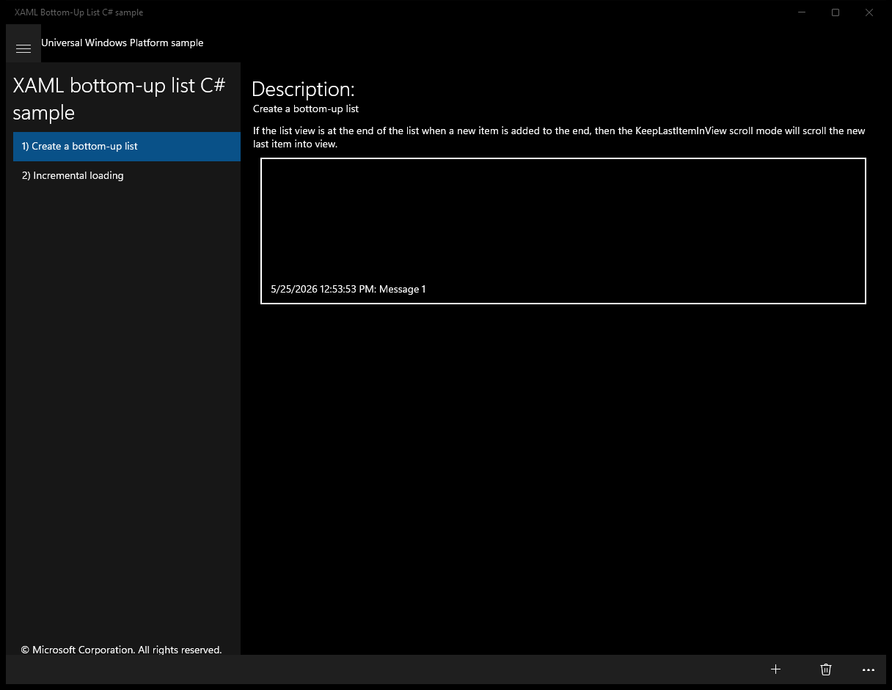
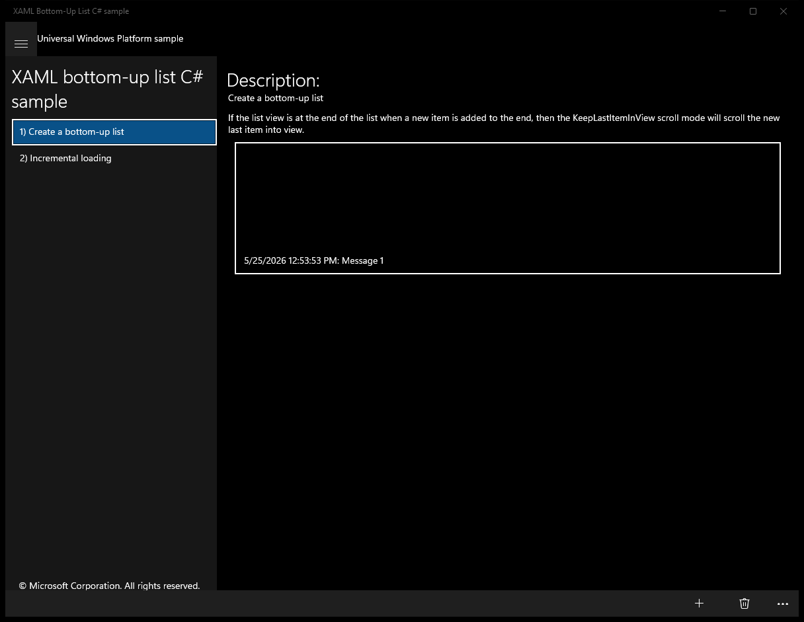
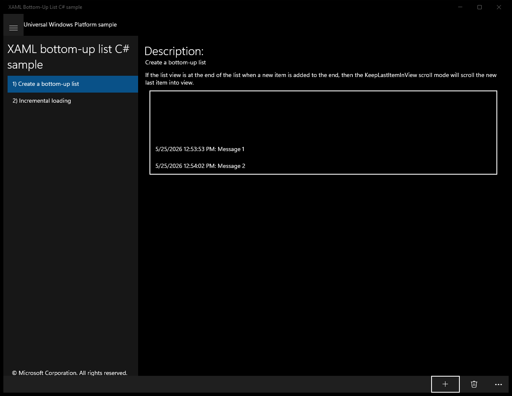
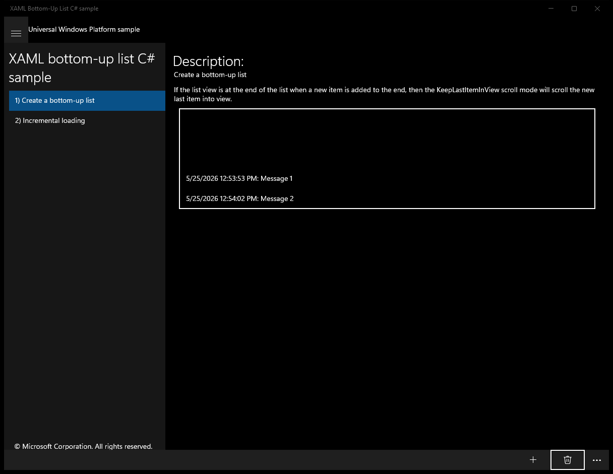
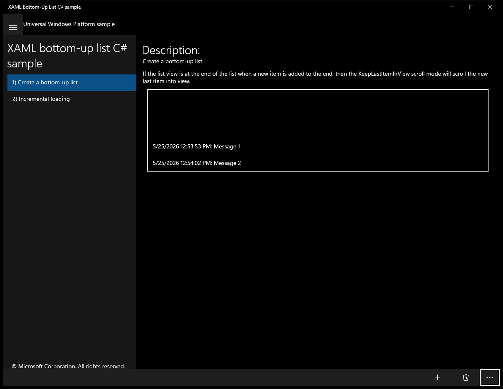
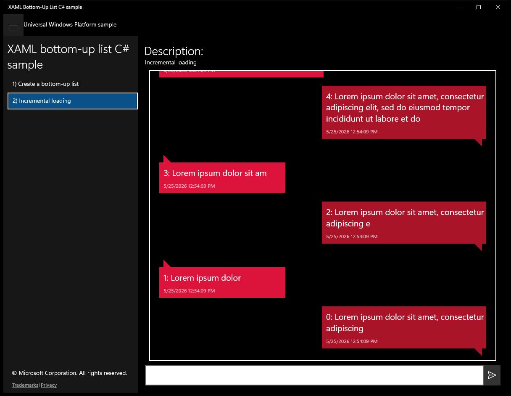

# XamlBottomUpList (C#)

> **Source**: `Samples\XamlBottomUpList\cs\`  
> **Feature**: XAML bottom-up list C# sample  
> **AUMID**: `Microsoft.SDKSamples.XamlBottomUpList.CS_8wekyb3d8bbwe!XamlBottomUpList.App`  
> **PackageFamilyName**: `Microsoft.SDKSamples.XamlBottomUpList.CS_8wekyb3d8bbwe`  

## Sample purpose
Shows a ListView that is tailored for scenarios in which the last item is the most interesting.

## Scenarios demonstrated (from README)
- Set the ItemsStackPanel.ItemsUpdatingScrollMode property to KeepLastItemInView
- Save and restore the scroll position.
- Add older items to the top of the list incrementally.
- Manually trigger the ISupportIncrementalLoading.LoadMoreAsync method

## Top-level UWP namespaces used
- `Windows.UI.Xaml.HorizontalAlignment.Right`
- `Windows.UI.Xaml.HorizontalAlignment.Left`

## Build / deploy / capture status
- build: skipped
- deploy: ok
- launch: ok
- capture: ok
- uninstall: ok

## Main page

---

## Scenario 1 - Create a bottom-up list

### UI elements
- **TextBlock**  - text="Description:"
- **TextBlock**  - text="Create a bottom-up list"
- **TextBlock**  - text="If the list view is at the end of the list when a new item is added to the end, then the KeepLastItemInView scroll mode will scroll the new last item into view."
- **ListView**  - x:Name="BottomUpList"
- **AppBarButton**  - events: Click={x:Bind AddItemToEnd}
- **AppBarButton**  - events: Click={x:Bind DeleteSelectedItem}
- **AppBarButton**  - events: Click={x:Bind SaveScrollPosition}
- **AppBarButton**  - events: Click={x:Bind RestoreScrollPosition}

### Code behavior
- **`AddItemToEnd`**
    - API refs: `BottomUpList.Items`, `DateTime.Now`
- **`DeleteSelectedItem`**
    - API refs: `BottomUpList.SelectedIndex`, `BottomUpList.Items`, `BottomUpList.SelectedItem`
- **`SaveScrollPosition`**
    - API refs: `ListViewPersistenceHelper.GetRelativeScrollPosition`
- **`RestoreScrollPosition`**
    - API refs: `ListViewPersistenceHelper.SetRelativeScrollPositionAsync`, `Task.FromResult`

### Screenshots
Initial state:

After click **Add**:

After click **Delete**:

After click **More app bar** (popup: PopupHost):

After click **More app bar**:

---

## Scenario 2 - Incremental loading

### UI elements
- **TextBlock**  - text="Description:"
- **TextBlock**  - text="Incremental loading"
- **TextBlock**  - text="{x:Bind Body}"
- **TextBlock**  - text="{x:Bind DisplayTime}"
- **TextBox**  - x:Name="MessageTextBox"; events: KeyUp=MessageTextBox_KeyUp
- **Button**  - events: Click={x:Bind SendTextMessage}

### Code behavior
- **`LoadMoreItemsAsync`**
    - instantiates: `LoadMoreItemsResult`
    - API refs: `Task.FromResult`
- **`CreateMessages`**
    - instantiates: `TextMessage`
    - API refs: `DateTime.Now`
- **`TextMessage`**
    - API refs: `DateTime.Now`
- **`ChatListView`**
    - API refs: `IncrementalLoadingTrigger.None`
- **`ProcessDataVirtualizationScrollOffsetsAsync`**
    - API refs: `Items.Count`, `Math.Max`
- **`UpdateRunningAverageContainerHeight`**
    - API refs: `ItemContainer.DesiredSize`, `ItemContainer.Content`
- **`SendTextMessage`**
    - API refs: `MessageTextBox.Text`, `DateTime.Now`, `Task.Delay`, `TimeSpan.FromSeconds`, `Conversation.CreateRandomMessage`
    - updates UI: `MessageTextBox.Text`
- **`OnChatViewContainerContentChanging`**
    - namespaces: `Windows.UI.Xaml.HorizontalAlignment.Right`, `Windows.UI.Xaml.HorizontalAlignment.Left`
    - API refs: `ItemContainer.HorizontalAlignment`, `Windows.UI`, `Xaml.HorizontalAlignment`
- **`MessageTextBox_KeyUp`**
    - API refs: `VirtualKey.Enter`

### Screenshots
Initial state:

