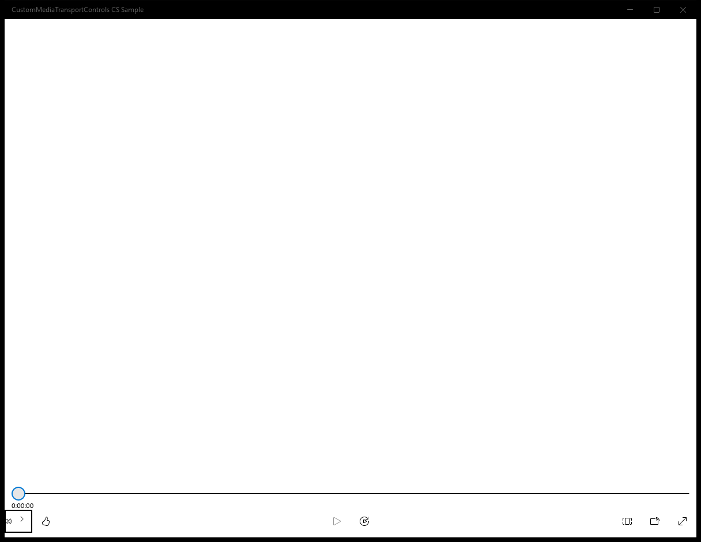
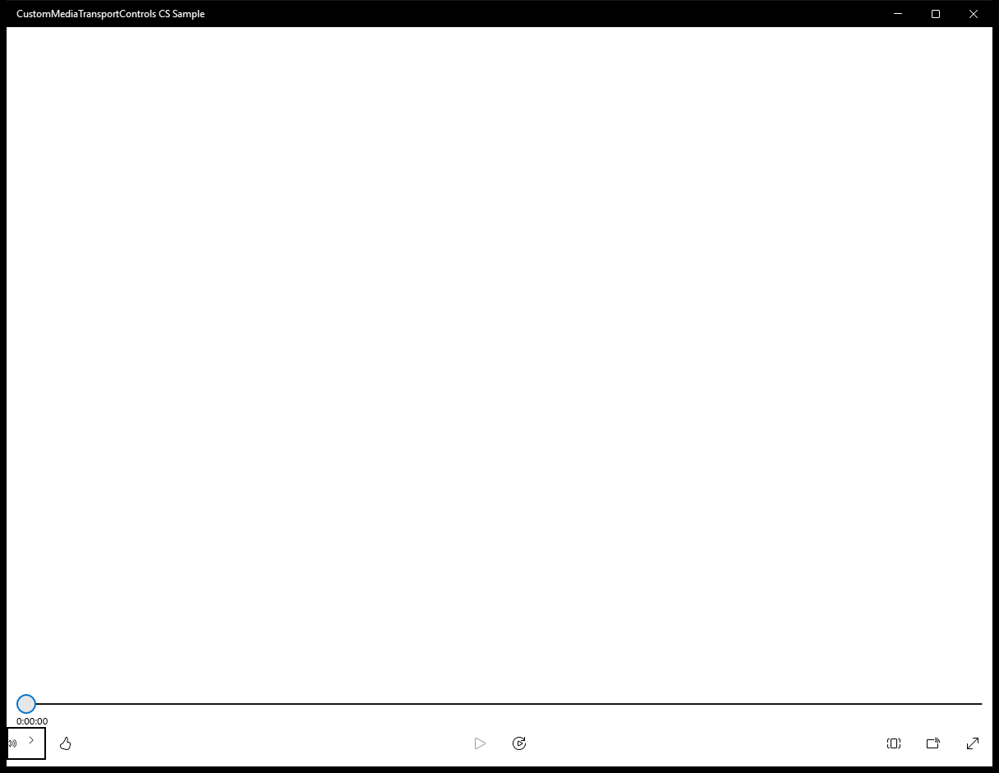
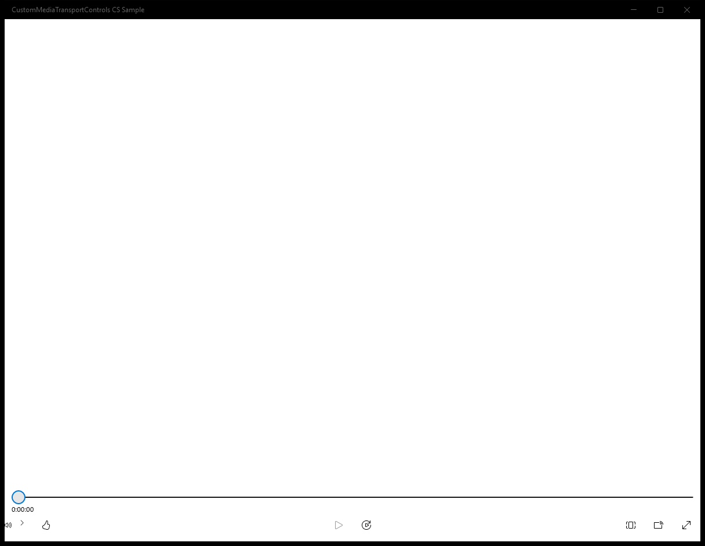
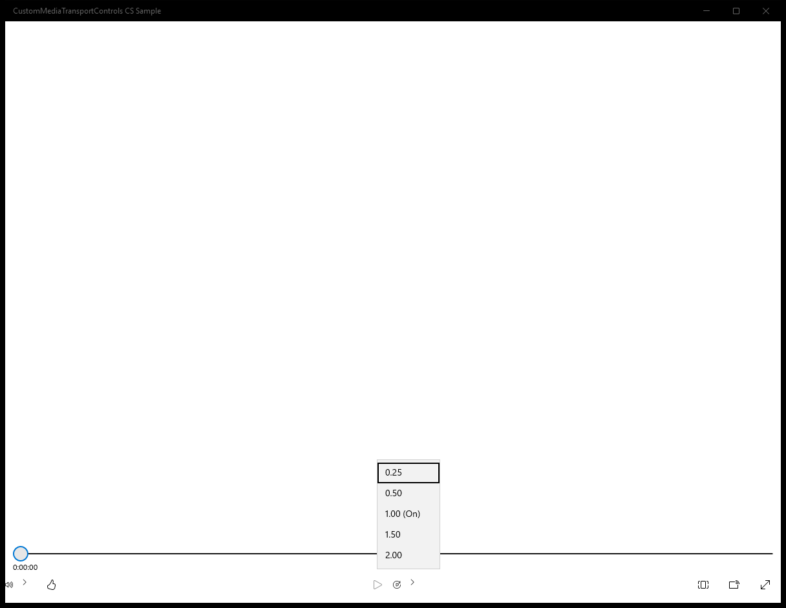
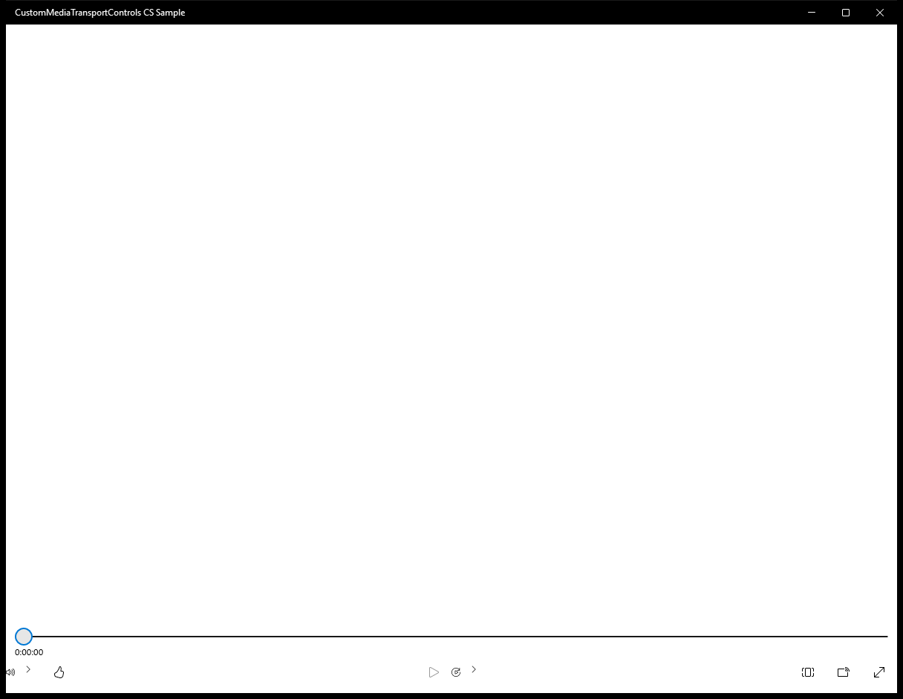
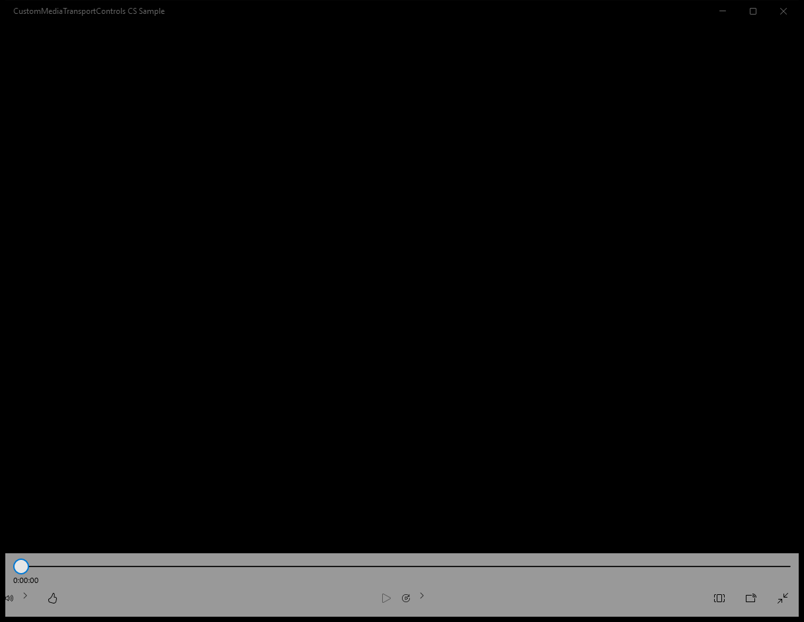

#  (C#)

> **Source**: `Samples\\cs\`  
> **AUMID**: `Microsoft.SDKSamples.CustomMediaControls.CS_8wekyb3d8bbwe!App`  
> **PackageFamilyName**: `Microsoft.SDKSamples.CustomMediaControls.CS_8wekyb3d8bbwe`  

## Sample purpose
Shows how to create customized media transport controls for the MediaPlayerElement control in your XAML Windows App.

## Scenarios demonstrated (from README)
- **Set up the custom template:** Add a new template to the Themes/generic.xaml folder and create a custom template. Add a class called CustomMediaTransportControls.cs
- **Add a custom button:** In generic.xaml, add a custom button to the CommandBar, show how to reference it, and make it useable in CustomMediaTransportControls.cs
- **Change the color of the slider:** Add references in app.xaml for a custom brush used to change the color of the media slider

## Build / deploy / capture status
- build: skipped
- deploy: ok
- launch: ok
- capture: ok-generic
- uninstall: ok

## Main page

---

## MainPage (generic)

This sample did not expose a standard scenario list. Captures below come from a generic enumeration of buttons / list items / hyperlinks on the main page.

### Interaction captures
Initial state:

After click **Button: Volume**:

After click **Button: Like**:

After click **Button: Show playback rate list**:

After click **Button: Aspect Ratio**:

After click **Button: Cast to Device**:

After click **Button: Full Screen**:

