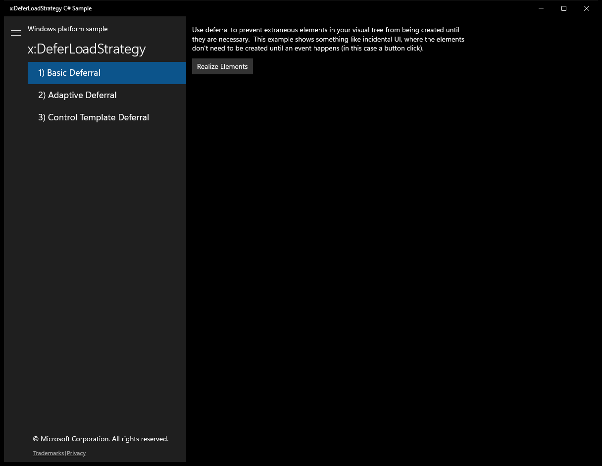
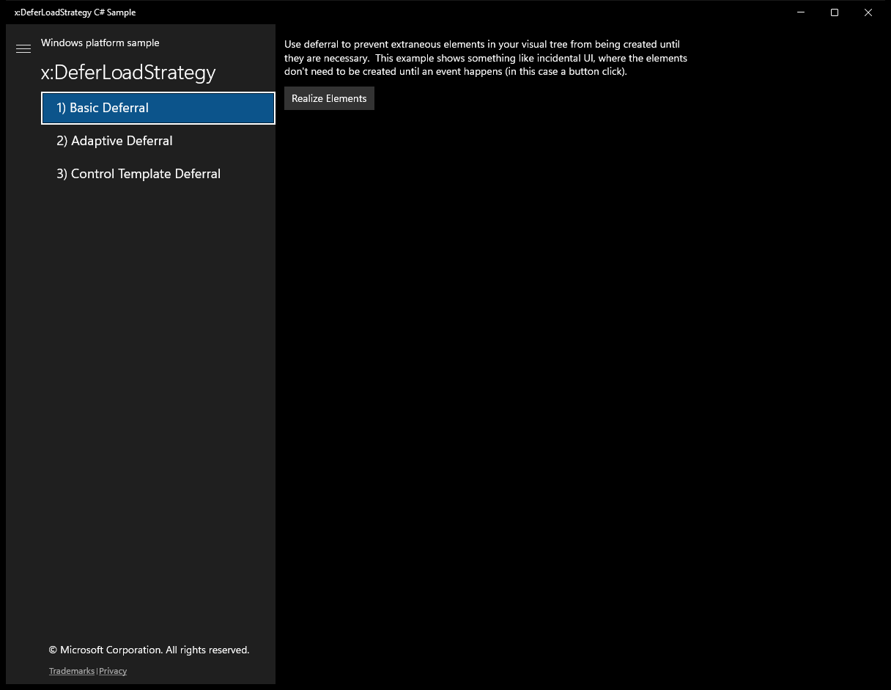
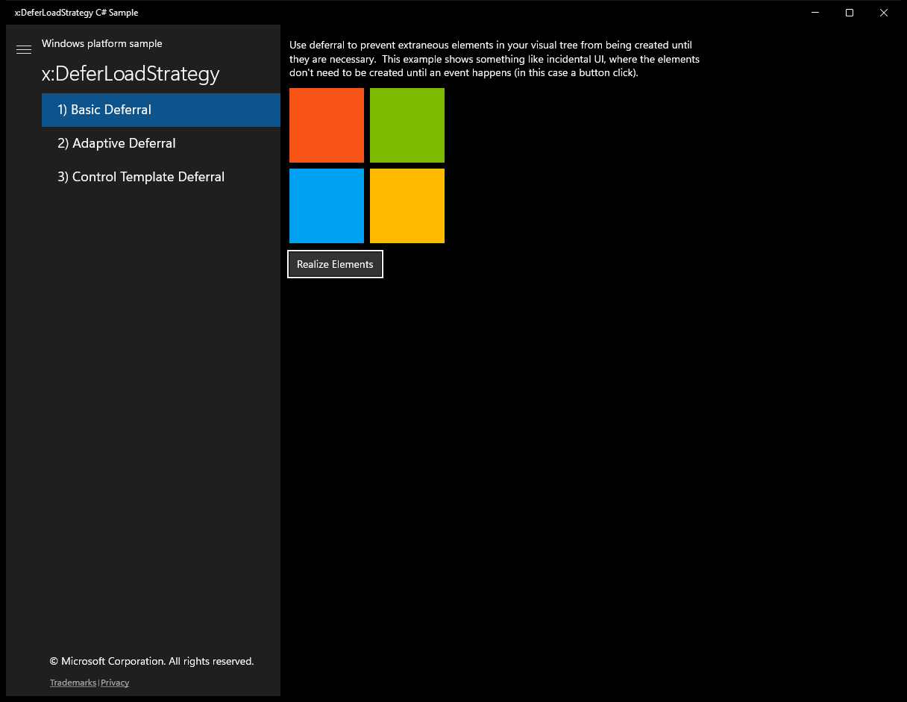
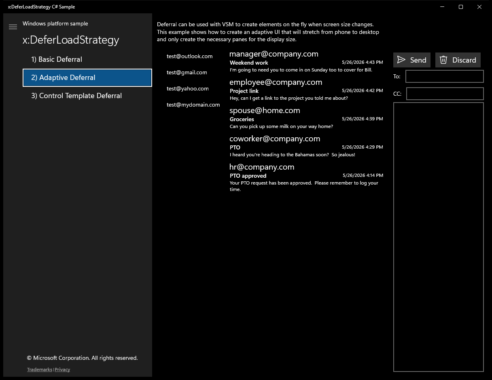
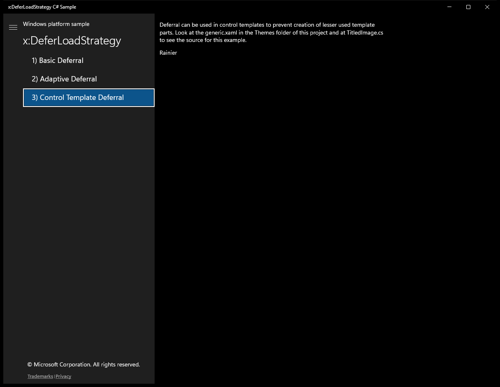

# XamlDeferLoadStrategy (C#)

> **Source**: `Samples\XamlDeferLoadStrategy\cs\`  
> **Feature**: x:DeferLoadStrategy  
> **AUMID**: `Microsoft.SDKSamples.xDeferLoadStrategy.CS_8wekyb3d8bbwe!App`  
> **PackageFamilyName**: `Microsoft.SDKSamples.xDeferLoadStrategy.CS_8wekyb3d8bbwe`  

## Top-level UWP namespaces used
- `Windows.System.Launcher.LaunchUriAsync`

## Build / deploy / capture status
- build: ok
- deploy: ok
- launch: ok
- capture: ok
- uninstall: ok

## Main page

---

## Scenario 1 - 1) Basic Deferral

### Screenshots
Initial state:

After click **Realize Elements**:

---

## Scenario 2 - 2) Adaptive Deferral

### Screenshots
Initial state:

---

## Scenario 3 - 3) Control Template Deferral

### Screenshots
Initial state:

---

## MainPage (static analysis)

This sample is a single-page app (no scenario list). The MainPage covers the entire functionality.

### UI elements
- **Image**  - x:Name="WindowsLogo"
- **TextBlock**  - x:Name="Header"; text="Windows platform sample"
- **TextBlock**  - x:Name="SampleTitle"; text="Sample Title Here"
- **ListBox**  - x:Name="ScenarioControl"; events: SelectionChanged=ScenarioControl_SelectionChanged
- **TextBlock**  - text="{Binding Converter={StaticResource ScenarioConverter}}"
- **TextBlock**  - x:Name="Copyright"; text="© Microsoft Corporation. All rights reserved."
- **HyperlinkButton**  - content="Trademarks"; events: Click=Footer_Click
- **TextBlock**  - text="|"
- **HyperlinkButton**  - x:Name="PrivacyLink"; content="Privacy"; events: Click=Footer_Click
- **ToggleButton**  - events: Click=Button_Click

### Code behavior
- **`MainPage`**
    - API refs: `SampleTitle.Text`
- **`OnNavigatedTo`**
    - API refs: `ScenarioControl.ItemsSource`, `Window.Current`, `Bounds.Width`, `ScenarioControl.SelectedIndex`
- **`ScenarioControl_SelectionChanged`**
    - API refs: `ScenarioFrame.Navigate`, `Window.Current`, `Bounds.Width`, `Splitter.IsPaneOpen`
- **`Footer_Click`**
    - namespaces: `Windows.System.Launcher.LaunchUriAsync`
    - instantiates: `Uri`
    - API refs: `Windows.System`, `Launcher.LaunchUriAsync`, `Tag.ToString`
- **`Button_Click`**
    - API refs: `Splitter.IsPaneOpen`
- **`Convert`**
    - API refs: `MainPage.Current`, `Scenarios.IndexOf`

