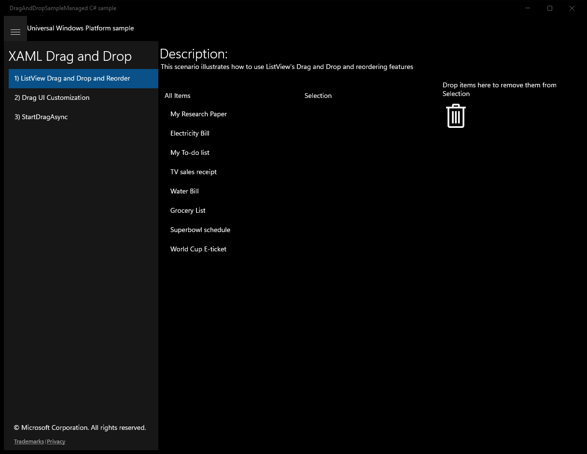
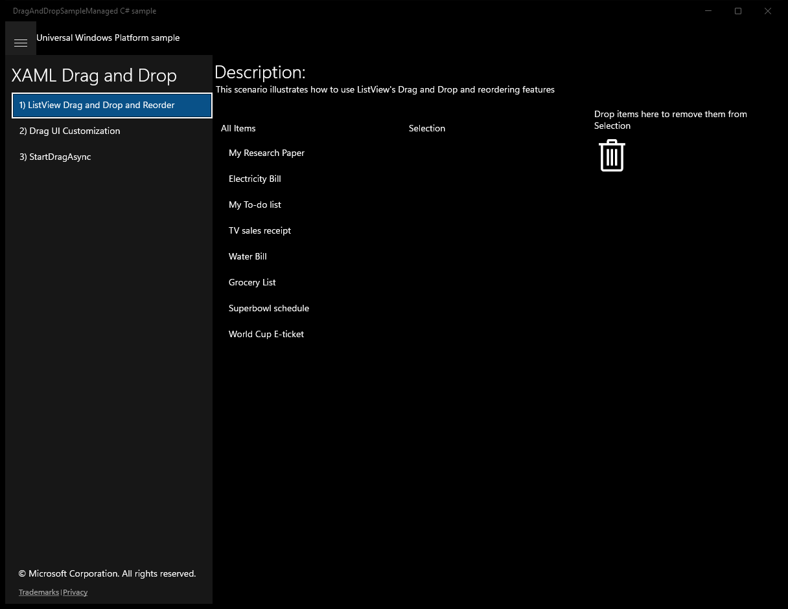
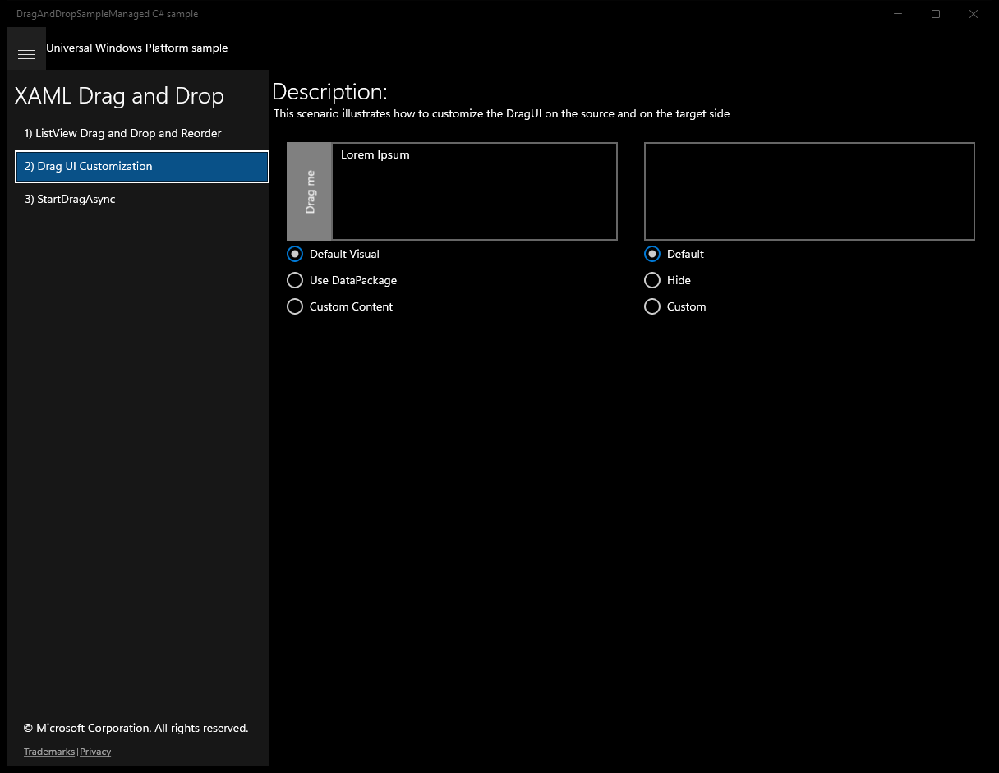
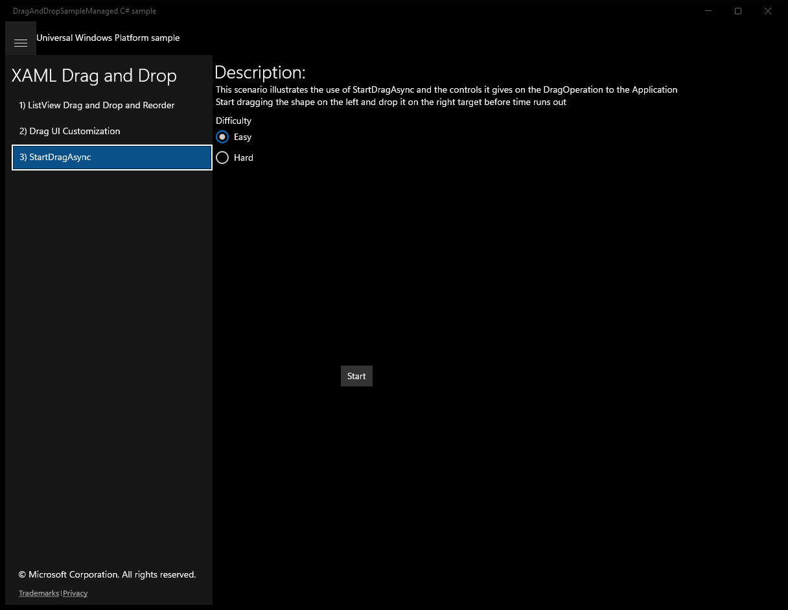

# XamlDragAndDrop (C#)

> **Source**: `Samples\XamlDragAndDrop\cs\`  
> **Feature**: XAML Drag and Drop  
> **AUMID**: `Microsoft.SDKSamples.DragAndDropSampleManaged.CS_8wekyb3d8bbwe!DragAndDropSampleManaged.App`  
> **PackageFamilyName**: `Microsoft.SDKSamples.DragAndDropSampleManaged.CS_8wekyb3d8bbwe`  

## Sample purpose
Shows how to enable Drag and Drop in a XAML Application.

## Scenarios demonstrated (from README)
- **Enable Drag and Drop of ListView items** ListView's Drag and Drop allows dropping information in the ListView, dragging items from a ListView to other targets (any kind of UIElement) or reordering items within the ListView. This sample shows a sample implementation of a ListView using all this features to allow the user to create a list of items entirely with Drag and Drop.
- **Customize the Drag and Drop UI** Both the source of a UIElement's Drag and Drop and the target of a Drag and Drop can customize the appearance of the Drag and Drop UI. This sample illustrates the different options for such customization.
- **Start Drag and Drop programmatically** UIElement's StartDragAsync allows a finer control of a Drag and Drop operation such as the gesture which triggers it or its possible cancellation. This sample shows how to call StartDragAsync and how to cancel the resulting Drag and Drop operation.

## Top-level UWP namespaces used
- `Windows.UI.Xaml.Visibility.Collapsed`
- `Windows.UI.Xaml.Visibility.Visible`

## Build / deploy / capture status
- build: skipped
- deploy: ok
- launch: ok
- capture: ok
- uninstall: ok

## Main page

---

## Scenario 1 - ListView Drag and Drop and Reorder

### UI elements
- **TextBlock**  - text="Description:"
- **TextBlock**  - text="This scenario illustrates how to use ListView's Drag and Drop and reordering features"
- **TextBlock**  - text="All Items"
- **ListView**  - x:Name="SourceListView"
- **TextBlock**  - text="Selection"
- **ListView**  - x:Name="TargetListView"
- **TextBlock**  - text="Drop items here to remove them from Selection"
- **TextBlock**  - x:Name="TargetTextBlock"; text=""

### Code behavior
- **`OnNavigatedTo`**
    - API refs: `MainPage.Current`
- **`SourceListView_DragItemsStarting`**
    - instantiates: `StringBuilder`
    - API refs: `Data.SetText`, `Data.RequestedOperation`, `DataPackageOperation.Copy`
- **`TargetListView_DragOver`**
    - API refs: `DataView.Contains`, `StandardDataFormats.Text`, `DataPackageOperation.Copy`, `DataPackageOperation.None`
- **`TargetListView_Drop`**
    - API refs: `DataPackageOperation.None`, `DataView.Contains`, `StandardDataFormats.Text`, `DataView.GetTextAsync`, `DataPackageOperation.Copy`
- **`TargetListView_DragItemsStarting`**
    - API refs: `Items.Count`, `Data.SetText`, `Data.RequestedOperation`, `DataPackageOperation.Move`
- **`TargetTextBlock_DragEnter`**
    - API refs: `DataView.Contains`, `StandardDataFormats.Text`, `DataPackageOperation.Move`, `DataPackageOperation.None`, `DragUIOverride.IsGlyphVisible`, `DragUIOverride.Caption`
- **`TargetTextBlock_Drop`**
    - API refs: `DataView.Contains`, `StandardDataFormats.Text`, `DataView.GetTextAsync`, `DataPackageOperation.Move`

### Screenshots
Initial state:

---

## Scenario 2 - Drag UI Customization

### UI elements
- **TextBlock**  - text="Description:"
- **TextBlock**  - text="This scenario illustrates how to customize the DragUI on the source and on the target side"
- **TextBlock**  - text="Drag me"
- **TextBox**  - x:Name="SourceTextBox"; text="Lorem Ipsum"
- **RadioButton**  - x:Name="SourceDefaultRB"; content="Default Visual"
- **RadioButton**  - x:Name="DataPackageRB"; content="Use DataPackage"
- **RadioButton**  - x:Name="CustomContentRB"; content="Custom Content"
- **TextBox**  - x:Name="TargetTextBox"
- **RadioButton**  - x:Name="TargetDefaultRB"; content="Default"
- **RadioButton**  - x:Name="HideRB"; content="Hide"
- **RadioButton**  - x:Name="CustomRB"; content="Custom"

### Code behavior
- **`SourceGrid_DragStarting`**
    - instantiates: `RenderTargetBitmap`
    - API refs: `Data.SetText`, `SourceTextBox.Text`, `DataPackageRB.IsChecked`, `DragUI.SetContentFromDataPackage`, `CustomContentRB.IsChecked`, `SoftwareBitmap.CreateCopyFromBuffer`, `BitmapPixelFormat.Bgra8`, `BitmapAlphaMode.Premultiplied`, `DragUI.SetContentFromSoftwareBitmap`
- **`TargetTextBox_DragEnter`**
    - instantiates: `BitmapImage`, `Uri`, `Point`
    - API refs: `VisualStateManager.GoToState`, `DataView.Contains`, `StandardDataFormats.Text`, `DataPackageOperation.Copy`, `DataPackageOperation.None`, `DragUIOverride.Caption`, `HideRB.IsChecked`, `DragUIOverride.IsGlyphVisible`, `DragUIOverride.IsContentVisible`, `CustomRB.IsChecked`, `UriKind.RelativeOrAbsolute`, `DragUIOverride.SetContentFromBitmapImage`, `DragUIOverride.IsCaptionVisible`
- **`TargetTextBox_DragLeave`**
    - API refs: `VisualStateManager.GoToState`
- **`TargetTextBox_Drop`**
    - API refs: `VisualStateManager.GoToState`, `DataView.Contains`, `StandardDataFormats.Text`, `DataPackageOperation.Copy`, `DataPackageOperation.None`, `DataView.GetTextAsync`, `TargetTextBox.Text`

### Screenshots
Initial state:

---

## Scenario 3 - StartDragAsync

### UI elements
- **TextBlock**  - text="Description:"
- **TextBlock**  - text="This scenario illustrates the use of StartDragAsync and the controls it gives on the DragOperation to the Application"
- **TextBlock**  - text="Start dragging the shape on the left and drop it on the right target before time runs out"
- **TextBlock**  - text="Difficulty"
- **RadioButton**  - x:Name="EasyRB"; content="Easy"
- **RadioButton**  - content="Hard"
- **Button**  - x:Name="StartButton"; content="Start"; events: Click=StartButton_Click
- **TextBlock**  - x:Name="SourceTextBlock"; events: DragStarting=SourceTextBlock_DragStarting
- **GridView**  - x:Name="DropGridView"
- **TextBlock**  - text="{Binding}"
- **TextBlock**  - x:Name="ResultTextBlock"

### Code behavior
- **`Scenario3_StartDragAsync_Loaded`**
    - instantiates: `Uri`, `ObservableCollection`
    - API refs: `UriKind.RelativeOrAbsolute`, `StorageFile.GetFileFromApplicationUriAsync`, `FileIO.ReadLinesAsync`, `DropGridView.ItemsSource`
- **`StartButton_Click`**
    - namespaces: `Windows.UI.Xaml.Visibility.Collapsed`, `Windows.UI.Xaml.Visibility.Visible`
    - instantiates: `DispatcherTimer`
    - API refs: `SourceTextBlock.Text`, `ResultTextBlock.Text`, `EasyRB.IsChecked`, `TimeSpan.FromSeconds`, `StartButton.Visibility`, `Windows.UI`, `Xaml.Visibility`, `SourceTextBlock.Visibility`
    - updates UI: `SourceTextBlock.Text`, `ResultTextBlock.Text`, `SourceTextBlock.Visibility`
- **`OnTick`**
    - API refs: `DataPackageOperation.None`
- **`SourceTextBlock_PointerMoved`**
    - API refs: `Pointer.IsInContact`, `SourceTextBlock.StartDragAsync`
- **`EndRound`**
    - namespaces: `Windows.UI.Xaml.Visibility.Visible`, `Windows.UI.Xaml.Visibility.Collapsed`
    - API refs: `ResultTextBlock.Text`, `StartButton.Visibility`, `Windows.UI`, `Xaml.Visibility`, `SourceTextBlock.Visibility`
    - updates UI: `ResultTextBlock.Text`, `SourceTextBlock.Visibility`
- **`DragCompleted`**
    - API refs: `AsyncStatus.Completed`, `DataPackageOperation.Copy`
- **`SourceTextBlock_DragStarting`**
    - API refs: `Data.RequestedOperation`, `DataPackageOperation.Copy`, `Data.SetText`
- **`DropBorder_DragEnter`**
    - API refs: `DataView.Contains`, `StandardDataFormats.Text`, `DataPackageOperation.Copy`, `DataPackageOperation.None`, `DragUIOverride.IsCaptionVisible`
- **`DropBorder_Drop`**
    - API refs: `DataView.Contains`, `StandardDataFormats.Text`, `DataPackageOperation.Copy`, `DataPackageOperation.None`

### Screenshots
Initial state:

