# XamlListView (C#)

> **Source**: `Samples\XamlListView\cs\`  
> **Feature**: ListView/GridView C# Sample  
> **AUMID**: `Microsoft.SDKSamples.ListView.CS_8wekyb3d8bbwe!App`  
> **PackageFamilyName**: `Microsoft.SDKSamples.ListView.CS_8wekyb3d8bbwe`  

## Sample purpose
Shows how to use the ListView and GridView controls.

## Scenarios demonstrated (from README)
- **Simple ListView Sample:** Shows how to implement a grouped ListView using the new x:Bind and x:Phase features.
- **Simple GridView Sample:** Shows how to implement a grouped GridView using the new x:Bind and x:Phase features.
- **Master/Details plus Selection Sample:** Shows how to implement a responsive master/details experience with a successful multiple selection experience.
- **Tap on the left edge of ListView:** Shows how to implement the behavior Tap on the left edge of ListView to going into multiple selection mode.
- **Restore Scroll Position Sample:** Shows how to restore a list's scrollviewer position when a user navigates away and back from a page. Implements the ListViewPersistenceHelper API.
- **Scroll into View Sample:** Shows how to scroll a specific item into view.

## Build / deploy / capture status
- build: skipped
- deploy: ok
- launch: ok
- capture: ok
- uninstall: ok

## Main page
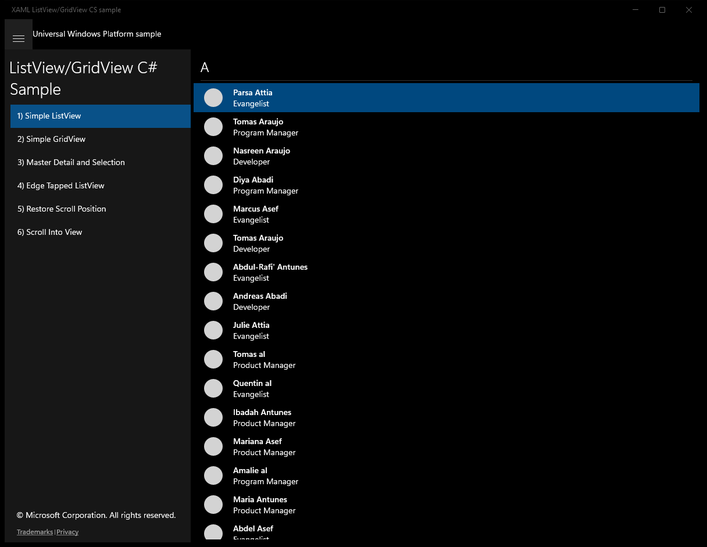

---

## Scenario 1 - Simple ListView

### UI elements
- **TextBlock**  - text="{x:Bind Name}"
- **TextBlock**  - text="{x:Bind Position}"
- **TextBlock**  - text="{x:Bind Key}"

### Screenshots
Initial state:

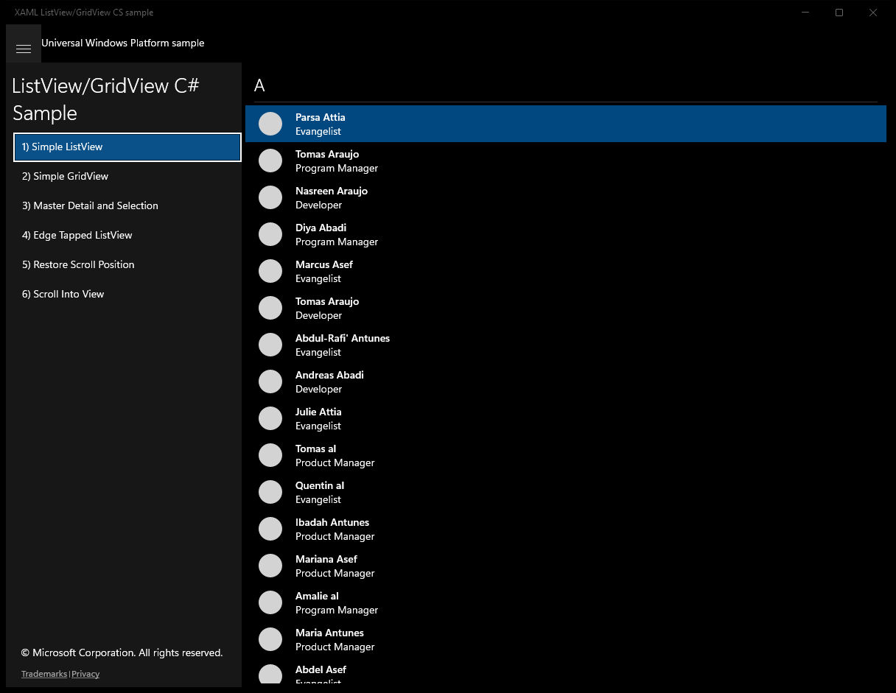

---

## Scenario 2 - Simple GridView

### UI elements
- **TextBlock**  - text="{x:Bind Name}"
- **TextBlock**  - text="{x:Bind Position}"
- **TextBlock**  - text="{x:Bind Key}"

### Screenshots
Initial state:

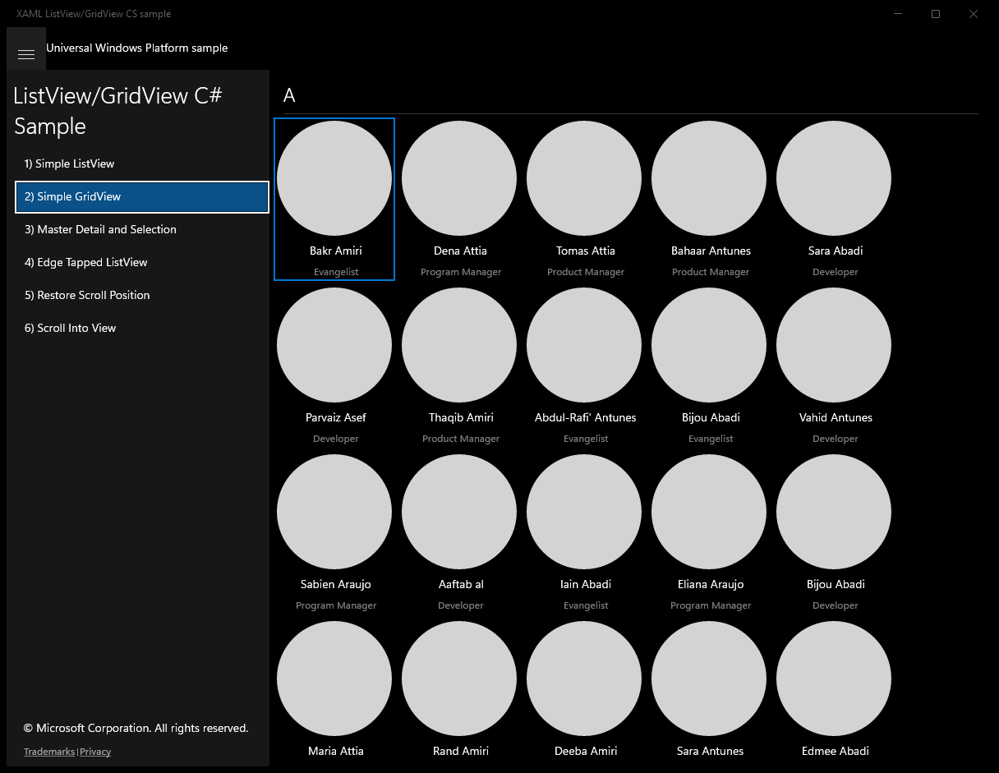

---

## Scenario 3 - Master Detail and Selection

### UI elements
- **AppBarButton**  - x:Name="SelectItemsBtn"; events: Click=SelectItems
- **AppBarButton**  - x:Name="AddItemBtn"; events: Click=AddItem
- **AppBarButton**  - x:Name="DeleteItemBtn"; events: Click=DeleteItem
- **AppBarButton**  - x:Name="DeleteItemsBtn"; events: Click=DeleteItems
- **AppBarButton**  - x:Name="CancelSelectionBtn"; events: Click=CancelSelection
- **TextBlock**  - text="{x:Bind Name}"
- **TextBlock**  - text="{x:Bind Position}"
- **TextBlock**  - text="Contacts"
- **ListView**  - x:Name="MasterListView"; events: ItemClick=OnItemClick, SelectionChanged=OnSelectionChanged
- **TextBlock**  - text="{x:Bind Name}"
- **TextBlock**  - text="{x:Bind Position}"
- **TextBlock**  - text="{x:Bind PhoneNumber}"
- **TextBlock**  - text="{x:Bind Biography}"

### Code behavior
- **`OnNavigatedTo`**
    - API refs: `Contacts.FirstOrDefault`, `MasterListView.SelectedItem`
- **`OnLoaded`**
    - instantiates: `InvalidOperationException`
    - API refs: `MasterListView.SelectedItem`, `Contacts.Count`, `MasterListView.SelectedIndex`, `PageSizeStatesGroup.CurrentState`, `VisualStateManager.GoToState`, `MasterState.Name`, `MasterDetailsState.Name`
- **`OnCurrentStateChanged`**
    - instantiates: `SuppressNavigationTransitionInfo`
    - API refs: `Frame.Navigate`, `MasterListView.SelectedItem`, `VisualStateManager.GoToState`, `MasterDetailsState.Name`, `MasterListView.SelectionMode`, `ListViewSelectionMode.Extended`, `EntranceNavigationTransitionInfo.SetIsTargetElement`
- **`OnSelectionChanged`**
    - API refs: `PageSizeStatesGroup.CurrentState`, `MasterListView.SelectedItems`, `MasterDetailsStatesGroup.CurrentState`, `VisualStateManager.GoToState`, `ExtendedSelectionState.Name`, `MasterDetailsState.Name`
- **`OnItemClick`**
    - instantiates: `DrillInNavigationTransitionInfo`
    - API refs: `MasterListView.SelectedItem`, `PageSizeStatesGroup.CurrentState`, `Frame.Navigate`
- **`EnableContentTransitions`**
    - instantiates: `EntranceThemeTransition`
    - API refs: `DetailContentPresenter.ContentTransitions`
- **`AddItem`**
    - API refs: `Contacts.Add`, `Contact.GetNewContact`, `MasterListView.SelectedIndex`, `DetailContentPresenter.Visibility`, `Visibility.Visible`
- **`SelectSomethingIfPossible`**
    - API refs: `Contacts.Count`, `MasterListView.SelectedIndex`, `DetailContentPresenter.Visibility`, `Visibility.Collapsed`
- **`DeleteItem`**
    - API refs: `MasterListView.SelectedIndex`, `Contacts.RemoveAt`, `Math.Min`, `Contacts.Count`
- **`DeleteItems`**
    - API refs: `MasterListView.SelectedIndex`, `Contacts.RemoveAt`
- **`SelectItems`**
    - API refs: `MasterListView.Items`, `VisualStateManager.GoToState`, `MultipleSelectionState.Name`
- **`CancelSelection`**
    - API refs: `PageSizeStatesGroup.CurrentState`, `VisualStateManager.GoToState`, `MasterState.Name`, `MasterDetailsState.Name`

### Screenshots
Initial state:

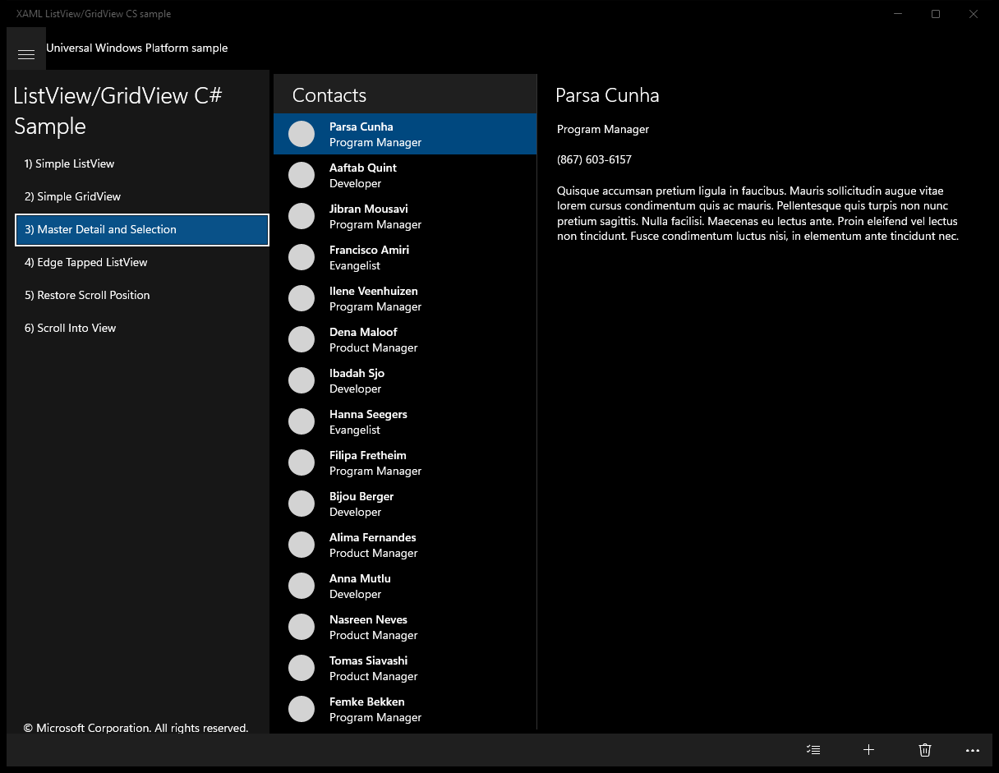

After click **Select Items**:

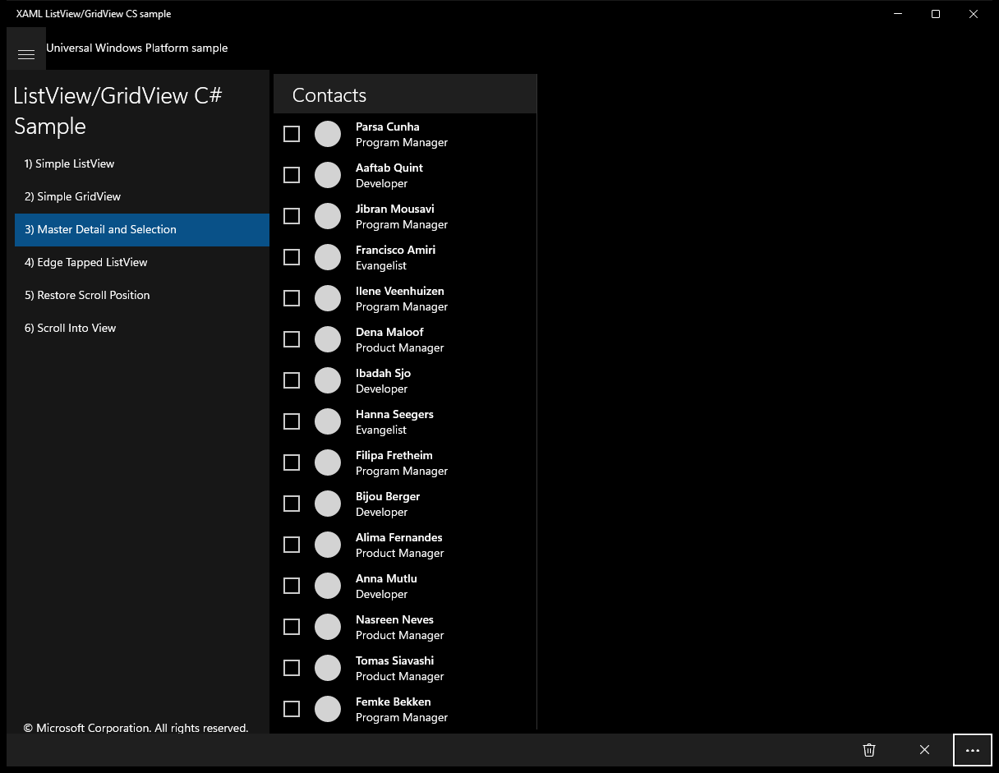

After click **Add Item**:

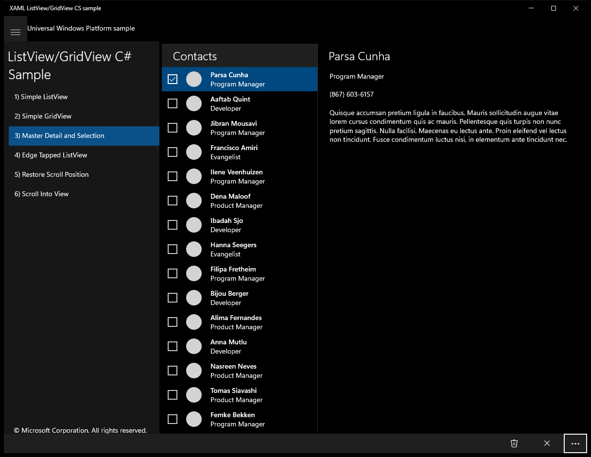

After click **Delete Item**:

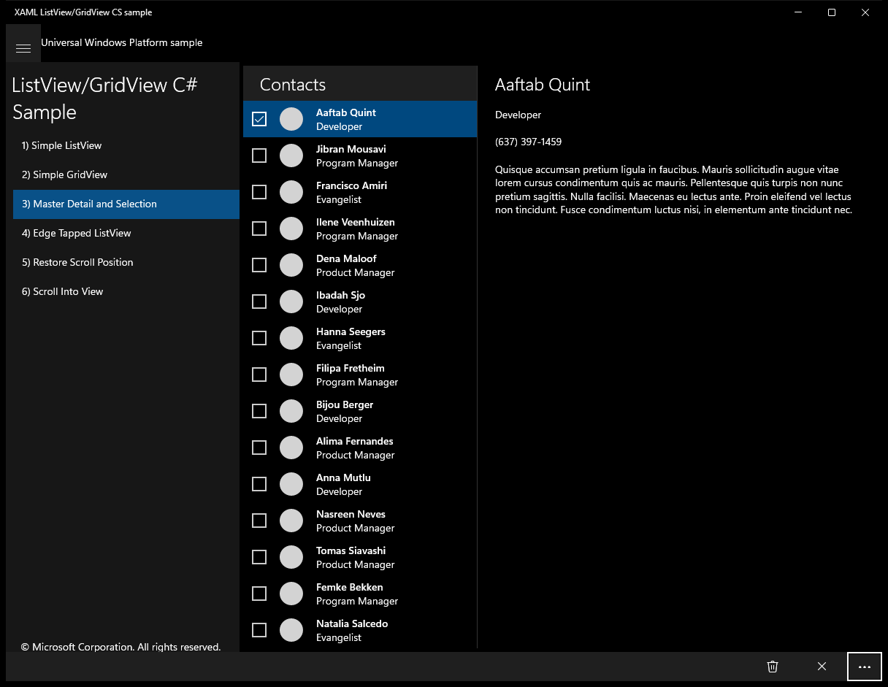

---

## Scenario 4 - Edge Tapped ListView

### UI elements
- **AppBarButton**  - x:Name="SelectAppBarBtn"; events: Click=SelectItems
- **AppBarButton**  - x:Name="AddItemAppBarBtn"; events: Click=AddItem
- **AppBarButton**  - x:Name="RemoveItemAppBarBtn"; events: Click=RemoveItem
- **AppBarButton**  - x:Name="CancelSelectionAppBarBtn"; events: Click=CancelSelection
- **TextBlock**  - text="{x:Bind Name}"
- **TextBlock**  - text="{x:Bind Position}"

### Code behavior
- **`OnNavigatedTo`**
    - API refs: `SystemNavigationManager.GetForCurrentView`
- **`OnNavigatedFrom`**
    - API refs: `SystemNavigationManager.GetForCurrentView`
- **`OnEdgeTapped`**
    - API refs: `MyListView.SelectionMode`, `ListViewSelectionMode.Multiple`, `MyListView.IsItemLeftEdgeTapEnabled`
- **`UpdateSelectionUI`**
    - API refs: `MyListView.SelectedItems`, `MyListView.SelectionMode`, `ListViewSelectionMode.None`, `MyListView.IsItemLeftEdgeTapEnabled`
- **`OnBackRequested`**
    - API refs: `MyListView.SelectionMode`, `ListViewSelectionMode.Multiple`, `MyListView.SelectedItems`
- **`SetCommandsVisibility`**
    - API refs: `ListViewSelectionMode.Multiple`, `SelectedItems.Count`, `SelectAppBarBtn.Visibility`, `Visibility.Collapsed`, `CancelSelectionAppBarBtn.Visibility`, `Visibility.Visible`, `AddItemAppBarBtn.Visibility`, `RemoveItemAppBarBtn.Visibility`, `SystemNavigationManager.GetForCurrentView`, `AppViewBackButtonVisibility.Visible`, `AppViewBackButtonVisibility.Collapsed`
- **`SelectItems`**
    - API refs: `MyListView.SelectionMode`, `ListViewSelectionMode.Multiple`, `MyListView.IsItemLeftEdgeTapEnabled`
- **`AddItem`**
    - API refs: `Contacts.Add`, `Contact.GetNewContact`
- **`RemoveItem`**
    - instantiates: `List`
    - API refs: `MyListView.SelectedIndex`, `MyListView.SelectedItems`, `Contacts.Remove`
- **`CancelSelection`**
    - API refs: `MyListView.SelectedItems`, `MyListView.SelectionMode`, `ListViewSelectionMode.None`, `MyListView.IsItemLeftEdgeTapEnabled`

### Screenshots
Initial state:

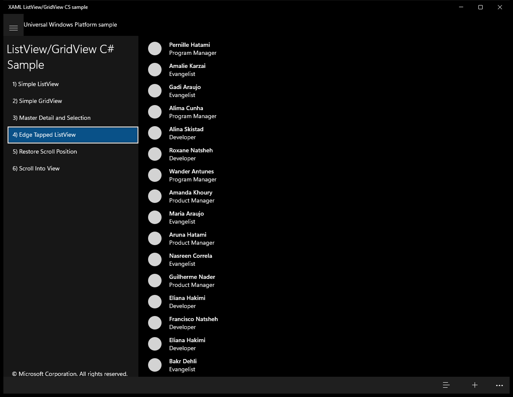

After click **Select**:

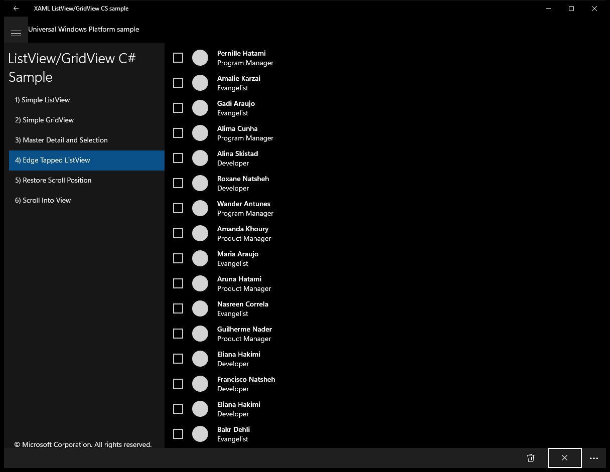

After click **Add Item**:

After click **More app bar**:

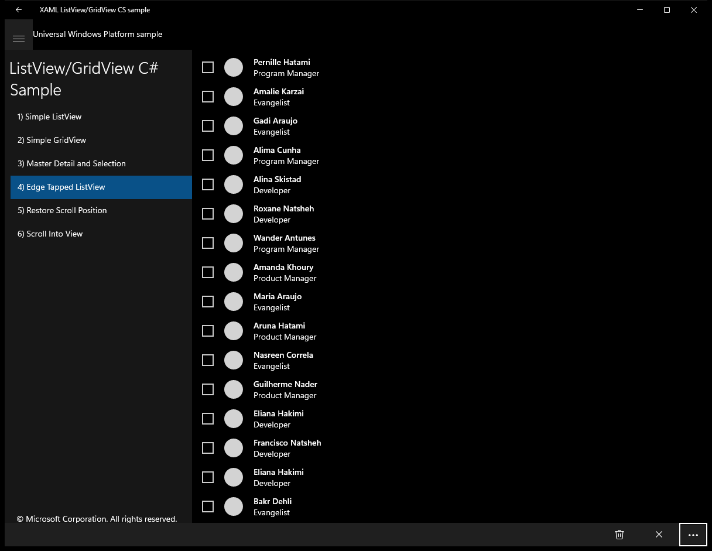

---

## Scenario 5 - Restore Scroll Position

### UI elements
- **TextBlock**  - text="When you navigate away from this scenario, then navigate back, it returns to the previous scroll position."
- **ListView**  - x:Name="ItemsListView"; events: ItemClick=ItemsListView_ItemClick
- **TextBlock**  - x:Name="IdLabel"; text="Id :"
- **TextBlock**  - text="{x:Bind Id}"

### Code behavior
- **`Page_Loaded`**
    - API refs: `ListViewPersistenceHelper.SetRelativeScrollPositionAsync`
- **`OnNavigatingFrom`**
    - API refs: `ListViewPersistenceHelper.GetRelativeScrollPosition`
- **`GetItem`**
    - API refs: `Task.Run`
- **`GetKey`**
    - API refs: `ItemsListView.ContainerFromItem`
- **`ItemsListView_ContainerContentChanging`**
    - API refs: `ItemContainer.Height`, `ItemContainer.ClearValue`
- **`ItemsListView_ItemClick`**
    - API refs: `Frame.Navigate`

### Screenshots
Initial state:

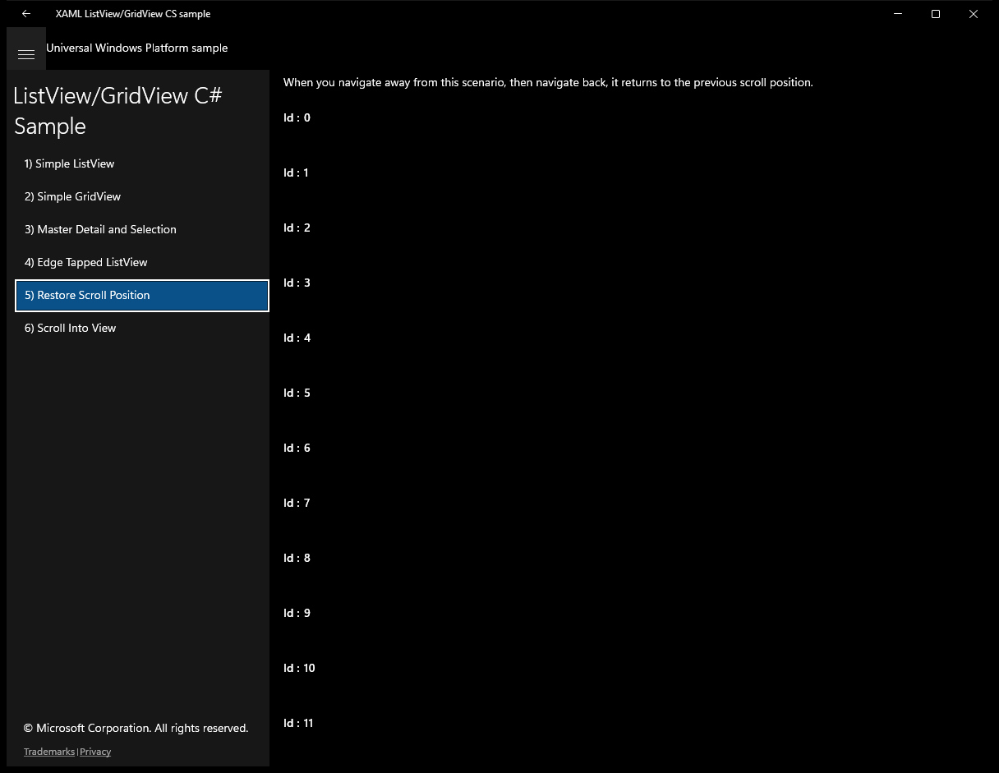

After click **Back**:

---

## Scenario 6 - Scroll Into View

### UI elements
- **TextBlock**  - text="By default, ScrollIntoView scrolls the minimum necessary to bring the item into view. Specifying an alignment of Leading aligns the item with the leading edge."
- **Button**  - x:Name="Scroll"; content="Scroll to position:"; events: Click=Scroll_Click
- **TextBox**  - x:Name="scrollId"; text="6"
- **TextBlock**  - text="Alignment:"
- **ComboBox**  - x:Name="ScrollAlignment"
- **ListView**  - x:Name="ItemsListView"
- **TextBlock**  - x:Name="IdLabel"; text="Id :"
- **TextBlock**  - text="{x:Bind Id}"

### Code behavior
- **`Scroll_Click`**
    - API refs: `Int32.TryParse`, `ItemsListView.Items`, `ScrollAlignment.SelectedItem`, `ItemsListView.ScrollIntoView`

### Screenshots
Initial state:

After click **Back**:

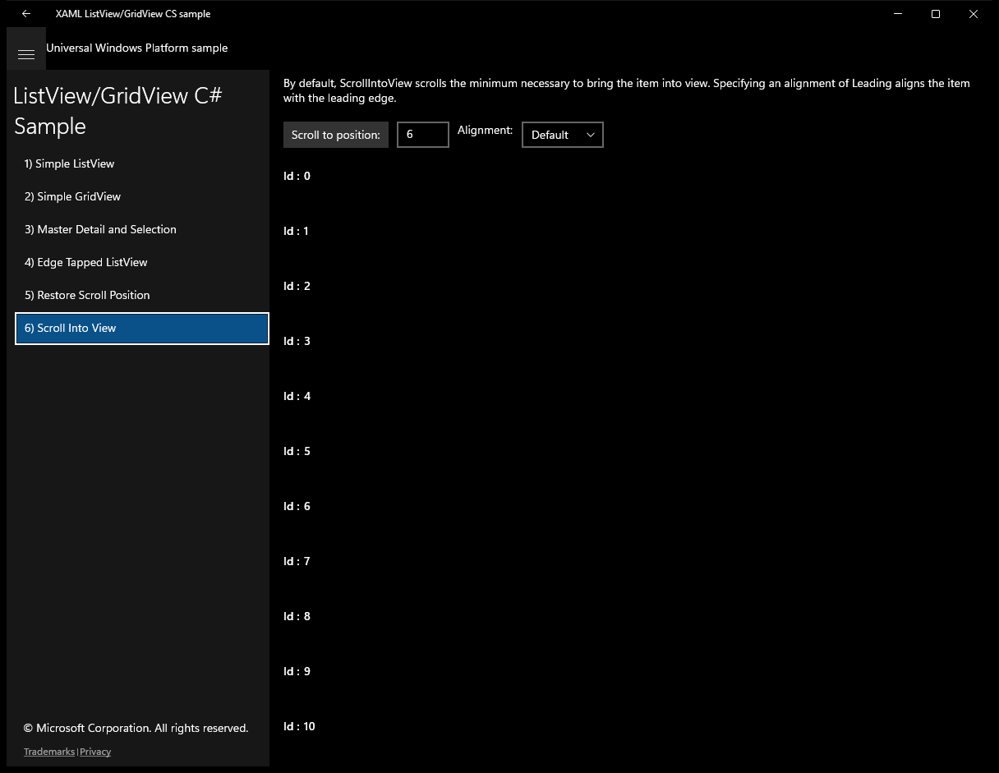

After click **Scroll to position:**:

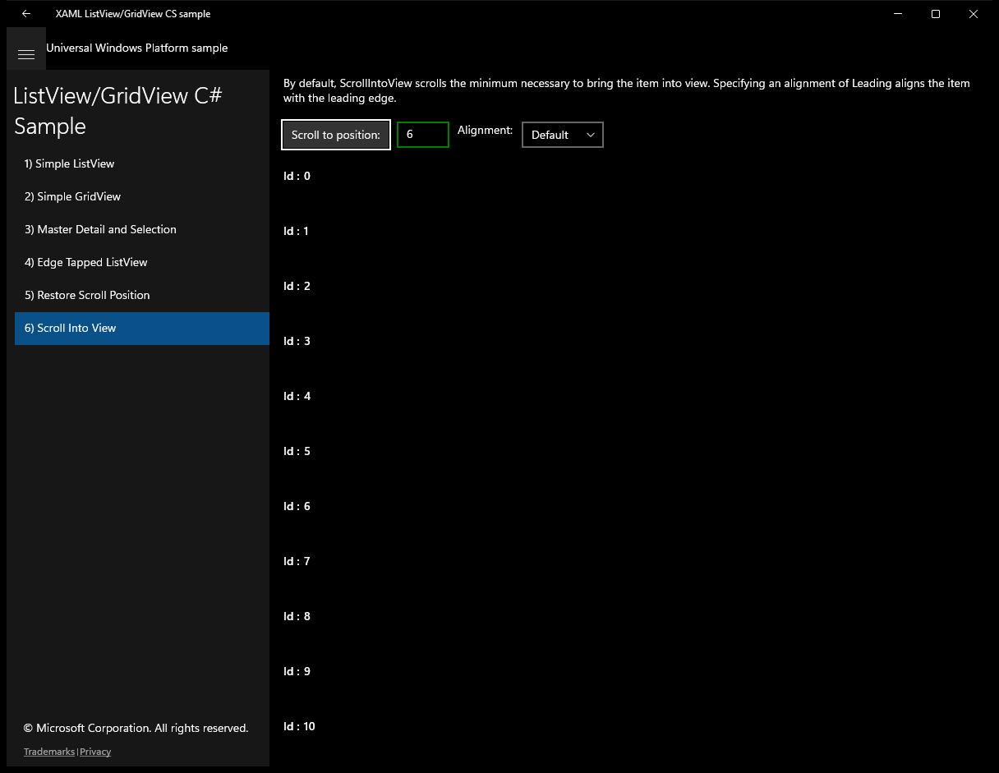

