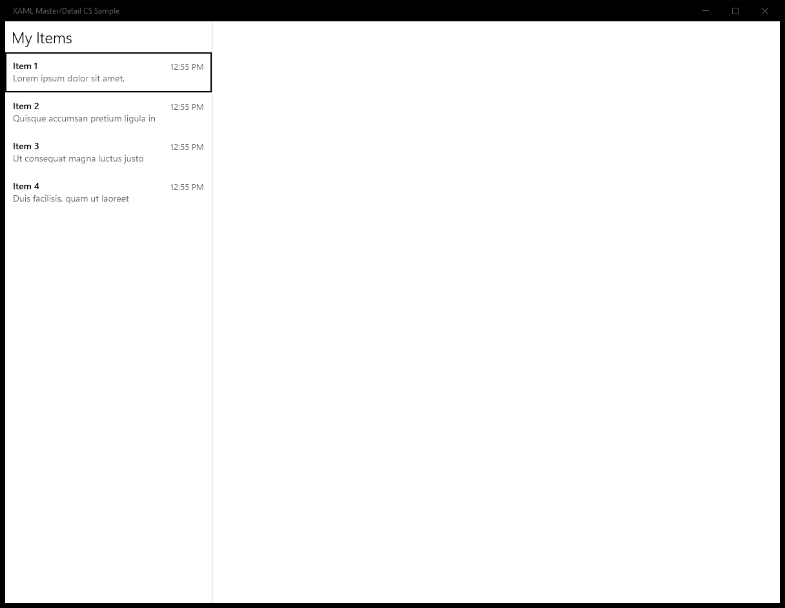
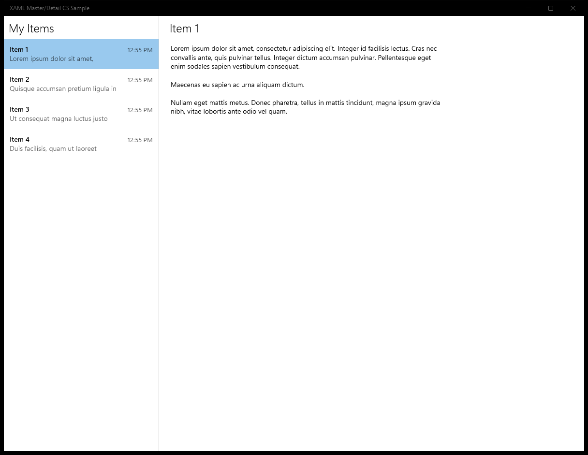
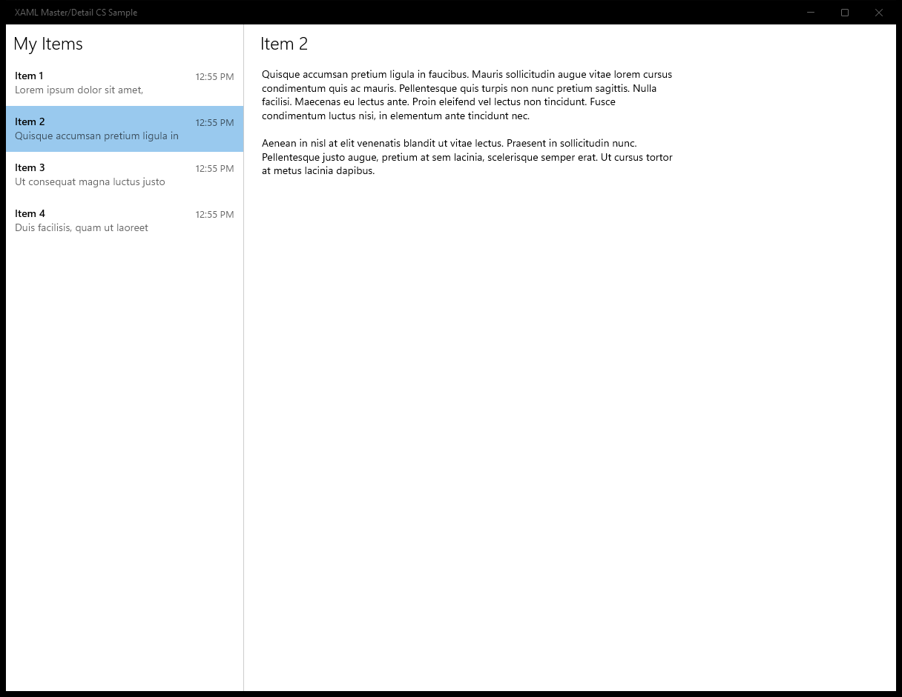
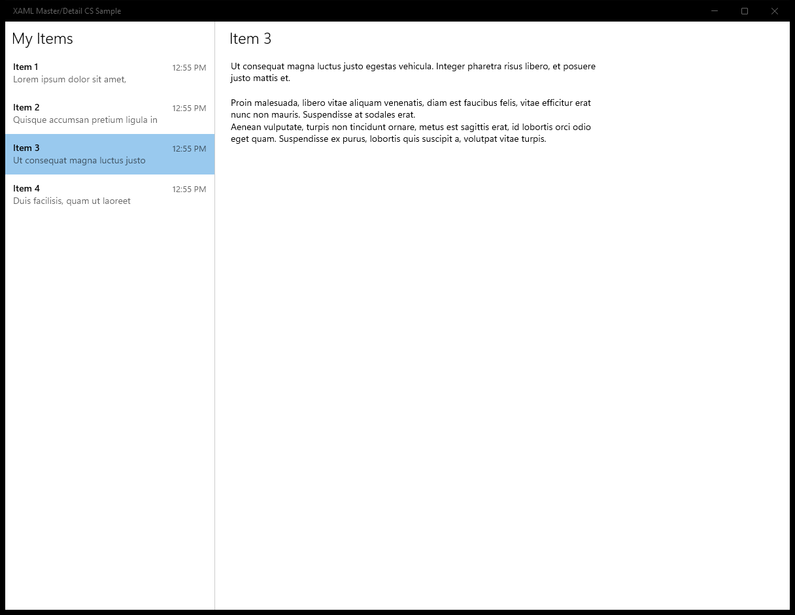
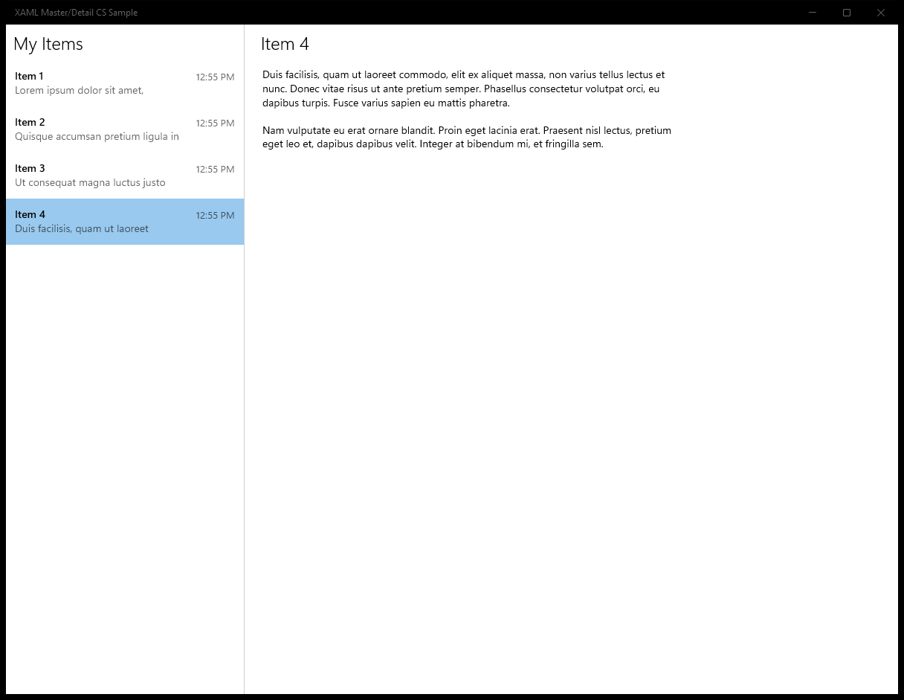

# XamlMasterDetail (C#)

> **Source**: `Samples\XamlMasterDetail\cs\`  
> **AUMID**: `9296b303-e43c-4323-bc5f-6cb3e72b0054_8wekyb3d8bbwe!App`  
> **PackageFamilyName**: `9296b303-e43c-4323-bc5f-6cb3e72b0054_8wekyb3d8bbwe`  

## Sample purpose
Shows how to implement a responsive master/detail experience in XAML.

## Scenarios demonstrated (from README)
- **Creating a side-by-side master/detail experience in XAML:** In MasterDetailPage.xaml, a master list is used to switch between detail items in a side-by-side view. This page will also responsively update to include just the master list when the view is narrow.
- **Navigating between the master list and a detail view:** At narrow screen sizes, the user can navigate between the master list in MasterDetailPage.xaml and detail view in DetailPage.xaml to view different items.
- **Changing the navigation model when the app is resized:** This sample contains the code necessary to adaptively switch between the two experiences described above at runtime based on screen size.

## Build / deploy / capture status
- build: skipped
- deploy: ok
- launch: ok
- capture: ok-generic
- uninstall: ok

## Main page

---

## MainPage (generic)

This sample did not expose a standard scenario list. Captures below come from a generic enumeration of buttons / list items / hyperlinks on the main page.

### Interaction captures
Initial state:

After click **ListItem: MasterDetailApp.ViewModels.ItemViewModel**:

After click **ListItem: MasterDetailApp.ViewModels.ItemViewModel**:

After click **ListItem: MasterDetailApp.ViewModels.ItemViewModel**:

After click **ListItem: MasterDetailApp.ViewModels.ItemViewModel**:

