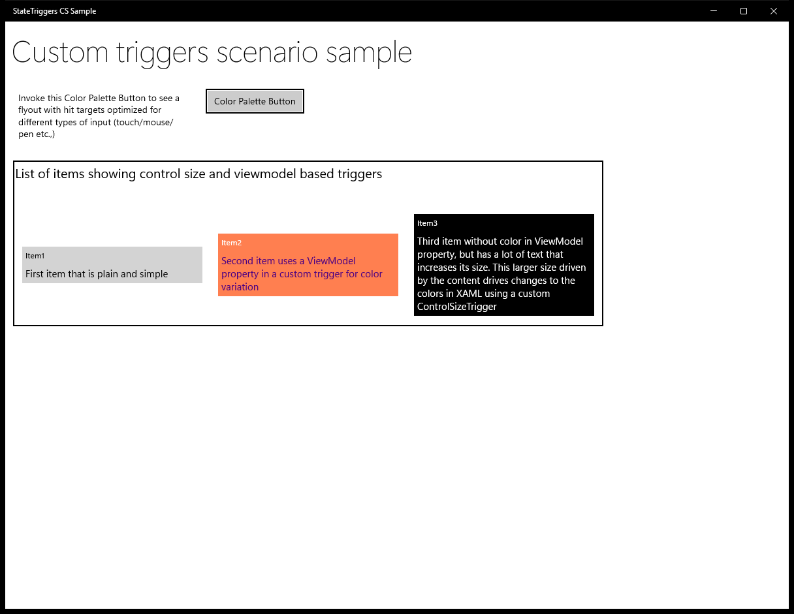
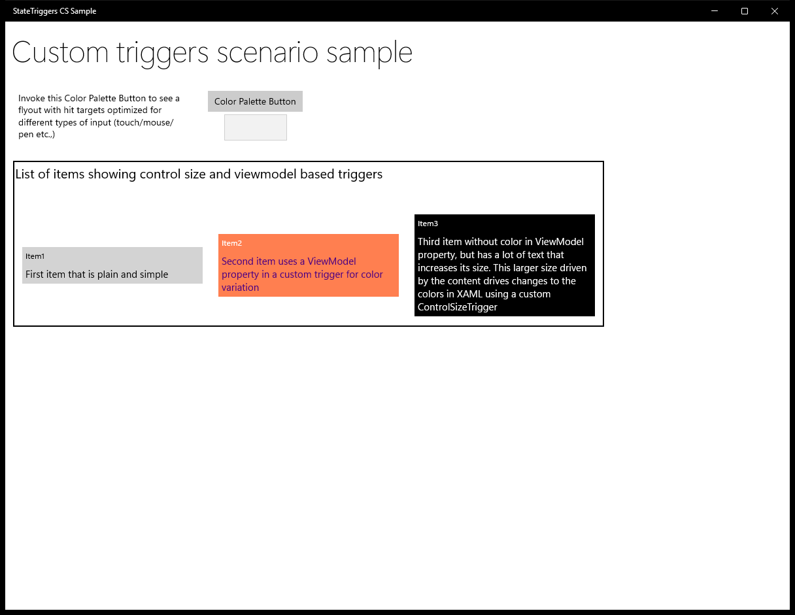
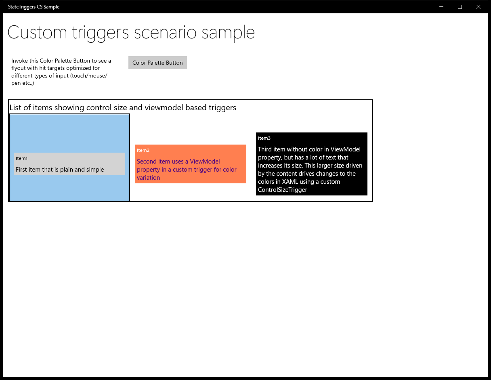
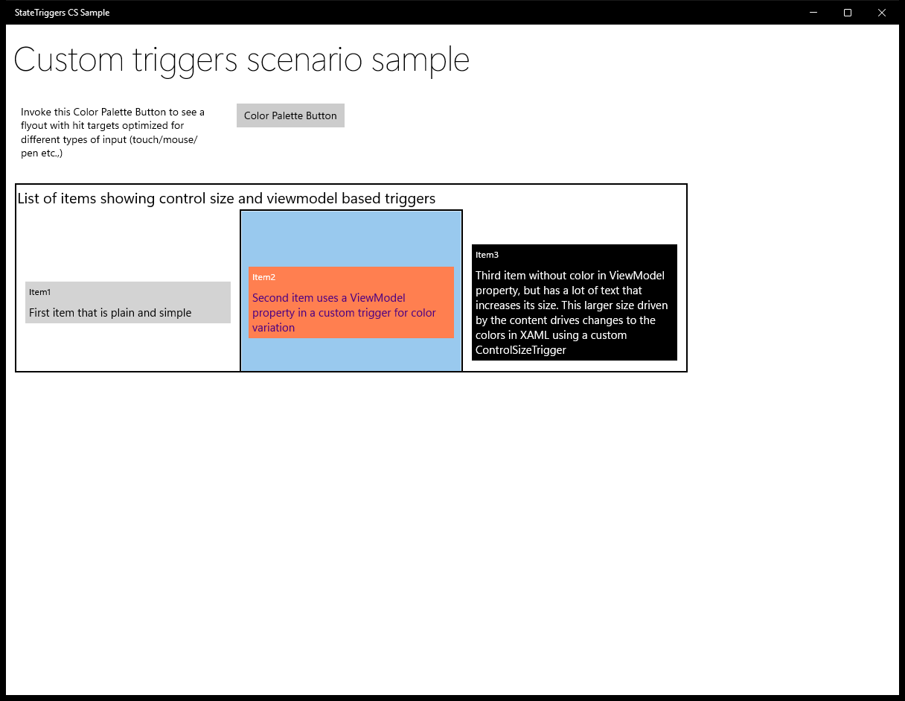
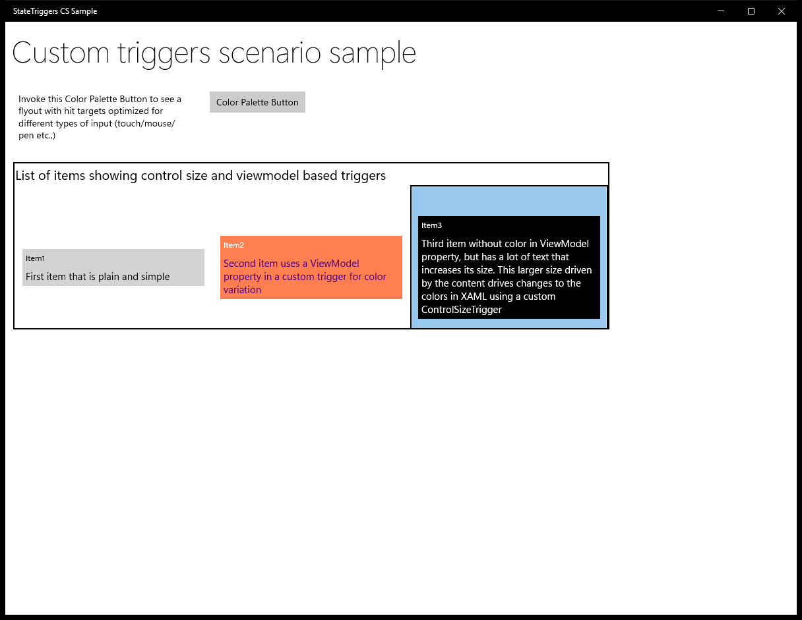

# XamlStateTriggers (C#)

> **Source**: `Samples\XamlStateTriggers\cs\`  
> **AUMID**: `Microsoft.SDKSamples.StateTriggers.CS_8wekyb3d8bbwe!App`  
> **PackageFamilyName**: `Microsoft.SDKSamples.StateTriggers.CS_8wekyb3d8bbwe`  

## Sample purpose
Shows how to extend StateTrigger with a couple of different custom triggers built into a scenario app.

## Build / deploy / capture status
- build: skipped
- deploy: ok
- launch: ok
- capture: ok-generic
- uninstall: ok

## Main page

---

## MainPage (generic)

This sample did not expose a standard scenario list. Captures below come from a generic enumeration of buttons / list items / hyperlinks on the main page.

### Interaction captures
Initial state:

After click **Button: Color Palette Button**:

After click **ListItem: StateTriggersSample.ViewModel.Model**:

After click **ListItem: StateTriggersSample.ViewModel.Model**:

After click **ListItem: StateTriggersSample.ViewModel.Model**:

---

## MainPage (static analysis)

This sample is a single-page app (no scenario list). The MainPage covers the entire functionality.

### UI elements
- **TextBlock**  - x:Name="title"; text="Custom triggers scenario sample"
- **TextBlock**  - x:Name="inputLabel"; text="Invoke this Color Palette Button to see a flyout with hit targets optimized for different types of input (touch/mouse/pen etc.,)"
- **Button**  - x:Name="MenuButton"; content="Color Palette Button"
- **TextBlock**  - x:Name="avatarLabel"; text="This label and the avatar image will only be shown when this app is being viewed in an Xbox device family."
- **Image**  - x:Name="avatar"
- **ListView**  - x:Name="list"
- **TextBlock**  - text="List of items showing control size and viewmodel based triggers"

