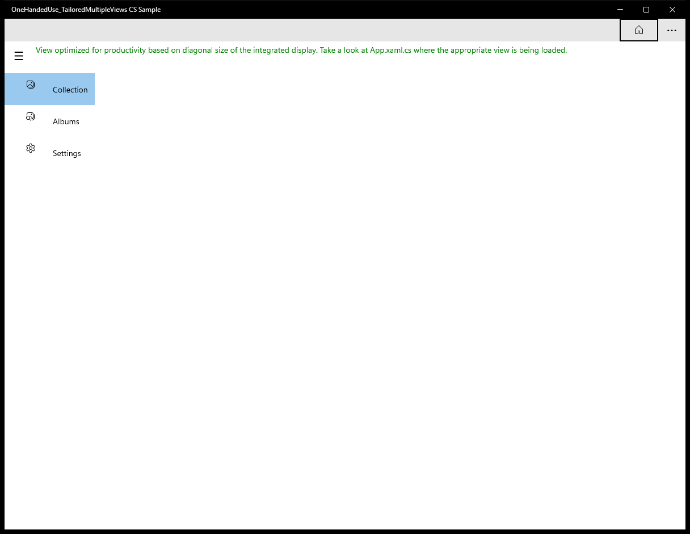
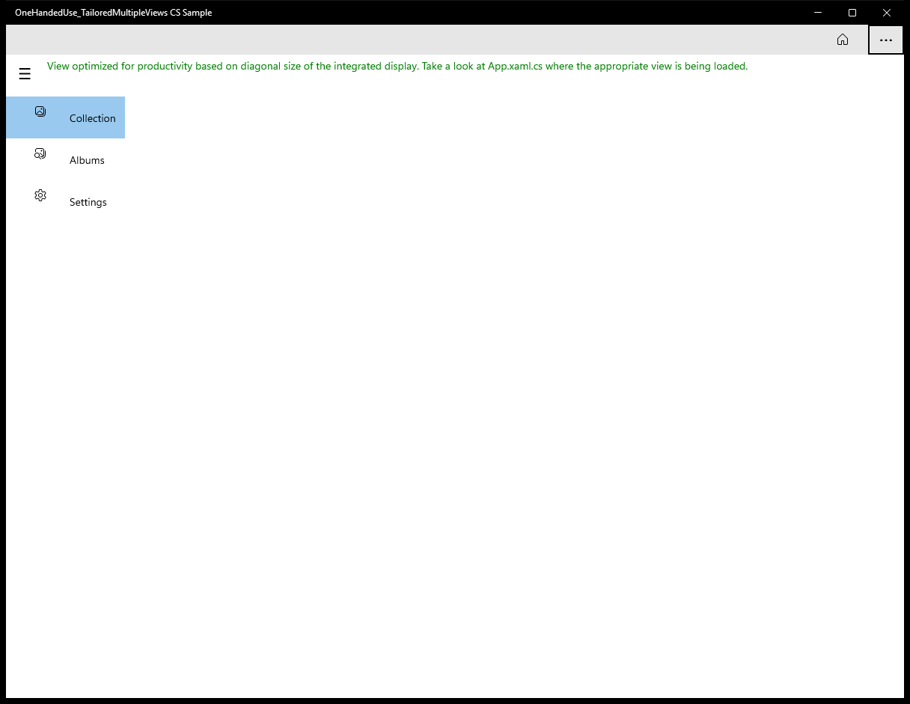
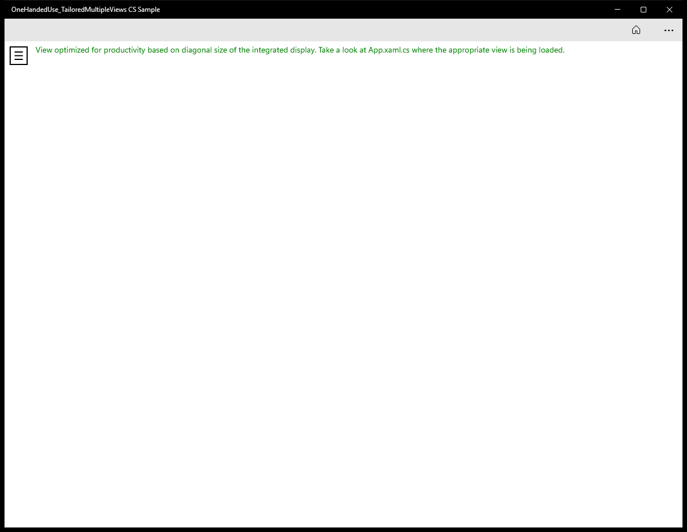
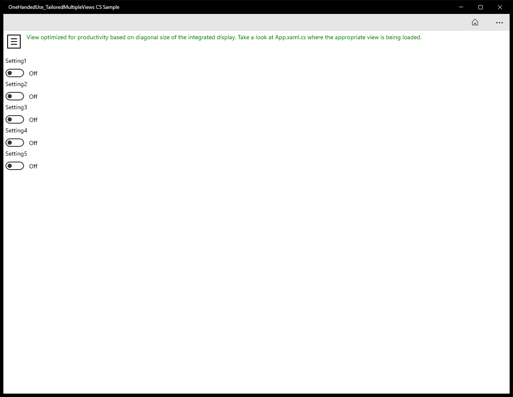

#  (C#)

> **Source**: `Samples\\cs\`  
> **AUMID**: `Microsoft.SDKSamples.TailoredViews.CS_8wekyb3d8bbwe!App`  
> **PackageFamilyName**: `Microsoft.SDKSamples.TailoredViews.CS_8wekyb3d8bbwe`  

## Sample purpose
Shows how to build a tailored UI using multiple views that are optimized for one-handed use.

## Scenarios demonstrated (from README)
- Use the Pivot control plus commands at the bottom of devices that are less than 7" in size.
- Use the SplitView control plus commands at the top of devices greater than 7" in size.

## Build / deploy / capture status
- build: skipped
- deploy: ok
- launch: ok
- capture: ok-generic
- uninstall: ok

## Main page

---

## MainPage (generic)

This sample did not expose a standard scenario list. Captures below come from a generic enumeration of buttons / list items / hyperlinks on the main page.

### Interaction captures
Initial state:

After click **Button: Home**:

After click **Button: More app bar**:

After click **Button: <unnamed>**:

After click **ListItem: <unnamed>**:

After click **ListItem: <unnamed>**:

After click **ListItem: <unnamed>**:

After click **ListItem: OneHandedUse_TailoredMultipleViews.ViewModel.Model**:

After click **ListItem: OneHandedUse_TailoredMultipleViews.ViewModel.Model**:

